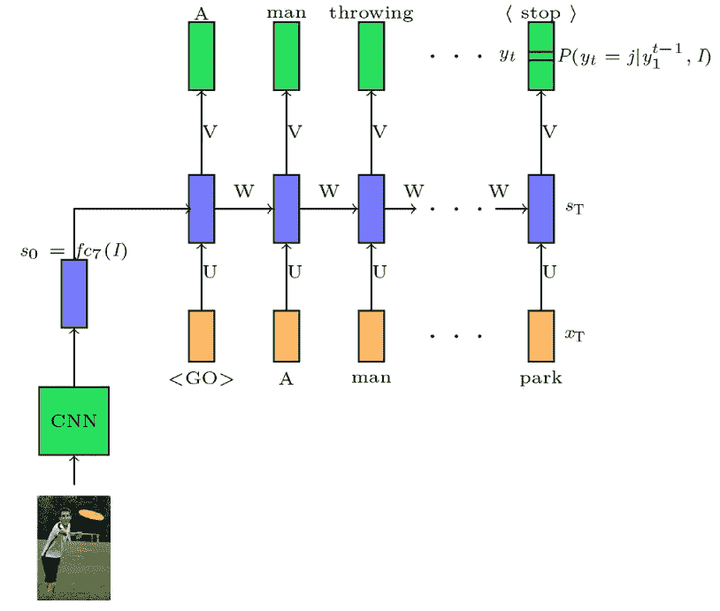
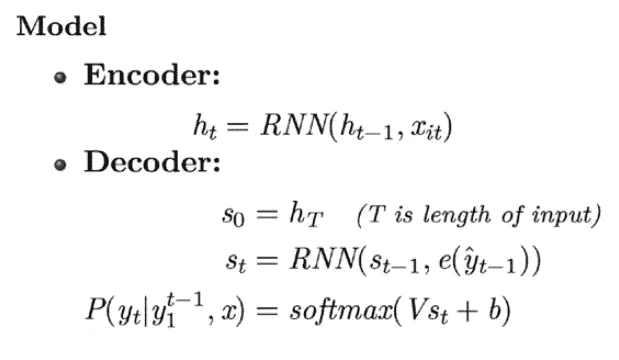

# 编码器-解码器模型简介— ELI5 路

> 原文：<https://towardsdatascience.com/introduction-to-encoder-decoder-models-eli5-way-2eef9bbf79cb?source=collection_archive---------9----------------------->

## ELI5 项目机器学习

在 [Unsplash](https://unsplash.com?utm_source=medium&utm_medium=referral) 上由 [Kouji 鹤](https://unsplash.com/@pafuxu?utm_source=medium&utm_medium=referral)拍摄的照片

大家好，欢迎来到我的博客“**编解码模型介绍——Eli 5 Way**”。我叫 [Niranjan Kumar](https://www.linkedin.com/feed/) ，是好事达印度公司的高级数据科学顾问。

在本文中，我们将讨论编码器-解码器模型的基本概念及其在一些任务中的应用，如语言建模、图像字幕、文本推导和机器音译。

> ***引用注:*** *本文的内容和结构是基于我对四分之一实验室深度学习讲座的理解——*[*pad hai*](https://padhai.onefourthlabs.in/)*。*

在我们讨论编码器-解码器模型的概念之前，我们先回顾一下语言建模的任务。

# 语言建模—概述

语言建模是预测下一个单词/字母的任务。与 FNN 和 CNN 不同，在序列建模中，当前输出依赖于先前输入，并且输入的长度不固定。

给定“t-1”个单词，我们感兴趣的是基于先前的单词或信息来预测 iᵗʰ单词。让我们看看如何使用递归神经网络解决语言建模问题。

语言建模— RNN

我们来看看 WhatsApp 中自动完成的问题。当你打开键盘输入时，你注意到字母 **I** 是信息第一个字符的建议。在这个问题中，每当我们键入一个字符，网络就试图根据先前键入的字符来预测下一个可能的字符。

该函数的输入用橙色表示，并表示为一个 **x** ₜ.与输入相关联的权重使用向量 **U** 来表示，并且单词的隐藏表示( **s** ₜ **)** 作为先前时间步长的输出和当前输入以及偏差的函数来计算。隐藏表示的输出( **s** ₜ **)** 由下面的等式给出，

一旦我们计算了输入的隐藏表示，来自网络的最终输出( **y** ₜ)是隐藏表示的 softmax 函数(表示为 o ),以及与其相关联的权重和偏差。

# 编码器-解码器模型—语言建模

在这一节中，我们将看到我们是如何在不知道的情况下，在语言建模的问题中使用编码器-解码器模型的。

在语言建模中，我们感兴趣的是根据以前的信息找到 iᵗʰ词的概率分布。

# 编码器型号

*   第一个时间步长的 RNN 输出作为输入与原始输入一起输入到下一个时间步长。
*   在每个时间步长，单词的隐藏表示( **s** ₜ₋₁ **)** 被计算为前一时间步长的输出和当前输入以及偏置的函数。
*   最终隐藏状态 vector(sₜ)包含来自先前隐藏表示和先前输入的所有编码信息。
*   这里，递归神经网络充当了一个**编码器**。

# 解码器模型

*   一旦我们将编码的向量传递到输出层，输出层就解码成下一个可能单词的概率分布。
*   输出层是一个 softmax 函数，它将隐藏状态表示和与之关联的权重以及偏差作为输入。
*   由于输出层包含了线性变换和偏置运算，因此可以称为简单的前馈神经网络。
*   前馈神经网络充当**解码器。**

# 编码器-解码器应用

在这一节中，我们将讨论编码器-解码器模型的一些应用

# 图像字幕

图像字幕是根据图像上显示的内容自动生成字幕的任务。

*   在图像字幕中，我们将通过卷积神经网络传递图像，并以特征表示向量的形式从图像中提取特征。
*   预处理后的特征表示向量通过 RNN 或 LSTM 生成字幕。

*   CNN 用于对图像进行编码
*   然后，RNN 被用来从嵌入的句子中**解码**

# 文本蕴涵

文本蕴涵是确定一段给定文本 *T* 是否包含另一段称为“假设”的文本的任务。

举个例子，

**输入**:外面下雨。

**输出**:地面潮湿。

在这个问题中，输入和输出都是字符序列。因此，编码器和解码器网络都是 RNN 或 LSTM。

# 机器音译

音译——“用另一种语言或文字书写同一个单词”。**翻译**会告诉你另一种语言中单词的意思，而**音译**不会告诉你单词的意思，但会帮你发音。

**输入**:印度

**输出** : इंडिया

# 编码器

*   输入的每个字符都作为输入被输入到 RNN，方法是将字符转换成一个独热向量表示。
*   在编码器的最后一个时间步长，所有先前输入的最终隐藏表示将作为输入传递给解码器。

# 解码器

*   解码器模型可以是 RNN 或 LSTM 网络，它将对状态表示向量进行解码，并给出每个字符的概率分布。
*   softmax 函数用于生成每个字符的概率分布向量。这又有助于生成完整的音译单词。

# 从这里去哪里？

如果想用 Keras & Tensorflow 2.0 (Python 或 R)学习更多关于神经网络的知识。查看来自 [Starttechacademy](https://courses.starttechacademy.com/full-site-access/?coupon=NKSTACAD) 的 Abhishek 和 Pukhraj 的[人工神经网络](https://courses.starttechacademy.com/full-site-access/?coupon=NKSTACAD)。他们以一种简单化的方式解释了深度学习的基础。

*推荐阅读—***Eli 5 项目机器学习**

 [## 长短期记忆和门控循环单位的解释——Eli 5 方式

### 在这篇文章中，我们将学习 LSTM 和格鲁工作背后的直觉

towardsdatascience.com](/long-short-term-memory-and-gated-recurrent-units-explained-eli5-way-eff3d44f50dd)  [## 递归神经网络(RNN)解释 ELI5 方式

### 使用 RNN 的序列标记和序列分类

towardsdatascience.com](/recurrent-neural-networks-rnn-explained-the-eli5-way-3956887e8b75)  [## 理解卷积神经网络 ELI5 方法

### 了解卷积运算和 CNN 的

towardsdatascience.com](/understanding-convolution-neural-networks-the-eli5-way-785330cd1fb7) 

# 结论

在这篇文章中，我们通过 RNN 和 FNN 讨论了如何在语言建模的任务中使用基本的编码器-解码器模型。之后，我们讨论了编码器-解码器模型在解决一些复杂任务中的应用，如机器音译、文本蕴涵。

在我的下一篇文章中，我们将讨论注意力机制。因此，请确保您在 Medium 上[跟随我](https://medium.com/@niranjankumarc)，以便在它下降时得到通知。

直到那时，和平:)

NK。

# 作者简介

[Niranjan Kumar](https://medium.com/@niranjankumarc) 是好事达印度公司的高级数据科学顾问。他对深度学习和人工智能充满热情。除了在媒体上写作，他还作为自由数据科学作家为 Marktechpost.com 写作。点击查看他的文章[。](https://www.marktechpost.com/author/niranjan-kumar/)

你可以在 [LinkedIn](https://www.linkedin.com/in/niranjankumar-c/) 上与他联系，或者在 [Twitter](https://twitter.com/Nkumar_283) 上关注他，了解关于深度学习和机器学习的最新文章。

**免责声明** —这篇文章中可能有一些相关资源的附属链接。你可以以尽可能低的价格购买捆绑包。如果你购买这门课程，我会收到一小笔佣金。

**参考文献**:

1.  [深度学习—帕德海](https://padhai.onefourthlabs.in/)
2.  [理解翻译与音译](https://www.familytreemagazine.com/premium/now-what-translation-vs-transliteration/)
3.  [深度学习(CS7015)](https://www.youtube.com/playlist?list=PLyqSpQzTE6M9gCgajvQbc68Hk_JKGBAYT)