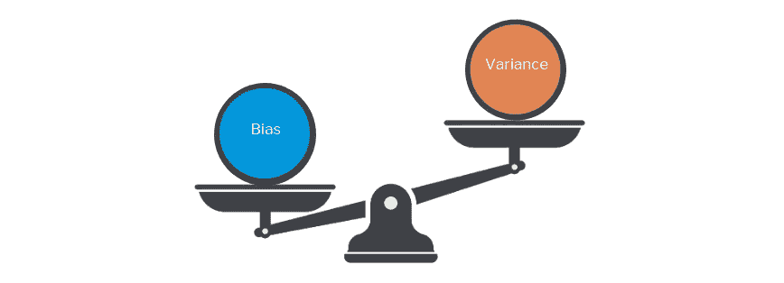
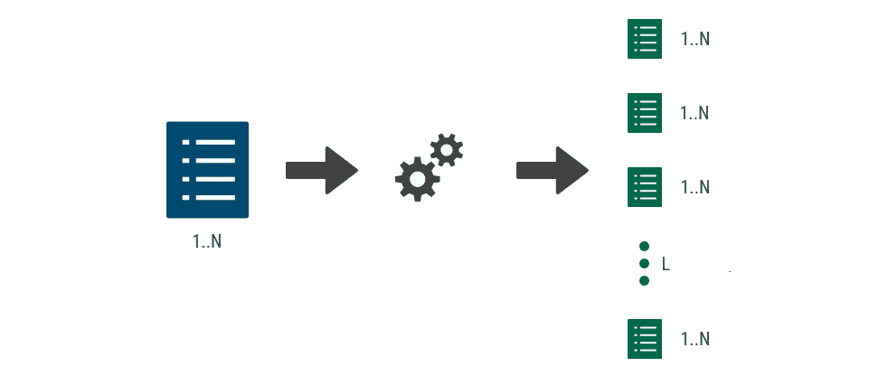
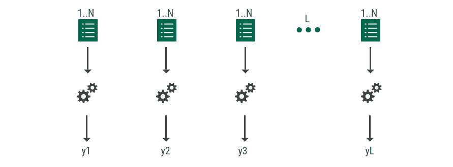
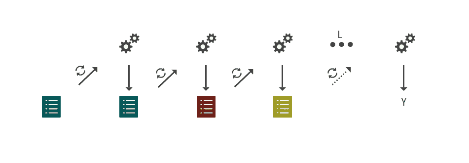
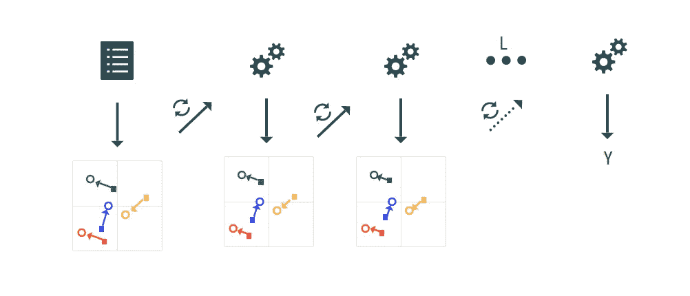

# 集成学习简介

> 原文：<https://towardsdatascience.com/introduction-to-ensemble-learning-27af286ac470?source=collection_archive---------24----------------------->

## 装袋和增压技术概述

图:[团结成长理念](https://www.lasemainedecastres.fr/quand-les-arbres-communiquent-entre-eux/)

***“弱者团结起来也变得强大。”*** *—弗里德里希·冯·席勒*

这是集合方法背后的基本思想。弱学习器，也称为基础模型，被有策略地组合在一起，形成一个强学习器，称为集成模型。集成模型使用多种学习算法来解决特定的分类/回归问题，该问题不能由它的任何组成学习器单独有效地学习。

组合弱学习器的不同技术在如何聚集这些弱学习器中的每一个的输出以获得最终输出方面有所不同。我们将研究两种实现集合模型的流行技术:

1.  制袋材料
2.  助推

在继续之前，让我们直观地理解这些技术对模型性能的影响。一个好的机器学习算法理论上被期望在学习训练数据时实现低偏差和低方差。然而，实现两者是不可能的，这被称为**偏差-方差权衡**。这两种误差源(偏差/方差)都妨碍了模型对训练数据进行归纳，从而无法对看不见的数据进行有效处理。

> 偏差是由算法做出的错误假设引起的误差。这会导致模型错过训练数据中的特征和目标输出之间的关系(欠拟合)。
> 
> 方差是由对训练数据中微小波动的敏感性引起的误差。这将导致模型从训练数据中学习噪声(过拟合)。

集合方法用于根据基础模型的弱点来减少偏差或方差。根据我们试图减少的误差源，选择不同的组合技术。

# 打包(引导汇总)

> Bagging 涉及在不同的训练数据集上并行训练弱学习模型，并使用某种平均方法组合这些基础模型的结果。

**1。采样**

当我说多组训练数据时，你肯定在想这将需要大量的训练数据来馈送多个数据饥渴的深度学习网络。但我们需要的只是一组训练数据的多个样本。这可以使用一种叫做**自举的技术来实现。**

> Bootstrapping 是一种从原始数据中进行采样的统计方法，其中样本几乎是独立的，并且代表原始数据分布(大约独立于原始数据分布，并且与原始数据分布相同)。

**2。培训**

假设我们从大小为 *N* 的原始数据集生成 *L* 个大小为 *N* 的样本，并进行替换。然后，我们在通过自举生成的这些 *L* 个样本中的每一个样本上训练 *L* 个同质基础模型。

**3。聚集**

现在我们有了来自 *L* 基本模型的预测，我们需要使用某种平均方法来汇总这些预测。在回归问题的情况下，我们可以找到基础模型预测的字面平均值，以此来弥补集合模型的预测。

> Y = ( y1+y2+y3+…+yL ) / L

对于分类问题，如果我们让基本模型返回类别标签，那么一种聚合方式是将每个弱分类器返回的类别视为投票，并且具有最高票数的类别由集成模型返回— **硬投票**。

> Y = max ( y1，y2，y3，…，yL)

另一方面，如果我们有返回每个类别概率的基础模型，那么一种方法是从所有基础模型中找到每个类别预测的平均值，并且具有最高平均概率的类别由集合模型返回— **软投票**。

> Y = max [ P(y1)，P(y2)，P(y3)，…，P(yL) ]

**什么时候用什么时候不用装袋？**

*   装袋方法主要集中在**减少方差**，不影响偏倚。**因此，当基础模型具有高方差和低偏差时，选择这种技术，这通常是对于复杂数据具有高自由度的模型的情况(例如:深度决策树)。**
*   Bagging 不适用于具有高偏差和低方差的模型，因为组合不太适合训练数据(欠拟合)的基础模型的结果在聚合时不会改变结果。
*   具有高自由度(复杂数据)的模型需要更多的训练时间。由于基本模型是并行训练的，训练每个基本模型所花费的时间相当于训练它们中的任何一个，使得 bagging 成为集成方法的一个好选择。

# **增压**

> Boosting 涉及逐步训练弱学习者，每次，模型直观地将其努力集中在它的前任难以学习的观察上。

基本模型以非常*自适应*的方式组合以形成集合模型。集合模型是组成基本模型的加权和。主要有两种流行的*元算法*，它们与弱学习者的聚集方式有着明显的不同。它们都旨在以迭代方式优化集合模型。

1.  自适应增强(Adaboost)
2.  梯度推进(阿达格拉德)

**自适应增压**

每个基础学习者**更新数据集中每个观察值的权重**。对 *L* 学习器重复下面的步骤，其中每个基本模型试图使用权重来纠正其前一个模型的错误。

(I)在弱学习者被训练之后，数据集中的每个数据点被分配一个表示分类准确性的权重。即，具有较高准确度的数据点将被分配较低的权重，反之亦然。

(ii)这个加权数据集然后被用作下一个弱学习者的训练集。该学习者将直观地更加关注具有较高权重的数据点，并尝试对它们进行正确分类。

(iii)对于错误分类的样本，结果数据集被重新加权，并被用作下一个学习者的输入。

**梯度增强**

每个基础学习器**更新数据集中的观察值**。像在 Adaboost 中，下一个模型取决于前一个模型的误差。顾名思义，我们使用梯度下降顺序组合弱学习者。每个基本模型都试图将数据拟合到与我们迄今为止从集合模型获得的误差梯度相反的方向。

> 西ᵢ =西ᵢ-₁ — (α * ∇东ᵢ-₁)

W ᵢ是基本模型 I 的权重，α是步长，E ᵢ-₁是基本模型(i-1)的误差。

对于数据集中的每个观察值，我们计算观察值和预测值之间的差异。这些值被称为**伪残差。**它们指示下一个学习者应该更新的方向，以获得正确的值。

1.  最初，我们将伪残差设置为已知目标的平均值。
2.  对于每个弱学习算法 I，我们预测在(i-1)中获得的伪残差。
3.  由此获得的伪残差是后续弱学习器的目标。

> 伪残差= Yᵗᵃʳᵍᵉᵗ - Yᵖʳᵉᵈ

**什么时候用什么时候不用升压？**

*   一般使用**低方差高偏差**的模型，自由度少(例如:浅层决策树)。
*   与并行训练模型的 bagging 不同，这里的模型是顺序训练的。依次训练几个复杂的模型会使计算变得昂贵。

**参考文献**

[1]伊恩·古德菲勒、约舒阿·本吉奥、亚伦·库维尔——深度学习。

[2]约瑟夫·罗卡，[集合方法:装袋，助推，堆垛](/ensemble-methods-bagging-boosting-and-stacking-c9214a10a205)。

[3]使用[拍卖](https://venngage.com/)创建的数字。

如果你想过来打个招呼，请通过[LinkedIn](https://www.linkedin.com/in/pallavirbharadwaj)|[Twitter](https://twitter.com/pallavibharadwj)|[Github](https://github.com/pallavibharadwaj)与我联系。