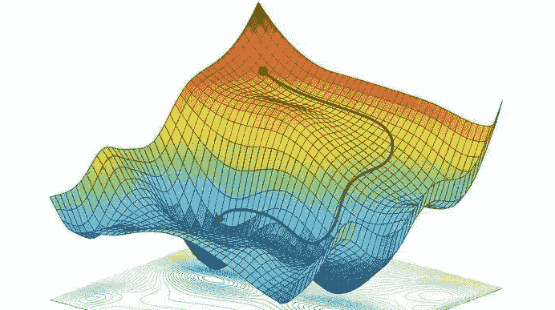
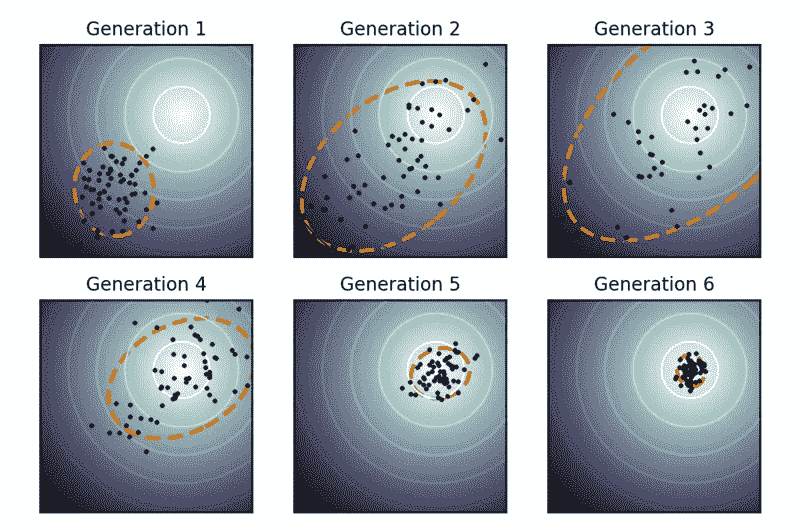
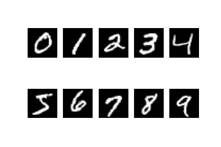

# 进化策略简介

> 原文：<https://towardsdatascience.com/introduction-to-evolution-strategy-1b78b9d48385?source=collection_archive---------27----------------------->

## 用进化策略训练无反向传播神经网络

在这篇文章中，我们将学习在 MNIST 手写数字数据集上使用 Python 中的进化策略从头开始训练一个无反向传播的神经网络。这个简单的实现将帮助我们更好地理解这个概念，并将其应用于其他合适的设置。我们开始吧！

**目录**
1。数值优化
2。进化策略
3。普通实现
4。Python 从头实现
5。结尾注释

## 数值优化

几乎所有的机器学习算法都可以归结为一个优化问题。在 ML 算法中，我们更新模型的参数以最小化损失。例如，每个监督学习算法都可以写成，θ_ estimate = arg min𝔼[l(y,f(x,θ))]，其中 x 和 y 分别表示特征和目标，θ表示模型参数，f 表示我们试图建模的函数，l 表示损失函数，它衡量我们的拟合程度。梯度下降算法也称为最速下降法，已经证明在大多数情况下可以很好地解决这类问题。这是一种求可微函数局部极小值的一阶迭代算法。我们采取与当前点的损失函数的梯度的负值成比例的步长，即θ_new = θ_old — α*∇ L(y，f(x，θ_old))。牛顿法是另一种二阶迭代法，它以较少的迭代次数收敛，但由于需要计算损失函数(海森矩阵)的二阶导数的倒数，计算量很大，即θ_new = θ_old — [∇ L(y，f(x，θ_old))]^(-1) * ∇ L(y，f(x，θ_old))。我们正在使用梯度搜索参数，因为我们相信它将引导我们朝着减少损失的方向前进。但是我们能在不计算任何梯度的情况下搜索最优参数吗？其实解决这个问题的方法有很多！有许多不同的无导数优化算法(也称为黑盒优化)。



来源:谷歌图片

## 进化策略

梯度下降不一定总能解决我们的问题。为什么？简而言之，答案是局部最优。例如，在强化学习的稀疏奖励场景中，代理在一集结束时收到奖励，就像在国际象棋中，结束奖励分别为赢或输游戏的+1 或-1。万一我们输掉了比赛，我们就不知道我们是玩得可怕还是只是犯了一个小错误。回报梯度信号很大程度上是无信息的，会让我们陷入困境。我们可以求助于诸如进化策略(es)之类的无导数技术，而不是使用噪声梯度来更新我们的参数。在这种情况下，以及在我们不知道目标函数的精确解析形式或不能直接计算梯度的情况下，ES 工作得很好。

在 OpenAI 的这篇[论文](https://arxiv.org/abs/1703.03864)中，他们展示了 ES 在分布式计算环境中更容易实现和扩展，它在稀疏回报的情况下不受影响，并且具有更少的超参数。此外，他们发现，与传统的强化学习算法相比，专家系统发现了更多样的策略。

ES 是一种受自然启发的优化方法，它使用随机突变、重组和选择来应用于包含候选解的个体群体，以便迭代地进化出更好的解。它对于非线性或非凸的连续优化问题非常有用。

在专家系统中，我们不太关心函数及其与输入或参数的关系。数百万个数字(模型的参数)进入算法，并且它吐出 1 个值(例如，监督设置中的损失；强化学习情况下的奖励)。我们试图找到这些数字的最佳集合，为我们的优化问题返回好的值。我们正在优化一个关于参数θ的函数 J(θ)，只是通过对它求值，而不对 J 的结构做任何假设，因此命名为“黑盒优化”。下面就来深挖一下实现细节吧！

## 普通实现

首先，我们随机生成参数，并对其进行调整，使参数稍微工作得更好。数学上，在每一步我们取一个参数向量θ，并通过用高斯噪声抖动θ来产生一群，比如说 100 个稍微不同的参数向量θ₁,θ₂…θ₁₀₀。然后，我们通过运行模型独立评估 100 个候选中的每一个，并基于输出值评估损失或目标函数。然后，我们选择前 N 个性能最佳的精英参数，N 可以是 10，取这些参数的平均值，称之为我们迄今为止的最佳参数。然后，我们重复上述过程，通过将高斯噪声添加到迄今为止获得的最佳参数中，再次生成 100 个不同的参数。

从自然选择的角度考虑，我们正在随机创建一个参数(物种)群体，并根据我们的目标函数(也称为适应度函数)选择表现良好的顶级参数。然后，我们通过取它们的平均值来结合这些参数的最佳质量(这是一种粗略的方法，但仍然有效！)并称之为我们的最佳参数。然后，我们通过添加随机噪声使该参数突变来重建种群，并重复整个过程直到收敛。


来源:改编自 Lur 专题百科全书，通过维基共享资源

**伪码**:

1.  使用高斯分布随机初始化最佳参数
2.  循环直至收敛:
    —通过将高斯噪声添加到最佳参数
    来创建参数θ₁,θ₂…θ₁₀₀群体——评估所有参数的目标函数并选择前 n 个最佳性能参数(精英参数)
    —最佳参数=平均值(前 n 个精英参数)
    —在每次迭代结束时以某个因子衰减噪声(在开始时，更多的噪声将有助于我们更好地探索，但是当我们到达收敛点时，我们希望噪声最小以便不偏离)



来源:https://en.wikipedia.org/wiki/CMA-ES[。图片基于尼古拉·汉森和其他人的工作。
球形优化景观用 f 值相等的实线描绘。在这个简单的例子中，群体(点)在几次迭代后集中于全局最优。](https://en.wikipedia.org/wiki/CMA-ES)

## 从头开始 Python 实现

让我们通过 Python 中的一个简单例子来更好地理解。我试图添加一些与数值稳定性相关的细节。请看评论！我们将从加载所需的库和 MNIST 手写数字数据集开始。

```
# Importing all the required libraries
import numpy as np
import matplotlib.pyplot as plt
import tqdm
import pickle
import warnings
warnings.filterwarnings(‘ignore’)
from keras.datasets import mnist# Machine Epsilon (needed to calculate logarithms)
eps = np.finfo(np.float64).eps# Loading MNIST dataset
(x_train, y_train), (x_test, y_test) = mnist.load_data()# x contains the images (features to our model)
# y contains the labels 0 to 9# Normalizing the inputs between 0 and 1
x_train = x_train/255.
x_test = x_test/255.# Flattening the image as we are using 
# dense neural networks
x_train = x_train.reshape( -1, x_train.shape[1]*x_train.shape[2])
x_test = x_test.reshape( -1, x_test.shape[1]*x_test.shape[2])# Converting to one-hot representation
identity_matrix = np.eye(10) 
y_train = identity_matrix[y_train]
y_test = identity_matrix[y_test]# Plotting the images
fig, ax = plt.subplots(2,5)
for i, ax in enumerate(ax.flatten()):
 im_idx = np.argwhere(y_train == i)[0]
 plottable_image = np.reshape(x_train[im_idx], (28, 28))
 ax.set_axis_off()
 ax.imshow(plottable_image, cmap=’gray’)

plt.savefig(‘mnist.jpg’)
```

这是图像的样子，



MNIST 手写数字数据集样本图像

我们将从定义我们的模型开始，这将是一个只有正向传递的单层神经网络。

```
def soft_max(x):'''
 Arguments: numpy array

 Returns: numpy array after applying 
 softmax function to each
 element '''

 # Subtracting max of x from each element of x for numerical
 # stability as this results in the largest argument to 
 # exp being 0, ruling out the possibility of overflow
 # Read more about it at :
 # [https://www.deeplearningbook.org/contents/numerical.html](https://www.deeplearningbook.org/contents/numerical.html)

 e_x = np.exp(x — np.max(x))

 return e_x /e_x.sum()class Model():'''
 Single layer Neural Network

'''

 def __init__(self, input_shape, n_classes):

 # Number of output classes
 self.n_classes = n_classes

 # Parameters/Weights of our network which we will be updating
 self.weights = np.random.randn(input_shape, n_classes)

 def forward(self,x):

 '''
 Arguments: numpy array containing the features,
 expected shape of input array is
 (batch size, number of features)

 Returns: numpy array containing the probability,
 expected shape of output array is
 (batch size, number of classes)

 '''

 # Multiplying weights with inputs
 x = np.dot(x,self.weights)

 # Applying softmax function on each row
 x = np.apply_along_axis(soft_max, 1, x)

 return x

 def __call__(self,x):

 '''
 This dunder function
 enables your model to be callable

 When the model is called using model(x),
 forward method of the model is called internally

 '''

 return self.forward(x)

 def evaluate(self, x, y, weights = None):

 '''Arguments : x — numpy array of shape (batch size,number of features),
 y — numpy array of shape (batch size,number of classes),
 weights — numpy array containing the parameters of the model

 Returns : Scalar containing the mean of the categorical cross-entropy loss
 of the batch'''

 if weights is not None:

 self.weights = weights

 # Calculating the negative of cross-entropy loss (since
 # we are maximizing this score)
 # Adding a small value called epsilon 
 # to prevent -inf in the output

 log_predicted_y = np.log(self.forward(x) + eps)

 return (log_predicted_y*y).mean()
```

我们现在将定义我们的函数，它将一个模型作为输入并更新它的参数。

```
def optimize(model,x,y,
 top_n = 5, n_pop = 20, n_iter = 10,
 sigma_error = 1, error_weight = 1, decay_rate = 0.95,
 min_error_weight = 0.01 ):

 '''
 Arguments : model — Model object(single layer neural network here),
 x — numpy array of shape (batch size, number of features),
 y — numpy array of shape (batch size, number of classes),
 top_n — Number of elite parameters to consider for calculating the
 best parameter by taking mean
 n_pop — Population size of the parameters
 n_iter — Number of iteration 
 sigma_error — The standard deviation of errors while creating 
 population from best parameter
 error_weight — Contribution of error for considering new population
 decay_rate — Rate at which the weight of the error will reduce after 
 each iteration, so that we don’t deviate away at the 
 point of convergence. It controls the balance between 
 exploration and exploitation

 Returns : Model object with updated parameters/weights

 '''

 # Model weights have been randomly initialized at first
 best_weights = model.weights

 for i in range(n_iter):

 # Generating the population of parameters
 pop_weights = [best_weights + error_weight*sigma_error* \
 np.random.randn(*model.weights.shape)

 for i in range(n_pop)]

 # Evaluating the population of parameters
 evaluation_values = [model.evaluate(x,y,weight) for weight in pop_weights]

 # Sorting based on evaluation score
 weight_eval_list = zip(evaluation_values, pop_weights)

 weight_eval_list = sorted(weight_eval_list, key = lambda x: x[0], reverse = True)

 evaluation_values, pop_weights = zip(*weight_eval_list)

 # Taking the mean of the elite parameters
 best_weights = np.stack(pop_weights[:top_n], axis=0).mean(axis=0)

 #Decaying the weight
 error_weight = max(error_weight*decay_rate, min_error_weight)

 model.weights = best_weights

 return model# Instantiating our model object
model = Model(input_shape= x_train.shape[-1], n_classes= 10)print(“Evaluation on training data”, model.evaluate(x_train, y_train))# Running it for 200 steps
for i in tqdm.tqdm(range(200)):

 model = optimize(model, 
 x_train,
 y_train, 
 top_n = 10, 
 n_pop = 100,
 n_iter = 1)

 print(“Test data cross-entropy loss: “, -1*model.evaluate(x_test, y_test))
 print(“Test Accuracy: “,(np.argmax(model(x_test),axis=1) == y_test).mean())

# Saving the model for later use
with open(‘model.pickle’,’wb’) as f:
 pickle.dump(model,f)
```

**结果**:经过 200 次迭代训练后，测试准确率约为 85%，交叉熵损失约为 0.28。这相当于用反向传播训练的单层神经网络。注意，这里我们甚至没有使用 decay，因为 n_iter 设置为 1。

## **结尾注释**

ES 实现起来非常简单，不需要梯度。仅仅通过将噪声注入到我们的参数中，我们就能够搜索参数空间。尽管为了便于理解，我们已经解决了一个监督问题，但它更适合强化学习场景，在这种场景中，人们必须通过采样来估计预期回报的梯度。

希望你喜欢阅读这篇文章！

更多的技术博客也可以查看我的网站:[深挖 ML](https://www.digdeepml.com)

**参考资料和进一步阅读**:

[OpenAI 博文](https://openai.com/blog/evolution-strategies/)

[奥托罗的博客](https://blog.otoro.net/2017/10/29/visual-evolution-strategies/)

[莉莲的博客](https://lilianweng.github.io/lil-log/2019/09/05/evolution-strategies.html)