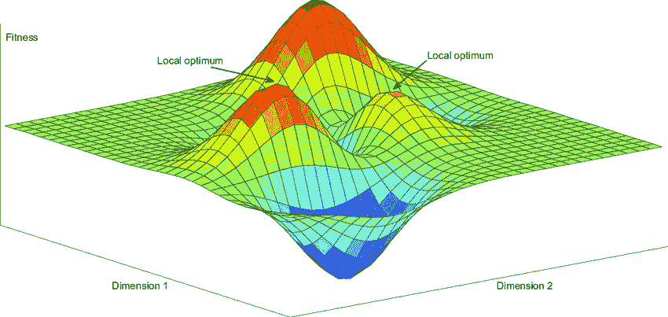
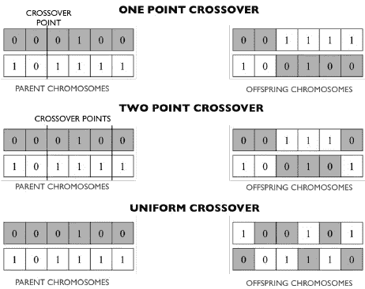
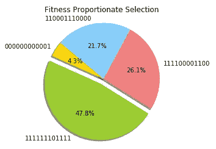
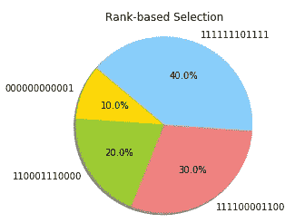

# 进化算法简介

> 原文：<https://towardsdatascience.com/introduction-to-evolutionary-algorithms-1278f335ead6?source=collection_archive---------12----------------------->

## 关于如何用 Python 编写进化算法来解决优化任务的实用介绍。


Johannes Plenio 在 [Unsplash](https://unsplash.com?utm_source=medium&utm_medium=referral) 上拍摄的照片

# 介绍

自然选择进化是一种科学理论，旨在解释自然系统如何随着时间的推移进化成更复杂的系统。自然选择的进化需要四个主要因素:

*   **繁殖:**生物需要能够繁殖和产生后代，以延续其物种。
*   遗传:后代在某种程度上需要像他们的父母。
*   变异:群体中的个体需要彼此不同。
*   **适应度的变化:**个体之间的差异应该导致其繁殖成功(适应度)的变化。

在进化算法中，一个适应值可以被用来作为一个向导来指示我们离一个解决方案有多近(例如，值越高，我们离我们想要的目标就越近)。通过将群体中具有相似适合度的所有元素更紧密地组合在一起，并将所有不相似的元素进一步分开，我们可以构建一个适合度景观(图 1)。进化算法面临的一个主要问题是在适应度范围内存在局部最优。事实上，局部最优可能会误导我们的算法，使其达不到我们期望的全局最大值，而偏向于次优解。



图 1:健身景观示例[1]

使用变异操作符，如交叉和变异，就有可能跳过一个山谷，达到我们想要的目标。

如果使用突变，我们允许组成个体的随机元素发生突变的小概率。作为一个例子，如果我们把一个个体表示为一个位串，使用突变，我们允许一个个体的一个或多个位随机改变(例如，把 1 改变为 0，反之亦然)。

当使用 crossover 时，我们将两个元素作为父元素，并将它们组合在一起，生成一个全新的后代(图 2)。



图 2:不同类型的交叉[2]

在本文中，我将向您介绍两种不同的方法来实现进化算法，以解决一个简单的优化问题。这些相同的技术(如本文结尾所示)可以用来处理更复杂的任务，如[机器学习超参数优化](/hyperparameters-optimization-526348bb8e2d)。本文中使用的所有代码都可以在我的 GitHub 库的[链接中找到。](https://github.com/pierpaolo28/Artificial-Intelligence-Projects/blob/master/Genetic%20Algorithms/Genetic%20Algorithms%20Playground.ipynb)

# 爬山者

爬山法是一种随机局部搜索方法，可用于解决优化问题。

该算法可通过以下步骤实现:

1.  创建一个随机个体(例如，一个位串，一串字符，等等)。
2.  对个体进行某种形式的随机突变。
3.  如果这种突变导致个体的适应度增加，那么用新的个体替换旧的个体，并反复重复这一过程，直到我们能够达到我们期望的适应度分数。相反，如果一个突变没有导致适应度的增加(例如有害的突变)，那么我们丢弃我们突变的个体，保留原来的个体。

举个简单的例子，假设我们知道一个由 12 个 1 组成的位串所代表的基因型代表了一个群体中一个元素所能达到的最佳组合。在这个例子中，我们的适应度分数可以简单地用一个人的位串中 1 的数量来表示(位串中 1 的数量越大，我们就越接近我们想要的分数)。

为了实现我们的爬山器，我们首先需要创建一个函数来变异我们的个体。在这种情况下，我们将允许 30%的概率，我们每个单独的位可能会发生突变。

最后，我们现在可以创建我们的爬山者并测试它，给一个初始健康水平为零的个体作为输入。

```
Fitness: 12  
Resulting Individual: ['111111111111']
```

# 进化算法

爬山者的一个主要问题是，为了避免陷入局部极小值，可能需要多次运行该算法。事实上，使用不同的初始化条件，我们的初始个体可能被放置在离局部最优值更近或更远的地方。

进化算法旨在通过使用群体而不是单个个体(利用并行性)以及通过使用交叉和变异作为我们的变异机制(使我们的算法可能更容易逃脱局部最小值)来解决这个问题。

这两个附加功能可以使用下面两个函数在 Python 中实现(按照我们之前的例子)。

因为在这种情况下，我们有一个完整的个体群体，我们现在可以利用不同的技术来决定哪些个体最好进行交叉和变异，以便更接近我们的最终目标。选择技巧的一些例子是:

*   **健身比例选择。**
*   **基于等级的选择。**
*   **比武选拔。**

当使用适应度比例选择时，我们创建一个假想的轮子，并将其分成 *N* 个部分(其中 *N* 表示群体中的个体数量)。每个人得到的轮盘份额的大小与每个人的健康程度成正比。

最后，在车轮圆周上选择一个固定点，并旋转车轮。然后，位于固定点前面的轮子区域被选为我们选择的个体。然后，轮子可以旋转我们想要的任何时间，以便选择多个个体，然后用于交叉和变异。

下面是一个如何在 Python 中实现适应度比例选择的简单示例。

通过使用 4 个个体的群体并绘制结果，可以复制图 3 中的图。



图 3:健身比例选择

当使用适合度比例选择时，如果其中一个元素与其他元素相比具有更高的适合度，则其他元素几乎不可能被选择。为了解决这个问题，我们可以使用等级比例选择。

等级选择根据个体的适应性对其进行排序(例如，最差的个体得到等级 1，第二差的个体得到等级 2，依此类推)。使用这种方法，车轮上的股份实际上会更均匀地分布。

使用基于时间等级的选择，使用 4 个个体的群体再次绘制结果，给出了如图 4 所示的结果。



图 4:基于等级的选择

最后，我们可以使用锦标赛选择作为替代方法。在这种情况下，我们可以从群体中随机选择 *N* 个个体，并从这些元素中选择最好的成为我们选择的元素。然后，根据我们想要从总体中选择的元素数量，可以迭代地重复相同的过程。

现在，我们终于拥有了创建进化算法的所有必要元素。有两种主要类型的进化算法可以实现:稳态(有替换的繁殖)和世代(无替换的繁殖)。

在稳态算法中，一旦我们产生新的子代，它们会立即被放回原始群体，一些不太适合的元素会被丢弃，以保持群体大小不变。下面提供了使用基于等级的选择的稳态进化算法的例子。

在世代进化算法中，一旦新的后代产生，就会被放入新的种群。在预定数量的代之后，这个新的种群成为我们当前的种群。下面提供了使用基于等级的选择的世代进化算法的例子。

# TPOT

进化算法可以使用 [TPOT 自动机器学习库](https://epistasislab.github.io/tpot/)在 Python 中实现。TPOT 建立在 scikit-learn 库的基础上，可用于回归或分类任务。

进化算法在机器学习中的主要应用之一是超参数优化。例如，让我们想象我们用一些预定义的超参数创建了一群 *N* 个机器学习模型。然后，我们可以计算每个模型的准确性，并决定只保留一半的模型(表现最好的模型)。我们现在可以生成一些子代，这些子代具有与最佳模型相似的超参数，从而再次得到一群 *N* 个模型。在这一点上，我们可以再次计算每个模型的准确性，并重复定义数量的代的循环。通过这种方式，只有最好的模型会在流程结束时保留下来。

如果您有兴趣了解更多关于超参数优化的信息，更多信息请点击[这里](/hyperparameters-optimization-526348bb8e2d)。

# 联系人

如果你想了解我最新的文章和项目[，请在 Medium](https://medium.com/@pierpaoloippolito28?source=post_page---------------------------) 上关注我，并订阅我的[邮件列表](http://eepurl.com/gwO-Dr?source=post_page---------------------------)。以下是我的一些联系人详细信息:

*   [领英](https://uk.linkedin.com/in/pier-paolo-ippolito-202917146?source=post_page---------------------------)
*   [个人博客](https://pierpaolo28.github.io/blog/?source=post_page---------------------------)
*   [个人网站](https://pierpaolo28.github.io/?source=post_page---------------------------)
*   [帕特里翁](https://www.patreon.com/user?u=32155890)
*   [中型简介](https://towardsdatascience.com/@pierpaoloippolito28?source=post_page---------------------------)
*   [GitHub](https://github.com/pierpaolo28?source=post_page---------------------------)
*   [卡格尔](https://www.kaggle.com/pierpaolo28?source=post_page---------------------------)

# 文献学

[1]机器人形态和控制的进化优化—在六足机器人平台的设计中使用进化算法。[托尼斯·尼加德](https://www.researchgate.net/profile/Tonnes_Nygaard)。访问:[https://www . researchgate . net/figure/An-example-a-fair-simple-三维健身景观-including-two-local _ fig 2 _ 323772899](https://www.researchgate.net/figure/An-example-of-a-fairly-simple-three-dimensional-fitness-landscape-including-two-local_fig2_323772899)

[2]无线网络中的遗传算法:技术、应用和问题。 [Usama Mehboob](https://www.researchgate.net/scientific-contributions/2058761995_Usama_Mehboob) 等人访问:[https://www . research gate . net/figure/Illustration-of-examples-of-one-point-two-point-and-uniform-crossover-methods-Adapted _ fig 5 _ 268525551](https://www.researchgate.net/figure/Illustration-of-examples-of-one-point-two-points-and-uniform-crossover-methods-Adapted_fig5_268525551)