# 极限学习机简介

> 原文：<https://towardsdatascience.com/introduction-to-extreme-learning-machines-c020020ff82b?source=collection_archive---------5----------------------->

## 理解 ML

## 不要急着介绍什么是榆树。真的是创新还是只是迭代？

# 榆树是什么？

ELM(极限学习机)是前馈神经网络。由 *G .黄*于 2006 年“发明”。

正如原[论文](https://www.ntu.edu.sg/home/egbhuang/pdf/ELM-NC-2006.pdf)中所说:

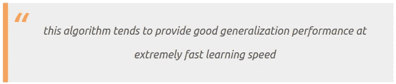

因此在 **E** LM 中出现了“极端”这个短语(但是这个名字的真正原因可能会因来源而异)。

# 为什么 ELM 不同于标准神经网络

ELM 不需要基于梯度的反向传播来工作。它使用[摩尔-彭罗斯广义逆](https://en.wikipedia.org/wiki/Moore%E2%80%93Penrose_inverse)来设置其权重。

首先，我们看标准 SLFN(单隐层前馈神经网络):

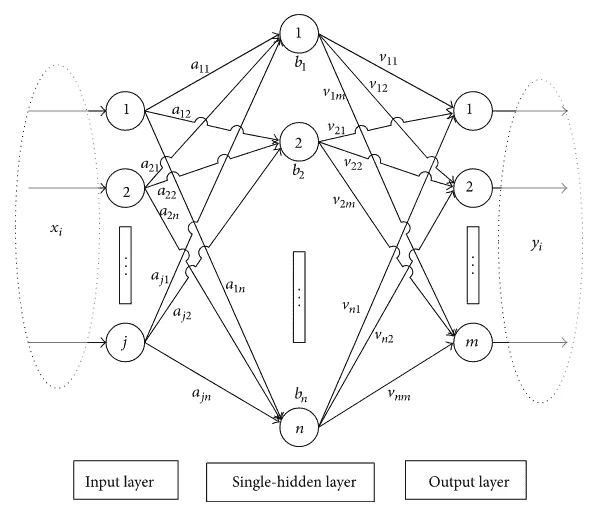

*单隐层前馈神经网络，来源:丁下 CC BY 3.0*

这很简单:

1.  将输入乘以权重
2.  添加偏差
3.  应用激活功能
4.  重复步骤 1-3 的层数次
5.  计算产量
6.  反向传播
7.  重复一切

ELM 删除了第 4 步(因为它总是 SLFN)，用矩阵求逆代替第 6 步，并且只做一次，所以第 7 步也消失了。

# 更多细节

在进入细节之前，我们需要看看 ELM 输出是如何计算的:

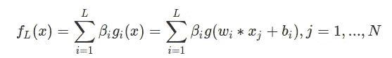

其中:

*   l 是隐藏单元的数量
*   n 是训练样本的数量
*   是隐藏层和输出之间的权重向量
*   w 是输入层和隐藏层之间的权重向量
*   g 是激活函数
*   b 是通孔向量
*   输入向量中的 x

这与标准神经网络中的反向传播非常相似，但如果你仔细观察，你会发现我们将隐藏层和输出之间的权重命名为 Beta。这个β矩阵是一个特殊的矩阵，因为它是我们的伪逆矩阵。我们可以缩短等式，写成:

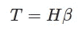

其中:

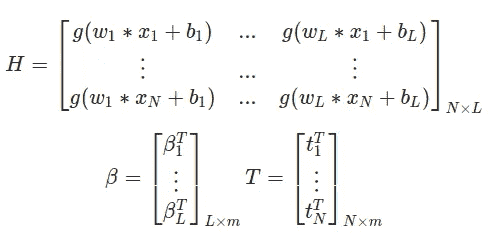

其中:

*   m 是输出的数量
*   **H** 称为**隐层输出矩阵**
*   t 是训练数据目标矩阵

# 学习背后的理论(如果你愿意，可以跳过这一部分)

现在我们必须挖掘迪普网络背后的理论，以决定下一步该做什么。

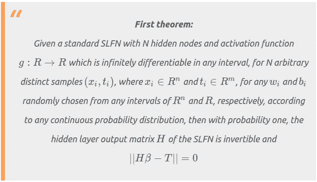

如果一个函数是[光滑函数](https://en.wikipedia.org/wiki/Smoothness)，那么它就是*无限可微的*

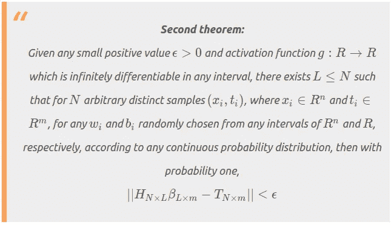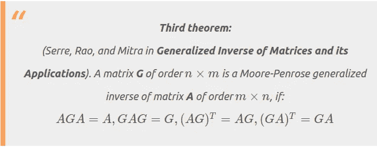

我不打算证明这些定理，但是如果你感兴趣，请参考 ELM-NC-2006 第 3 页的进一步解释。

现在我们要做的是定义我们的成本函数。基于我们对四层前馈神经网络的*能力的假设:四层对三层*我们可以看到，如果输入权重和隐藏层偏差可以随机选择，则 SLFN 是线性系统。

因为我们 ELM 是一个线性系统，所以我们可以创建优化目标:

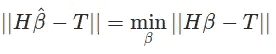

为了近似求解，我们需要再次使用 Rao 和 Mitra 的工作:

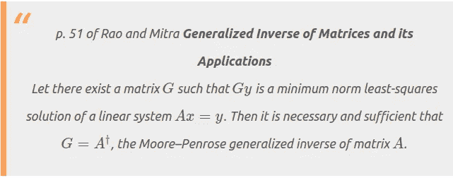

现在我们可以算出，因为 H 是可逆的，我们可以计算βhat 为:

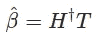

# 学习算法

在经历了一些困难的数学之后，我们现在可以定义学习算法了。算法本身相对简单:

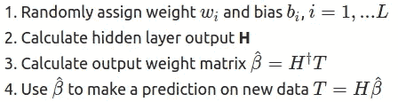

如果你对 python 的实现感兴趣，请查看这个资源库:

https://github.com/burnpiro/elm-pure

下面是该模型在 MNIST 数据集上工作的预览:

[https://github . com/burn piro/ELM-pure/blob/master/ELM % 20 example . ipynb](https://github.com/burnpiro/elm-pure/blob/master/ELM%20example.ipynb)

正如你所看到的，一个简单版本的 ELM 在 MNIST 数据集上达到了 91%的准确率，在英特尔 i7 7820 x T12 T13 CPU 上训练网络需要大约 3 秒。

# 性能比较

在本节中，我将使用原始论文中的指标，与之前的 MNIST 示例相比，您可能会惊讶于一些训练持续了多长时间，但请记住原始论文发表于 2006 年，网络是在 ***奔腾 4 1.9GHz*** CPU 上训练的。

## 数据集

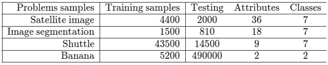

# 结果

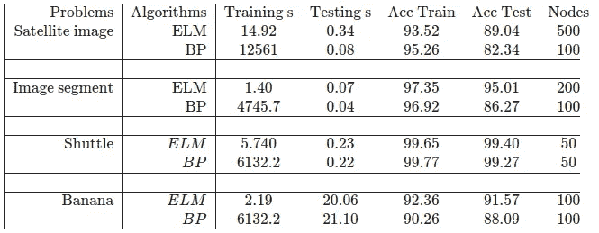

我们现在可以忽略训练时间，因为梯度下降显然比矩阵求逆需要更长的时间。该结果表中最重要的信息是**精度**和**节点**。在前两个数据集中，您可以看到作者使用不同大小的 BP 来获得与 ELM 相同的结果。第一种情况下 BP 网络的规模比第二种情况下小 **5x** 和 **2x** 。这会影响测试时间(运行 100 个节点的神经网络比运行 500 个节点的神经网络更快)。这告诉我们我们的方法在逼近数据集时有多精确。

很难在流行的数据集上找到任何 ELM 网络的测试，但我已经设法做到了。这里有一个关于 **CIFAR-10** 和 **MNIST** 的基准测试

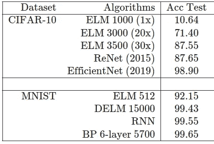

其中:

*   **DELM** 是一棵深榆树
*   **ReNet** 在[文中有描述](https://arxiv.org/pdf/1505.00393.pdf)
*   **RNN** 是一个递归神经网络
*   **EfficientNet** 在[这篇论文中有所描述](https://arxiv.org/pdf/1905.11946.pdf)

我没有找到 ELM 的训练时间，所以没有办法将它们与其他网络的结果进行比较，但所有这些乘数( **20x** 、 **30x** )都是基于 CIFAR-10 上 **ELM 1000 的训练时间的相对差异。如果在 **ELM 1000** 和 **ELM 3500** 之间有 30 倍的时间增长，那么你可以想象训练拥有 15000 个神经元的 DELM 需要多长时间。**

# 结论

ELMs 不如传统的神经网络精确，但在处理需要对网络进行实时再训练的问题时，可以使用 ELMs。我马上要写另一篇文章描述榆树的演变和用法。现在，由你来创造一个关于这些网络的观点。

榆树背后有很多争议，我不是评判的最佳人选。我将把你转到带有描述的维基百科页面[。](https://en.wikipedia.org/wiki/Extreme_learning_machine#Controversy)

# 参考资料:

*   光-黄斌，秦-朱钰，徐志敬。极限学习机:理论与应用，2006 年[https://www.ntu.edu.sg/home/egbhuang/pdf/ELM-NC-2006.pdf](https://www.ntu.edu.sg/home/egbhuang/pdf/ELM-NC-2006.pdf)
*   罗正荣，米特拉，矩阵的广义逆及其应用，韦利，纽约，1971。
*   D.《矩阵:理论与应用》，施普林格，纽约，2002 年。
*   南 Tamura，M. Tateishi，四层前馈神经网络的能力:四层对三层，IEEE Trans。神经网络 8(2)(1997)251–255。

*原载于*[*https://erdem . pl*](https://erdem.pl/2020/05/introduction-to-extreme-learning-machines)*。*