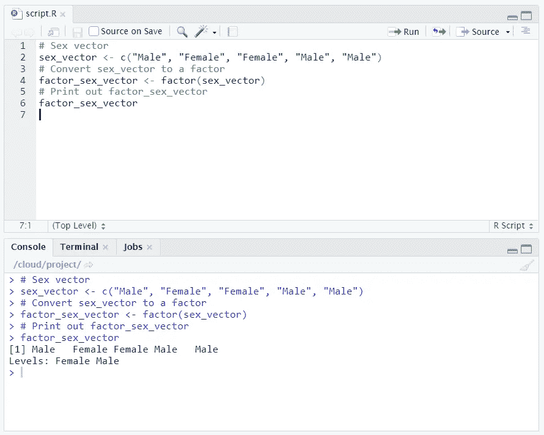
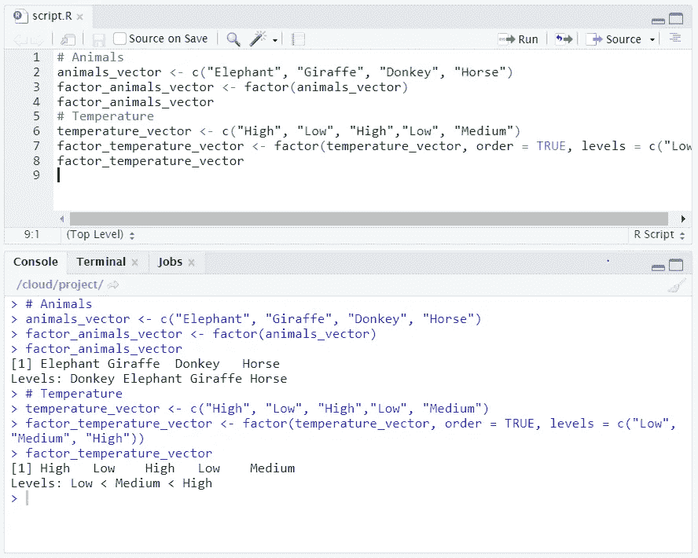
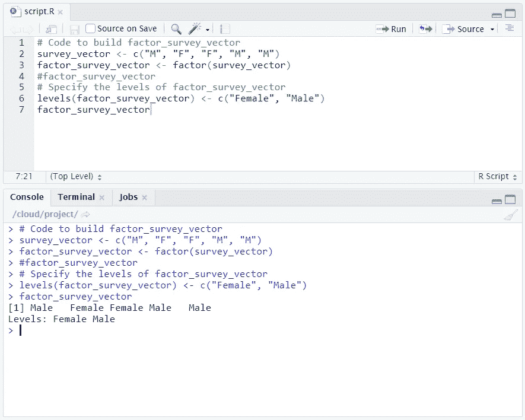
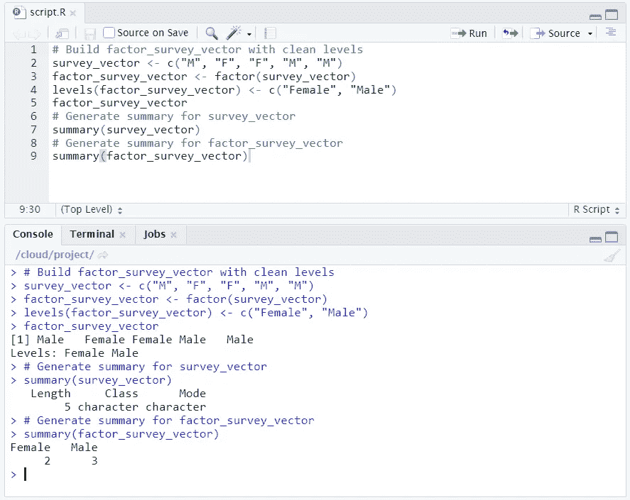
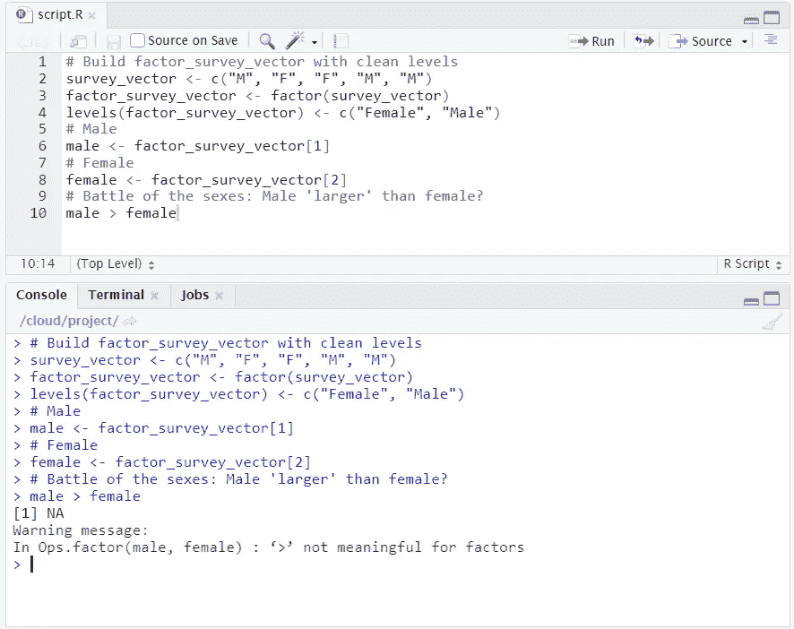
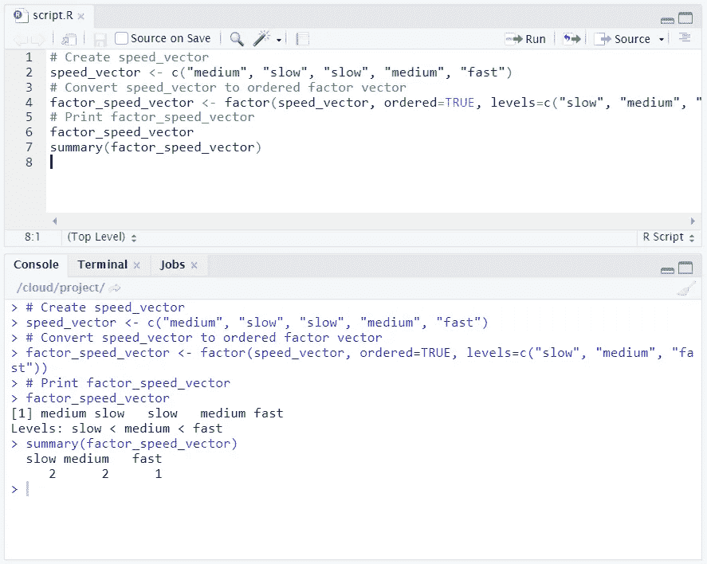
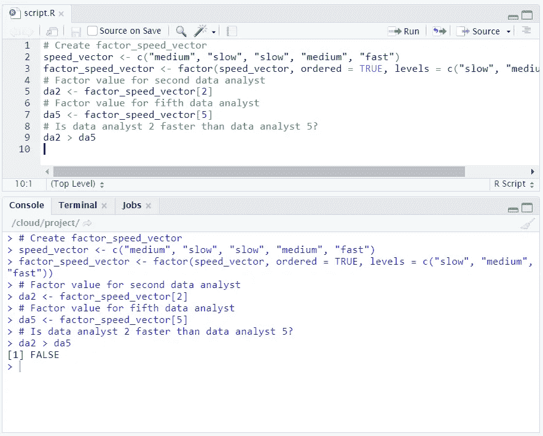

# R 中的因子介绍

> 原文：<https://towardsdatascience.com/introduction-to-factors-in-r-dd752f732c94?source=collection_archive---------28----------------------->

## 因素在数据分析中起着至关重要的作用。学习如何创建、子集化和比较它们。


# 什么是因子？

**因子**指用于存储分类变量的统计数据类型。**分类变量**属于*有限数量的类别*。另一方面，**连续变量**可以对应一个*无限个*数值。

区分您使用的是分类变量还是连续变量非常重要，因为统计模型对这两种类型的处理是不同的。

分类变量的一个例子是性别。在大多数情况下，您可以将类别限制为“男性”或“女性”。虽然在某些情况下你可能会包括额外的类别(无论是考虑到染色体变异、雌雄同体的动物，还是不同的文化规范)，但你总会有有限的类别数量。

要在 R 中创建因子，使用`[**factor()**](https://www.rdocumentation.org/packages/base/versions/3.6.2/topics/factor)`函数。`factor`函数用于将一个向量编码为一个因子(因子的其他术语是“类别”和“枚举类型”)。例如，`sex_vector`包含 5 个不同个体的性别:

```
sex_vector <- c("Male", "Female", "Female", "Male", "Male")
```

很明显有两类(**因子等级**):“男性”和“女性”。

函数`factor()`将矢量编码为一个因子:

```
factor_sex_vector <- factor(sex_vector)
```



下面是 factor()函数的一个实例。

# 分类变量的类型

有两种不同类型的分类变量:

*   一个**名义分类变量**，它是一个没有隐含顺序的分类变量。不可能说“一个比另一个更有价值”例如，考虑类别`"Elephant"`、`"Giraffe"`、`"Donkey"`和`"Horse"`。不可能说一个站在另一个之上或之下。
*   一个**有序分类变量**，它有一个自然排序。考虑类别:`"Low"`、`"Medium"`和`"High"`。很明显`"Medium"`排名比`"Low"`高，`"High"`排名比`"Medium"`高。



注意 R 是如何构造和打印名义变量和顺序变量的。

r 以不同的方式构造和打印名义变量和顺序变量。对于名义变量，没有排序，所以 R 打印它们时没有指明任何排序。

```
# Animals
[1] Elephant Giraffe  Donkey   Horse   
Levels: Donkey Elephant Giraffe Horse
```

对于顺序变量，R 使用`<`表示顺序。

```
# Temperature
[1] High   Low    High   Low    Medium
Levels: Low < Medium < High
```

# 因素水平

有时，出于清晰或其他原因，更改数据集中特定因子级别的名称会有所帮助。您可以使用`[**levels()**](https://www.rdocumentation.org/packages/base/versions/3.6.2/topics/levels)` 功能完成此操作:

```
levels(factor_vector) <- c("name1", "name2", ...)
```

例如，假设来自调查的原始数据包含一个关于回答者性别的问题，并且只记录了两个类别:`"M"`和`"F"`。

```
survey_vector <- c("M", "F", "F", "M", "M")
```

在收集数据时，用缩写记录性别可能很方便(尤其是用笔和纸)，但一旦到了分析数据的时候，就会变得令人困惑。此时，为了清晰起见，您可能希望将因子级别更改为`"Male"`和`"Female"`，而不是`"M"`和`"F"`。

注意:你分配等级的顺序很重要。`levels(factor_survey_vector)`输出`[1] "F" "M"`。如果在创建矢量时没有指定因子的级别，`R`会自动按字母顺序分配给它们*。为了正确地将`"F"`映射到`"Female"`和`"M"`映射到`"Male"`，等级应按此顺序设置为`c("Female", "Male")`。*



我们将数据中默认的“F”和“M”级别改为“女性”和“男性”。

# 总结一个因素

`[**summary()**](https://www.rdocumentation.org/packages/base/versions/3.6.2/topics/summary)`函数给出了变量内容的快速概览:

```
summary(my_var)
```

假设我们想确定在我们的向量中每个因素水平有多少个响应。我们可以使用`summary()`函数来确定这一点。



在这种情况下，summary(factor_survey_vector)显然比 summary(survey_vector)更有用

# 因素比较

当你试图比较一个因素的元素时会发生什么？在`factor_survey_vector`中，您有一个具有两个级别的因子:`"Male"`和`"Female"`。但是它们之间的相对价值是怎样的呢？

让我们测试一下`male`是否大于(`>` ) `female`。



默认情况下，当您试图比较因子中的值时，R 返回 NA，因为这个想法没有意义。

# 有序因子

对于无序(或名义)因子级别，如`"Male"`和`"Female"`，比较运算符(如大于运算符)没有意义，R 会返回一条警告消息来反映这一点。

默认情况下，r 为因子的级别赋予相等的值。然而，并不一定是这种情况。有时你还会处理那些在类别之间有自然顺序的因素。这样的因素被称为序数因素。在这种情况下，我们必须将这个信息传递给 r。

假设你想评估五个分析师的表现。要做到这一点，你跟踪他们的速度作为`"slow"`、`"medium"`或`"fast"`。您会得到以下结果:

*   分析师 1 是中等水平，
*   分析师 2 很慢，
*   分析师 3 很慢，
*   分析师 4 是中等，和
*   分析师 5 速度很快。

我们的第一步是构建一个包含五个条目的向量，并将速度因子分配给每个分析师。

```
# Create speed_vector
speed_vector <- c("medium", "slow", "slow", "medium", "fast")
```

`speed_vector`应转换为*序数*因子，因为其类别具有自然排序。也就是说，`"fast"`大于`"medium"`，然后`"medium"`大于`"slow"`。

默认情况下，`factor()`函数将`speed_vector`转换成一个无序因子。要创建一个有序因子，需要两个额外的参数:`ordered`和`levels`。

```
factor(some_vector, ordered = TRUE, levels = c("lev1", "lev2", ...))
```

通过将参数`ordered`设置为`TRUE`，可以表明该因子是有序的。使用参数`levels`，你可以按正确的顺序给出因子的值。

## 让你试试

从速度向量创建有序向量。因子的正确排序是`c("slow", "medium", "fast")`。

## 解决办法

```
# Create speed_vector
speed_vector <- c("medium", "slow", "slow", "medium", "fast")# Convert speed_vector to ordered factor vector
factor_speed_vector <- factor(speed_vector, ordered=TRUE, levels=c("slow", "medium", "fast"))# Print factor_speed_vector
factor_speed_vector
summary(factor_speed_vector)
```



# 比较有序因子

您可以通过使用众所周知的操作符来比较一个*有序*因子的不同元素。例如，要比较第一个因子向量的元素是否大于第二个因子向量的第一个元素，可以使用大于运算符(`>`)。

```
factor_vector1[1] > factor_vector2[1]
```

## 让你试试

假设‘二号数据分析师’抱怨‘五号数据分析师’拖慢了整个项目。检查他们的陈述是否属实。

## 解决办法

```
# Create factor_speed_vector
speed_vector <- c("medium", "slow", "slow", "medium", "fast")
factor_speed_vector <- factor(speed_vector, ordered = TRUE, levels = c("slow", "medium", "fast"))# Factor value for second data analyst
da2 <- factor_speed_vector[2]# Factor value for fifth data analyst
da5 <- factor_speed_vector[5]# Is data analyst 2 faster than data analyst 5?
da2 > da5
```



结果告诉我们，数据分析师 2 在抱怨数据分析师 5，而事实上是他们拖慢了一切。

# 笔记

所有图片，除非特别注明，均归作者所有。横幅图像是使用 [Canva](https://www.canva.com/) 创建的。