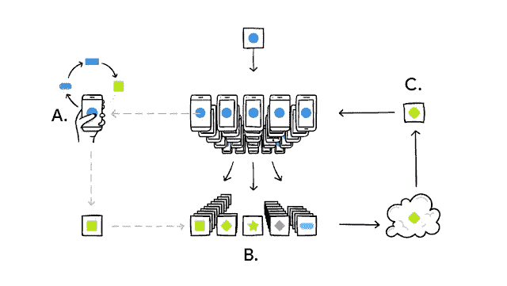
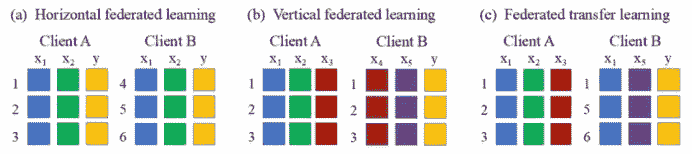
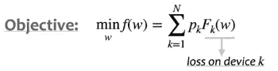

# 联合学习简介和挑战

> 原文：<https://towardsdatascience.com/introduction-to-federated-learning-and-challenges-ea7e02f260ca?source=collection_archive---------6----------------------->

## 联邦学习和挑战简介

下一代人工智能建立在围绕**“数据隐私”**的核心理念之上。当数据隐私是一个主要问题，并且我们不信任任何隐瞒我们数据的人时，我们可以转向联合学习，通过私人构建智能系统来构建保护隐私的人工智能。

联邦学习就是将计算转移到数据上。全球共享模型被购买到数据所在的位置，例如智能手机。通过将模型移动到设备上，我们可以将模型作为一个整体进行集体训练。

有了这个概念，任何人都可以直接或间接地在他们的设备上参与联合学习，例如，智能手机和物联网设备等边缘设备可以受益于设备上的数据，而数据永远不会离开设备，特别是对于计算受限的设备，通信是较小设备的瓶颈。

从构建任何智能系统同时保护任何个人隐私的角度来看，将计算转移到数据的概念是一个强大的概念。

图一。您的手机会根据您的使用情况在本地对型号进行个性化设置 A)。许多用户的更新被聚集 B)以形成对共享模型的一致变更 C)之后重复该过程。(图由[谷歌人工智能博客](https://ai.googleblog.com/2017/04/federated-learning-collaborative.html)提供)

联合学习也分为三类，如“**、**、**、**、**、**。

**水平联合学习**在所有设备上使用具有相同特征空间的数据集，这意味着客户端 A 和客户端 B 具有如下 A)所示的相同特征集。**垂直联合学习**使用不同特征空间的不同数据集来联合训练如下 b)所示的全局模型。例如，客户端 A (Amazon)拥有关于客户在 Amazon 上购买的电影的信息，客户端 B (IMDB)拥有关于客户的电影评论的信息，使用来自不同域的这两组数据集可以更好地为客户服务，使用电影评论信息(IMDB)向在 Amazon 上浏览电影的客户提供更好的电影推荐。最后，**联合迁移学习**是与预训练模型一起使用的垂直联合学习，该预训练模型在类似的数据集上被训练以解决不同的问题。联合迁移学习的一个这样的例子是训练个性化模型，例如针对用户过去的浏览行为的电影推荐。

图二。联合学习的分类。a)横向学习，b)纵向学习，c)迁移学习(图由[链接](https://www.researchgate.net/figure/Categorization-of-Federated-Learning-a-Horizontal-federated-learning-b-Vertical_fig1_339582159)

# 联合学习是如何工作的

联邦学习围绕着名为“**、FedAvg**”[3]的联邦平均算法。FedAvg 是 Google [3]为解决联邦学习问题制定的第一个标准联邦学习算法。此后，FedAvg 算法的许多变种如“ **FedProx** ”、“ **FedMa** ”、“ **FedOpt** ”、“**脚手架**等..已经被开发来解决[2]中的许多联合学习问题。

下面描述了 FedAvg 算法如何在较高层次上工作。

在每一轮 FedAvg 中，目标是最小化全局模型 ***w*** 的目标，其中只是本地设备损耗的加权平均之和。

1.  随机采样客户端/设备的子集。
2.  服务器向每个客户端广播其全局模型。
3.  并行地，客户端对它们自己的损失函数运行**随机梯度下降(SGD)** ，并将结果模型发送到服务器进行聚合。
4.  然后，服务器将其全局模型更新为这些局部模型的平均值。
5.  然后对于 ***n*** 这样的通信循环重复该过程。

# 联合学习的挑战

这种有用的技术带来了大量需要解决的挑战[2，4]。我认为需要解决的一些最重要的挑战是从[4]中挑选出来的以下四点(该列表绝非详尽无遗)。

1.  **噪声和准确性之间的权衡:**使用**差分隐私(DP)** ，我们可以将噪声添加到数据中，以增强隐私保护。然而，与 **DP** 我们牺牲了模型的性能。因此，需要在添加适量噪声和不损害模型性能之间进行权衡。
2.  **系统和统计异构:**在异构设备上进行培训是一项挑战，无论设备类型如何，确保在所有设备上有效地扩展联合学习非常重要。统计信息的不相似性是指一个设备不能导出全局统计模式，因此一个设备的总体、样本或结果与其他设备的不同。
3.  **通信瓶颈:**将模型带到设备的通信成本应该适度低，因为它可能会影响 FL 环境，其中一个设备可能会由于通信瓶颈而瘫痪，这反过来会拖延联合训练过程。有几项工作致力于解决通信瓶颈，如丢弃掉队者(未能在指定时间窗口内计算训练的设备)，以及建模压缩/量化以降低带宽成本。
4.  **中毒:**中毒有两种形式， **1。数据中毒:**在联合训练过程中，多个客户端可以通过贡献它们的设备上训练数据来参与，并且很难检测/防止恶意客户端发送恶意/伪造数据来毒害训练过程，这反过来毒害模型。 **2。模型中毒**，与数据中毒相反，恶意客户端在将收到的模型发送回中央服务器进行聚合之前，通过篡改其梯度/参数来修改模型，因此，在聚合过程中，全局模型可能会因无效梯度而严重中毒。
5.  **效率和隐私之间的权衡:**使用**安全多计算(SMPC)和差分隐私(DP)** 提高了联邦学习中的隐私保护能力，然而，这种保护伴随着成本和效率之间的权衡。使用 **SMPC** ，客户端将在发送回中央服务器之前加密模型的参数，因此加密需要额外的计算资源，这将损害训练模型的效率。使用 **DP** ，噪声被添加到模型和数据中，因此损失了一些精度。因此，在联邦学习中，在 **SMPC** 和 **DP** 之间找到一个合适的平衡是一个公开的挑战。

# 结论

联邦学习仍然是一个相对较新的领域，有很多研究机会可以让保护隐私的人工智能变得更好。这包括诸如**系统异构**、**统计异构**、**隐私问题、**和**沟通效率等挑战。**。这带来了联合学习中的许多开放问题，在联合学习被业界广泛采用之前，这些问题需要作为一个整体来解决。

# **参考文献:**

[1] [联合学习:没有集中训练数据的协同机器学习](http://ai.googleblog.com/2017/04/federated-learning-collaborative.html)

[2] [联邦学习的进展和公开问题](https://arxiv.org/abs/1912.04977)

[3] [从分散数据进行深度网络的通信高效学习](https://arxiv.org/pdf/1602.05629.pdf)

[4] [一项关于联合学习的安全性和隐私性的调查](https://www.sciencedirect.com/science/article/abs/pii/S0167739X20329848)