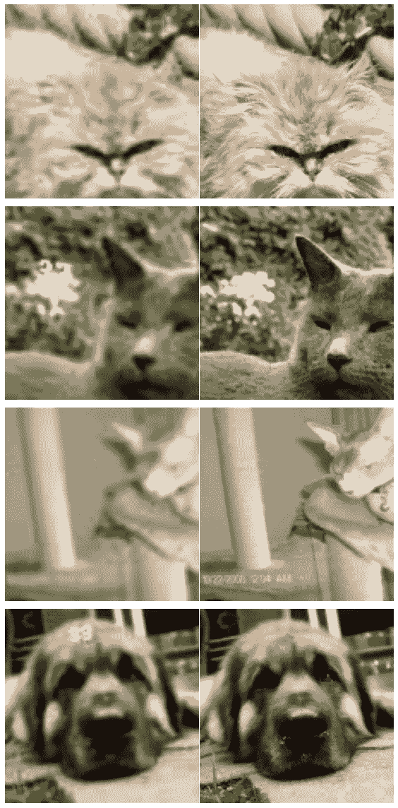
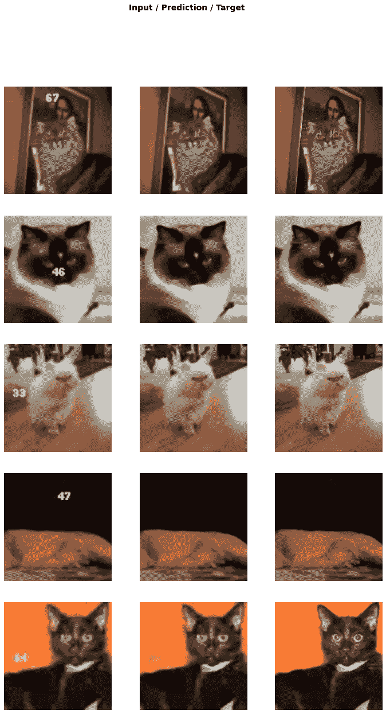
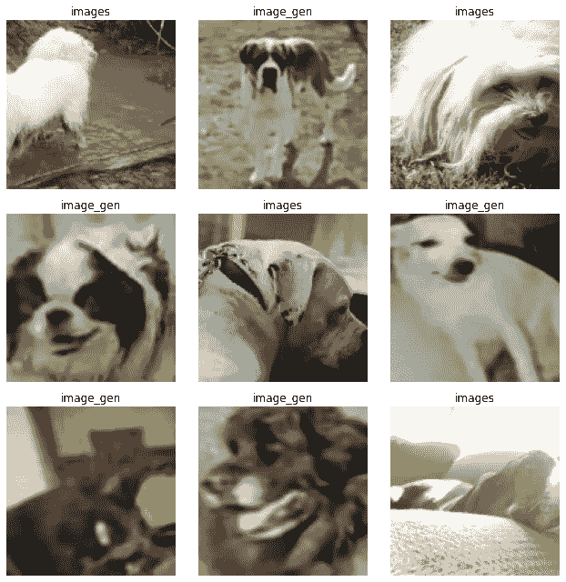
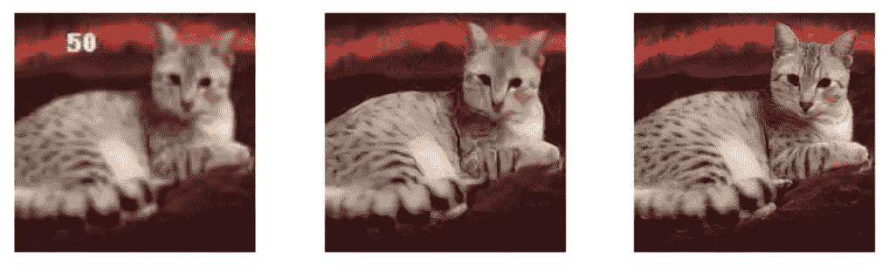
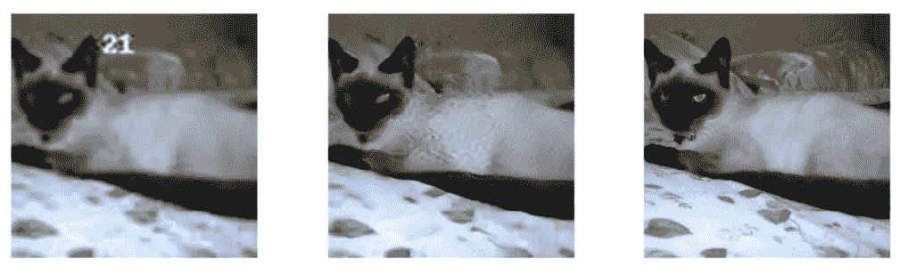

# 基于高斯函数的图像恢复

> 原文：<https://towardsdatascience.com/introduction-to-gans-877dd689cac1?source=collection_archive---------20----------------------->

## [实践教程](https://towardsdatascience.com/tagged/hands-on-tutorials)

## 利用生成对抗网络恢复图像质量。

由[马文·迈耶](https://unsplash.com/@marvelous?utm_source=medium&utm_medium=referral)在 [Unsplash](https://unsplash.com?utm_source=medium&utm_medium=referral) 上拍摄的照片

自 Goodfellow 等人于 2014 年在 [NIPS](http://papers.nips.cc/paper/5423-generative-adversarial-nets) 推出以来，GANs(生成对抗网络)已经在深度学习和计算机视觉领域掀起了风暴。GANs 的主要思想是同时训练两个模型；一个生成器模型 ***G*** 捕获某一数据分布，另一个鉴别器模型 ***D*** 确定样本是来自原始分布还是来自 ***G*** 。

GAN 框架就像一个两人的最小最大游戏。 ***G*** 不断改进，生成更逼真、质量更好的图像。 ***D*** 提高了确定图像是否由 ***G*** 创建的能力。训练 GAN 可以完全通过反向传播来完成，这极大地简化了训练过程。通常，通过从 ***G*** 到 ***D*** 的定期切换来执行训练，以防止两个模型中的巨大性能差距。

# 图像恢复

为了更详细地解释 GANs，我们将使用图像恢复的例子，使用来自 fast.ai 的[第 7 课-v3](https://github.com/fastai/course-v3/blob/master/nbs/dl1/lesson7-superres-gan.ipynb) 的代码。您可以在 [Google Colab](https://colab.research.google.com/) 上制作笔记本的副本，并在通读时自己运行代码，以获得更多的实践经验！一个优点是，我们只需要一个未标记的图像数据集来创建图像恢复模型。该模型的目的是恢复低分辨率图像和去除简单水印。以下是映像恢复过程的简要概述:

1.  决定要使用的数据集。在本帖中，我们将使用[牛津-IIIT 宠物数据集](https://www.robots.ox.ac.uk/~vgg/data/pets/)，这是在 [CC 4.0 许可下公开提供的](https://creativecommons.org/licenses/by-sa/4.0/)。
2.  通过对图像进行某些变换来“美化”数据集。
3.  预先训练一个带有 [UNet](https://arxiv.org/abs/1505.04597) 架构的生成器网络，将伪造的图像转换回原始图像。
4.  生成可用于预训练评论家的初始恢复图像集。
5.  预先训练一个批评家网络，将生成的图像分类为“假的”，将原始图像分类为“真的”。
6.  训练整个 GAN 结构，根据 [GAN 文件](http://papers.nips.cc/paper/5423-generative-adversarial-nets)从发生器切换到批判器。
7.  最后，我们将获得一个生成器网络，可用于恢复其他质量较低的图像！

## 数据集生成

为了创建一个带标签的数据集，我们使用一个随机函数来“简化”我们的图像，下面是应用的变换:

*   添加随机文本/数字
*   通过调整到较小的分辨率，然后调整回原始分辨率来降低图像质量

下面是左边的复制图片和右边的原始图片。我们可以看到质量严重下降，一些图像中添加了随机数水印！

来自[牛津 Pets 数据集](https://www.robots.ox.ac.uk/~vgg/data/pets/)的复制图像(左)、原始图像(右)。

## 预培训生成者和评论家

利用该数据集，我们对 UNet 模型进行预处理，以产生原始图像，并将经过处理的图像作为输入。这是使用均方误差损失来训练的。 [ResNet34](https://arxiv.org/abs/1512.03385) 被用作主干，这也是在 ImageNet 上预先训练的，这样我们可以节省一些计算时间！以下是仅经过 5 个纪元(在 Google Colab 免费 GPU 上大约 10 分钟)后预训练生成器网络的结果:

预训练发电机网络的结果

我们观察到生成器模型能够部分恢复一些图像质量。此外，大多数带水印的数字都被模型删除和填充了！对于仅仅 10 分钟的训练时间来说，这已经是相当不错的表现了。但是画质还是有较大差距；显然，简单的均方误差损失不足以执行完整的图像恢复。

为了预先训练批评家，我们简单地使用上面的生成器输出，并将它们放入一个目录中。评论家将从目录名中检索标签，并将学会将这些图像分类为真实或虚假。以下是来自一批 critic 预训练数据集的一些样本:

具有原件(标记为图像)和赝品(标记为 image_gen)的评论家预训练数据集

## 甘培训

在这一部分，我将只简要说明甘训练的细节，而不是把重点放在直觉和技巧，以提高其稳定性。对于完整的解释，[约瑟夫·罗卡](https://medium.com/@joseph.rocca)有一大篇[T3关于它！](/understanding-generative-adversarial-networks-gans-cd6e4651a29)

为了训练 GAN，我们需要在更新生成器 **G** 和鉴别器/鉴别器 **D** 之间交替。 **G** 将使用对抗性损失进行训练，该损失描述了生成的样本欺骗 **D** 的可能性。均方误差损失也用于确保 **G** 不会开始产生看起来根本不像原始图像的样本。 **D** 被单独训练使用相同的对抗性损失，但是与 **G** 相比，试图将这个损失项推向另一个方向。在训练 D 时，我们希望最大化 D 正确分类真假样本的可能性。

GAN 的训练过程非常复杂，并且需要大量的计算时间。这就是我们进行预培训的原因。预训练模型(甚至在低于标准的生成样本上)允许模型 **G** 和 **D** 以合理的网络参数开始。这是双重优势，因为它减少了培训失败的机会，也缩短了培训时间！

## 结果

在这里，我们展示了经过大约 80 个时期的训练(在 Google Colab 上将近 3 个小时)后生成的一些样本。利用简单的 UNet 模型和短的训练过程，我们能够恢复大部分图像质量并去除简单的水印。在下面的例子中，我们看到图像质量有了显著提高。数字水印也被几乎完美地去除了！但是，一些细节，如猫的头部和面部的精细纹理已经模糊了。

## 结论

尽管随机图像生成是当今的热门话题，但 GANs 并不局限于这些生成任务(人脸、风景、绘画等)。如果我们跳出框框思考，有许多创造性的应用，GANs 在其中同样有效！除了图像质量恢复，另一个很酷的例子是图像彩色化，我们可以通过相同的过程生成一个变色的数据集，并使用它来训练我们的 GAN。