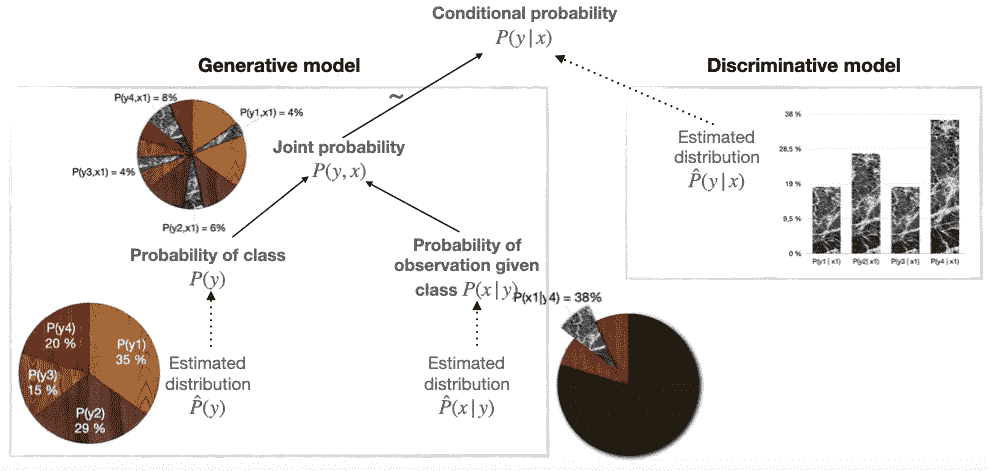

# 生成模型和判别模型介绍

> 原文：<https://towardsdatascience.com/introduction-to-generative-and-discriminative-models-9c9ef152b9af?source=collection_archive---------15----------------------->

Pawel Nolbert 在 [Unsplash](https://unsplash.com?utm_source=medium&utm_medium=referral) 上拍摄的照片

**简介**

最近我在工作中做了一个演示，在那里我解释了如何使用[条件随机场(CRF)](https://en.wikipedia.org/wiki/Conditional_random_field) 解决一些问题。由于我的同事对 CRF 知之甚少，我有几张幻灯片专门介绍这个算法背后的理论。当我准备理论幻灯片时，我觉得有责任将 CRF 与概念上类似的算法[隐马尔可夫模型(HMM)](https://en.wikipedia.org/wiki/Hidden_Markov_model) 进行比较。已知 CRF 是判别模型，而 HMM 是生成模型。我必须更新我对监督机器学习方法分类的知识，特别是生成模型。现在我想简单地分享一下我对生成模式和判别模式之间区别的理解。

***生成模型*** 是一大类机器学习算法，通过对联合分布 *P(y，x)* 建模来进行预测。

***判别模型*** 是一类有监督的机器学习模型，通过估计条件概率 *P(y|x)进行预测。*

为了使用生成模型，应该解决更多的未知数:必须估计每个类的概率和给定类的观察概率。这些概率用来计算联合概率，最后联合概率可以作为条件概率的替代来进行预测。

为了估计条件概率 P(y|x ),生成模型比判别模型有更多的步骤

判别模型采取了一种更简单的方式:它只是直接估计条件概率。

每种模式都有许多优点和缺点。我只是注意到生成模型可以用来生成新的样本，但是它需要更多的数据。给定相同数量的数据，判别模型通常优于生成模型，但是它不知道特征之间的依赖性，因为它与预测无关。因此，判别模型不能产生新的样本。

现在让我们仔细看看生成模型的概念。

**生成模型**

> *正如我前面所展示的，要做出预测，条件分布* P(y|x) *就足够了。但由于* P(y|x) = P(y，x) / P(x) *，其中* P(x) *为常数对于给定的* x *和* *所有可能的* y *，使用联合分布* P(y，x) *进行预测是有效的。*

通过模拟联合分布 *P(y，x)* 意味着对于每一对(*、*)，概率 *P(易、)*是已知的(被模拟)。一开始，我甚至有点难以理解这是怎么可能的——***X***的可能值的范围可能是巨大的，所以建议每个*的概率是不现实的，更不用说一对(*易*、*)了。应该怎么做呢？**

***首先。**贝叶斯定理！它将联合概率 *P(y，x)* 的计算分解为另外两种类型的概率的计算:类概率*P(y)*和给定类的观察概率 *P(x|y)。**

**P(y，x) = P(y) * P(x|y)**

*它有什么好处？这样至少更容易计算出概率 *P(y)* ，因为它可以通过计算类别频率从数据集进行估计。 *P(x|y)* 比较棘手，因为通常 *x* 不只是一个特征，而是一组特征: *x = xi，…，xn* ，它们之间可能存在依赖关系*。**

**P(x | y)=пP(Xi | y，x1，xi-1，xi+1，xn)**

*通常特征之间的依赖关系是未知的，特别是当它们出现在复杂的星座中时( *y，x1，xi-1，xi+1，xn)* )。*

*那么估计 *P(x|y)* 应该怎么做呢？为此，有以下诀窍:*

***第二。**胡乱假设！或者仅仅是一些假设，使得 *P(x|y)* 的估计易于处理。朴素贝叶斯分类器可以作为具有这种假设的生成模型的完美例子，这使得 *P(x|y)* 的计算更容易。也就是说，它具有特征之间的独立性假设 *xi，…，xn。**

**P(x | y)=пP(Xi | y)**

*通过这种放松，对 *P(x|y)* 的估计是易处理的，因为每个 *P(xi|y)* 都可以通过独立于其他特征找到离散特征 *xi* 的频率或者使用高斯分布来估计，如果特征 *xi* 是连续的。*

***结论***

*现在你可以看到，为了使用生成模型，你应该准备好估计两种类型的概率 *P(y)* 和 *P(x|y)。*同时，判别模型直接估计条件概率 *P(y|x)* ，这通常更有效，因为人们不估计特征之间的依赖性，因为这些关系不一定有助于目标变量的预测。*