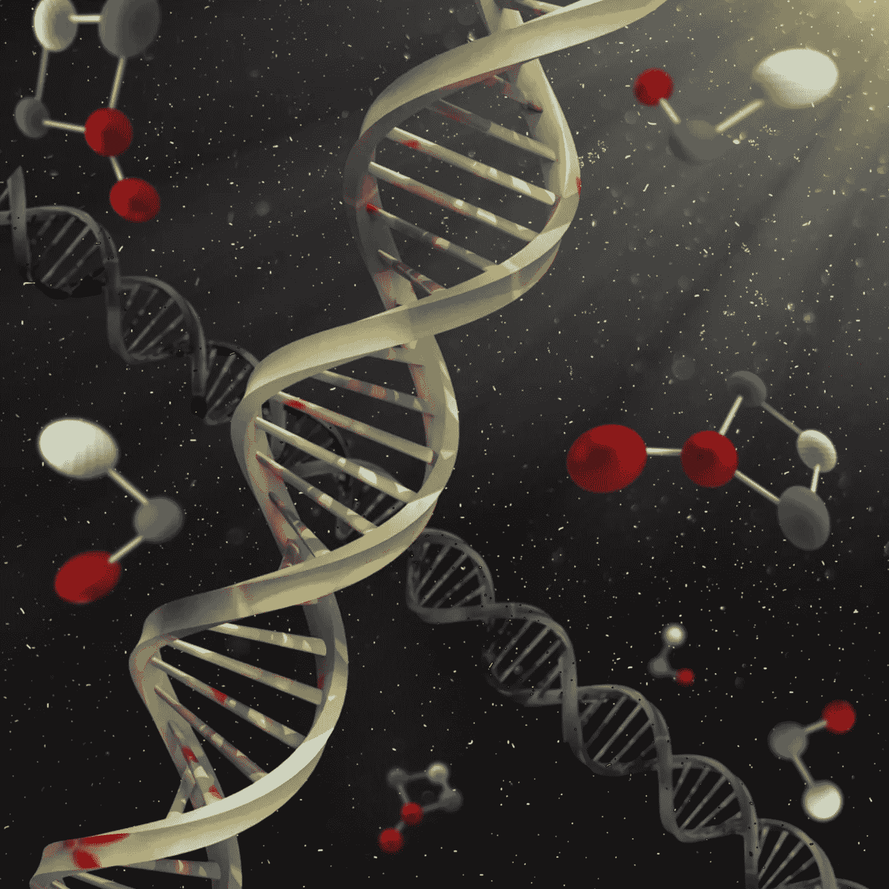
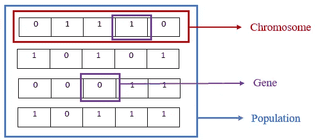
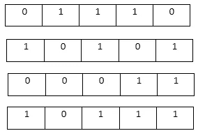
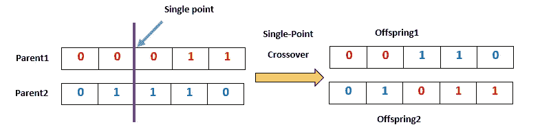
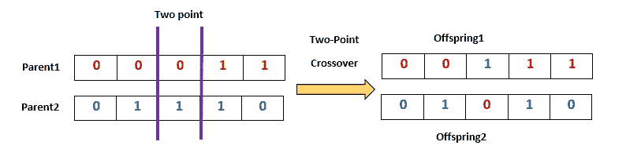
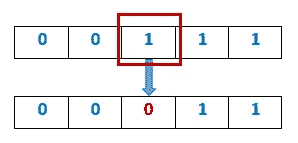
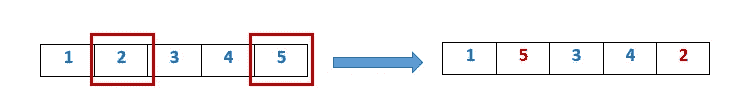
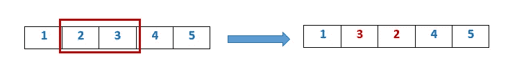

# 函数优化的遗传算法和 Python 实现简介

> 原文：<https://towardsdatascience.com/introduction-to-genetic-algorithm-and-python-implementation-for-function-optimization-fd36bad58277?source=collection_archive---------9----------------------->



图片由来自 [Pixabay](https://pixabay.com/?utm_source=link-attribution&utm_medium=referral&utm_campaign=image&utm_content=4828422) 的[威廉·弗伦奇](https://pixabay.com/users/french1944-12643700/?utm_source=link-attribution&utm_medium=referral&utm_campaign=image&utm_content=4828422)拍摄

这里，在这篇文章中，我将尝试给你一个遗传算法如何工作的想法，我们将实现函数优化的遗传算法。那么，我们开始吧。

遗传算法是一种基于搜索的优化技术。它经常用于寻找最优或最接近的最优解。它是由霍兰德引进的。它基于达尔文的自然选择理论。在解释遗传算法如何工作之前，让我先解释一下达尔文的自然选择理论。在他的理论中，他将自然选择定义为“一个特征的每一个微小的变化，如果有用的话，被保留下来的原则”。这个概念简单而有力:最能适应环境的个体更有可能生存和繁衍。[ [维基百科](https://en.wikipedia.org/wiki/Natural_selection) ]有时这个理论被描述为“适者生存”。那些比其他人更适合的人有机会在这场进化中生存下来。遗传算法就是关于这个的。它模仿自然选择的过程来寻找最佳解决方案。

在遗传学中，我们将使用一些生物学术语，如群体、染色体、基因、选择、交叉、突变。现在，首先，让我们试着理解这些术语的含义。

## 群体、染色体、基因

在这个过程的开始，我们需要初始化这个问题的一些可能的解决方案。群体是给定问题的所有可能解决方案的子集。换句话说，我们可以说群体是一组染色体。染色体是解决当前问题方法之一。每条染色体都是一组基因。

为简单起见，我们可以将染色体描述为一个字符串。因此，我们可以说群体是一些字符串的集合(每个字符是一个二进制值，或者是 0，或者是 1)。字符串中的每个字符都是一个基因。



为了开始遗传算法的过程，我们首先需要初始化种群。我们可以用两种方法初始化群体。第一个是随机的，第二个是启发式的。用一些随机群体开始算法总是更好。

## 适应度函数

初始化种群后，我们需要计算这些染色体的适应值。现在的问题是这个适应度函数是什么，它是如何计算适应度值的。

作为一个例子，假设我们有一个方程，f(x) = -x + 5。我们需要有最大值且约束为 0≤x≤31 的解。

现在，让我们考虑一下，我们有一个随机的四条染色体的群体，如下所示。我们的染色体长度是 5 as 2⁵=32，0≤x≤31。



我们的适应度函数将计算每个染色体的函数值，如问题陈述中所述:

对于第一条染色体，01110 表示整数 14。所以，f(x) = -(14*14) + 5 = -191。

对于第二条染色体，10101 表示整数 21。所以，f(x) = -(21*21) + 5 = -436。

对于第三条染色体，00011 表示整数 3。所以，f(x) = -(3*3) + 5 = -4。

对于第四条染色体来说，10111 在整数上意味着 23。所以，f(x) = -(23*23) + 5 = -524。

## 亲代选择

亲本选择通过使用由适应度函数计算的染色体的适应度值来完成。基于这些适应值，我们需要选择一对具有最高适应值的染色体。

有许多方法适合度计算喜欢轮盘赌轮选择，等级选择。

在轮盘赌轮选择中，具有最高适应值的染色体具有最大的可能性被选为亲本。但是在这个选择过程中，可以选择更低的。

在等级选择中，染色体根据它们的适应度值从高到低排序。作为一个例子，根据上面计算的那些适应值，我们可以从高到低排列那些染色体，如第 3 >第 1 >第 2 >第 4。因此，在选择阶段，将基于从适应度函数计算的适应度值来选择第三和第一染色体。

## 交叉

交叉用于通过产生子代或后代来改变一代代染色体的编程。亲代染色体用于创建这些后代(生成的染色体)。

为了创造后代，有一些方法，如单点杂交，两点或多点杂交。

对于单点杂交，首先，我们需要选择一个点，然后在亲代染色体之间交换被该点分割的这些部分，以产生后代。你可以使用颜色组合，以便于理解。



对于两点交叉，我们需要选择两个点，然后交换比特。



最后，这些新的后代被添加到种群中。

## 变化

突变给种群带来多样性。有不同种类的突变，如位翻转突变、交换突变、倒位突变等。这些太简单了。

在比特翻转突变中，只需选择一个或多个比特，然后翻转它们。如果所选位为 0，则将其转换为 1，如果所选位为 1，则将其转换为 0。



在交换位突变中，选择两个位并交换它们。



在逆突变中，只需反转位。



# **遗传算法在 Python 中的实现**

让我们尝试用 python 实现函数优化的遗传算法。

**问题陈述**

假设我们有一个方程，f(x) = -x + 5。我们需要有最大值且约束为 0≤x≤31 的解。使用概率 0.2 来选择初始群体。

你可以在这里 找到完整的代码 [**。**](https://www.kaggle.com/aaawnrahman/genetic-algorithm)

**初始人口**

随机初始化优于启发式初始化。因此，这里随机初始化用于群体初始化。

```
*#initialize population*
import random
best=-100000
populations =([[random.randint(0,1) for x **in** range(6)] for i **in** range(4)])
print(type(populations))
parents=[]
new_populations = []
print(populations)
```

**健身功能**

适应性函数计算染色体的适应性值。适应度函数的功能取决于问题的要求。

```
*#fitness score calculation ............*
def fitness_score() :
    global populations,best
    fit_value = []
    fit_score=[]
    for i **in** range(4) :
        chromosome_value=0

        for j **in** range(5,0,-1) :
            chromosome_value += populations[i][j]*(2**(5-j))
        chromosome_value = -1*chromosome_value if populations[i][0]==1 else chromosome_value
        print(chromosome_value)
        fit_value.append(-(chromosome_value**2) + 5 )
    print(fit_value)
    fit_value, populations = zip(*sorted(zip(fit_value, populations) , reverse = True))
    best= fit_value[0]

fitness_score()
```

**选择**

基于适合度分数选择最适合的染色体。这里使用等级选择过程。

```
def selectparent():
    global parents
    *#global populations , parents*
    parents=populations[0:2]
    print(type(parents))
    print(parents)
selectparent()
```

**交叉**

在选择了最合适的亲本后，需要进行杂交来产生后代。这里使用单点交叉。

```
def crossover() :
    global parents

    cross_point = random.randint(0,5)
    parents=parents + tuple([(parents[0][0:cross_point +1] +parents[1][cross_point+1:6])])
    parents =parents+ tuple([(parents[1][0:cross_point +1] +parents[0][cross_point+1:6])])

    print(parents)
```

**突变**

交叉完成后，进行变异以保持一代到另一代的多样性。在这里，我们将单点位翻转突变。

```
def mutation() :
    global populations, parents
    mute = random.randint(0,49)
    if mute == 20 :
        x=random.randint(0,3)
        y = random.randint(0,5)
        parents[x][y] = 1-parents[x][y]
    populations = parents
    print(populations)
```

我们需要多次迭代整个过程，直到找到我们的最佳解决方案。

你会在 [**卡格尔**](https://www.kaggle.com/aaawnrahman/genetic-algorithm) 上找到完整的代码。

## 参考

1.  [遗传算法—变异](https://www.tutorialspoint.com/genetic_algorithms/genetic_algorithms_mutation.htm)
2.  [遗传算法——交叉](https://www.tutorialspoint.com/genetic_algorithms/genetic_algorithms_mutation.htm)
3.  [遗传算法—亲本选择](https://www.tutorialspoint.com/genetic_algorithms/genetic_algorithms_parent_selection.htm)
4.  [遗传算法—种群初始化](https://www.tutorialspoint.com/genetic_algorithms/genetic_algorithms_population.htm)

## 最后，感谢您的阅读。感谢您的任何反馈。