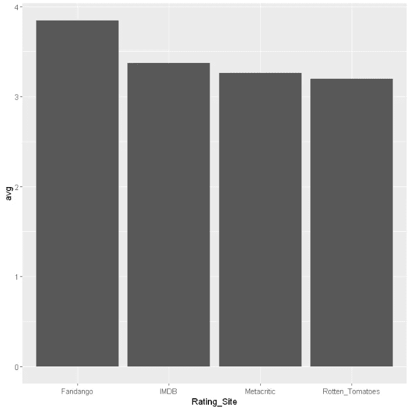

# R 中的 ggplot2 简介

> 原文：<https://towardsdatascience.com/introduction-to-ggplot2-in-r-4db4f720f505?source=collection_archive---------26----------------------->

## 使用 ggplot2 包中的数据可视化技术快速入门。


# 什么是数据可视化？

> *是以图形、图标、演示等方式可视化数据的实践。它最常用于将复杂的数据转化为非技术受众易于理解的见解。*

如果你是数据可视化的新手，这是一本可以作为起点的好书——[用数据讲故事](https://www.amazon.com/Storytelling-Data-Visualization-Business-Professionals/dp/1119002257)

如果你有兴趣学习更多关于 Python 数据可视化的知识，可以看看我的另一个教程——Python 中的[Matplotlib](https://medium.com/@jasonmchlee/introduction-to-matplotlib-in-python-5f5a9919991f)

# R 是什么？

r 是一种主要用于统计分析的编程语言。它是金融和医疗保健行业的常用分析工具。

[**R**](https://www.r-project.org/about.html) 提供了多种多样的统计(线性和非线性建模、经典统计测试、时序分析、分类、聚类、…)和图形技术，具有高度的可扩展性。

R 入门的绝佳资源，

1.  [代码学院](https://www.codecademy.com/learn/learn-r)
2.  [guru99](https://www.guru99.com/r-tutorial.html)
3.  [R 之书](https://nostarch.com/bookofr)

# 什么是 ggplot2？

[ggplot2](https://en.wikipedia.org/wiki/Ggplot2) 是来自[*tidy verse*](https://www.tidyverse.org/)*的 R 包。它的流行归因于在高抽象层次上定制图形和删除或改变图中组件的简单性。*

如果您有兴趣了解更多信息，请查阅这本书— [用 ggplot2 实现 R 中的数据可视化](http://shop.oreilly.com/product/0636920052807.do)

ggplot 中的绘图语法遵循构建图形的简单分层方法。

1.  数据
2.  美学——变量
3.  几何样式-这是您定义图形样式的地方
4.  用于定制的附加层—标题、标签、轴等。

结构看起来像这样。

```
ggplot(data = Example_Data) +
       aes(x = Variable_1, y = Variable_2) +
       geom_bar()   #this is an example of a bar plot sysntax
```

对于本教程，我将假设您对 R 概念有基本的工作熟练程度。

我们开始吧！

# 准备好我们的环境

首先，我们需要安装 tidyverse 和 ggplot2 包。

```
install.packages(c("ggplot2", "tidyverse")
```

接下来，我们需要加载 ggplot2 库。

```
library(ggplot2)
```

# 条形图

对于数据，我们将使用一个名为 *reviews 的数据集。*文件已经读入我们的环境。*评论*数据集收集了来自 4 个主要评论网站的电影评论，分别是 Fandango、烂番茄、IMDB 和 Metacritic。

我们感兴趣的输入是，

1.  数据= *评论*
2.  美学= (x 轴=评分网站，y 轴=平均评分)
3.  几何样式=条形图

要创建一个显示每个网站平均评分的条形图，我们可以执行以下操作。

```
ggplot(data=reviews) +
    aes(x = Rating_Site, y = avg) +
        geom_bar(stat = 'identity')
```



# 直方图

直方图向我们展示了一个值出现的频率。下面是一个直方图，显示了我们的点评数据集中评分的频率分布。请注意，添加了一些附加层。

```
ggplot(data = reviews) +
    aes(x = Rating, **fill** = "red") +
        **geom_histogram**(bins=30) +
        **labs**(title = "Distribution of Ratings")
```


其他步骤:

1.  填充——我们在美学层使用它来指定我们想要的颜色。
2.  geom_histogram() —这里我们定义我们想要一个直方图。
3.  实验室——为了添加标题，我们为*标签使用了一个新图层。*

在这里，我们可以看到，我们改变和增加了 3 个新的层。ggplot 使得根据我们的个人喜好定制图形变得非常容易。

# 箱线图

箱线图是可视化描述性统计的另一个优秀工具。如果您想了解更多关于 boxplots 的信息，请查看这篇来自数据科学作家伙伴的文章

下面是一个箱线图，显示了所有评级网站的分布情况。

```
ggplot(data=reviews) +
    aes(x=Rating_Site, y = Rating, **color = Rating_Site**) +
        **geom_boxplot**() +
            labs(title="Comparison of Movie Ratings") +
                theme(**panel.background** = element_rect(fill = "white"), **legend.position**="none")
```


现在我们看看这个箱线图，我们已经改变或添加了一些新的层。

1.  颜色—颜色允许我们定制元素的线条边框，这里我们选择传入变量 rating_site。这使得每个盒子的颜色彼此不同。
2.  geom _ box plot()-陈述图形的样式
3.  panel.background —这允许我们移除灰色背景并用白色填充它。我个人倾向于白色背景，但是根据你想要表达的内容，有时候不同颜色的背景会更有用。
4.  legend.position —这里我声明移除图例标签。为什么？如果我让图例可见，它只会说明它所指的每个盒状图的颜色是哪个 rating_site。这是重复的，因为很明显 xlabels 已经向我们显示了 rating_site。

总的来说，我们可以看到代表 Fandango 评级的方框在 y 轴上比其他网站的要高。相比之下，烂番茄盒子更长，这意味着评级更加分散。

# 概观

ggplot 是 r 中最强大的可视化工具之一。一旦您深入研究这个主题，您就会发现您可以拥有多少可定制性来创建丰富多彩、详细生动的图形。

在 ggplot 库中以及其他流行的 r 库中有更多可用的图形，值得探索所有不同的选项并找到适合您的编码和分析风格的库。

请继续关注——我将分享更多关于在 ggplot 中创建其他图形的教程。