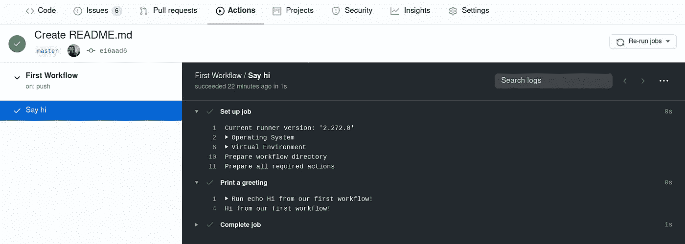
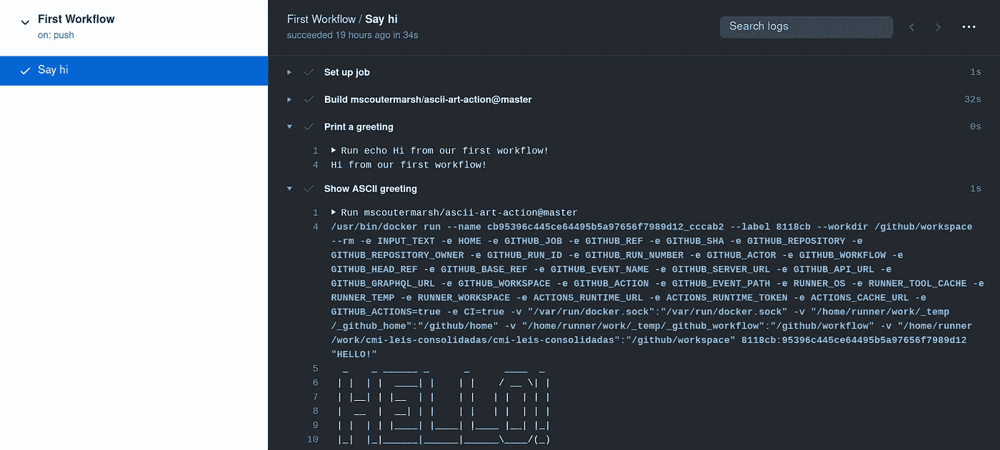
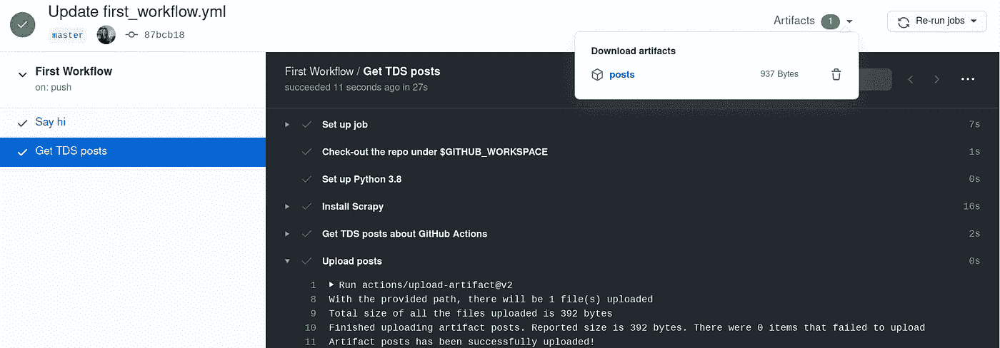

# GitHub 操作简介

> 原文：<https://towardsdatascience.com/introduction-to-github-actions-7fcb30d0f959?source=collection_archive---------14----------------------->

## 对于数据科学家来说



看到那些绿色的扁虱真是太好了

如果您是 DevOps 和 CI/CD 世界的新手，GitHub 操作可能会有点混乱，所以在本文中，我们将探索一些特性，看看我们可以使用该工具做些什么。

从 CI/CD 的角度来看，GitHub 动作和工作流的主要目标是**在每次有变化的时候测试我们的软件**。这样我们可以发现错误，并在错误出现时立即纠正。

今天我们将学习更多关于 GitHub 动作的知识，并学习如何使用 Bash 脚本和 Python 来使用它们。很好，我们开始吧！

# GitHub 操作与工作流

首先，最好说明一下 GitHub 动作和工作流之间的区别。正如 GitHub Actions [文档](https://docs.github.com/en/actions)所述，Actions 是“**单个任务**，您可以组合它们来创建工作并定制您的工作流”。另一方面，[工作流](https://docs.github.com/en/actions/configuring-and-managing-workflows/configuring-a-workflow#about-workflows)是“**定制的自动化流程**，您可以在您的存储库中设置这些流程，以便在 GitHub 上构建、测试、打包、发布或部署任何项目”。换句话说:

*   **工作流**:在您的存储库上运行的自动化流程；工作流可以有许多 GitHub 动作
*   **GitHub 动作**:单个任务；它们可以用 Docker、JavaScript 编写，现在也可以用新的[复合运行步骤](https://github.blog/changelog/2020-08-07-github-actions-composite-run-steps/)编写 shell 脚本；您可以编写自己的动作或使用其他人创建的动作

# 编写我们的第一个工作流

让我们首先创建一个没有动作的工作流，以便理解它是如何工作的。工作流是使用 YAML 文件定义的，您必须将它们存储在存储库根目录下的`.github/workflows`目录中。

要创建工作流，我们需要定义以下内容:

*   ***事件*** *触发工作流*
*   ***机床*** *每项工作都要运行*
*   ***构成工作流的作业*** *(作业包含一组执行单个任务的步骤，默认情况下并行运行)*
*   ***步骤*** *每项工作都要运行*

工作流的**基本语法**是:

*   `on` —触发工作流的事件
*   `runs-on`—**机床**每项工作应该运行
*   `jobs` —构成**工作流**的作业
*   `steps`—**任务**每个作业应该运行的任务
*   `run`—**命令**该步骤应该运行

首先，我们需要定义**触发**工作流的事件。在这个例子中，我们想在每次有人推送到存储库时说声问候。

一个工作流**运行**由一个或多个**作业**组成。每项工作都在`runs-on`指定的机器上运行。该机器可以是 GitHub 托管的运行程序，也可以是自托管的运行程序。我们将使用 GitHub 托管的 runner。

一个作业包含一系列被称为**步骤**的任务。步骤可以运行命令、运行安装任务或运行操作。每个步骤都可以有一个使用操作系统外壳的 **run** 命令。这里我们要回显一个信息。

迷惑？让我们看看它是如何工作的。继续在 repo 上的`.github/workflows`中创建一个`first_workflow.yml`文件，然后粘贴以下代码:

```
# your-repo-name/.github/workflows/first_workflow.ymlname: First Workflow **on:** push **jobs:**                         
  first-job:                           
    name: Say hi                           
    **runs-on**: ubuntu-latest                           
   ** steps**:                           
    - name: Print a greeting                             
      **run**: echo Hi from our first workflow!
```

现在，如果您将此文件提交到您的存储库，点击它并转到 GitHub 网站上的 Actions 选项卡，您可以看到新的工作流，检查所有运行并查看输出:


我们第一个工作流程的输出

## 在我们的第一个工作流中使用动作

行动是单独的任务，我们可以从三个来源使用它们:

*   在与工作流相同的存储库中定义的动作
*   在**公共存储库中定义的动作**
*   在**发布的 Docker 容器图像**中定义的动作

它们在我们的工作流程中作为**步骤**运行。为了调用它们，我们使用了`uses`语法。在本例中，我们将使用由 [Mike Coutermarsh](https://github.com/mscoutermarsh) 编写的[打印 ASCII 艺术文本](https://github.com/mscoutermarsh/ascii-art-action)的动作。因为它是在公共存储库中定义的，所以我们只需要传递它的名称:

```
# your-repo-name/.github/workflows/first_workflow.ymlname: First Workflowon: push jobs:                         
  first-job:                           
    name: Say hi                           
    runs-on: ubuntu-latest                           
    steps:                           
      - name: Print a greeting                             
        run: echo Hi from our first workflow!   

      - name: Show ASCII greeting                             
        **uses: mscoutermarsh/ascii-art-action@master**   
        **with:**                               
          text: 'HELLO!'
```

`with`语法是由动作定义的输入参数的映射。结果如下:



ASCII 艺术动作的结果

# 将 Python 与工作流结合使用

作为数据科学家，我们在日常生活中会使用大量的 Python，所以学习如何在我们的工作流程中使用它是一个好主意。**设置特定版本的 Python 或 PyPy** 是将 Python 与 GitHub 操作结合使用的推荐方式，因为它“确保不同运行者和不同版本 Python 之间的一致行为”。为此，我们将使用一个动作:`setup-python`。

之后，我们可以像通常在机器上一样运行命令。在这里，我们将安装 Scrapy 并运行一个脚本来获取一些关于 GitHub 操作的 TDS 帖子，看看它是如何工作的。因为我们想从我们自己的库中运行一个脚本，所以我们也需要使用`checkout`动作来访问它。让我们创建一个新作业来运行脚本:

```
# your-repo-name/.github/workflows/first_workflow.ymlname: First Workflowon: push jobs:                         
  first-job:                           
    name: Say hi                           
    runs-on: ubuntu-latest                               steps:                           
      - name: Print a greeting                             
        run: echo Hi from our first workflow!  

      - name: Show ASCII greeting                             
        uses: mscoutermarsh/ascii-art-action@master    
        with:                               
          text: 'HELLO!'                                                            **get-posts-job:**                           
 **name: Get TDS posts**                           
    runs-on: ubuntu-latest         steps:                             
      - name: Check-out the repo under $GITHUB_WORKSPACE                               
        **uses: actions/checkout@v2  **       

      - name: Set up Python 3.8                               
        **uses: actions/setup-python@v2    **                           
        with:                                 
          python-version: '3.8'          

      - name: Install Scrapy                               
        **run: pip install scrapy  **       

      - name: Get TDS posts about GitHub Actions                                 
        **run: scrapy runspider posts_spider.py -o posts.json**
```

我想把刮下来的帖子保存到一个文件里，所以我们来学习一下怎么做。

## 持续工作流数据

一个**工件**是在工作流运行期间产生的一个文件或文件集合。我们可以将工件传递给同一个工作流中的另一个作业，或者使用 GitHub UI 下载它。

让我们下载文章中的 JSON 文件，看看它是如何工作的。为了处理工件，我们使用了`upload-artifact`和`download-artifact`动作。要上传工件，我们需要指定文件或目录的路径以及工件的名称:

```
# your-repo-name/.github/workflows/first_workflow.yml# [...]get-posts-job:                            
    name: Get TDS posts                            
    runs-on: ubuntu-latest steps:                             
      - name: Check-out the repo under $GITHUB_WORKSPACE                               
 uses: actions/checkout@v2        

      - name: Set up Python 3.8                               
        uses: actions/setup-python@v2                              
        with:                                 
          python-version: '3.8'          

      - name: Install Scrapy                               
        run: pip install scrapy         

      - name: Get TDS posts about GitHub Actions                                 
        run: scrapy runspider posts_spider.py -o posts.json ** - name: Upload artifact                      
        uses: actions/upload-artifact@v2                        
        with:                                 
          name: posts                                 
          path: posts.json**
```

现在我们可以使用 GitHub UI 下载该文件:



下载藏物

# 创建您的第一个动作

可以使用 Docker 容器、JavaScript 创建动作，也可以使用 shell 脚本创建动作(复合运行步骤动作)。[复合运行步骤动作](https://github.blog/changelog/2020-08-07-github-actions-composite-run-steps/)的主要用例是当您有许多 shell 脚本来自动化任务，并且编写一个 shell 脚本来组合它们比 JavaScript 或 Docker 更容易时。

一个动作的三个主要组成部分是`runs`、`inputs`和`outputs`。

*   `runs` — ***(必需)*** 配置动作代码的路径和用于执行代码的应用程序。
*   `inputs` — ***(可选)*** 输入参数允许您指定操作在运行时期望使用的数据
*   `outputs` — ***(可选)*** 输出参数允许你声明一个动作设置的数据

动作的文件名必须是`action.yml`或`action.yaml`。让我们使用 GitHub Docs 中的例子，创建一个打印“嘿[用户]”消息的动作。因为这是一个复合动作，我们将使用`using: "composite"`语法:

```
# action.ymlname: 'Hey From a GitHub Action'description: 'Greet someone'**inputs:
  user:**  # id of input
    description: 'Who to greet'
    required: true
    default: 'You'runs:
  **using: "composite"**
  steps: 
    - run: echo Hey ${{ inputs.user }}.
      shell: bash
```

如果在与工作流相同的存储库中定义了一个动作，我们可以使用`./path-to-action-file`来引用它。在这种情况下，我们需要访问存储库中的文件，所以我们也需要使用`checkout`动作。

如果动作是在公共存储库中定义的，我们可以使用特定的提交、发布版本或分支来引用它。

## 从同一个存储库中运行操作

```
# .github/workflows/use-action-same-repo.ymlname: Action from the same repoon: push 
                                                                        jobs:                                 
  use-your-own-action:                           
    name: Say Hi using your own action                           
    runs-on: ubuntu-latest                           
    steps:                             
      **- uses: actions/checkout@v2**

      **- uses: ./** # the action.yml file is in the root folder                           
        with:                                
         user: 'Déborah'
```

## 从公共存储库中运行操作

```
# .github/workflows/use-action-public-repo.ymlname: Action from a public repositoryon: push 
                                                                        jobs:                                 
  use-your-own-action:                           
    name: Say Hi using your own action                           
    runs-on: ubuntu-latest                           
    steps:                                               
      **- uses: dmesquita/github-actions-tutorial@master  **                          
        with:                                
         user: 'Déborah'
```

这是为了我们的巡演。您还可以在工作流中使用[变量和秘密](https://docs.github.com/en/actions/configuring-and-managing-workflows/using-variables-and-secrets-in-a-workflow)，[缓存依赖关系](https://docs.github.com/en/actions/configuring-and-managing-workflows/caching-dependencies-to-speed-up-workflows)来加速它们，以及[连接数据库和服务容器](https://docs.github.com/en/actions/configuring-and-managing-workflows/using-databases-and-service-containers)来管理工作流工具。

在本指南中，我们没有使用 CI 最酷的功能之一，即**经常测试**，这样我们就可以在流程的早期发现 bug。但是我认为在做之前理解动作和工作流程是很好的。我希望现在开始使用 CI 工具会更容易，我计划在接下来的教程中这样做。

你可以看到我们在这里使用的所有代码:[https://github.com/dmesquita/github-actions-tutorial](https://github.com/dmesquita/github-actions-tutorial)

今天就到这里，感谢阅读！