# 梯度下降简介:权重初始化和优化器

> 原文：<https://towardsdatascience.com/introduction-to-gradient-descent-weight-initiation-and-optimizers-ee9ae212723f?source=collection_archive---------13----------------------->

## 如何修改梯度下降算法以获得更好的性能？

梯度下降是所有机器学习和深度学习方法背后的主要驱动算法之一。随着时间的推移，这种机制在几个方面经历了几次修改，以使其更加健壮。在这篇文章中，我们将讨论其中的两个。为此，你需要一个非常清晰的直觉，知道什么是梯度下降，以及它是如何运作的。如果你对这个话题有任何疑问或困惑，请随时访问我的文章。

## 挑战

1.  **损失函数的结构差异**

让我们来学习两种类型的曲线。

**凸曲线**

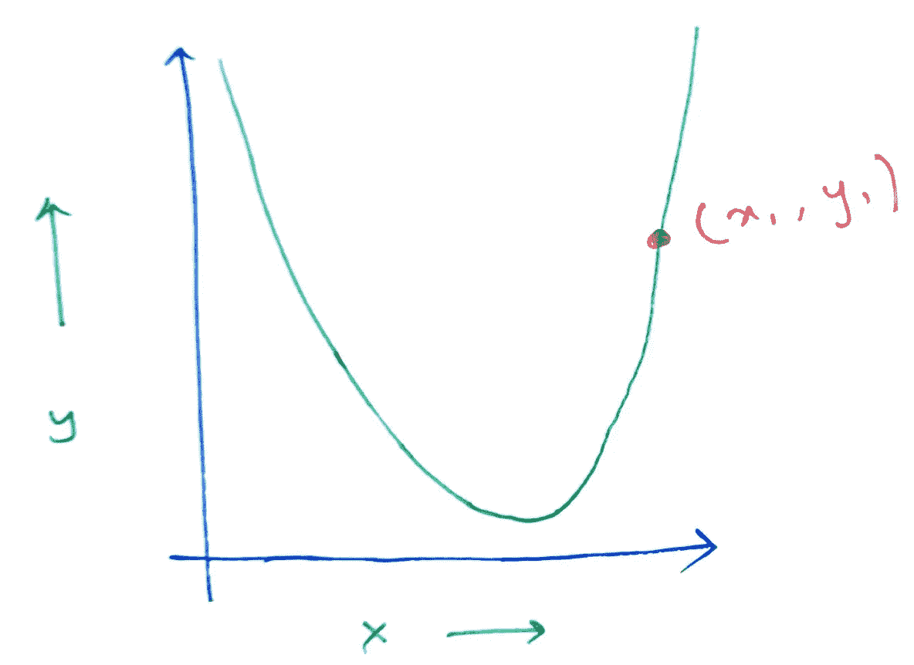

这是一条凸曲线。它有一个单一的全局最小值。所以，无论我们在哪里初始化任何点，我们都可以使用梯度来达到全局最小值。如果我们考虑点作为我们的权重，曲线作为损失函数，我们可以很容易地使用损失函数关于权重的导数收敛到损失函数的最小值。

**非凸曲线**

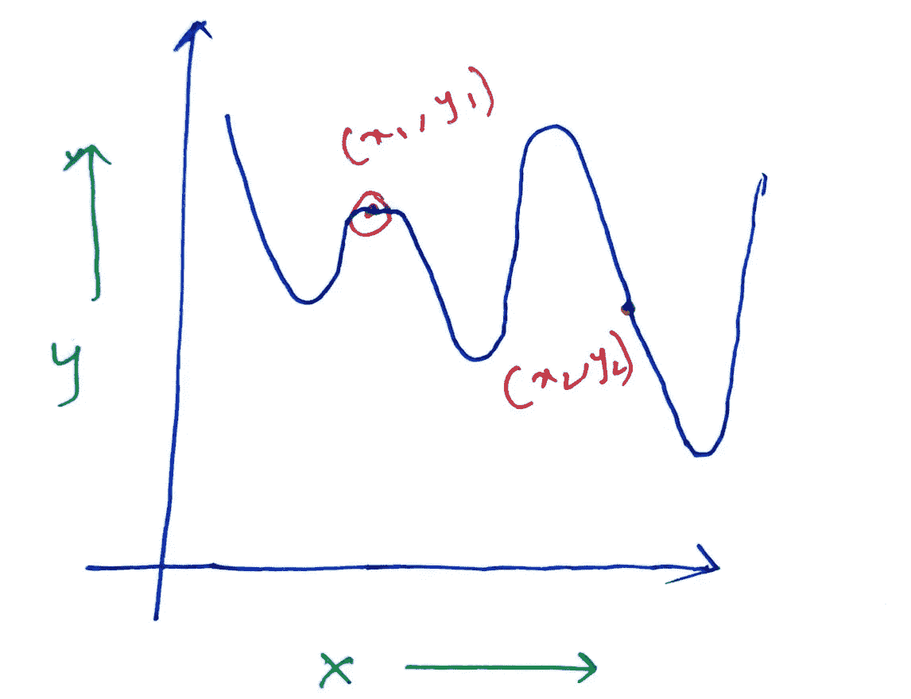

这是一条非凸曲线，现在，这里如果我们从曲线上的任何一点(x，y)使用梯度下降，我们不确定会达到全局最小值。我们可能会陷入局部最小值。例如，(x1，y1)可能会卡在跟随它的局部最小值，但是(x2，y2)会很容易到达全局。所以，这里点的位置很重要。

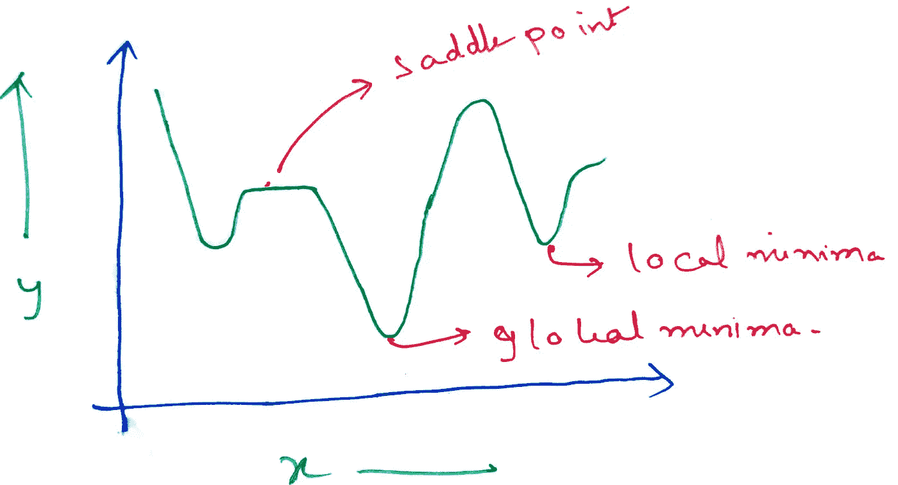

非凸特征。

一条非凸曲线有三个点，这将是有趣的。鞍点，即类平台区域、局部和全局最小值。所有这些点都会有

> dy/dx=0

现在，如果我们考虑 x 作为权重，y=f(x)作为损失函数，dL/dW=0

到目前为止，我们一直使用梯度下降方程，

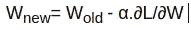

因此，如果 dL/dW 为 0，权重保持不变，我们将陷入次优状态。由于函数复杂，这类非凸曲线在神经网络中非常常见。

现在让我们来讨论一些其他的问题，关于梯度下降算法。

2.**爆炸和消失渐变**

在神经网络中，如果我们使用非常深的网络，我们会遇到一个称为消失和爆炸梯度的问题。我们已经看到，在神经网络中，我们得到一个等式

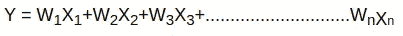

并且通过几个激活函数 f(x)和 g(x)发送这个。通过多次执行这样的运算，我们得到了复杂的方程。举个例子，

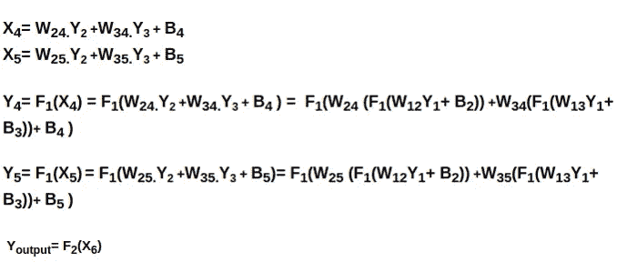

我们在我之前的文章中已经看到了这一点。我们可以看到，我们将权重乘以几倍。层数越多，乘法次数越多。

现在，如果权重被初始化为非常高的值，梯度值将爆炸，这被称为爆炸梯度问题。类似地，如果权重的值很低，则由于与非常小的值反复相乘，梯度值几乎消失。这就是所谓的消失梯度问题。

3.**不同类型梯度下降技术的行为。**

在我之前的文章中，我们谈到了三种梯度下降技术。

1.  **批次梯度下降:**此时，整个批次被一起输入到模型中，对整个数据集进行预测，误差计算如下:

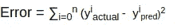

因此，它获取批次中所有样本的误差，并计算所有误差的总和。现在，由于它将整个集合放在一起，所以在一个时期中，它只更新一次权重。此外，由于我们每次都使用相同的批次，集合的分布不会改变，因此每次更新时权重分布也保持相似。如果我们想象下降的过程，

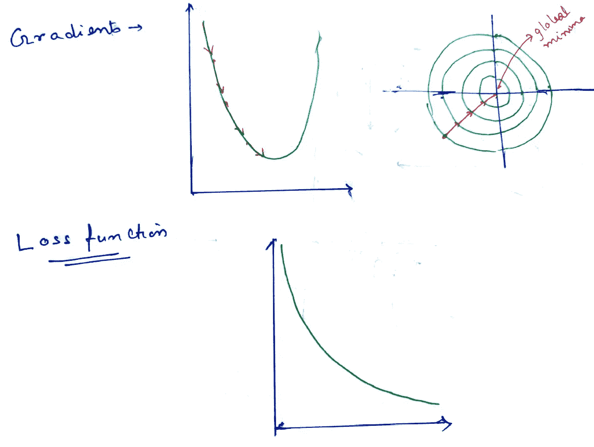

它看起来会像这样。

对于更高维的权重，我们用轮廓来表示。第一个图显示了 2d 平面中的梯度运动。第二个图显示了使用等高线显示的复杂函数的梯度移动，第三个图显示了损失函数的收敛。

因此，我们可以看到梯度下降相当平稳，损失函数收敛很快。这里，在批量下降的情况下，我们必须发送整个批量，如果它有一百万个条目，它在计算上将是非常低效的。所以，我们需要转向不同的东西。

2.**随机梯度下降:**这里训练集的一个样本一次通过模型。因此，误差计算如下

> 误差=(y 实际值-y 预测值)

它非常快。它在每次误差计算后更新权重。如果集合中有 100 个样本，则在一个时期中，SGD 会在模型预测每个样本后更新权重 100 次。现在，每一次，它尝试一个新的样本，在大多数情况下，这个样本将不同于前一个，相应地，权重的分布也将相应地变化。假设可能存在异常值，对于该异常值，特征值分布是不同的，相应地，该样本的权重分布将会变化，并且它将不同于先前的样本。所以，梯度下降会有点嘈杂。它的视觉效果会是这样的，

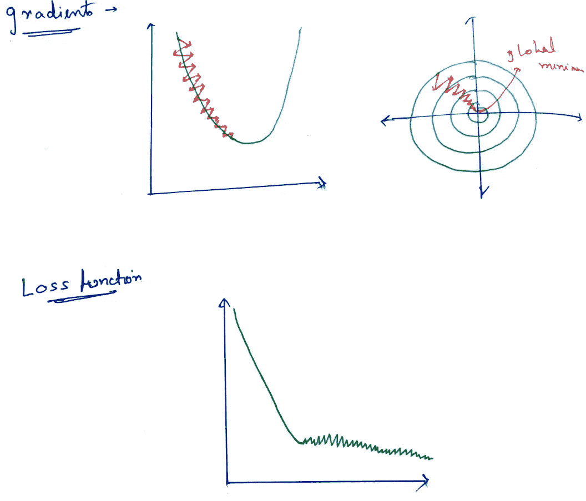

所以，我们可以看到，这里它也收敛了，但是下降变得有点嘈杂。这种噪声使得随机梯度下降的梯度下降缓慢。

## 什么是噪音？

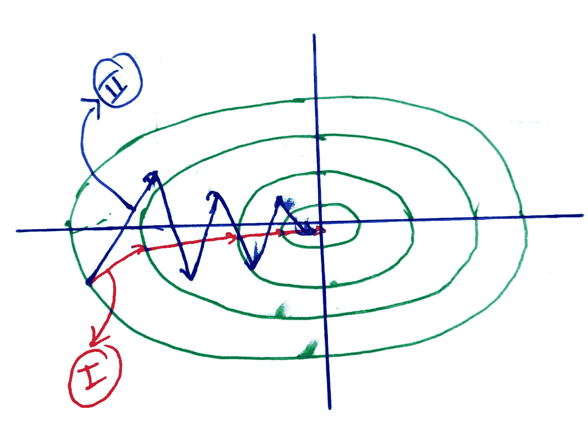

**I** 显示本应下降的高度 **II** 显示 SGD 下降。我们可以看到，除了水平分量之外，还有一个垂直分量。这个垂直分量负责减慢速度。它被称为**噪音。**

3.**小批量梯度下降**:这里我们将整个训练数据集分成更小的小批量，并使用它们进行训练。因此，如果在训练集中有 100 个数据，我们将 25 个作为我们的采样大小，我们将获得 4 个小批量。误差计算如下:

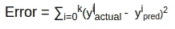

其中 k 是一批样品的数量。因此，在每个历元中，为 4 个批次计算误差，并更新 4 次。这里也有一个噪声问题，但与 SGD 相比要小一些。如果我们想象一下，我们会得到，

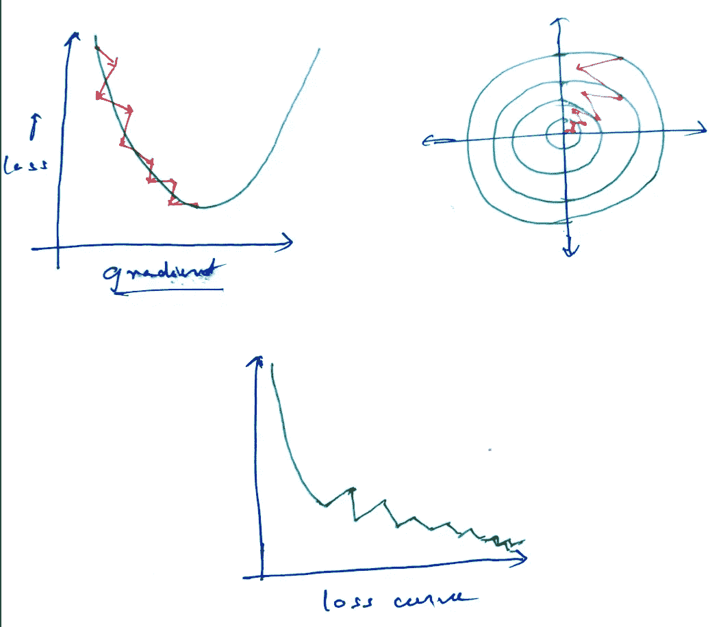

我们会得到这样的东西。我们可以看到，有噪声，但它比 SGD 小得多。但是为了加速梯度下降，我们需要尽可能地去除噪声，并尽可能地抑制运动的垂直分量。

因此，我们列出了梯度下降机制的三个重要挑战。

现在，让我们看看解决方案。

## 解决方法

1.  **重量初始化**

权重初始化方法用于解决我们的第二个问题，即爆炸和消失梯度问题。

我们知道我们的神经元在方程上工作，

其中 n 是特征的数量以及相应的权重的数量。我们试图以这样的方式初始化权重，

(W1，W2，……..Wn) = 1/n

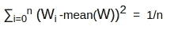

因此，对于对应于每个特征的权重，我们将权重初始化为

> W=a/sqrt(n)

其中‘a’是常数，并且‘a’在 1 到 n-1 之间变化。这防止权重被初始化得太大或太小。

2.**优化师**

为了解决第一个和第三个问题，我们使用称为优化器的算法。有几个优化器已经开发了两个主要目标。

1.  优化学习速度
2.  抑制垂直运动以加速梯度下降。

在我们讨论优化器之前，让我们来看看一个叫做**指数加权平均的概念。**

**加权平均值**

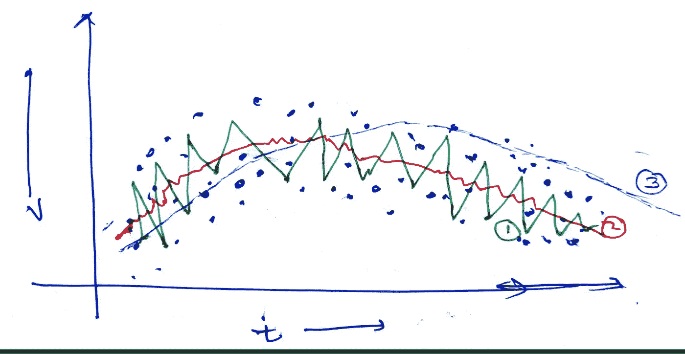

在图表中，深蓝色的点是数据点。现在，我们可以看到数据点是随机分布的，因此噪声很大。为了减少噪声并提取分布的一些实际趋势，我们使用了一种称为移动平均考虑的技术。

比方说，在股票营销中，为了决定一只股票价值的变化，我们经常看它在过去几天的表现。如果我们考虑过去 10 天的价值，它被称为 10 移动平均线，以此类推。这给了我们一种近似，并有助于减少随机性。

类似地，在这种情况下，为了获得第 n 个时间单位的值，我们考虑最后几个时间单位的加权平均值以及当前值。为什么我们称之为加权呢？我们这样称呼它是因为它包含了一个常数，当我们移动到更远的时间单位时，那个时间单位的值对我们当前时间单位值的影响开始减小。

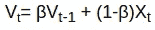

这是我们将使用的等式。这里 V 是时间 t 的加权平均值，X 是时间 t 的数据值。现在，参数*β*据说是我们取多少天平均值的近似值。

通常情况下，我们取β的值为 0.9。0.9 值对应于我们正在计算的移动平均天数。

> 平均天数= 1/(1-β)

现在，如果我们必须用β0.9 计算 50 天的加权平均值

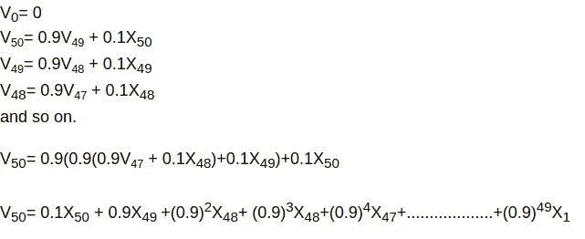

这是计算，因此我们为不同时间单位的影响提供不同的权重。(0.9) ⁰变得非常小，并且在此之后不再起作用。这是计算值的方式。

当我们取值 0.9 时，我们得到图像中的红线。它给出了我们数据点的一个相当好的近似值。绿线代表β= 0.5。它是 2 倍单位平均值，因此它非常快地适应了数据点的变化，并且仍然具有高度的噪声，而蓝色对应于 0.98 beta 值。平均 50 天，所以需要很多时间来适应。

但是，这里有一个问题，在 t=1，估计出来很差。如果 X1=10

那么，V1 = 0.9×0+0.1×10 = 1。

当 V0=0 时。所以，我们使用一种叫做**的偏差修正**。

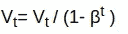

这样做是为了得到较低 t 值的正确近似值。对于较高的 t 值，beta)^t 变得很小，不重要

> (1- (beta)^t)= 1
> 
> Vt=Vt/1

所以，值保持不变。

**随动量梯度下降**

这种技术使用加权平均法来稳定垂直运动以及次优状态的问题。

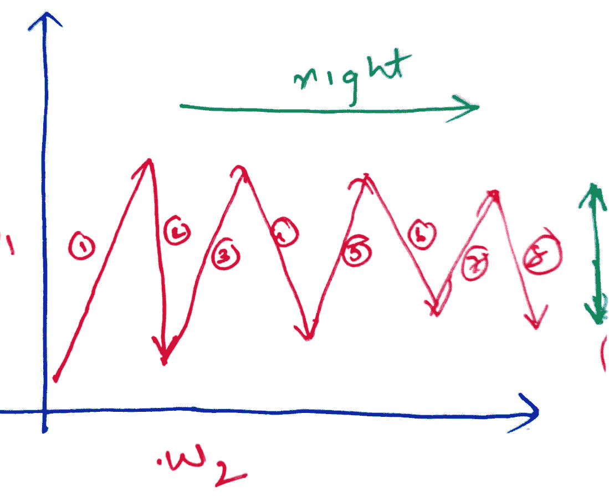

如果我们看到图像，我们会看到，它显示了下降过程中引入的噪音运动。现在，如果我们分解每个运动，我们将得到两个分量，右运动和垂直运动。现在，当我们取加权平均值时，例如 1 和 2、3 和 4，实际上在彼此相反的方向上的垂直运动都是相反的，这抑制了垂直方向上的运动幅度，但是水平运动对所有人都是相同的。所以水平运动加速了，因为这些运动积极地累积起来解决了我们的问题。

等式变成了，

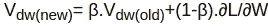

这个“Vdw”叫做力矩。

更新等式变成:

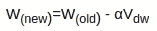

另一个需要注意的是，当 dL/dW=0 时，W(旧)不再等于 W(新)。它还有一个防止下降进入次优状态的因素。

**AdaGrad 优化器**

自适应梯度优化器使用一种在训练期间修改学习率的技术。它以较高的学习速率开始，随着学习速率的收敛而降低。可以看出，这种方法有助于更好地收敛，并且当我们接近最小值时，它采取非常小的步骤并且非常小心地移动，因此几乎没有超过最优点的机会。这也有助于避免鞍点和局部最小值。

因此，它使用一个修改的学习率参数来适应随时间的变化。

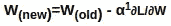

因此，它将学习速率*α*变为*α。*我们将*阿尔法*定义如下。

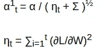

如果我们看到第二个方程，它是所有梯度的平方和，直到这个单位。在第一个等式中，我们可以看到，它从一个固定的学习速率α开始。ε值是 10^-8，它是防止分母为 0 的值。

随着时间单位的流逝，随着(nu)值的增加, *alpha* 值变小。因此，t 值越大，nu 值越大，alpha 值越小，学习速率越小，向最小值前进的步伐越短。

**RMSProp**

在 Adagrad 中，仍然存在一个问题，即 nu 值变得非常大，并且 dL/dW 的突然变化也影响学习参数。因此，在 RMSProp 中还引入了加权平均值来计算 nu 值。不过，这里加权平均的*β*值取为 0.999。

所以，方程式是:

而且，

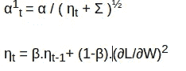

因此，RMSProp 使用加权平均法调节学习率参数。

**亚当优化器**

Adam 或自适应力矩优化器基于 RMSprop 和 SGD 与力矩和偏差校正的使用。

它使用方程式。

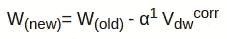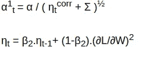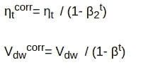

Adam 优化器是最健壮的优化器，也是最常用的。它优化了学习速率，并引入矩来解决梯度下降中的挑战。

## 结论

在本文中，我们已经讨论了梯度下降的挑战和使用的解决方案。我们也详细谈过几个优化器。

希望这篇文章有所帮助。