# 使用 PyTorch 的线性回归示例的梯度下降介绍

> 原文：<https://towardsdatascience.com/introduction-to-gradient-descent-with-linear-regression-example-using-pytorch-dbf7a9540d78?source=collection_archive---------34----------------------->

## 机器/深度学习中广泛使用的优化方法。


杰里米·毕晓普在 [Unsplash](https://unsplash.com?utm_source=medium&utm_medium=referral) 上的照片

# 介绍

在机器学习中，通常情况下，我们需要找到一个损失函数(或成本函数)的最小值。梯度下降法是一种广泛应用的优化方法。

在这篇文章中，我将通过一些例子讨论梯度下降法，包括使用 PyTorch 的线性回归。

# 结石

求函数最大值或最小值的一种方法是求斜率为零的点。函数的最大值或最小值将是函数的导数等于零的解。

以这个函数为例:

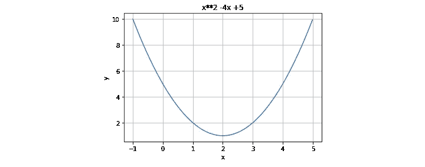

f(x)= x * * 2–5x+5，图片由作者提供

该函数的导数为:


所以设 f'(x) = 0，我们可以求出 x=2 为解。这意味着函数的斜率在 x=2 时等于零，函数的最小值是 f(2)=1。

这种方法找到了解析解，然而，在实际应用中有时很难将这种方法应用于复杂函数。因此，我们需要数值方法来寻找近似解，梯度下降法就是其中一种方法。

# 梯度下降

梯度的数学解释可以在这个[环节](https://en.wikipedia.org/wiki/Gradient)中找到。

对于一维函数 f(x)，梯度表示为 f'(x)。对于多维函数，表示如下。

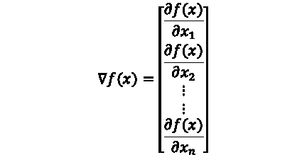

> 来自 [wiki](https://en.wikipedia.org/wiki/Gradient) :如果函数的梯度在 *p* 点不为零，那么梯度的方向就是函数从 *p* 开始增加最快的方向，梯度的大小就是那个方向的增加率。

梯度下降试图通过下降到梯度的相反方向来接近函数的最小值。

它迭代地更新参数(这里是 x)来寻找解。所以首先，我们需要一个解的初始猜测(x0)，然后基于初始猜测计算梯度，然后基于计算的梯度更新解(x)。可以用这个公式来解释:


t 是迭代次数，r 是学习率。

所以，首先，我们有一个初始猜测 x0，通过上面的等式，我们可以找到 x1:


然后通过 x1，我们可以找到 x2:


通过多次重复这一过程(历元)，我们应该能够找到参数(x ),其中函数在其最小值。

## 示例 1:

让我们以前面的函数为例:


并将其应用于梯度下降方程


重新排列:


让我们设定学习率= 0.1，初始猜测值 x0=7。然后，我们可以轻松地更新和计算 x1、x2、x3…以及 f(x1)、f(x2)、f(x3)…

在本例中:

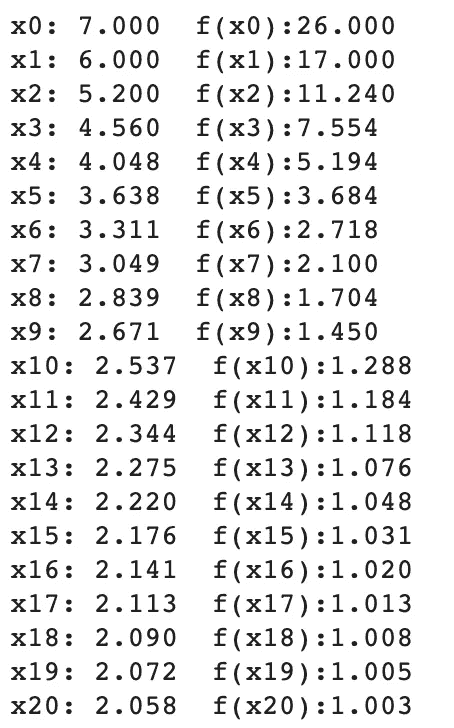

可以看到参数(x)接近 2，函数接近最小值 1。

让我们把它放在图表上:

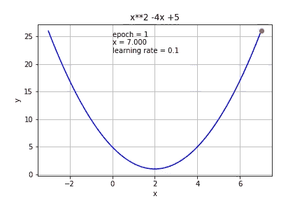

梯度下降(学习率= 0.1)(图片由作者提供)

如果我们用一个更小的学习率(0.01)呢？

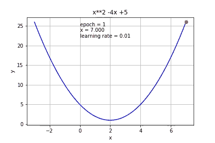

梯度下降(学习率= 0.01)(图片由作者提供)

正如所料，达到最小值需要更多的迭代。

如果我们把学习提高到 0.3，它比 0.1 更快达到最小值。

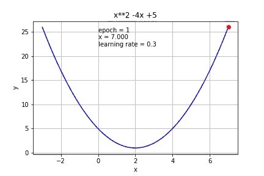

梯度下降(学习率= 0.3)(图片由作者提供)

如果我们把它进一步提高到 0.7，它就开始超调了。

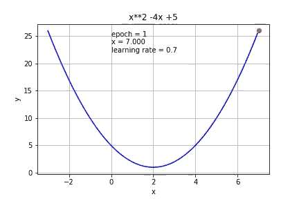

梯度下降(学习率= 0.7)(图片由作者提供)

如果我们把它增加到 1，它根本达不到最小值。

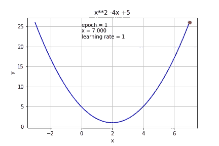

梯度下降(学习率= 1)(图片由作者提供)

所以学习率对梯度下降非常重要。如果太小，就需要大量的迭代，如果太大，就可能达不到最小值。

现在，我们对梯度下降如何工作有了一个概念，让我们尝试将其应用到一个简单的机器学习模型——线性回归。

## 示例 2 —线性回归:

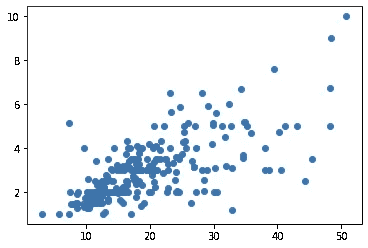

线性回归示例

线性回归是一种寻找两个变量之间线性关系的方法。它找到一条线，


描述图中所示的数据点。m 是直线的斜率，c 是截距。任务是找到最符合数据点的直线(m 和 c)。

**损失函数**

我们使用均方误差(MSE)来度量线和数据点的误差。


它对点和线之间的差的平方和进行平均。

我们可以重新排列等式:


我们想找到 m 和 c，它们给出了 MSE 的最小值。

**梯度下降**

就像前面的例子，我们需要找到梯度。

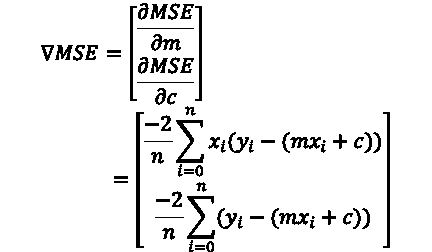

然后我们可以用这个等式来更新 m 和 c:

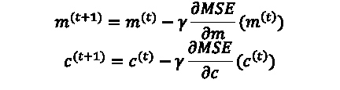

同样，我们需要对 m 和 c 的初始猜测，让我们从 m=0 和 c=0 开始，学习率= 0.0001

```
#Gradient Descentfor i in range(epochs):
   Y_pred = m*X + c
   d_m = (-2/n) * sum(X * (Y - Y_pred))
   d_c = (-2/n) * sum(Y - Y_pred)
   # Update m
   m = m - r * d_m
   # Update c
   c = c - r * d_c
   mse=(1/n) * sum((Y - m*X + c)**2)
```

可以基于梯度更新 m 和 c。让我们把它放在图表上。

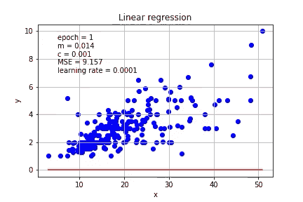

梯度下降-线性回归例子，学习率= 0.0001。(图片由作者提供)

同样，仔细选择学习率是重要的，如果学习率增加到 0.01，计算将不会收敛。

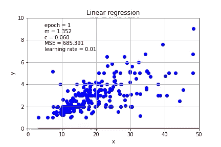

梯度下降-找不到最佳 m 和 c，学习率= 0.01。(图片由作者提供)

在这个简单的例子中，我们自己通过对函数的*求导*来计算梯度，这对于更复杂的问题可能会变得困难。幸运的是，PyTorch 提供了一个工具来自动计算几乎任何函数的导数。

**Pytorch 方法**

让我们定义这条线:

```
**def** f(x, params):
    m, c= params
    **return** m*x + c
```

损失函数——均方误差:

```
**def** mse(preds, targets): **return** ((preds-targets)**2).mean()
```

再次，我们由 m=0 开始，c=0，这里的 ***需要 _grad_()*** ，这里是用来计算梯度的。

```
params = torch.zeros(2).requires_grad_()
```

然后我们可以根据第一个参数预测 y 值，并画出来。

```
preds = f(X_t, params)
```

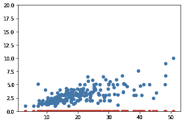

Pytorch 梯度下降-初步猜测。(图片由作者提供)

然后我们可以计算损失:

```
loss = mse(preds, Y_t)
```

以及 PyTorch 函数的梯度:

```
loss.backward()
```

之后，我们可以检查梯度:

```
params.grad
```

它返回一个张量，即梯度:张量([433.6485，18.2594])

然后，我们使用梯度和学习率更新参数:

```
lr = 1e-4
params.data -= lr * params.grad.data
params.grad = **None**
```

并使用这些新参数预测 y:

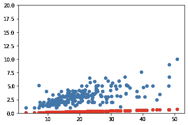

Pytorch 梯度下降—第二纪元(图片由作者提供)

我们需要多次重复这个过程，让我们制作一个函数:

```
**def** apply_step(params):
  preds = f(X_t, params)
  loss = mse(preds, Y_t)
  loss.backward()
  params.data -= lr * params.grad.data
  params.grad = None
  return pred
```

然后我们可以跑几个纪元。看起来随着时间的推移，损失在减少。

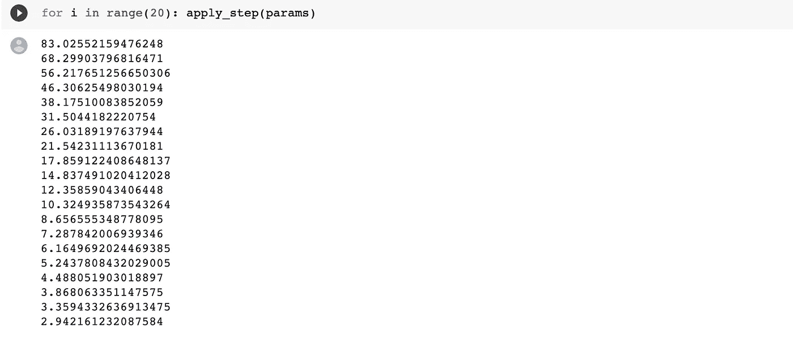

把它放在图表上

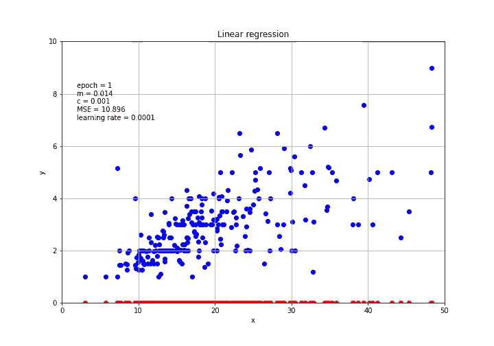

Pytorch 的梯度下降(图片由作者提供)

就是这个！通过使用 PyTorch，我们可以轻松地计算梯度，并为机器和深度学习模型执行梯度下降。

感谢阅读。