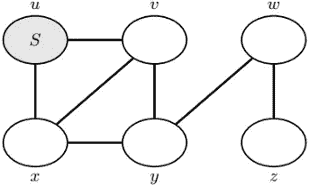
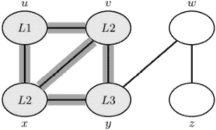
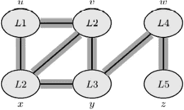

# 图算法简介:Python 中的广度优先搜索算法

> 原文：<https://towardsdatascience.com/introduction-to-graph-algorithm-breadth-first-search-algorithm-in-python-8644b6d31880?source=collection_archive---------17----------------------->


照片由 [Unsplash](https://unsplash.com?utm_source=medium&utm_medium=referral) 上的[甘帕尼·库马尔](https://unsplash.com/@gkumar2175?utm_source=medium&utm_medium=referral)拍摄

## [入门](https://towardsdatascience.com/tagged/getting-started)

## 清晰理解可视化广度优先搜索算法

图表形式的数据存在于许多流行和广泛使用的应用程序中。网络爬虫、计算机网络、关系数据库和社交网络都是很好的例子。图搜索算法对于计算机科学的任何部分都是重要的。同样，这对于许多编码面试来说也是重要和有用的。

有几种不同的图形搜索算法可用。这是最简单的图搜索算法之一，也是许多其他图算法的一种原型。今天我将详细解释广度优先搜索算法，并展示广度优先搜索算法的一个用例。以下是这篇文章的要点:

1.  广度优先搜索算法如何处理视觉效果
2.  用 Python 开发算法
3.  如何用这个算法找到任意节点到源节点的最短路径。
4.  时间复杂度

**我们开始吧！**

# 广度优先搜索算法的工作原理

一个图有两个元素。顶点和边。

鉴于，

一个图 G = (V，E)，

其中 V 是顶点，E 是边。

广度优先搜索算法系统地逐层探索边，以发现从给定的源顶点 s 可到达的每个顶点。

以下是广度优先搜索流程的步骤:

1.  有一个起始顶点 s。
2.  用开始顶点 S 作为级别 1 初始化级别集。
3.  探索另一个顶点从开始就可以到达。这些顶点将被视为级别 2。
4.  这样顶点就会一层一层的打开。

以下是这些步骤的直观演示:



这里，我们有六个顶点，u，v，w，x，y，z 和七条边 ux，uv，vx，vy，xy，wy，wz。

将顶点 u 视为源顶点或起始顶点。现在看下图他们是怎么一级一级打开的。


源顶点是 u 是 level 1。我们查一下我们能从 L1 去哪里。从图中可以看出,‘u’有一条直接通向 v 和 x 的路径，所以，它们是 2 级。



现在，我们在节点 x 和 v 中。x 和 v 只能直接访问 y。因此，y 是第 3 层。 ***从 x 和 v 两方面，我们可以去 u 也。但是我们忽略了已经访问过的节点。***


y 只能直接访问 w。所以，w 是第四级。我们也可以从 y 到 v 和 x，但是它们已经被访问过了。所以，我们再也不用担心他们了。



最后 w 可以到 z，z 是 level5。

# Python 中的算法

在我们深入算法之前，让我们先做一个邻接表。也就是说，创建一个字典，其中每个节点都是一个键，链接到它的节点都是存储在列表中的值。

例如，节点 u 链接到节点 v 和 x。因此，它将表示为:

```
'u': ['v', 'x']
```

这里的“u”是“v”和“x”的父代。

我们还需要对所有其他节点进行同样的操作。邻接表将看起来像这样:

```
adj = {
    'u': ['v', 'x'],
    'x': ['u', 'v', 'y'],
    'v': ['u', 'x', 'y'],
    'y': ['w'],
    'w': ['y', 'z'],
    'z': ['w']
    }
```

接下来，我们需要初始化几个变量:

变量来跟踪我们已经访问过的节点，

“级别”变量来跟踪我们当前所处的级别，

“parent”变量来存储节点的父节点。

“traversal_output”来列出经过的节点。

最后，我们将使用一个队列来开发这个算法。Python 有一个内置的队列，我们可以导入并使用它。

```
from queue import Queue
visited = {}
level = {}
parent = {}
traversal_output = []
queue = Queue()
```

开始时，将“已访问”字典中的所有节点设置为“False ”,将“父”字典中的所有节点设置为“None ”,并将级别设置为-1。

```
for node in adj_list.keys():
        visited[node] = False
        parent[node] = None
        level[node] = -1
```

如图，假设来源是‘u’。首先，使用 visited[s] = True，使用 level 0 并在队列中添加“u”。

```
s = "u"
visited[s] = True
level[s] = 0
queue.put(s)
```

**循环来了！**

在这个阶段，我们需要访问链接到源节点“u”的节点。我们将它列在上面的邻接表中。对于它们中的每一个，将它们设置为已访问，将它们的级别升级为比源节点的级别高一级，将它们的父节点设置为“u”，最后将它们添加到队列中。

然后对它们的子节点重复同样的操作。以下是完整的循环:

```
while not queue.empty():
    u = queue.get()
    traversal_output.append(u)
    for v in adj_list[u]:
        if not visited[v]:
            visited[v] = True
            parent[v] = u
            level[v] = level[u] + 1
            queue.put(v)
print(traversal_output)
print(visited)
print(level)
print(parent)
```

输出:

```
['u', 'v', 'x', 'y', 'w', 'z']
{'u': True, 'x': True, 'v': True, 'y': True, 'w': True, 'z': True}
{'u': 0, 'x': 1, 'v': 1, 'y': 2, 'w': 3, 'z': 4}
{'u': None, 'x': 'u', 'v': 'u', 'y': 'v', 'w': 'y', 'z': 'w'}
```

Traversal_output 显示我们遍历了所有节点。

对于每个节点，第二行中的 visited 为 true。

在第三行中，我们有所有节点的级别。请对照上面的图片。

在第四行，我们有所有节点的父节点。“u”是源节点。所以,“u”没有父代。

将所有代码组合起来，放入一个函数中:

```
def Breadth_first_search(adj_list):
    visited = {}
    level = {}
    parent = {}
    traversal_output = []
    queue = Queue()
    for node in adj_list.keys():
        visited[node] = False
        parent[node] = None
        level[node] = -1
    s = "u"
    visited[s] = True
    level[s] = 0
    queue.put(s)
    while not queue.empty():
        u = queue.get()
        traversal_output.append(u)
        for v in adj_list[u]:
            if not visited[v]:
                visited[v] = True
                parent[v] = u
                level[v] = level[u] + 1
                queue.put(v)
    return traversal_output, visited, level, parent
```

调用这个函数并传递邻接表' adj '会给你同样的输出。

# 寻找最短的距离

该算法可用于寻找从源到任何其他节点的最短路径。怎么会？

看，我们知道每个节点的父节点。从任何一个节点，我们通过父节点不断回溯，最终会回到源节点。对吗？

比如说，我想从源节点‘u’找到最短路径‘w’。让我们看看，谁是 w 的父母。是 y。y 的父代是‘v’，然后 v 的父代是‘u’。所以，最短路径是 u，v，y，w。

检查图片，看看你是否认为这是最短的路径。

我们可以从上面定义的函数中找到每个节点的父节点。

```
traversed, visited, level, parent = Breadth_first_search(adj)
```

下面是查找最短路径的代码

```
v = "w"
path = []
while v is not None:
    path.append(v)
    v = parent[v]
path.reverse()
print(path)
```

输出:

```
['u', 'v', 'y', 'w']
```

# 时间复杂度

我们这里只有两个元素。**顶点和边。**

注意，小心。我们只访问每个顶点一次。在 for 循环中，我们忽略已经访问过的顶点。假设 V 是顶点的集合。

我们在这里使用了一个无向图。对于无向图，我们可以双向访问。我们可以从“u”到“v ”,也可以从“v”到“u”。在上面的邻接表' adj '中，你可以看到一个节点可以出现不止一次。我们最多会遍历一条边两次。设 E 是边的集合，在最坏的情况下，它将穿过边 2E 次。Som 最坏情况下的总时间 V+2E。

时间复杂度可以表示为 O(V+E ),因为系数包含在 O 中。

# 结论

我试图解释，width _ first _ search 算法如何使用视觉效果工作，用 Python 开发了该算法，如何使用 width _ first _ search 算法找到最短路径，以及该算法的时间复杂度。我希望你现在清楚了。

欢迎在推特上关注我，喜欢我的 T2 脸书页面。

# 更多阅读:

[](/clear-understanding-of-depth-first-search-algorithm-and-its-python-implementation-graph-algorithm-3e87d8f1a9ea) [## 清晰理解深度优先搜索算法及其 Python 实现:图算法

### 借助清晰的视觉效果进行学习。还要学习人们在深度优先搜索算法中常犯的一个错误

towardsdatascience.com](/clear-understanding-of-depth-first-search-algorithm-and-its-python-implementation-graph-algorithm-3e87d8f1a9ea) [](/an-ultimate-cheat-sheet-for-numpy-bb1112b0488f) [## Numpy 的终极备忘单

### 对学习也有好处

towardsdatascience.com](/an-ultimate-cheat-sheet-for-numpy-bb1112b0488f) [](/an-ultimate-cheat-sheet-for-data-visualization-in-pandas-4010e1b16b5c) [## 熊猫数据可视化的终极备忘单

### 熊猫的所有基本视觉类型和一些非常高级的视觉…

towardsdatascience.com](/an-ultimate-cheat-sheet-for-data-visualization-in-pandas-4010e1b16b5c) [](/a-complete-anomaly-detection-algorithm-from-scratch-in-python-step-by-step-guide-e1daf870336e) [## Python 中从头开始的完整异常检测算法:分步指南

### 基于概率的异常检测算法

towardsdatascience.com](/a-complete-anomaly-detection-algorithm-from-scratch-in-python-step-by-step-guide-e1daf870336e) [](/great-quality-free-courses-to-learn-machine-learning-and-deep-learning-1029048fd0fc) [## 学习机器学习和深度学习的优质免费课程

### 顶级大学高质量免费课程的链接

towardsdatascience.com](/great-quality-free-courses-to-learn-machine-learning-and-deep-learning-1029048fd0fc) [](/efficient-python-programming-with-lambda-map-filter-and-sorted-cfdf536afc36) [## 使用 Lambda、Map、Filter 和 Sorted 进行高效的 Python 编程

### 使用数字、字符串和字典列表的快乐编程

towardsdatascience.com](/efficient-python-programming-with-lambda-map-filter-and-sorted-cfdf536afc36) [](/a-complete-guide-to-confidence-interval-and-examples-in-python-ff417c5cb593) [## 置信区间的完整指南，以及 Python 中的示例

### 对统计学中一个非常流行的参数——置信区间及其计算的深入理解

towardsdatascience.com](/a-complete-guide-to-confidence-interval-and-examples-in-python-ff417c5cb593)