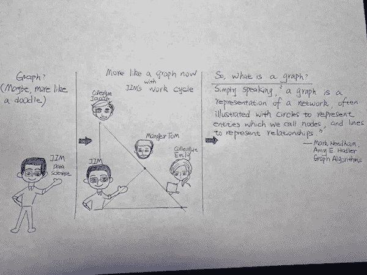

# 图形挖掘和分析简介

> 原文：<https://towardsdatascience.com/introduction-to-graph-mining-and-analytics-fac18515ea3e?source=collection_archive---------35----------------------->

你好。在这篇文章中，我将分享一些关于图形挖掘和分析的有趣故事/应用。

不是每个人，甚至是数据科学家每天都在处理与图形相关的问题/工具。所以人们可能会问的第一个问题是:什么是图？第二:为什么了解图形分析和算法很重要？第三:图挖掘和分析的一些应用是什么？让我们逐一回答这些问题，如果你想进一步探索图算法，我还会在最后附上一些好的资源。现在，让我们开始吧。

**什么是图？**

解释简单图形的涂鸦(图片由作者提供)

图形表示实体及其关系。每个实体由一个节点表示，它们之间的关系由一条边表示。这里每个实体(节点)是一个人，边表示关系有多“密切”(你可以给边加权来反映这一点。例如，在上面的涂鸦中，吉姆、艾米丽和雅各布位于等腰直角三角形的顶点。我们假设两边的权重为 1，斜边的长度为√2。经理汤姆位于斜边的中点，因此与其他所有人的距离相等，都是√2/2。现在，我们可以说，Tom 与他的三个直接下属有相同的“亲密度”，Jim 与 Jacob 和 Emily 有相同的“亲密度”,而 Jacob 和 Emily 自己的关系水平最高。).

现实生活中还有其他图表的例子。社交网络、网页、健康提供者网络等。并且该图可以进一步分为有向图和无向图。有向图意味着存在关于关系的方向，例如网页。无向图意味着实体之间的关系是相互的，例如，友谊网络。

**为什么了解图形分析和算法很重要？**

一句话，图表分析帮助我们研究互联数据，并帮助揭示模式，尤其是大数据中的社区。图形算法是图形分析中使用的工具。

考虑上面的涂鸦，但在一个更大的社交网络中。我们能找到社区中每个人都互相认识的社区吗(也称为强连接组件)？一旦我们确定了这些社区，我们能找到其中最有影响力的成员吗？到达那个人的最少人数是多少？此外，如果一个新人被添加到图表中，我们可以对这个新成员属于哪个社区进行分类吗？有趣的问题要解决，不是吗？

为了解决上述问题，我们需要引入图算法。例如，为了检测社区，我们需要引入三角形计数和聚类系数，以及标签传播和 Louvain 模块性。为了找到图中从一个成员到另一个成员的最小跳数，我们需要引入最短路径算法。图形算法的细节超出了本文的范围，但是你可以参考下面的参考资料获得更多信息。

**图挖掘和分析有哪些应用？**

有许多应用程序使用图形分析，我鼓励你自己多读一些。这里我要讲两个应用。一个是 PageRank，另一个是欺诈检测。

***PageRank。*** PageRank (PR)是谷歌搜索使用的一种算法，用于在其搜索引擎结果中对网页进行排名。我们知道网页是相连的，可以建模为有向图(节点之间的关系有方向)。为什么导演？这种关系不是相互的，因为我在帖子中指出了 neo4j 图书的链接，但他们可能不会指向我的链接。简单来说，PageRank 算法根据有多少网页指向一个网页，以及这些网页的影响力有多大，对该网页进行迭代排序，直到分数收敛。

***欺诈检测。*** 之前我们在一张图中谈到了社区检测。这有助于检测网络中的欺诈行为。异常实体应该表现出不属于任何强连接组件的模式，或者与图中的其他实体具有很高的距离。例如，考虑那些为吸引用户点击而创建的欺诈性网页。它们很可能是“孤岛”,很少被其他网站引用，也很少被其他网站引用。

以上是对图形挖掘和分析的快速介绍。我鼓励你在业余时间读一些书，并欢迎给我任何意见/建议。

**一些关于图形分析的好资源**

(TigerGraph 在 youtube 上举办的图形大师网络研讨会。

(neo4j 网站上免费赠送的《图形算法》一书。[https://neo4j.com/lp/book-graph-algorithms](https://neo4j.com/lp/book-graph-algorithms/)