# 使用 DeepWalk 介绍图形神经网络

> 原文：<https://towardsdatascience.com/introduction-to-graph-neural-networks-with-deepwalk-f5ac25900772?source=collection_archive---------19----------------------->

## 让我们通过讨论该领域的开创性工作之一——DeepWalk，来建立对图形神经网络(GNN)的原因和内容的直觉。我们将把它与 word2vec 联系起来，并通过在图上试验现有的实现来结束。


由 [Unsplash](https://unsplash.com/photos/11KDtiUWRq4) 的 urielsc26

# 介绍

图形神经网络是当前的热门话题[1]。这种兴趣肯定是合理的，因为 gnn 都是关于向量空间中图形的潜在表示。将实体表示为向量并不是什么新鲜事。在 NLP 中有许多像 word2vec 和手套嵌入这样的例子，它将一个单词转换成一个向量。使这种表示强大的是(1)这些向量在它们之间结合了相似性的概念，即彼此相似的两个词在向量空间中倾向于更接近(点积很大)，以及(2)它们在不同的下游问题中具有应用，如分类、聚类等。这就是 GNN 有趣的地方，因为有很多方法可以将一个单词或图像嵌入到矢量中，GNN 为图形奠定了基础。在本帖中，我们将讨论这样做的初始和基本方法之一——DeepWalk[2]

# 图表 101

图形或网络用于表示关系数据，其中主要实体称为节点。节点之间的关系由边来表示。通过添加多种类型的节点、边、边的方向，甚至边的权重，可以使图变得复杂。

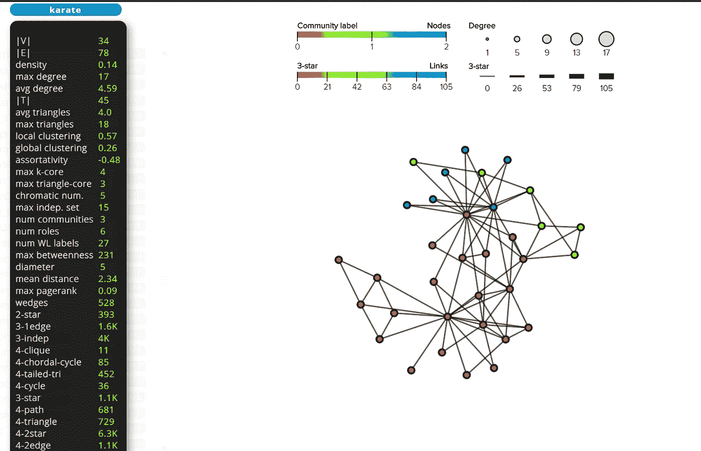

图 1:空手道数据集可视化@网络知识库[3]。

图 1 显示了一个图表示例。该图是空手道数据集[4],它表示大学空手道俱乐部成员的社会信息。每个节点代表俱乐部的一个成员，每个边代表俱乐部的两个成员之间的联系。左边的信息栏显示了几个图形属性，如节点数、边数、密度、度数等。网络库[3]包含了许多来自不同领域的网络，并提供了可视化工具和基本统计数据，如上所示。

# 相似节点的概念

因为矢量嵌入背后的思想是突出相似性，我们将考虑相似节点的一些定义。两个节点可以通过多种方式被称为相似的，例如它们是否具有相似性——入度计数、出度计数、平均度或邻居数量等。一个有趣的概念是考虑节点的邻居，它们共享的邻居越多，它们就越相似。在纯文本中，节点是由它所保持的公司定义的。如果两个节点有非常相似的公司，那就是非常相似。这种通过位置来表示实体的想法并不新鲜。自然语言处理中单词嵌入的基础是基于这样一条格言:“单词由它所保持的上下文来表示”。这两个领域如此相似，很明显，第一直觉是利用 NLP 中的现有技术，通过某种方式将单词上下文的概念转换为节点的邻居，将其移植到图域。一种现有的技术是 word2vec，我们将简要讨论它。

# Word2Vec

需要用 word2vec (w2v)走一段弯路，才能完全欣赏和理解 DeepWalk 背后的思想。Word2Vec 是一种将单词表示为向量的单词嵌入技术。每一个向量都可以看作是$R^{D}$空间中的一个点，其中$D$是每一个向量的维数。需要注意的一点是，这些向量并不是随机分布在向量空间中的。它们遵循一定的属性，相似的单词如*猫*和*虎*比完全不相关的单词如*坦克彼此相对更接近。*在向量空间中，这意味着它们的余弦相似性得分更高。与此同时，我们甚至可以观察到像`king - man + woman = queen`这样的著名类比，这些类比可以通过这些词的表示向量的向量相加来复制。

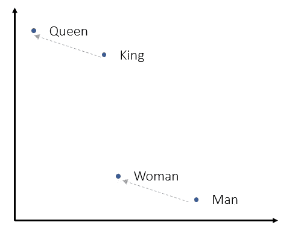

图 2:向量空间表示单词向量的位置以及它们之间的关系，以展示类比国王-男人+女人=王后

虽然这种表示不是 w2v 所独有的，但它的主要贡献是提供了一个简单而快速的基于神经网络的单词嵌入器。为此，w2v 将训练转化为一个分类问题，其中给定一个单词，网络试图回答哪个单词最有可能在给定单词的上下文中找到。这种技术正式称为 Skip-gram，其中输入是中间词，输出是上下文词。这是通过创建一个 1 层深度神经网络来实现的，其中输入单词以一位热编码格式馈送，输出是 softmax，理想情况下对上下文单词具有较大的值。

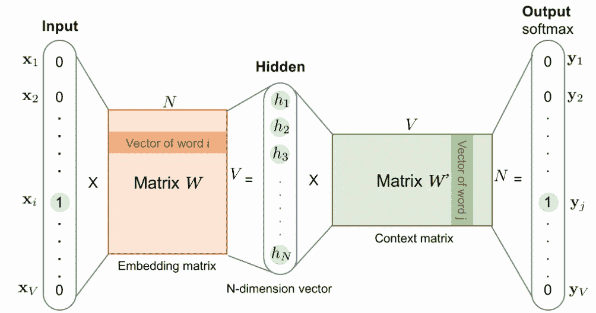

图 3: SkipGram 架构(摘自 Lil'Log [7])。它是一个 1 层深度神经网络，输入和输出为一个热编码。输入-隐藏权重矩阵包含单词嵌入。

训练数据是通过在大型文本(可以是文章或小说，甚至是完整的维基百科)的语料库上滑动一个窗口(某个窗口大小)来准备的，对于每个这样的窗口，中间的单词是输入单词，上下文中的剩余单词是输出单词。对于向量空间中的每个输入单词，我们希望上下文单词靠近，而其余的单词远离。并且如果两个输入单词将具有相似的上下文单词，则它们的向量也将接近。这是 Word2Vec 背后的直觉，它通过使用负采样来实现。训练后，我们可以观察到一些有趣的事情——神经网络的输入隐藏层之间的权重现在表示我们想要在单词嵌入中使用的概念，这样，具有相同上下文的单词在向量维度上具有相似的值。并且这些权重被用作单词嵌入。

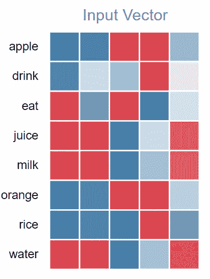

图 4:来自 Wevi 的 5D 单词嵌入的热图可视化[5]。颜色表示单元格的值。

图 4 中的结果来自一个很酷的交互式 w2v 演示 Wevi [5]的训练 5D 单词嵌入。像(果汁、牛奶、水)和(橘子、苹果)这样显而易见的词有相似的向量(一些维度被同样照亮——红色或蓝色)。感兴趣的读者可以去[7]详细了解建筑学和数学。此外，建议[5]对 word2vec 后面的引擎进行出色的可视化。

# 深度行走

DeepWalk 采用了和 w2v 相同的训练技术，即跳格训练。但是还有一件重要的事情要做，那就是创建训练数据来捕捉图形中的上下文概念。这是通过*随机漫步技术*完成的，我们从一个节点开始，随机地去它的一个邻居。我们重复这个过程$L$次，这是随机行走的长度。在这之后，我们重新开始这个过程。如果我们对所有节点都这样做(并且对每个节点做$M$次),我们在某种意义上已经将图形结构转换成类似于用于训练 w2v 的语料库的文本，其中每个单词是一个节点，并且它的上下文定义了它的邻居。

# 实现 1:作者代码

DeepWalk 的作者在这里提供了一个 python 实现。自述文件中提供了安装详细信息和其他先决条件(windows 用户可能会遇到一些安装和执行问题)。CLI API 公开了几个算法和优化参数，

*   `input`需要包含图形信息的输入文件的路径。一个图可以用几种格式存储，一些著名的(并且被代码支持)是邻接表(node-all_neighbors list)和边表(有边的节点-节点对)。
*   `number-walks`每个节点随机行走的次数。
*   `representation-size`每个节点最终嵌入的维度。也是 skipgram 模型中隐藏层的大小。
*   `walk-length`每次随机漫步的长度。
*   `window-size`skip gram 训练中的上下文窗口大小。
*   `workers`优化参数定义为训练生成的独立进程的数量。
*   `output`输出嵌入文件的路径。

作者也提供了示例图，其中之一是我们的空手道俱乐部数据集。它以邻接表的格式存储。

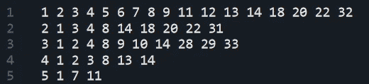

图 5:空手道俱乐部数据集邻接表的前 5 行。节点用数字表示。在每一行中，第一个节点名是中心节点，其余节点是它的邻居(它们有一条边)。

现在让我们读取图形数据并创建节点嵌入，

```
deepwalk --input example_graphs/karate.adjlist --number-walks 10
--representation-size 64 --walk-length 40 --window-size 5 
--workers 8 --output trained_model/karate.embeddings
```

这执行了从开始到结束的分析，包括从文件中加载图形，生成随机遍历，最后在遍历数据上训练 skip-gram 模型。通过使用额外的`--max-memory-data-size 0`参数运行该脚本，该脚本还存储了行走数据，如下所示。

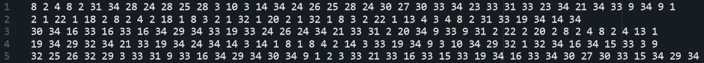

图 6:为空手道俱乐部数据集生成的随机行走语料库的前 5 行。节点用数字表示。每条线代表从第一个节点开始的一次随机行走。当我们设置 walk length = 40 时，每行(walk)有 40 个节点。同样，当我们设置遍历数= 10，总节点数= 34 时，总共生成 10*34=340 个随机遍历。

最后，我们得到包含图中每个节点的矢量嵌入的输出嵌入文件。该文件看起来像，

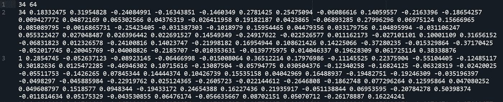

图 7:节点嵌入输出的前 3 行。第一行是带有节点和嵌入维度统计信息的标题。从第二行开始，第一个数字是节点名，随后的数字是提到的节点的矢量嵌入。

# 实施 2:空手道俱乐部

新发布的 python 实现——KarateClub[6]提供了一个简单得多的 API。要做同样的一套动作，我们需要做的就是跟着做。

```
# import libraries
import networkx as nx 
from karateclub import DeepWalk
# load the karate club dataset
G = nx.karate_club_graph()
# load the DeepWalk model and set parameters
dw = DeepWalk(dimensions=64)
# fit the model
dw.fit(G)
# extract embeddings
embedding = dw.get_embedding()
```

`DeepWalk`类也扩展了作者的代码所公开的相同参数，并且可以进行调整以进行所需的实验。

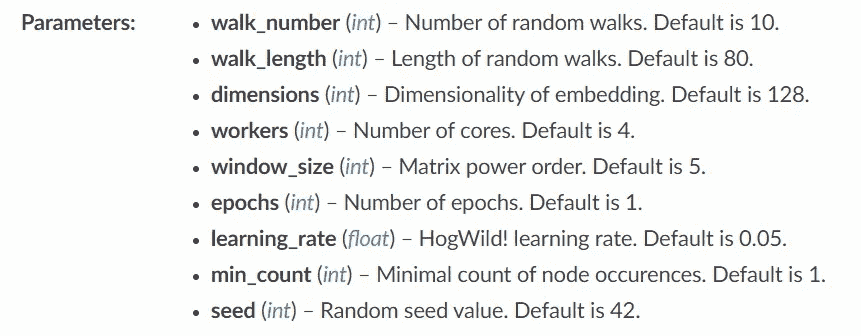

图 8:KarateClub[6]中 DeepWalk 实现公开的参数。

# 实验

为了查看 DeepWalk 的运行情况，我们将选择一个图，并可视化网络以及最终的嵌入。为了更好地理解，我创建了一个由 3 个完整的图组成的并集，每个图都有一些额外的边来连接。

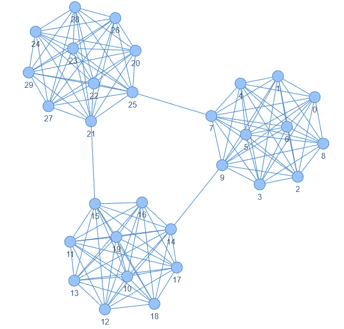

图 9:3 个完整图的并集。我们可以想象 3 个集群，其中节点 0 到 9 属于集群 1；10 到 19 到组 2，20 到 28 到组 3。

现在，我们将创建图的深走嵌入。为此，我们可以使用 KarateClub 包，通过在默认设置下运行 DeepWalk，我们可以获得 128 维的嵌入。为了形象化这一点，我使用了降维技术 PCA，它将 R ⁸的嵌入缩小到 r。我还将在边上绘制嵌入的 128D 热图。

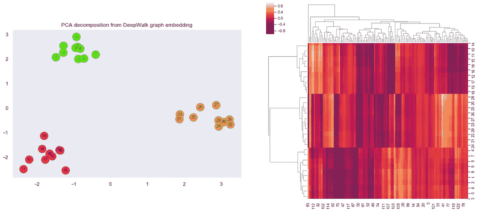

图 10:左图—主成分分析减少了(从 128D 到 2D)图的节点嵌入。右图—原始 128D 嵌入式产品的热图。

在左图中有清楚的节点分离，这表示嵌入的向量空间。这展示了 DeepWalk 如何将图形从力布局可视化转换为向量空间可视化，同时保持一些结构属性。热图还暗示了图形到 3 个聚类的清晰分离。

另一个需要注意的重要事情是，当图形不复杂时，我们也可以使用低维嵌入。这不仅减少了维数，而且改善了优化和收敛，因为在 skip-gram 中有较少的参数要训练。为了证明这一点，我们将创建大小仅为 2 的嵌入。这可以通过设置 DeepWalk 对象`dw = DeepWalk(dimensions=2)`中的参数来完成。我们将再次想象同样的情节。

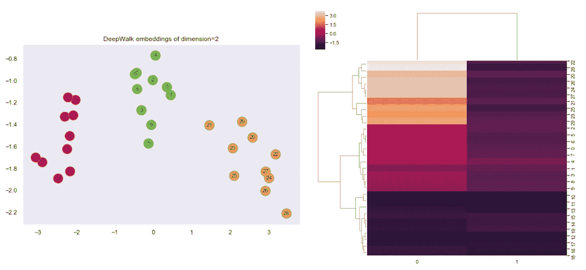

图 11:左图:图中的节点嵌入(大小=2)。右图:嵌入的热图。

两个图再次暗示了图中相同数量的集群，并且所有这些仅使用了 1%的先前维度(从 128 到 2，即~1%)。

# 结论

作为这个类比的答案`NLP - word2vec + GraphNeuralNetworks = ?`可以说是 DeepWalk(是吗？🙂)，这就引出了两个有趣的点，(1) DeepWalk 在 GNN 的影响可以类比 Word2Vec 在 NLP 的影响。这是真的，因为 DeepWalk 是第一批使用神经网络进行节点嵌入的方法之一。这也是一个很好的例子，说明了来自另一个领域(这里是 NLP)的一些成熟的 SOTA 技术是如何移植到一个完全不同的领域(这里是图)并应用的。这就引出了第二点，(2)正如 DeepWalk 不久前发表的(2014 年——只有 6 年，但却是人工智能研究的一生)，目前，有很多其他技术可以用来以更好的方式完成这项工作，如 Node2Vec，甚至是 GraphSAGE 等图形卷积网络。也就是说，从基于神经网络的 NLP 开始，word2vec 是最好的起点，我认为 DeepWalk 在同样的意义上是基于神经网络的图形分析的良好开端。也是本文的主题。

干杯。

# 参考

[1][easy AI——GNN 可能是人工智能的未来](https://easyai.tech/en/blog/gnn-ai-future/)

[2] DeepWalk — [论文](https://arxiv.org/abs/1403.6652) | [代码](https://github.com/phanein/deepwalk)

[3] [网络知识库](http://networkrepository.com/graphvis.php)

[4]扎卡里空手道俱乐部—[KONECT 项目](http://konect.cc/networks/ucidata-zachary/)

[5] [Wevi](https://ronxin.github.io/wevi/) —文字嵌入可视检查器

[6]空手道俱乐部— [论文](https://arxiv.org/pdf/2003.04819.pdf) | [代号](https://karateclub.readthedocs.io/en/latest/index.html)

[7] [Lil'Log —学习单词嵌入](https://lilianweng.github.io/lil-log/2017/10/15/learning-word-embedding.html)