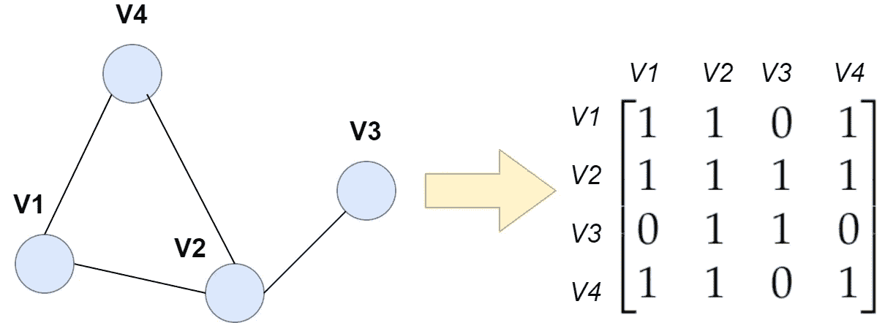
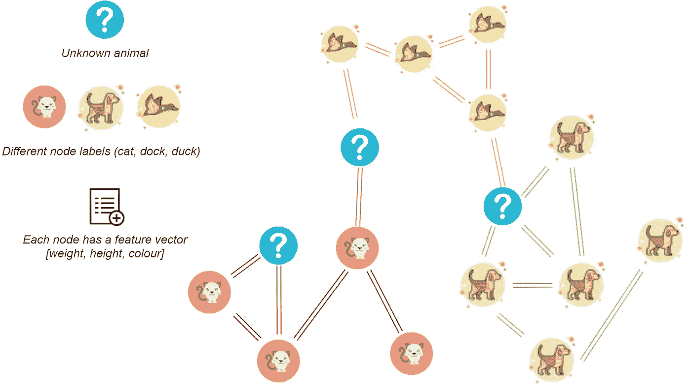
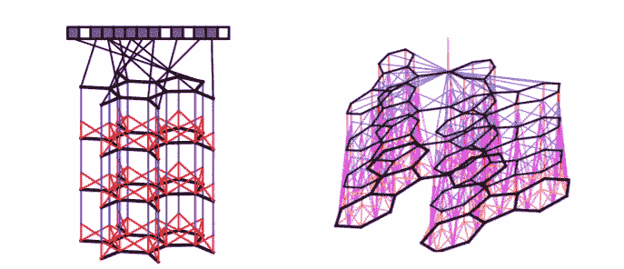

# 图形表示学习简介

> 原文：<https://towardsdatascience.com/introduction-to-graph-representation-learning-a51c963d8d11?source=collection_archive---------24----------------------->

## [入门](https://towardsdatascience.com/tagged/getting-started)

## 图上机器学习的主要概念和挑战

由[延斯·约翰森](https://unsplash.com/@jens_johnsson?utm_source=medium&utm_medium=referral)在 [Unsplash](https://unsplash.com?utm_source=medium&utm_medium=referral) 上拍摄的照片

近年来，图形表示学习的受欢迎程度激增。只有几个活跃的研究人员的时代已经成为遥远的过去。今天，我们看到谷歌或 Twitter 等顶级公司在这一领域进行了大量投资。

令人惊讶的是，许多可用的数据可以被建模为图表。以 Reddit 上的在线社交互动为例。我们可以将每个用户表示为一个连接到其他用户的节点。但是，我们如何分析这种数据，甚至应用机器学习呢？

在图形表示学习中，我们旨在回答这些问题。在这篇文章中，我们将看看图形表示学习的主要概念和挑战。

# 图表基础

从图中创建邻接矩阵。图片作者。

让我们从基础开始，好吗？

我们将图定义为一组顶点，这些顶点之间有连接(边)。有许多类型的图，例如，它们可以是有向的、无向的或无环的。

为了使图形对任何算法都有用，我们需要将它们转换成数字形式。为了实现这一点，我们可以使用[邻接](https://en.wikipedia.org/wiki/Adjacency_matrix#:~:text=In%20graph%20theory%20and%20computer,with%20zeros%20on%20its%20diagonal.)、[拉普拉斯矩阵](https://en.wikipedia.org/wiki/Laplacian_matrix)或[度矩阵](https://en.wikipedia.org/wiki/Degree_matrix)，它们提供了图形的方便的矩阵表示。每个顶点和每个连接也可以有一个定义其属性的特征向量。

在[1]中可以找到对图的很好的介绍。一旦你对基础知识相当有信心，学习更高级的概念是有好处的，比如[图同构](https://en.wikipedia.org/wiki/Graph_isomorphism#:~:text=Graph%20isomorphism%20is%20an%20equivalence,an%20isomorphism%20class%20of%20graphs.)和[图着色](https://www.whitman.edu/mathematics/cgt_online/book/section05.08.html)。

# 图的特征提取技术

节点级特征的一个例子，即中心性测量。左图说明了特征向量的中心性。右边的例子说明了程度中心性。[【来源】](https://commons.wikimedia.org/w/index.php?curid=39064835)

图形特征提取背后的主要思想是以一种更方便的、类似向量的格式来表示关于局部和全局图形结构的信息。我们同样对提取单个顶点的属性信息以及它们之间的连通性感兴趣。

从图中提取的特征可以分为三种类型:节点级、图级和邻域重叠特征。

对于节点级特征，我们的目标是为每个顶点生成一个特征向量。一些最流行的特征提取方法是节点度、中心性方法或聚类系数。为了计算这些特征，我们可以使用来自顶点的最近邻居的信息，或者来自更远的 K 跳邻居的信息。

我们也可以采取更一般的方法，为*整个图*创建一个特征。它被称为图形级特征。这可以通过邻接矩阵等基本特征来实现，也可以通过 Weisfeiler-Lehman 或 Graphlet 内核等更复杂的迭代方法来实现。

图的最后一种特征提取是邻域重叠特征。它们是专门为提取节点之间的连接信息而设计的。它们可以进一步细分为局部和全局方法。前者描述了两个节点之间的邻域的相似性，而后者描述了某些节点是否属于图中的同一社区(即一组密集聚集的节点)。

你可以在这篇文章中找到对特征提取技术[的深入解释。](/feature-extraction-for-graphs-625f4c5fb8cd)

# 图上的预测任务

预测顶点的动物类型。图片作者。图标按[图标 8](https://icons8.com/)

在图上使用机器学习的主要问题是节点是*相互连接*的。这打破了独立数据点的假设，这迫使我们使用更精细的特征提取技术或新的机器学习模型来处理这个问题。

预测任务在图上的定义也有很大不同。我们可以将其分为 4 种主要类型:节点分类、链接预测、整个图的学习和社区检测。

节点分类的目的是预测图中顶点的属性。链接预测也非常相似，但它预测两个顶点之间的链接(连接)的属性。这些任务被称为*半监督学习*，因为该图将同时包含训练和测试数据*。*

*学习整个图形是最直观的方法。我们将整个图形作为输入，并基于它生成预测。它非常类似于标准的机器学习回归和分类任务。*

*最后，对于社区检测，我们的目标是识别图中密集的顶点簇。*

*如果你想了解更多关于图表上的预测任务，请看这里的。*

# *图形神经网络*

**

*由 Duvenaud 等人创建的第一个图形神经网络架构之一。它是一种[消息传递神经网络。](/introduction-to-message-passing-neural-networks-e670dc103a87) [【来源】](https://arxiv.org/abs/1509.09292)*

*为了重新定义图上的神经网络，我们必须提出全新的深度学习架构[2]。*

*最简单的架构是[消息传递神经网络](/introduction-to-message-passing-neural-networks-e670dc103a87?source=---------5----------------------------)。在这里，前向过程的一个等效过程是来自顶点邻域的要素的迭代聚合。每个聚合操作都被视为一个层。在 *n* 次迭代之后，我们使用一个最终的聚合操作将所有信息提取为一个向量/矩阵。*

*我们也可以在图上定义图卷积神经网络。它们可以分为空间方法和光谱方法。空间方法是最直观的方法:我们定义一个核来对图形进行卷积，类似于 CNN。频谱方法稍微复杂一些:我们考虑傅立叶域中的图形，并集中处理通过图形传播的信号。*

# *生成图模型*

*这些模型的目的是创建具有所需属性的新图。这里，我们希望模型的输出是一个图[2]。但是我们为什么需要生成图表呢？*

*首先，我们可以使用这些图表作为机器学习模型的基准数据[2]。例如，如果我们想要检测社区，我们可以创建一个生成图模型，该模型可以创建具有社区的图。通过定义这些模型，我们还可以知道生成图的特定实例的可能性有多大。*

*鄂尔多斯-雷尼模式就是一个很好的例子。这是一个非常简单的模型，它将两个任意节点之间的连接概率指定为 *r.* 通过这个参数，我们可以控制生成的图的连接密度。*

*更复杂的模型包括随机块模型、优先附件和不同的变分自动编码器方法。在[2](第三部分——生成图模型)中可以找到对这些模型的详细解释。*

# *几句遗言*

*图上的机器学习并不简单。我们已经看到，大多数标准的机器学习方法都必须重新定义到图形域中。图形上的特征提取、预测任务与正常的机器学习问题非常不同。我们希望通过创建处理图表数据的新技术，我们可以充分利用图表中的信息，并创建性能更好的模型。*

# *关于我*

*我是阿姆斯特丹大学的人工智能硕士学生。在我的业余时间，你可以发现我摆弄数据或者调试我的深度学习模型(我发誓这很有效！).我也喜欢徒步旅行:)*

*如果你想了解我的最新文章和其他有用的内容，以下是我的其他社交媒体资料:*

*   *[领英](https://www.linkedin.com/in/kacperkubara/)*
*   *[GitHub](https://github.com/KacperKubara)*

# *参考*

*[1] [罗宾·j·威尔逊的图论](https://www.maths.ed.ac.uk/~v1ranick/papers/wilsongraph.pdf)*

*[2] [林子幸·汉密尔顿的《图形表示学》一书](https://www.cs.mcgill.ca/~wlh/grl_book/)*