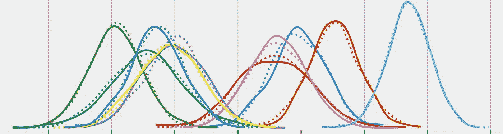
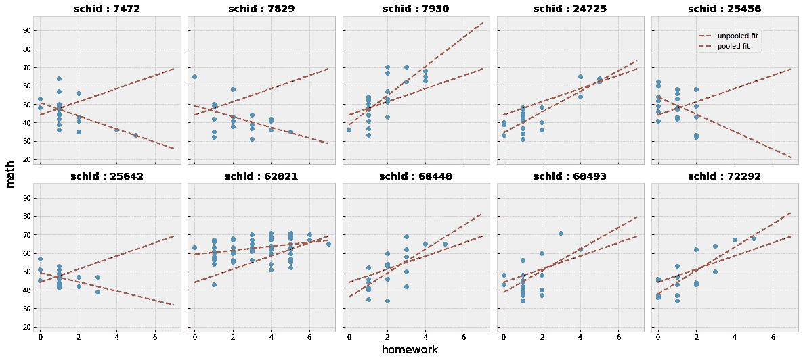
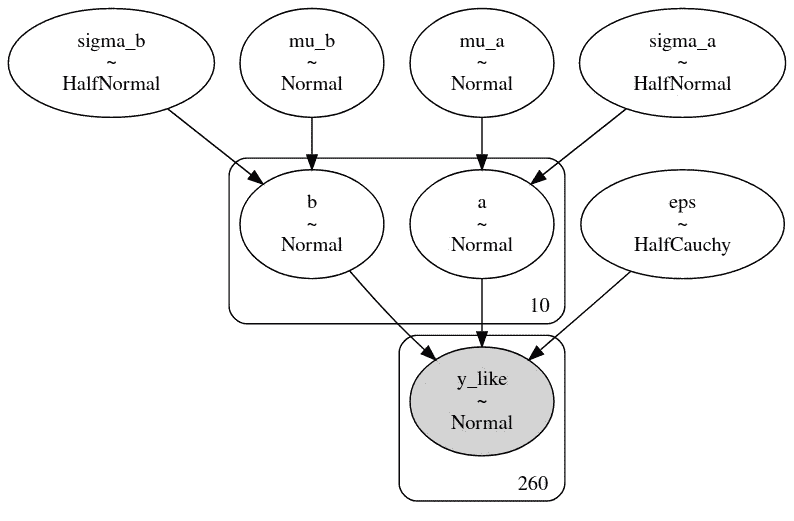
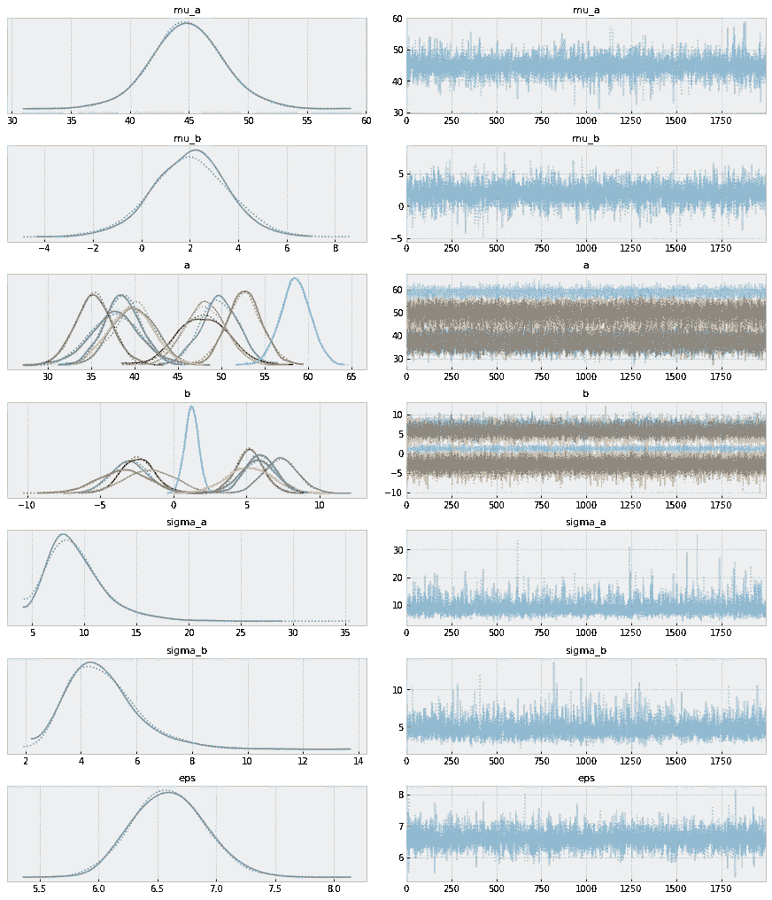
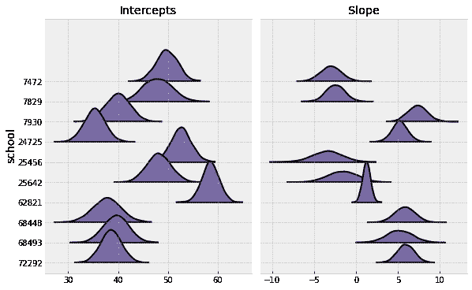
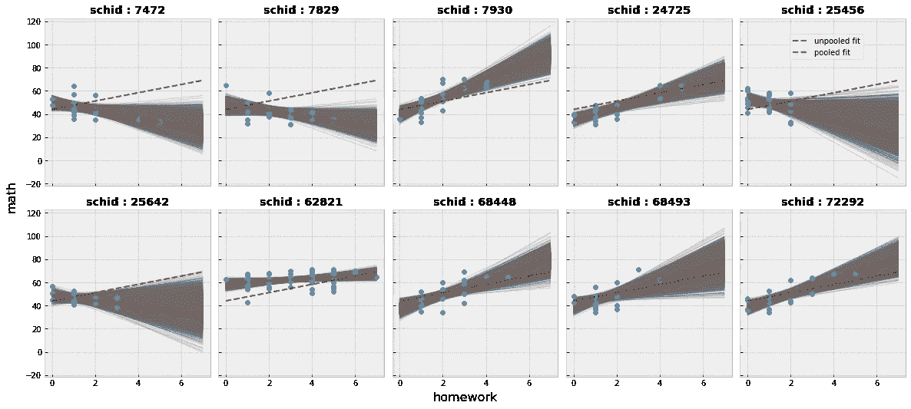

# 分层建模简介

> 原文：<https://towardsdatascience.com/introduction-to-hierarchical-modeling-a5c7b2ebb1ca?source=collection_archive---------9----------------------->

## 使用贝叶斯分层模型对自然聚集的数据建模



此分析中不同组之间的系数分布

# 介绍

在我们的数据集中发现不完全独立的样本并不罕见。数据集中的样本通常形成聚类或组，在这些聚类或组中共享一些属性。这通常需要在建模时特别注意，以构建可靠的模型，原因有两个。首先，对于像最大似然估计这样的统计分析过程，样本的独立性是一个重要的假设。第二，我们希望在我们的模型中捕捉预测因素对不同群体的影响的变化，这种变化被称为背景效应。

一个常用的例子，我发现足以理解这种情况是学生在学校的表现。在有多个班级学生的学校里，学生的学业表现受到他们个人能力(称为固定效应)和他们所在班级(称为随机效应)的影响。也许被分配到某个班级的老师比其他人教得更好，或者班级中高比例的聪明学生为学生创造了一个竞争环境，让他们表现得更好。

处理这种情况的一种方法是为每个类构建多个模型，称为**池**。但是这种方法并不总能产生可靠的结果。比如学生很少的班级对应的模型，会很误导人。一个单独的**非 pooled** 模型可能无法充分拟合数据。我们想在这两个极端之间找到一个折中的中间地带——部分统筹。这就把我们带到了**贝叶斯分层建模，**也称为多级建模。

在这种方法中，参数在不同级别的组中相互嵌套。粗略地说，它给出了未汇集和汇集模型估计的加权平均值。分层建模是贝叶斯推理和统计建模中最强大而简单的技术之一。在这篇文章中，我将用一个实际的例子来介绍这个想法。注意，这篇文章并没有涉及贝叶斯分析的基础。该示例的源代码可以在 [GitHub](https://github.com/SuryaThiru/hierarchical-model-blog) 的笔记本中找到。

# 数据

用于说明的数据集类似于上面的学生示例，只是我们试图找到来自不同学校的学生的数学成绩。在我们的例子中，我们使用作业完成情况作为预测指标。你可以在这里找到原始数据[，在这里](https://stats.idre.ucla.edu/stat/examples/imm/imm10.dta)找到 csv 版本[。](https://github.com/SuryaThiru/hierarchical-model-blog/blob/master/mlmldata.csv)

# 第一眼

绘制学生相对于家庭作业的数学成绩，以及**的未拟合**的 OLS 回归拟合给了我们这个结果:


具有非 pooled 回归拟合的数据样本

可视化学校层面的数据揭示了一些有趣的模式。我们还绘制了适合每个学校的**汇集的**回归线和未汇集的回归线，以供参考。为了简单起见，我们使用 OLS 回归。



合并回归的数据样本适合不同的组

该图显示了各组之间关系的变化。我们还注意到，在某些组中，作业完成率较高的少数数据点(可能的异常值)对估计值有很大影响。

# **层次模型**

我们将使用 PyMC3 构建我们的贝叶斯层次模型。我们将在我们的组级参数上构建**超优先级**，以允许模型在组间共享学生的个人属性。

该模型可以表示为 yᵢ = αⱼᵢ + βⱼᵢxᵢ + εᵢ，

或者用概率符号表示为 y∞n(αⱼ+βⱼx，ε)。

对于这个模型，我们将使用随机斜率β和截距α。这意味着它们将随每组而变化，而不是整个数据的恒定斜率和截距。概率模型的图示如下所示。



本例中使用的分层模型的图形表示

虽然我在这里通过目测样本的总体分布来选择我的先验，但是使用无信息的先验也会导致类似的结果。下面的代码片段定义了所使用的 PyMC3 模型。

```
with pm.Model() as model:
    # Hyperpriors
    mu_a = pm.Normal('mu_a', mu=40, sigma=50)
    sigma_a = pm.HalfNormal('sigma_a', 50)

    mu_b = pm.Normal('mu_b', mu=0, sigma=10)
    sigma_b = pm.HalfNormal('sigma_b', 5)

    # Intercept
    a = pm.Normal('a', mu=mu_a, sigma=sigma_a, shape=n_schools) # Slope
    b = pm.Normal('b', mu=mu_b, sigma=sigma_b, shape=n_schools)

    # Model error
    eps = pm.HalfCauchy('eps', 5)

    # Model
    y_hat = a[school] + b[school] * homework

    # Likelihood
    y_like = pm.Normal('y_like', mu=y_hat, sigma=eps, observed=math)
```

我们将使用 NUTS 采样器从后验分布中抽取样本。

```
with model:
    step = pm.NUTS()
    trace = pm.sample(2000, tune=1000)
```

对应于每个学校的轨迹图以及斜率和截距的后验分布如下图所示。



分层模型的轨迹图



每组截距和斜率的后验分布

我们可以看到不同学校系数估计值的差异。我们还可以清楚地解释与分布估计相关的不确定性。下面的后验预测回归(灰色)线是从每组估计值的后验分布中取样的，给出了关于数据的模型的更好的图像。



分层模型的后验预测拟合

请注意，显示负斜率的组通常具有更高的不确定性。该模型在群体级别的噪声敏感度和学生级别的全局估计值之间找到了一个折衷点(在 IDs 7472、7930、25456、25642 中很明显)。这意味着我们必须对从这些群体的模型中得出的决定更加谨慎。我们还观察到，随着更多的数据和更小的偏差，贝叶斯模型收敛到该组(ID 62821)的 OLS 模型，如预期的那样。我们还可以通过绘制从`mu_a`到`mu_b`的回归线来检查学生级别关系(这里我省略了)。

不同模型的交叉验证将显示层次建模方法的优越性。交叉验证可以在两个级别执行:

1.  在一个小组中找出学生，并根据其预测进行评估。
2.  支持整个团队并评估其预测。请注意，这在池模型中是不可能的。

我在这里不进行验证，因为这里使用的频率主义者和贝叶斯模型不能进行公平(或简单)的比较。但是 CV 可以通过用贝叶斯线性回归代替 OLS 回归并比较它们的模型的均方根偏差(RMSD)来执行。

# 结论

贝叶斯分层建模可以用自然聚集的数据产生健壮的模型。它们通常允许我们建立简单和可解释的模型，而不是像集成或神经网络这样常用于这种复杂数据的频繁技术。尽管模型中的参数数量增加了，它们也防止了过度拟合。这篇文章仅仅是对层次模型的介绍，其固有的简单性允许我们实现特定于我们的数据的模型的不同变体(例如:添加子组，使用更多的组级预测器)并进行不同类型的分析(例如:寻找级别之间的相关性)。

# 资源

[](https://docs.pymc.io/notebooks/GLM-hierarchical.html) [## GLM:分级线性回归- PyMC3 3.8 文档

### 本教程改编自达内·埃尔伯斯和托马斯·威奇的博客文章《两全其美…

docs.pymc.io](https://docs.pymc.io/notebooks/GLM-hierarchical.html)  [## pymc 3-pymc 3.8 文档中的(广义)线性和分层线性模型

### 让我们生成一些斜率已知的数据，截取并拟合一个简单的线性 GLM。glm.linear_component()函数…

docs.pymc.io](https://docs.pymc.io/notebooks/GLM.html)  [## 1.9 分层逻辑回归| Stan 用户指南

### 最简单的多级模型是分层模型，其中数据被分组到不同的类别(或…

mc-stan.org](https://mc-stan.org/docs/2_24/stan-users-guide/hierarchical-logistic-regression.html) 

A.Gelman 等人，《贝叶斯数据分析》(2013 年)，第 5 章，CRC 出版社

感谢您的阅读！我将感谢任何关于这个帖子的反馈。

你可以在 [Linkedin](https://www.linkedin.com/in/surya-krishnamurthy/) 上联系我，在 [GitHub](https://github.com/SuryaThiru) 上关注我。