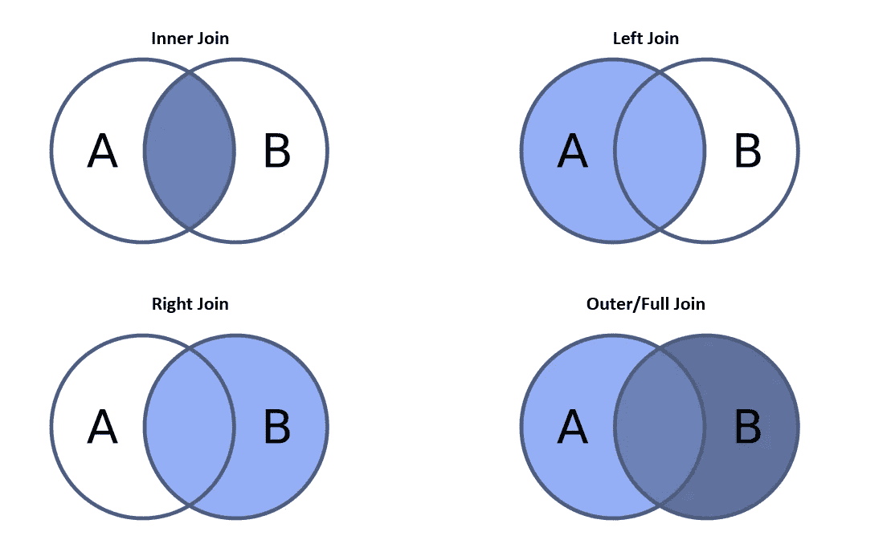

# Hive 简介

> 原文：<https://towardsdatascience.com/introduction-to-hive-859ba31a5769?source=collection_archive---------20----------------------->

## Hive & SQL 编码初学者指南

图像信用—Confusedcoders.com

本文主要关注 Hive、它的特性、用例以及 Hive 查询。因为许多 DML 和 DDL 查询与 SQL 非常相似，所以它可以作为任何 SQL 新手的基础或构建块。

Apache Hive 通常被称为构建在 Apache Hadoop 之上的数据仓库基础设施。最初由脸书开发，用于查询他们每天大约 20TB 的输入数据，目前，程序员使用它对存储在 HDFS (Hadoop 分布式框架系统)等文件系统中的大型数据集进行特别查询和分析，而无需了解 map-reduce 的细节。Hive 最好的部分是查询被 Hive 引擎隐式地转换成高效的链式 map-reduce 作业。

## 蜂巢的特点:

*   支持不同的存储类型，如纯文本、csv、Apache Hbase 等
*   数据建模，如创建数据库、表格等。
*   易于编码；使用类似 SQL 的查询语言 HiveQL
*   ETL 功能，例如提取、转换和将数据加载到表中，以及连接、分区等。
*   包含内置的用户定义函数(UDF ),用于操作日期、字符串和其他数据挖掘工具
*   无论布局如何，非结构化数据都显示为看起来像表格的数据
*   自定义映射器、缩减器和 UDF 的插件功能
*   Hadoop 上的增强查询

## Hive 的使用案例:

*   **文本挖掘** —具有便捷结构的非结构化数据，通过 map-reduce 进行覆盖和分析
*   **文档索引** —为多个文档分配标签以便于恢复
*   **业务查询** —查询大量历史数据以获得可操作的洞察，例如交易历史、支付历史、客户数据库等。
*   **日志处理** —处理各种类型的日志文件，如通话日志、网络日志、机器日志等。

# Hive 中的编码

我们将使用一个名为“transaction”的表来了解如何在 Hive 中查询数据。事务表包含属性 id、item 和 sales。

以下是任何编程语言的一些最佳编码实践。

 [## 对于数据科学的工作，你的编码技能够好吗？

### 5 编码嗅探如果你在数据科学行业工作，你必须知道

towardsdatascience.com](/are-your-coding-skills-good-enough-for-a-data-science-job-49af101457aa) 

# 配置单元中的 DDL 命令

DDL 是数据定义语言的简称，它处理数据库模式和描述，说明数据应该如何驻留在数据库中。一些常见的例子有

## 创建表格

*   创建表—创建表事务(id INT，item STRING，sales FLOAT)；
*   在特定位置存储表格—创建表格事务(id INT，item STRING，sales FLOAT)行格式分隔字段，以“\001”终止，存储为文本文件位置<hdfs path="" name="">；</hdfs>
*   对表进行分区—创建由(id INT)分区的表事务(id INT，item STRING，sales FLOAT)

## 翻桌

*   删除表交易记录；

## 改变表格

*   将表事务重命名为 transaction _ front _ of _ stores
*   添加列—ALTER TABLE transaction ADD COLUMNS(customer _ name STRING)；

## 显示表格

*   显示表格；

## 描述表格

*   描述交易记录；
*   描述扩展交易记录；

# 配置单元中的 DML 命令

DML 是**数据操作语言**的简称，它处理数据操作，包括最常用的 SQL 语句，如 SELECT、INSERT、UPDATE、DELETE 等。它主要用于存储、修改、检索、删除和更新数据库中的数据。

## 加载数据

*   从外部文件加载数据——加载数据本地路径“<file_path>”【覆盖】到表；</file_path> 
*   将数据本地路径“/documents/datasets/transaction . CSV”[OVERWRITE]加载到表事务中；
*   从单独的表写入数据集—插入覆盖表事务 SELECT id，item，date，volume FROM transaction _ updated

## 选择指令

select 语句用于从数据库表中提取数据。主要用于查看记录、选择必需的字段元素、获取不同的值以及显示任何筛选、限制或分组操作的结果。

要从事务表中获取所有记录:

从交易记录中选择*；

要从事务表中获取不同的事务 id:

从交易记录中选择不同的 id；

## 极限语句

与 Select 语句一起使用，限制编码人员希望查看的行数。任何事务数据库都包含大量数据，这意味着选择每一行都会导致更长的处理时间。

SELECT *从交易限额 10；

## 过滤语句

SELECT * FROM 销售额> 100 的交易；

## Group by 语句

Group by 语句用于汇总不同级别的数据。设想一个场景，我们希望按商品计算总销售额。

选择项目，SUM(sales)作为按项目分组的交易中的销售额；

如果我们想过滤掉所有销售额至少为 1000 英镑的商品。

按销售额> 1000 的项目从交易组中选择项目，SUM(sales)作为销售额；

# 加入配置单元

为了组合和检索多个表中的记录，我们使用了 Hive Join。目前，Hive 支持两个或更多表的内、外、左和右连接。语法类似于我们在 SQL 中使用的语法。在我们看语法之前，让我们了解不同的连接是如何工作的。

配置单元中的不同联接

SELECT A . * FROM transaction A { LEFT | RIGHT | FULL } JOIN transaction _ date B ON(A . ID = B . ID)；

注意事项:

*   配置单元不支持 IN/EXISTS 子查询
*   配置单元不支持不包含相等条件的连接条件
*   可以连接多个表，但要组织好表，使最大的表出现在序列的最后
*   如果对于每个表，在 join 子句中使用了相同的列，则 Hive 会将多个表的连接转换为单个 map/reduce 作业

# 优化配置单元中的查询

为了优化 hive 中的查询，这里有 5 条你应该知道的经验法则

1.  默认情况下，分组、聚合函数和连接发生在 reducer 中，而过滤操作发生在 mapper 中
2.  使用 hive.map.aggr=true 选项直接在地图任务中执行第一级聚合
3.  根据正在执行的任务类型设置映射器/缩减器的数量。对于筛选条件，请使用 set mapred . mapper . tasks = X；对于聚合操作:设置 mapred . reduce . tasks = Y；
4.  在连接中，序列中的最后一个表通过 reducers 进行流式传输，而其他表则被缓冲。 ***组织表格，使最大的表格出现在序列的最后***
5.  流表和地图连接可用于加速连接任务

想了解更多关于 Python 可视化的知识吗？

 [## 数据可视化:用 Python 中的图表说出来

### 使用 matplotlib、pyplot 和…的 python 可视化最佳实践和概念的完整实践指南

towardsdatascience.com](/data-visualization-say-it-with-charts-in-python-138c77973a56)  [## 现代分析的黎明——了解商业智能的一些最新趋势…

### 基于调查的方法来确定每个数据科学家都应该知道的 BI 工具

towardsdatascience.com](/the-dawn-of-modern-analytics-a-look-into-some-of-the-recent-trends-of-business-intelligence-fc12cdf41cae) 

*关于作者:高级分析专家和管理顾问，帮助公司通过对组织数据的商业、技术和数学的组合找到各种问题的解决方案。一个数据科学爱好者，在这里分享、学习、贡献；可以和我在* [*上联系*](https://www.linkedin.com/in/angel-das-9532bb12a/) *和* [*推特*](https://twitter.com/dasangel07_andy)*；*