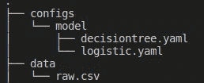
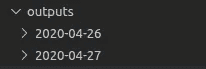
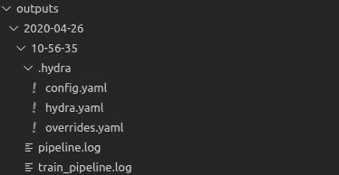

# Hydra.cc 简介:配置数据科学项目的强大框架

> 原文：<https://towardsdatascience.com/introduction-to-hydra-cc-a-powerful-framework-to-configure-your-data-science-projects-ed65713a53c6?source=collection_archive---------31----------------------->

## 尝试不同的参数和模型，而无需花费数小时来修改代码！


照片由[贾斯特斯·门克](https://unsplash.com/@justusmenke?utm_source=medium&utm_medium=referral)在 [Unsplash](https://unsplash.com?utm_source=medium&utm_medium=referral) 拍摄

# 动机

玩不同的特征工程方法和机器学习模型很有趣，但在获得好的结果之前，你很可能需要调整你的特征工程方法和调整你的机器学习模型。

例如，在下面的速配数据中，考虑到它们不是重要的特征，你可能想去掉`iid, id, idg, wave, career`。但是在对数据做了更多的研究之后，你意识到`career`将是预测两个人是否会有下一次约会的一个重要特征。所以你决定不放弃`career`专栏。

如果您正在进行硬编码，这意味着将数据**直接嵌入到脚本的源代码**中，如下所示

并且您的文件很长，您可能需要一段时间来**找到指定**删除哪些列的代码。如果从一个只包含数据信息的简单文本中修复列，而不使用像这样的其他 python 代码，这不是很好吗？

这时你需要一个配置文件。

# 什么是配置文件？

配置文件包含定义运行程序的设置的纯文本参数。一个好的做法是**避免在 python 脚本中硬编码**，而**在配置文件中保留与数据**相关的所有信息，比如删除哪些列、分类变量**。**

这种做法不仅节省了您在脚本中搜索特定变量的时间，而且使您的脚本更具可重复性。

例如，我可以对完全不同的数据重用这段代码，因为代码中没有指定列名。为了让代码为新数据工作，我需要做的就是修改我的配置文件中的列名！

配置文件的通用语言是 YAML。YAML 是所有编程语言的人性化数据序列化标准。语法易于阅读，几乎与 Python 相似。在这里找到更多关于 YAML 语法的信息。

# Hydra.cc 简介

我希望上面的简短解释能帮助你理解配置文件的重要性。但是我们如何访问配置文件中的参数呢？

有一些工具可以读取配置文件，比如 [PyYaml](https://pyyaml.org/wiki/PyYAMLDocumentation) ，但是我最喜欢的是 [Hydra.cc](https://hydra.cc/) 。为什么？因为它允许我:

*   无缝更改我在终端中的默认参数
*   在不同的配置组之间切换
*   自动记录结果

让我们了解如何开始使用 hydra.cc，并探索使用这一强大工具的好处。

## 开始

安装 [Hydra.cc](https://hydra.cc/)

```
pip install hydra-core --upgrade
```

让我们从一个具体的例子开始:

例如，如果您有如下所示的配置文件，其中包含关于数据路径、编码、管道类型和目标列的所有特定信息

您需要做的就是将装饰器`@hydra.main(config_path='path/to/config.yaml')`添加到将使用配置文件的函数中。确保在函数中添加`config`来访问配置文件。

现在，您可以使用配置文件中的任何参数了！如果你想知道目标的名字，

```
target: match
```

你所需要做的就是调用`config.target`来得到字符串‘匹配’！

请注意，您不需要将单词“match”用引号括起来。如果它是一个单词，YAML 文件会将其视为一个字符串。

## 简单命令行应用程序

Hydra.cc 允许您在终端中覆盖配置文件中的默认参数。例如，如果您想要将机器学习模型从决策树切换到逻辑回归

您不需要重写配置文件。您可以在运行文件时在终端中键入变量的替代参数

```
python file.py model=logisticregression
```

并且模型会切换到 logistic 回归！

更好的是，如果您的配置文件很复杂，Hydra.cc 还允许您通过制表符结束来更容易地访问文件中的参数！你可以在这里找到关于标签完成[的细节。](https://hydra.cc/docs/tutorial/tab_completion)

## 在不同的配置组之间切换

为了保持配置文件的简短和结构化，您可能希望为不同的模型创建不同的文件以及它们的参数，如下所示



您可以在命令行上指定要定型的模型的配置文件

```
python file.py model=logistic
```

现在，您可以在不同的模型之间切换，并轻松访问它们的超参数！

## 自动记录

如果你想记录跑步的结果，记录是很重要的。但是由于设置成本，许多人不使用 Python 日志记录。Hydra.cc 根据一天的情况，自动创建所有结果并保存在“输出”文件夹中



每个日文件夹都是根据小时和分钟来组织的。您将看到与您的运行相关的所有日志，以及用于该运行的配置文件！



如果您碰巧更改了您的配置文件，并且不记得您用来生成某个输出的配置文件是什么样子的，您可以查看当天的文件夹来找出答案！

在这里找到更多关于伐木[的信息](https://hydra.cc/docs/tutorial/logging)。

因为在运行 hydra decorator 包装的函数时，您位于输出目录中，所以如果您想要访问父目录中的其他文件，请确保使用`utils.to_absolute_path('path/to/file')`。

```
Current working directory  : /Users/khuyentran/dev/hydra/outputs/2019-10-23/10-53-03Original working directory : /Users/khuyentran/dev/hydrato_absolute_path('foo')    : /Users/khuyentran/dev/hydra/footo_absolute_path('/foo')   : /foo
```

# 结论

恭喜你！您已经了解了配置文件的重要性以及如何无缝配置您的数据科学项目。我发现，当我将所有与数据相关的信息都放在一个单独的文件中时，会更有条理。我还发现，当我所需要做的就是调用`python file.py variable=new_value.`时，试验不同的参数会更容易。我希望通过在数据科学实践中结合配置文件和 Hydra.cc，您也能获得同样的好处。

下面是使用 hydra.cc 和 config 文件的[示例项目](https://github.com/khuyentran1401/Speed-Dating)。

我喜欢写一些基本的数据科学概念，并尝试不同的算法和数据科学工具。你可以在 LinkedIn 和 Twitter 上与我联系。

如果你想查看我写的所有文章的代码，请点击这里。在 Medium 上关注我，了解我的最新数据科学文章，例如

[](/5-reasons-why-you-should-switch-from-jupyter-notebook-to-scripts-cb3535ba9c95) [## 你应该从 Jupyter 笔记本转向脚本的 5 个理由

### 使用脚本帮助我认识到 Jupyter 笔记本的缺点

towardsdatascience.com](/5-reasons-why-you-should-switch-from-jupyter-notebook-to-scripts-cb3535ba9c95) [](/how-to-create-fake-data-with-faker-a835e5b7a9d9) [## 如何用 Faker 创建假数据

### 您可以收集数据或创建自己的数据

towardsdatascience.com](/how-to-create-fake-data-with-faker-a835e5b7a9d9) [](/how-to-monitor-and-log-your-machine-learning-experiment-remotely-with-hyperdash-aa7106b15509) [## 如何使用 HyperDash 远程监控和记录您的机器学习实验

### 培训需要很长时间才能完成，但你需要去洗手间休息一下…

towardsdatascience.com](/how-to-monitor-and-log-your-machine-learning-experiment-remotely-with-hyperdash-aa7106b15509) [](/how-to-leverage-visual-studio-code-for-your-data-science-projects-7078b70a72f0) [## 如何在数据科学项目中利用 Visual Studio 代码

### 直到发现一种新的有效方法，我们才意识到我们是多么低效

towardsdatascience.com](/how-to-leverage-visual-studio-code-for-your-data-science-projects-7078b70a72f0) [](/how-to-share-your-python-objects-across-different-environments-in-one-line-of-code-f30a25e5f50e) [## 如何在一行代码中跨不同环境共享 Python 对象

### 为建立与他人分享你的发现的环境而感到沮丧？以下是如何让它变得更简单

towardsdatascience.com](/how-to-share-your-python-objects-across-different-environments-in-one-line-of-code-f30a25e5f50e)