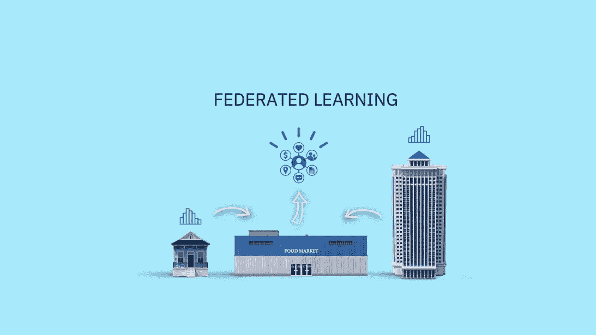
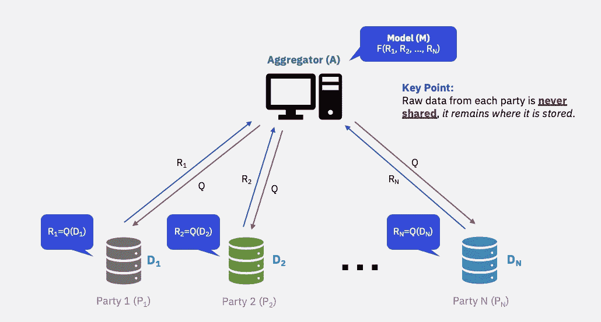
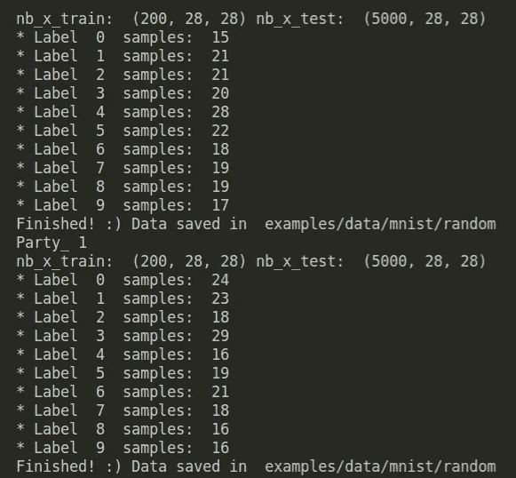
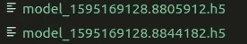
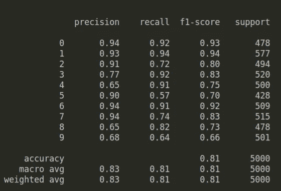
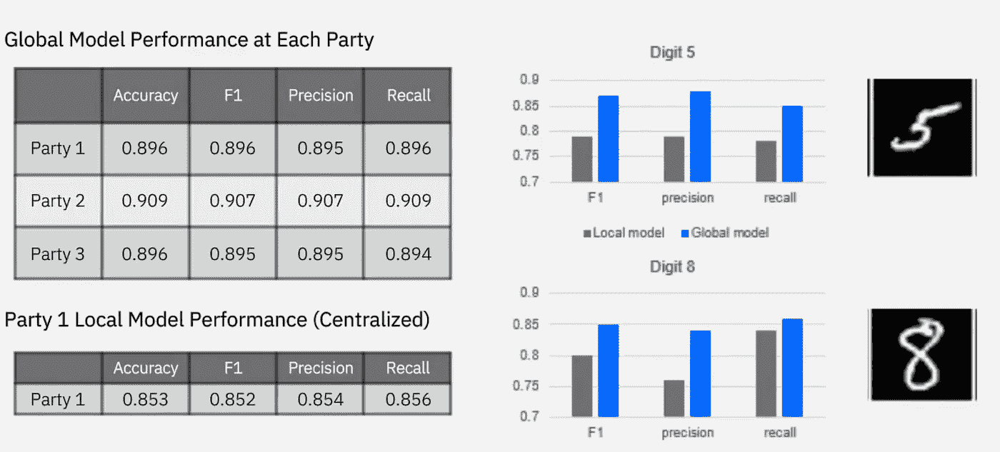

# IBM 联邦学习简介:一种在私有数据上训练 ML 模型的协作方法

> 原文：<https://towardsdatascience.com/introduction-to-ibm-federated-learning-a-collaborative-approach-to-train-ml-models-on-private-data-2b4221c3839?source=collection_archive---------42----------------------->

## 在训练来自不同来源的数据时，如何保证数据的安全？

IBM Research 刚刚在 Github 上发布了 [IBM 联邦学习](https://github.com/IBM/federated-learning-lib)。如果您一直在寻找一种方法，在保持数据私密的同时，利用从多个资源收集的数据来提高模型训练，那么这个框架非常适合您。本文将解释为什么需要联邦学习以及如何开始使用该框架。



照片由[晨酿](https://unsplash.com/@morningbrew?utm_source=unsplash&utm_medium=referral&utm_content=creditCopyText)在 [Unsplash](https://unsplash.com/?utm_source=unsplash&utm_medium=referral&utm_content=creditCopyText) 拍摄

# 动机

当训练一个机器学习模型时，我们通常知道你的数据看起来如何，数据的分布和统计。

但是在现实世界中，我们可能会使用不同来源的数据，却不知道这些数据是什么样的。为什么？因为数据安全在不同的企业中很重要。

例如，一个航空联盟想要模拟新冠肺炎最近的事件将如何影响航班延误。在航空联盟中，我们有几家不同的航空公司，它们拥有不同的数据。因为这些航空公司是竞争对手，所以**原始数据不能在每个航空公司之间共享**。但是航空联盟需要用**组合数据**来训练模型！

可能还有其他非竞争原因，例如:

*   对于一些企业来说，将数据移动到一个位置可能不切实际或成本高昂，尤其是在数据生成速度很快或数据量很大的情况下。
*   即使在同一家公司，客户数据库也可能位于不同的国家，数据不能被带出这个国家。
*   由于监管和保密的原因，金融公司不能共享交易数据，医疗机构也不能共享患者数据。

那么解决办法是什么呢？这就是我们需要联合学习的时候。

# 什么是联合学习？

联合学习(FL)是一种训练机器学习模型的方法，不需要与中央实体共享数据集。在联合学习中，模型是在多方之间协作训练的。各方可以**保留他们自己的训练数据集**，但是仍然能够参与共享的联合学习过程。



从 [IBM 数据科学和人工智能会议 4](https://event.on24.com/eventRegistration/console/EventConsoleApollo.jsp?&eventid=2282657&sessionid=1&username=&partnerref=on24seo&format=fhvideo1&mobile=&flashsupportedmobiledevice=&helpcenter=&key=FE212C94E68A58040CE3C3D7AB82C040&newConsole=false&nxChe=true&text_language_id=en&playerwidth=748&playerheight=526&eventuserid=305858761&contenttype=A&mediametricsessionid=281601187&mediametricid=3225091&usercd=305858761&mode=launch) 中检索的图像

各方之间的学习过程通常使用单个集合器。一个汇总者将与各方沟通并整合培训过程的结果。

例如，神经网络的过程可以是:

*   各方对其训练数据运行本地训练过程，与聚合器共享其模型的权重。
*   然后，这些权重将使用融合算法聚合所有各方的权重向量。
*   然后，将合并后的模型发回给各方进行下一轮训练。

联合决策树算法可以在聚合器中增长树，并基于各方的数据集向各方查询(请求)计数信息。

FL 的整个过程都是为了保证在不共享各方原始数据的情况下，从数据集合中创建一个健壮的机器学习模型！

# 但这是最优的吗？

虽然 FL 不需要集中管理培训数据，但它也带来了一些新的变化，例如:

*   **数据集异质性:**分布的差异、各方不同的数据集大小、不同的属性(即一家航空公司的富客户可能比另一家航空公司多)。因此，整个训练数据集没有共同的属性，如预处理方法、微调算法和模型性能评估。
*   **隐私**:一些联合学习场景要求不同的参与方(或者甚至是聚合方)不能基于在训练过程中交换的消息(例如，权重)得出关于彼此训练数据的见解
*   **技能:** FL 需要从机器学习到分布式系统再到密码学的不同技能。很难找到具备所有这些技能的员工。

理想情况下，我们希望在没有部署难度的情况下解决上述问题，尽可能避免打开端口等耗时的过程。

幸运的是，[**IBM Federated Learning**](https://github.com/IBM/federated-learning-lib)框架解决了上述所有挑战，并且能够轻松地将 FL 集成到高效的机器学习工作流中。

了解一个框架的最好方法就是去玩它！我们需要不止一个政党来检验这一点。但是不要担心，我们可以模拟多方试图从不同的机器训练他们的数据的场景！培训的效果如何？敬请期待，静观其变。

# IBM 联合学习

下面的步骤可以在 IBM Federated learning Github repo 的[设置部分找到](https://github.com/IBM/federated-learning-lib/blob/main/setup.md)

# 设置

从克隆[这个 repo](https://github.com/IBM/federated-learning-lib) 开始。然后转到创建的文件夹。

安装所有要求。我真的强烈推荐这个项目使用康达装置。

```
conda create -n <env_name> python=3.6
conda activate <env_name>
```

通过运行以下命令安装 IBM FL 包:

```
pip install <IBM_federated_learning_whl_file>
```

## 分割样本数据

这个例子解释了如何在 CNN 上运行联合学习，在 MNIST 数据上用 Keras 训练实现。

我们需要不止一个政党来观察 FL 是如何工作的。我们可以使用`generate_data.py`在任何集成数据集上生成样本数据。例如，我们可以运行:

```
python examples/generate_data.py -n 2 -d mnist -pp 200
```

该命令将从 MNIST 数据集中生成各有 200 个数据点的两个交易方。



## 创建配置文件

要运行 IBM federated learning，您必须拥有聚合器和各方的配置文件。每个配置文件都包含有关各方的信息。您可以使用`generate_configs.py`脚本生成这些配置文件。

例如，您可以运行:

```
python examples/generate_configs.py -m keras_classifier -n 2 -d mnist -p examples/data/mnist/random
```

这个命令将为`keras_classifier`模型生成配置，假设有两方。`-p`是当事人数据的路径。

# 开始学习

现在把你自己放在每个政党和聚合者的位置上。请记住，在现实生活中，各方和聚合者**不会看到彼此的屏幕**，但他们会**在培训过程中进行协调**。

## 启动聚合器

要启动聚合器，请打开一个终端窗口，运行之前设置的 IBM FL 环境。

1.  在终端运行中:

```
python -m ibmfl.aggregator.aggregator examples/configs/keras_classifier/config_agg.yml
```

其中提供的路径是聚合器配置文件路径。

2.然后在终端中，键入`START`，并按回车键。这意味着聚合器开始接受来自其他方的连接。

## 登记当事人

要注册新的参与方，请为每个参与方打开一个新的终端窗口，运行之前设置的 IBM FL 环境。

1.  在终端运行中:

```
python -m ibmfl.party.party examples/configs/keras_classifier/config_party0.yml
```

其中提供的路径是参与方配置文件的路径。

2.在每一方的终端中，键入`START`并按回车键。这意味着该方开始接受来自聚合器的连接

3.然后在每一方的终端中，键入`REGISTER`并按回车键。这意味着各方加入 FL 项目

## 火车

要启动联合培训，请在聚合器终端中键入`TRAIN`,然后按 enter 键。

## 同步

要在各方之间同步模型，请键入`SYNC`

## 救援

要保存模型，在您的聚合器终端中键入`SAVE`，并按 enter 键。

瞧啊。现在每个派对的模型都保存到你的文件夹里了。在真实的场景中，每一方将只看到他们的一个模型文件。



现在我们有了可以用于预测的模型！

## 停止

记住在聚合器终端和当事人终端都键入`STOP`来结束实验过程。恭喜你！您的团队刚刚完成培训过程，但没有透露您的数据。

## 预言；预测；预告

假设你是 0 方，要用模型预测你方的测试数据，你需要做的就是加载模型，预测你方的测试数据。



厉害！你的队伍获得 0.81 的 f1 分数。您不仅保护了您的数据，还获得了一个强大的机器学习模型！

# 但是 FL 车型相比本土车型性能如何？

我将使用来自 [IBM 数据科学和人工智能会议 4](https://event.on24.com/eventRegistration/console/EventConsoleApollo.jsp?&eventid=2282657&sessionid=1&username=&partnerref=on24seo&format=fhvideo1&mobile=&flashsupportedmobiledevice=&helpcenter=&key=FE212C94E68A58040CE3C3D7AB82C040&newConsole=false&nxChe=true&text_language_id=en&playerwidth=748&playerheight=526&eventuserid=305858761&contenttype=A&mediametricsessionid=281601187&mediametricid=3225091&usercd=305858761&mode=launch) 的截图来比较两者之间的性能



从 [IBM 数据科学和人工智能会议 4](https://event.on24.com/eventRegistration/console/EventConsoleApollo.jsp?&eventid=2282657&sessionid=1&username=&partnerref=on24seo&format=fhvideo1&mobile=&flashsupportedmobiledevice=&helpcenter=&key=FE212C94E68A58040CE3C3D7AB82C040&newConsole=false&nxChe=true&text_language_id=en&playerwidth=748&playerheight=526&eventuserid=305858761&contenttype=A&mediametricsessionid=281601187&mediametricid=3225091&usercd=305858761&mode=launch) 中检索的图像

如您所见，第 1 方本地模型性能的所有指标，包括准确度、f1、精确度和召回率，都高于本地模型性能！通过合并来自其他来源的数据，您可以获得一个更可靠的模型来预测您所在政党的数据。

# 结论

恭喜你！您刚刚学习了如何在不共享数据的情况下，在数据集的组合上训练机器学习！最重要的是，设置培训不需要高级技能。

您所需要做的就是在您的项目文件中添加一个配置，指定相关的信息，比如连接、数据、模型。然后在终端上使用一些简单的命令行，同时设置和训练各方。

Github 库以及该框架的文献可以在这里找到。您也可以使用 [IBM 联邦学习松弛渠道](https://app.slack.com/client/T015XLNRHT6/)直接联系框架的开发团队。

我喜欢写一些基本的数据科学概念，并尝试不同的算法和数据科学工具。你可以在 [LinkedIn](https://www.linkedin.com/in/khuyen-tran-1401/) 和 [Twitter](https://twitter.com/KhuyenTran16) 上和我联系。

如果你想查看我写的所有文章的代码，请点击这里。在 Medium 上关注我，了解我的最新数据科学文章，例如:

[](/i-scraped-more-than-1k-top-machine-learning-github-profiles-and-this-is-what-i-found-1ab4fb0c0474) [## 我收集了超过 1k 的顶级机器学习 Github 配置文件，这就是我的发现

### 从 Github 上的顶级机器学习档案中获得见解

towardsdatascience.com](/i-scraped-more-than-1k-top-machine-learning-github-profiles-and-this-is-what-i-found-1ab4fb0c0474) [](/introduction-to-datapane-a-python-library-to-build-interactive-reports-4593fd3cb9c8) [## Datapane 简介:构建交互式报表的 Python 库

### 创建精美报告并与您的团队分享分析结果的简单框架

towardsdatascience.com](/introduction-to-datapane-a-python-library-to-build-interactive-reports-4593fd3cb9c8) [](/how-to-find-the-nearest-hospital-with-voronoi-diagram-63bd6d0b7b75) [## 如何用 Voronoi 图找到最近的医院

### 给定美国医院的大型数据集，我们如何快速找到最近的医院？

towardsdatascience.com](/how-to-find-the-nearest-hospital-with-voronoi-diagram-63bd6d0b7b75) [](/how-to-leverage-visual-studio-code-for-your-data-science-projects-7078b70a72f0) [## 如何在数据科学项目中利用 Visual Studio 代码

### 直到发现一种新的有效方法，我们才意识到我们是多么低效

towardsdatascience.com](/how-to-leverage-visual-studio-code-for-your-data-science-projects-7078b70a72f0) [](/how-to-learn-non-linear-separable-dataset-with-support-vector-machines-a7da21c6d987) [## 如何用支持向量机学习非线性数据集

### 支持向量机简介及其在非线性数据集上的应用

towardsdatascience.com](/how-to-learn-non-linear-separable-dataset-with-support-vector-machines-a7da21c6d987)