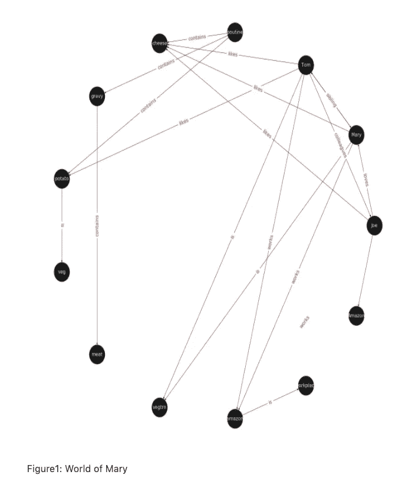
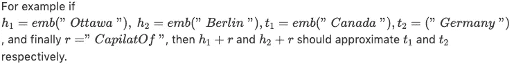
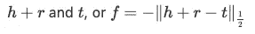
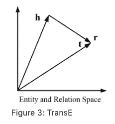
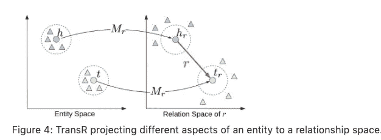
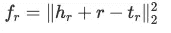

# 知识图嵌入简介

> 原文：<https://towardsdatascience.com/introduction-to-knowledge-graph-embedding-with-dgl-ke-77ace6fb60ef?source=collection_archive---------10----------------------->

## 了解知识图嵌入和两个流行的模型，以产生他们与 DGL 柯

作者:赛勒斯·瓦希德，郑达，乔治·卡里皮斯和巴拉吉·卡马科蒂:AWS AI

知识图(KGs)已经成为一种有效的方法来集成不同的数据源，并为搜索等应用程序建模底层关系。在亚马逊，[我们用 KGs](https://www.amazon.science/blog/combining-knowledge-graphs-quickly-and-accurately) 来表示产品之间的层级关系；亚马逊音乐和 Prime Video 上的创作者和内容之间的关系；以及 Alexa 问答服务的信息。以嵌入形式从知识仓库中提取的信息用于改进搜索、推荐产品和推断缺失的信息。然而，很难从具有数百万个节点和数十亿条边的图中训练 KG 嵌入。

亚马逊最近推出了 DGL 客，一个用简单的命令行脚本简化这一过程的软件包。使用[DGL-克](https://github.com/awslabs/dgl-ke)，用户可以比竞争技术快 2-5 倍的速度为非常大的图形生成嵌入。DGL-KE 通过配置硬件、数据采样参数和损失函数，为用户提供了选择用于生成嵌入和优化性能的模型的灵活性。然而，为了有效地使用这个包，理解嵌入是如何工作的以及计算它们的优化是很重要的。这个由两部分组成的博客系列旨在提供这些信息，并让你准备好开始利用[DGL-柯](https://github.com/awslabs/dgl-ke)。

# 什么是图表

图形是用来表示事物及其关系的结构。它由两组组成—一组节点(也称为顶点)和一组边(也称为弧)。每条边本身连接一对节点，表明它们之间存在关系。这种关系既可以是*无向*，例如捕获节点之间的对称关系，也可以是*有向*，捕获非对称关系。例如，如果一个图被用来模拟社交网络中的人的友谊关系，那么边将是无向的，因为它们被用来指示两个人是朋友；然而，如果该图用于模拟人们在 Twitter 上如何相互关注，那么这些边将是有向的。根据边的方向性，一个图可以是*有向的*或*无向的。*

图形可以是*同质*或*异质*。在同构图形中，所有节点代表相同类型的实例，所有边代表相同类型的关系。例如，社交网络是由人和他们的联系组成的图，所有人都代表相同的实体类型。相反，在异构图中，节点和边可以是不同的类型。例如，用于对市场中的信息进行编码的图将具有*买方*、*卖方*和*产品*节点，这些节点通过*想买*、*已买*、*是*的客户，以及*是销售*的边连接。

最后，另一类对知识图特别重要的图是*多图*。这些图在同一对节点之间可以有多条(有向)边，也可以包含环。这些多重边通常是不同类型的，因此大多数多重图是异构的。注意，不允许这些多条边和自循环的图被称为简单图。

# 什么是知识图

在之前的市场图示例中，分配给不同节点类型(买方、卖方、产品)和不同关系类型(想买、已经买、是客户的、是销售的)的标签传达了关于特定域的节点和关系代表什么的精确信息(通常称为*语义* ) 。一旦该图被填充，它将对我们关于该市场的知识进行编码，因为它涉及到所包括的节点和关系的类型。这样的图是知识图的一个例子。

知识图(KG)是一种有向异构多重图，其节点和关系类型具有特定于领域的语义。KGs 允许我们将知识编码成一种人类可以理解的形式，并且可以进行自动分析和推理。kg 正在成为一种流行的方法，以通过不同类型的关系连接的不同类型的实体的形式来表示不同类型的信息。

使用 kg 时，我们采用了一种不同于图中使用的传统顶点和边的术语。知识图的顶点通常被称为*实体*，有向边通常被称为*三元组*，并且被表示为( *h，r，t* )元组，其中 *h* 是头部实体， *t* 是尾部实体， *r* 是将头部实体与尾部实体相关联的关系。注意，术语*关系*在这里指的是关系的类型(例如，想要购买、已经购买、是客户的和是销售的之一)。

现在让我们用石膏来考察一个民族和他们生活的世界。

**场景:**
**玛丽**和**汤姆**是*兄妹，他们都是 ***素食者*** ，谁 ***像*** **土豆**和**奶酪**。玛丽和汤姆都在亚马逊的**和**工作。**乔**是汤姆的 ***同事*** 的一个小子。让事情变得复杂的是，乔 ***爱着*** 玛丽，但我们不知道这种感觉是否得到了回报。*

*乔 ***来自*** **魁北克**并以他的家乡菜 **Poutine** 为傲，这是由 土豆、奶酪和**肉汁**组成的 ***。我们还知道，肉汁 ***以某种形式含有*** **肉**。****

*乔很兴奋地邀请汤姆共进晚餐，并偷偷地邀请了他的兄弟姐妹玛丽。他的计划从一开始就注定要失败，因为他打算为素食的兄弟姐妹提供他最喜欢的魁北克菜 Poutine。*

*哦！顺便说一下，一个地理琐事:魁北克 ***位于*** 的一个**省**的同名省 ***又位于**加拿大**的*** 。*

*这个场景中有几个关系没有明确提到，但我们可以简单地从给出的信息中推断出来:*

*   *玛丽是汤姆的同事。*
*   *汤姆是玛丽的同事。*
*   *玛丽是汤姆的妹妹。*
*   *汤姆是玛丽的哥哥。*
*   *Poutine 有肉。*
*   *Poutine 不是素菜。*
*   *玛丽和汤姆不吃布丁。*
*   *布丁是一道加拿大菜。*
*   *乔是加拿大人。*
*   *亚马逊是玛丽、汤姆和乔的工作场所。*

*一些有趣的负面结论对我们来说似乎是直观的，但对机器来说却不是:*

*   *土豆不喜欢玛丽。*
*   *加拿大*不是来自*乔。*
*   *加拿大*不在魁北克*。*
*   *…
    我们研究的是一个知识图，一组具有不同关系类型的节点:*
*   *一对一:玛丽是汤姆的兄弟姐妹。*
*   *1 对 N: Amazon 是 Mary、Tom 和 Joe 的工作场所。*
*   *n 对 1:乔、汤姆和玛丽在亚马逊工作。*
*   *N 对 N:乔、玛丽和汤姆是同事。*

*对于这些关系，还有其他的分类观点:*

*   *对称:乔是汤姆的同事，汤姆也是乔的同事。*
*   *反对称:魁北克位于加拿大意味着加拿大不能位于魁北克。*

*图 1 显示了一个 KG，它描述了 Mary 的世界。有关如何使用示例的更多信息，请参考嵌入的[代码](https://github.com/cyrusmvahid/GNNTrainingMaterial/tree/master/supporting_examples)。*

**

# *知识图嵌入*

*知识图嵌入是知识图中实体和关系的低维表示。它们提供了一个可用于推断关系的总体 KG 的概括上下文。在上面想象的玛丽的世界中，嵌入提供了关于玛丽、乔和汤姆之间关系的洞察力。在更大和更密集的 KG 中，嵌入可以提供关于分子属性相互作用的见解，以加速药物发现或聚集游戏网络中骗子的用户行为。

计算知识图嵌入，使其满足某些性质；也就是说，它们遵循给定的 KGE *模型。*这些 KGE 模型定义了不同的*得分函数*，其测量两个实体相对于其在低维嵌入空间中的关系类型的距离。这些得分函数用于训练 KGE 模型，使得通过关系连接的实体彼此靠近，而未连接的实体远离。

有很多流行的 KGE 模型如 [TransE](https://papers.nips.cc/paper/5071-translating-embeddings-for-modeling-multi-relational-data.pdf) 、 [TransR](https://www.aaai.org/ocs/index.php/AAAI/AAAI15/paper/viewPaper/9571) 、 [RESCAL](http://citeseerx.ist.psu.edu/viewdoc/download?doi=10.1.1.383.2015&rep=rep1&type=pdf) 、 [DistMult](https://arxiv.org/abs/1412.6575) 、 [ComplEx](http://proceedings.mlr.press/v48/trouillon16.pdf) 、 [RotatE](https://arxiv.org/pdf/1902.10197.pdf) ，这些模型定义了不同的得分函数来学习实体和关系嵌入。DGL-柯使得这些实现可以通过命令行脚本中的一个简单的输入参数来实现。在这篇文章中，我们介绍并比较 TransE 和 TransR 这两种常用方法，为读者提供一些关于模型和权衡的直觉

**TransE**
[基于平移的嵌入模型(TransE)](https://arxiv.org/pdf/1806.01973.pdf) 是一种代表性的平移距离模型，它将实体和关系表示为维度 Rd 的相同语义空间中的向量，其中 d 是具有降低维度的目标空间的维度。源空间中的一个事实被表示为一个三元组(h，r，t)，其中 h 是头部*的缩写*，r 是关系*的缩写*，t 是尾部*的缩写*。该关系被解释为平移向量，使得通过关系 r 连接的嵌入实体具有短距离。[3, 4]*

*就向量计算而言，这可能意味着向关系添加头部应该接近关系的尾部或 h+r ≈ t。*

**

*TransE 执行线性变换，评分函数是以下各项之间的负距离:*

****

***运输***

*TransE 不能涵盖非一对一的关系，因为它只了解相似性的一个方面。TransR 通过将关系空间与实体空间分离来解决这个问题，其中 h，t ∈ ℝᵏ和$r ∈ ℝᵈ.语义空间不需要具有相同的维度。在多关系建模中，我们学习每个关系的投影矩阵 M∈ℝᵏˣᵈ，它可以将实体投影到不同的关系语义空间。这些空间中的每一个都捕获了与不同关系相关的实体的不同方面。在这种情况下，使用学习的投影矩阵 Mᵣ作为 hᵣ=hMᵣ和 tᵣ=tM ᵣrespectively.，将具有关系 r 的头节点 h 和尾节点 t 投影到关系空间中图 4 展示了这个投影。*

**

*让我们用一个例子来探讨这个问题。玛丽和汤姆是兄妹兼同事。他们都是素食者。乔也在亚马逊工作，是玛丽和汤姆的同事。TransE 可能最终为 Mary、Tom 和 Joe 学习到非常相似的嵌入，因为他们是同事，但不能识别(不是)兄弟姐妹关系。使用 TransR，我们学习投影矩阵:M_sibling、M_colleague 和 M _ 素食者，它们在学习类似(非)兄弟的关系方面表现得更好。

TransR 中的 score 函数类似于 TransE 中使用的函数，度量 h+r 和 t 之间的欧氏距离，但是距离度量是每个关系空间的。更正式地说:*

**

*TransR 相对于 TransE 的另一个优势是它能够提取组成规则。提取规则的能力有两个主要好处。它提供了更丰富的信息和更小的存储空间，因为我们可以从其他规则中推断出一些规则。

**权衡**
TransR 中更具表现力的投影带来的好处增加了模型的复杂性和更高的数据传输率，这对分布式训练产生了不利影响。TransE 要求每个关系有 O( *d* )个参数，其中 dd 是 TransE 中语义空间的维度，包括实体和关系。由于 TransR 将实体投影到维度为 kk 的关系空间，因此每个关系将需要 O( *kd* )个参数。根据 k 的大小，这可能会大幅增加参数的数量。在探索 DGL-柯的过程中，我们将检验[DGL-柯](https://github.com/awslabs/dgl-ke)在显著提高知识嵌入计算效率方面的优势。[5], [7]*

*关于在[DGL-克](https://github.com/awslabs/dgl-ke)中其他实现的详细概述，请查看我们的文档。*

# *下一步是什么？*

*在这篇博文中，我们介绍了知识图嵌入(kge)的概念，它们是如何工作的，以及生成 kge 的两种流行方法。在我们[的下一篇文章](/optimize-knowledge-graph-embeddings-with-dgl-ke-1fff4ab275f2?source=email-ad11aea5ba40-1592228879945-layerCake.autoLayerCakeWriterNotification-------------------------c241be34_5fc5_43b9_a2f1_4c0d47b32e26&sk=c5e477feb73aba2119c44ea54d91bf47)中，我们将探索如何加速与[DGL-柯](https://github.com/awslabs/dgl-ke)的训练。*

# *参考*

1.  *[http://semantic-web-journal.net/system/files/swj1167.pdf](http://semantic-web-journal.net/system/files/swj1167.pdf)*
2.  *孙志清，智，建，和。旋转:通过复杂空间中的关系旋转嵌入知识图。澳大利亚统计局/1902.10197，2019 年。*
3.  *知识图嵌入:方法与应用综述，毛振东，，李国。DOI 10.1109/TKDE.2017.2754499，IEEE 知识与数据工程汇刊*
4.  *transE: Antoine Bordes、Nicolas Usunier、Alberto Garcia-Duran、JasonWeston 和 Oksana
    Yakhnenko。翻译用于多关系数据建模的嵌入。神经信息处理系统进展 26。2013.
    5。译者:、林、、孙茂松、、。用于知识图完成的学习实体和关系嵌入。2015 年第 29 届 AAAI 人工智能会议论文集。*
5.  *重新校准:马克西米利安·尼克尔、沃克·特雷斯特普和汉斯·彼得·克里格尔。多关系数据集体学习的三向模型。《第 28 届国际机器学习会议论文集》，ICML，2011 年 11 月。*
6.  *调查论文:Q. Wang，Z. Mao，B. Wang 和 L. Guo，“知识图嵌入:方法和应用调查”，载于 IEEE 知识与数据工程汇刊，第 29 卷，第 12 期，第 2724-2743 页，2017 年 12 月 1 日。*
7.  *主持人:杨碧山、赵文涛、、高剑锋和。在知识库中嵌入用于学习和推理的实体和关系。《学习表征国际会议论文集(ICLR)
    2015，2015 年 5 月。*
8.  *复合:特鲁永，约翰内斯·韦尔布尔，塞巴斯蒂安·里德尔，埃里克·高西尔和纪尧姆·布沙尔。简单链路预测的复杂嵌入。更正，abs/1606.06357，2016。*
9.  *孙志清，智，建，和。旋转:通过复杂空间中的关系旋转嵌入知识图。澳大利亚统计局/1902.10197，2019 年。*