# NumPy 线性代数导论

> 原文：<https://towardsdatascience.com/introduction-to-linear-algebra-with-numpy-79adeb7bc060?source=collection_archive---------12----------------------->

## 带示例的基本概念和操作


[张家瑜](https://unsplash.com/@danielkcheung?utm_source=unsplash&utm_medium=referral&utm_content=creditCopyText)在 [Unsplash](https://unsplash.com/s/photos/small?utm_source=unsplash&utm_medium=referral&utm_content=creditCopyText) 上拍照

数据以许多不同的格式收集，从数字到图像，从类别到声波。然而，我们需要用数字表示的数据，以便能够在计算机上进行分析。机器学习和深度学习模型需要大量数据。它们的性能高度依赖于数据量。因此，我们倾向于收集尽可能多的数据，以便建立一个稳健而准确的模型。随着数据量的增加，用标量完成的操作开始变得低效。我们需要矢量化或矩阵运算来有效地进行计算。这就是**线性代数**发挥作用的地方。

线性代数是数据科学领域中最重要的课题之一。在这篇文章中，我们将介绍线性代数中的一些基本术语，并使用 Python 的科学计算库 **NumPy** 进行示例。

线性代数中有不同类型的对象(或结构):

*   标量:单一数字
*   Vector:数字数组
*   矩阵:数字的二维数组
*   张量:N 维数组，其中 n > 2

让我们为每个对象创建一个例子。我将跳过“标量”,因为它只是一个数字。我们首先导入 numpy:

```
import numpy as np
```

有 4 个元素的向量:

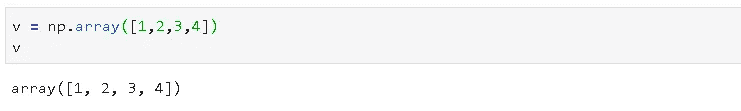

2x4 矩阵:

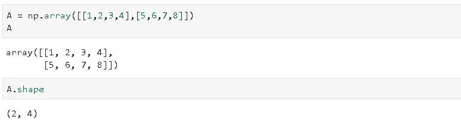

2x2x4 张量:

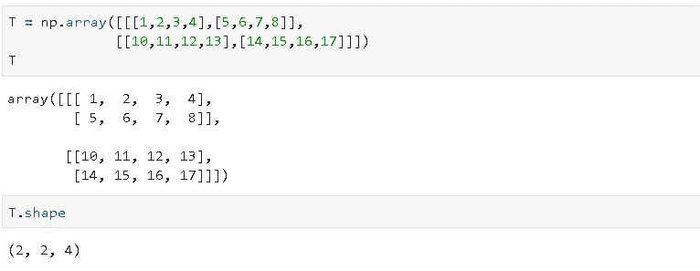

就 numpy 表示而言，向量是一维数组，矩阵是二维数组，张量是 n 维数组(n>2):

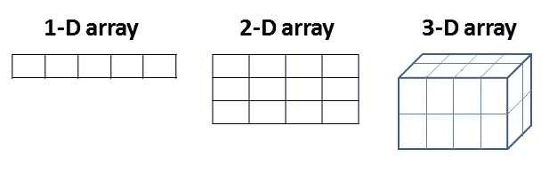

我们也可以用 numpy 创建更高维的数组，但是这些很难可视化。让我们创建一个四维数组，每个维度的大小为 2。

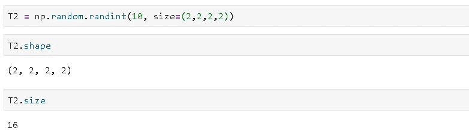

数组的总大小是每个维度的大小的乘积。T2 的印刷版本:

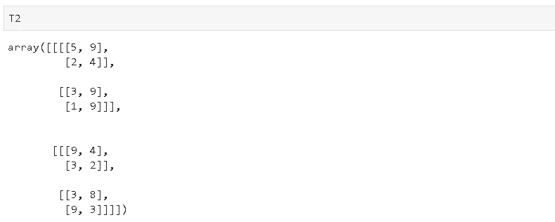

我们已经介绍了基本结构。现在是时候讨论可以在这些结构上完成的基本操作了。

# **向量运算**

*   当向量与标量相乘时，向量的每个元素都与标量相乘:

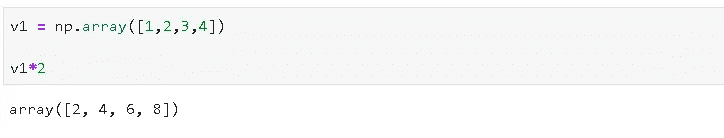

*   另一个常见的操作是**点积**。两个向量的点积是关于位置的元素乘积的和。一个向量的第一个元素乘以第二个向量的第一个元素，依此类推。这些积的和就是点积，可以用 **np.dot()** 函数来做。

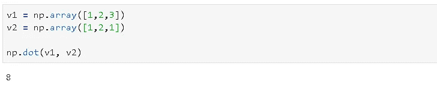

点积是矩阵乘法的重要部分，我们将在本文后面讨论。

*   向量的元素求和与减法是通过标准的数学运算完成的。

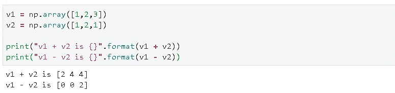

# **矩阵运算**

矩阵乘法是线性代数中一种广泛使用的运算。解线性方程组时，矩阵乘法非常方便。在复杂的机器学习和深度学习模型中，许多矩阵乘法都是在幕后进行的。优化算法执行大量矩阵乘法来寻找模型参数。因此，这是一个必须知道的操作。

在我们深入研究矩阵乘法之前，最好先了解矩阵的一些性质。矩阵是一个二维数组。如果两个维度中的元素数量(大小)相同，那么我们就有了一个**方阵。**

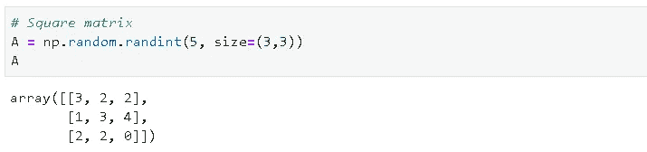

**单位矩阵**是一个在主对角线上包含 1，在所有其他位置包含 0 的方阵。

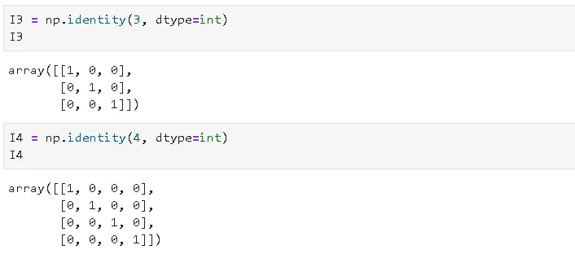

我们用行数和列数来定义矩阵的形状。例如，下面的矩阵 A 有 3 行 4 列。索引从零开始，所以我们可以通过 A[0]访问第一行，通过 A[:，0]访问第一列。可以通过传递行索引和列索引来访问特定的元素。例如，A[1，1]给出了第二行第二列的元素。

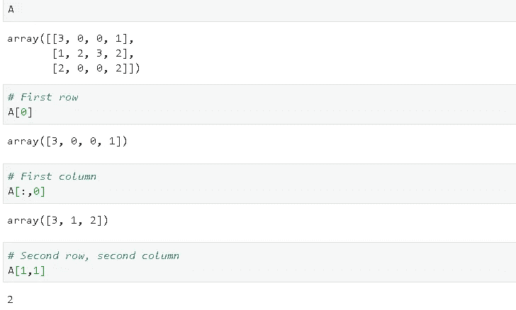

**两个矩阵的矩阵乘法**基于一个矩阵的行与另一个矩阵的列的点积。乘积矩阵的每个元素是第一个矩阵中的一行和第二个矩阵中的一列的点积。考虑下面的矩阵 A1 和 A2。A1 的第一行是[2，2]，A2 的第一列是[1，4]。这两个向量的点积是(2x1)+(2x4)=10，这是乘积矩阵在位置[0，0]的元素。A1 的第三行和 A2 的第三列的点积给出了位置[2，2]处的元素，即 12。

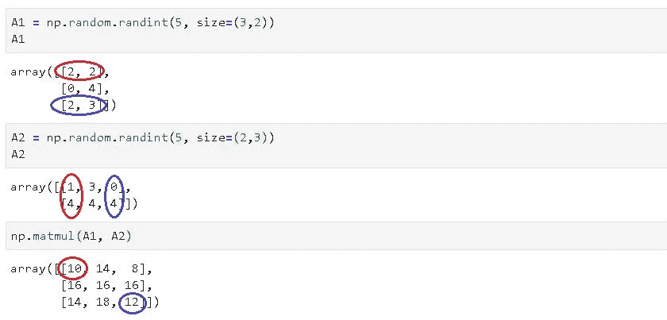

因为第一个矩阵的行乘以第二个矩阵的列，所以第一个矩阵的行数必须等于第二个矩阵的列数。如果我们将 mxn 矩阵(m 行，n 列)乘以 nxk 矩阵，则乘积矩阵的形状为 mxk:

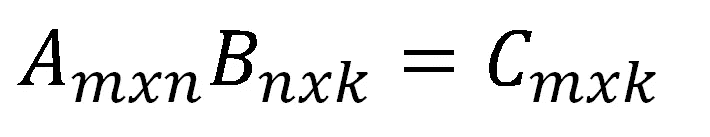

因此，矩阵乘法是**不可交换的**，这意味着我们不能在乘法中交换矩阵的顺序。因此，AB 不等于 BA。

当我们把一个矩阵和它的**逆**相乘，我们得到**单位矩阵**。因此，

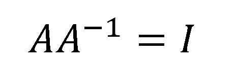

请注意，不是所有的矩阵都有逆矩阵。对于具有逆矩阵的矩阵，它必须是方阵(即行数等于列数)。然而，并不是所有的方阵都有逆矩阵。

如果一个方阵有一个逆，称为**可逆**或**非奇异**。如果一个方阵没有逆矩阵，它就是一个**奇异**矩阵。非方阵没有逆矩阵。

单位矩阵的一个重要特征是它在相乘时不会改变矩阵。所以，AI = A .我们用 numpy 确认一下:

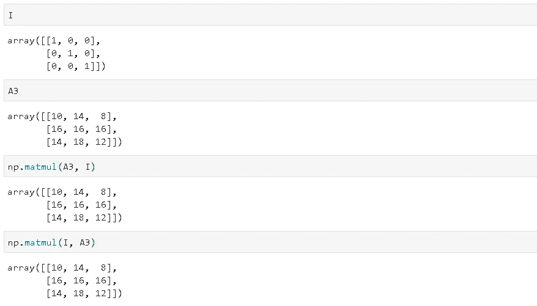

正如我们所看到的，对于单位矩阵来说，顺序无关紧要。当从右或左相乘时，它不会改变矩阵。因此，矩阵的左逆等于右逆:

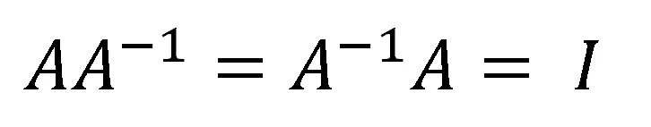

矩阵的逆的逆本身是:

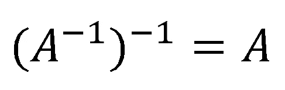

求矩阵的逆矩阵有不同的方法。一种方法叫做排除法。这很简单，但我会把它留到另一篇文章中，以免这篇文章太长。

对矩阵的一个基本操作是**转置**，这意味着交换行和列。可以使用一个字母(T)和 numpy 来完成:

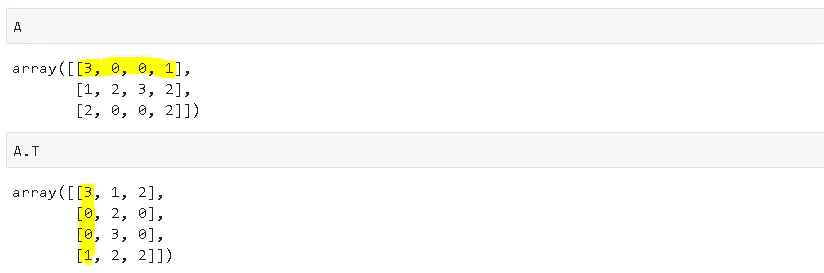

我们已经讨论了线性代数中的一些基本概念。当然，还有更复杂的概念和操作。然而，从基础到高级一步一步地积累知识总是一个好的做法。

感谢您的阅读。如果您有任何反馈，请告诉我。