# 线性回归简介

> 原文：<https://towardsdatascience.com/introduction-to-linear-regression-141cde7a46b2?source=collection_archive---------21----------------------->

## 创建线性回归模型之前要采取的步骤。

在我们开始研究线性回归之前，我想强调在开始处理数据之前理解问题的重要性。我们经常看到统计学家开始谈论斜率、分布和其他实际分析，而没有将问题公式化。正如阿尔伯特·爱因斯坦曾经说过的那样，“问题的表述往往比解决问题更重要，而解决问题可能仅仅是数学或实验技巧的问题”。因此，像所有其他数据分析执行一样，我们需要通过与问题专家合作来制定问题，以便了解特定领域的背景、分析的目标、输出的一致性，并进一步将问题整合到统计术语中。

理解数据收集与制定问题同样重要，因为某些收集过程会对数据产生影响，如果不了解收集过程的某些方面，我们可能会在分析结束时得出错误的结论。理解数据收集的最佳实践有:

*   查看数据是否是从设计好的调查中收集的。
*   探索无响应。我们没有得到回复的某些数据可能对问题和我们的分析非常重要。
*   查找是否有任何缺失值或可能的数据错误，并执行健全性检查。
*   如有必要，查看测量单位是如何设置和执行标准化的。
*   看看定性变量如分类变量是如何编码的。

一旦我们明确了我们的问题并理解了数据是如何收集的，我们就可以执行清理和初始数据分析。我们可以简化为:

*   看数值变量的**汇总。**
*   参见变量的**分布**
*   寻找可能的**相关性**
*   探索任何可能的**异常值**
*   用数据健全性寻找**数据错误**。
*   确保**数据类型**正确。

# 线性回归的使用

回归简单地给出了数据集中两个或多个变量的线性关系。我们有一个因变量(或预测变量)，与自变量(响应变量)有关系。

我们来复习一些例子，看看能否找到变量之间的关系。在回顾这些数据集时，我们还将讨论为了正确使用线性回归，我们需要做出的某些假设或需要满足的某些条件。

我们的第一组数据是关于英国青少年赌博的。

由于我们没有赌博领域的任何物理背景，我们可以创建一个示例问题陈述来指导我们的分析。这可以简单地理解为“为什么英国青少年赌博？”或者“收入或地位对英国青少年的赌博习惯有影响吗？”或者“教育能帮助减少英国青少年的赌博吗？

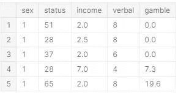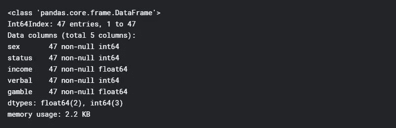

我们的数据集中没有缺失值。查看汇总统计数据可以给我们一些提示，看是否有任何数据错误。例如，有些人不在赌博上花钱。我认为这是可信的。最低收入为每周 0.6 英镑。这有意义吗？由于我们没有看到任何明显的错误，如“0”收入或“2”性价值，让我们假设做调查的人准确地收集了这些数据。

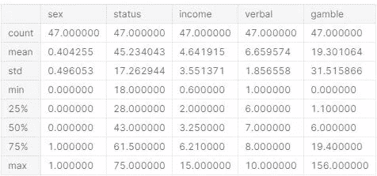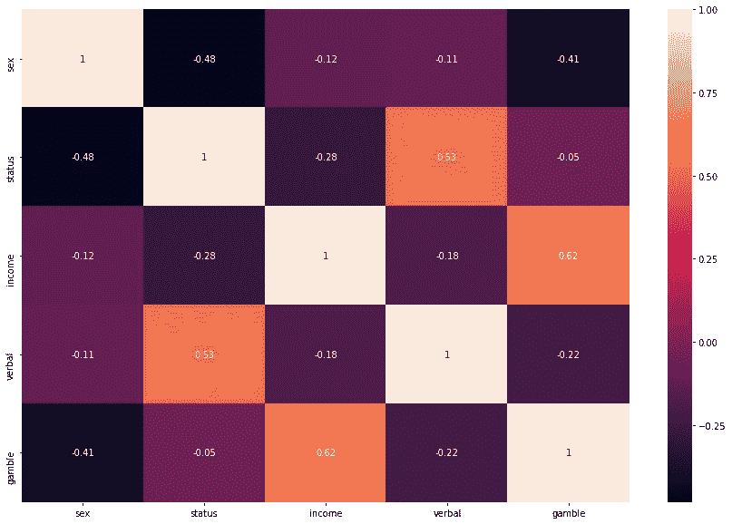

基于我们之前定义的问题陈述(“收入或地位对英国青少年的赌博习惯有影响吗？例如)，自变量或响应变量“y”为“gamble”。我们可以看到赌博和收入之间有一些线性关系。我们确实看到了语言和地位之间的一些其他相关性，例如，然而，由于我们试图找到一个特定问题的解决方案，我们可以将重点放在赌博反应变量和收入相关变量(预测因素)上。

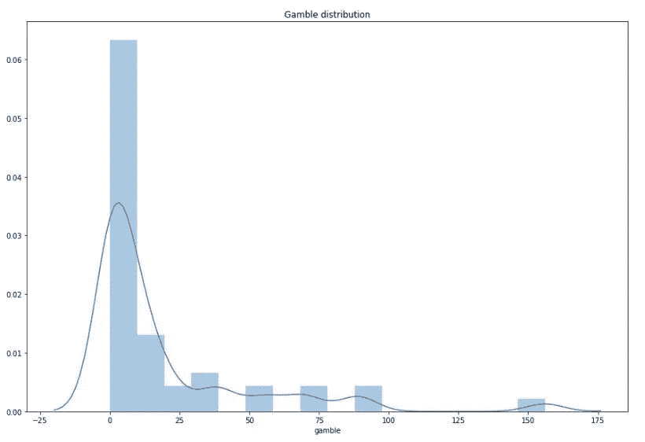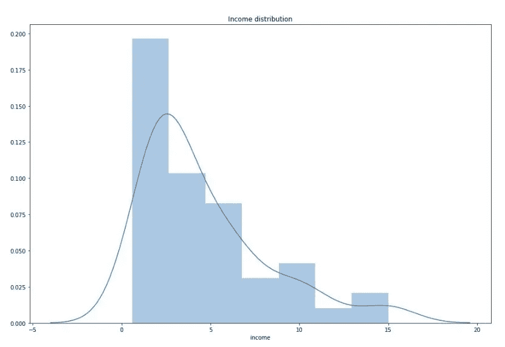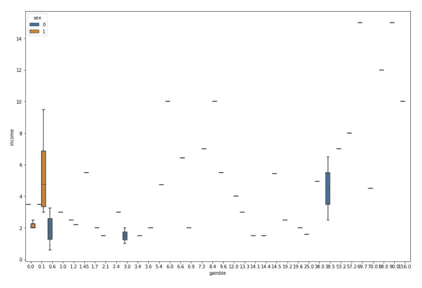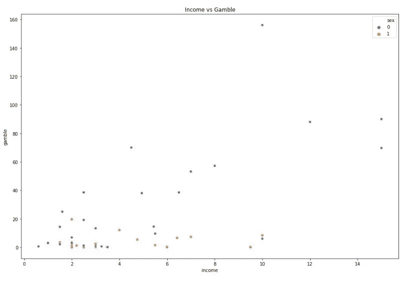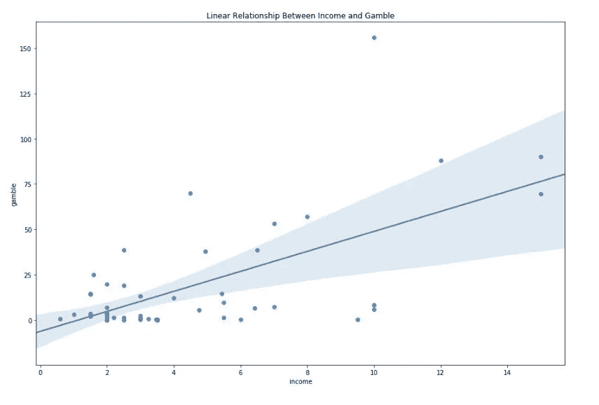

在我们开始创建回归模型、预测值、误差、截距或斜率之前，我们应该看看作为预测变量的收入和作为响应变量的赌博之间的当前关系是否满足线性回归所需的某些假设和条件。

为了让我们创建线性回归模型，我们需要确保关系是线性的，误差意义是独立的，残差不相互影响，并且它们不遵循特定的模式，收入和赌博之间存在同方差，以便数据看起来不像漏斗和误差分布的正态性，其中观察值主要围绕预测值并且均匀分布。

我发现解释这些假设最简单的方法是通过可视化。以下四张图解释了数据集需要满足线性回归的每个假设。

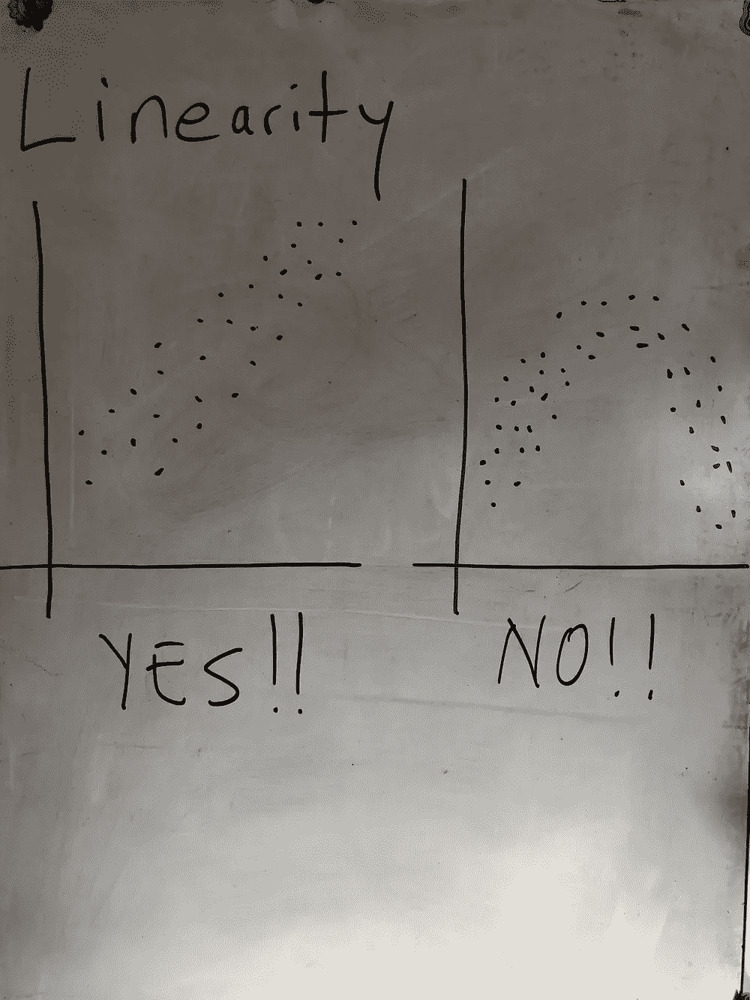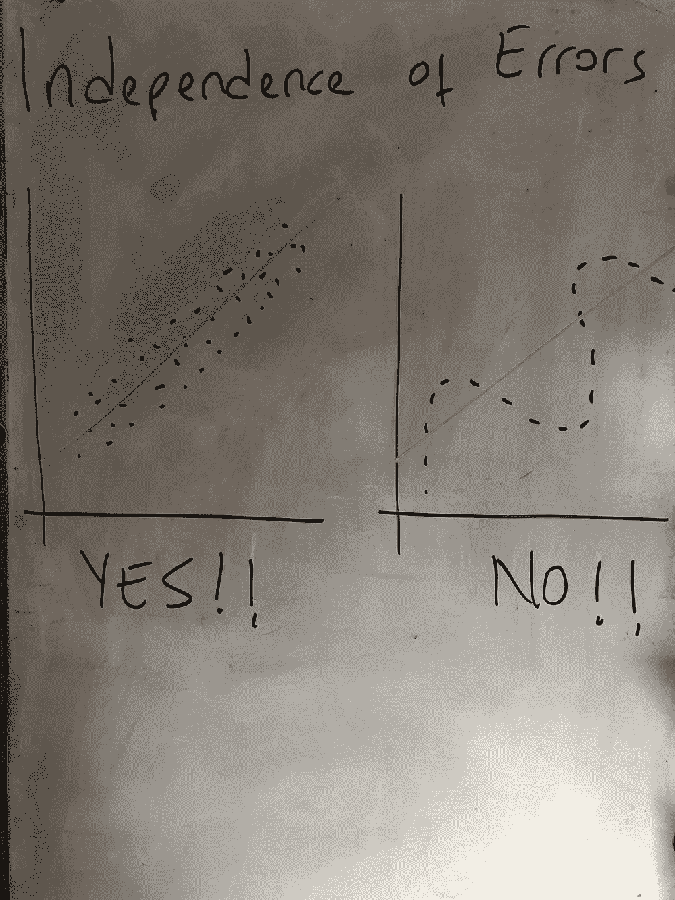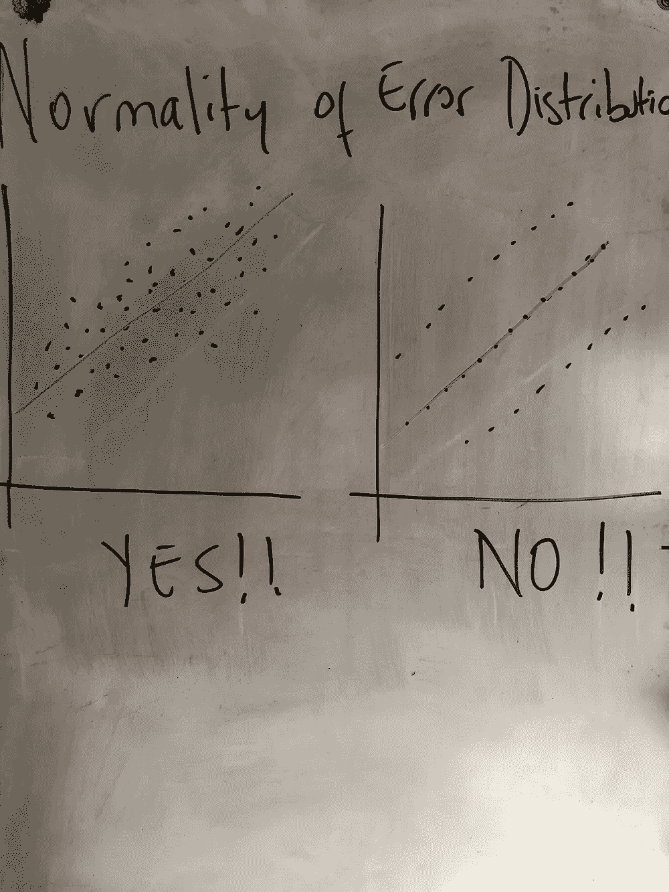

当我们查看我们的回归线和每个观察值的位置时，我们可以看到存在某种程度的线性，误差彼此不相关，残差没有创建任何看起来像漏斗的模式，并且它们呈正态分布。这意味着，随着我们的独立变量收入增加，赌博支出(我们的依赖反应变量)也会增加。收入和赌博之间有一个明确的正线性关系。

我们不会在本文中进一步扩展我们的分析和创建回归模型，因为这意味着是对线性回归的介绍，但是我们可以以类似的方式探索其他数据集。

让我们来看看另一项研究，我们观察了 97 名患有前列腺癌的男性，他们将接受根治性前列腺切除术。

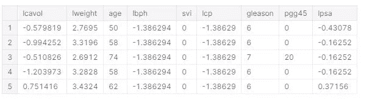

正如我们所看到的，我们肯定需要理解变量描述，并且必须咨询前列腺相关领域的专业知识，以便完全阐明问题。下面是每个变量的描述；

*   lcavol:癌症卷
*   体重:癌症体重
*   年龄:年龄
*   lbph:良性前列腺增生量
*   svi:精囊侵犯
*   lcp:包膜穿透
*   格里森:格里森得分
*   pgg45:格里森得分 4 或 5 的百分比
*   lpsa:前列腺特异性抗原

让我们假设问题陈述是“男性有哪些特定的属性会导致前列腺癌？”。这些数据来自一项研究，该研究检测了即将接受根治性前列腺切除术的男性的前列腺特异性抗原水平和许多临床指标之间的相关性。这意味着我们的 y 反应变量(因变量)是 lpsa:前列腺特异性抗原。

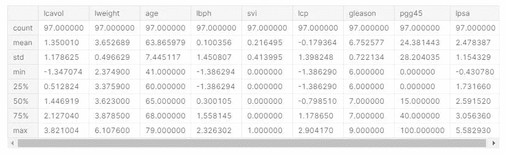

我们有 97 个观察值，9 个属性。当我们查看最小值和最大值时，我们唯一有疑问的变量是 svi:精囊侵犯和 pgg45:百分比 Gleason 评分 4 或 5。不幸的是，在没有任何医学专业知识的情况下，我们无法确认这些值是否有意义，或者可能是数据错误。因此，我们假设创建这个数据集的统计学家收集了准确的数据。

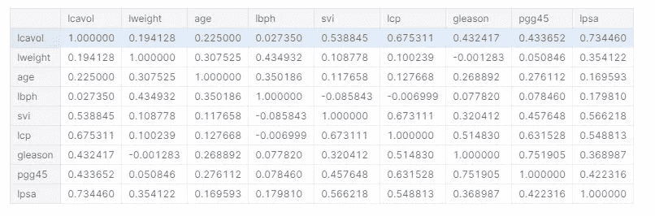

当我们查看变量之间的相关性时，请记住我们关注的是 lpsa 的定义响应变量，我们看到癌症体积具有最强的相关性。

当我们观察每个观察值在线性线周围的分布时，我们看到了线性、误差的独立性、同方差性和正态性。我们可以坚定地说，lcavol 自变量和 lpsa 因变量之间存在正的线性相关关系。

# 结论

不管统计分析，我们需要首先制定一个问题陈述，并了解数据的收集。我们可以通过与领域专家、调查员或商业利益相关者的合作来做到这一点。通过遵循数据汇总统计的简单步骤，如数值变量、分布、相关性、异常值、数据错误和数据类型的汇总，我们可以指出数据错误并定义包括线性回归在内的分析方法。为了能够准确地使用线性回归，我们需要确保满足线性回归条件。因为我们不是从研究人员的角度，而是从数据分析师或数据科学家的角度来看数据，所以我们不一定要对每个条件进行每个测试，而是通过查看某些分布图来假设这些条件。