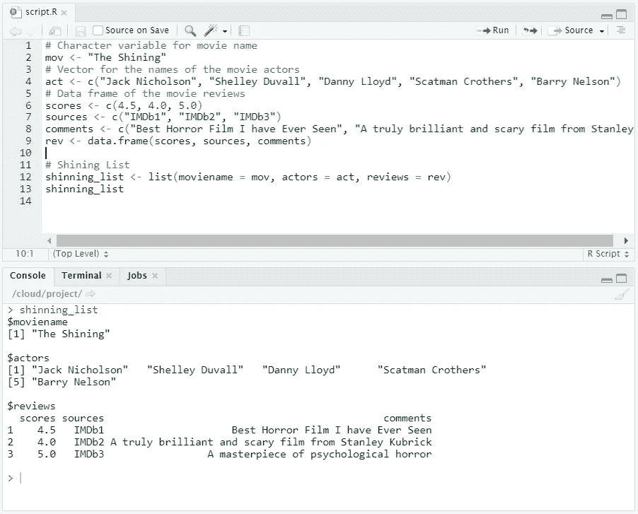

# R 中的列表介绍

> 原文：<https://towardsdatascience.com/introduction-to-lists-in-r-ff6469e6ca79?source=collection_archive---------27----------------------->

列表可以包含不同类型的组件。了解如何创建、命名和子集化这些列表。


# 什么是列表，为什么需要列表？

有几种数据结构可以用来保存数据:

*   **向量**(一维数组)—向量可以保存数值、字符或逻辑值，但它们的元素必须都是相同的数据类型。
*   **矩阵**(二维数组)——就像向量元素一样，矩阵可以保存数字、字符或逻辑值；但是，它们的元素必须都是相同的数据类型。
*   **数据框**(二维对象)——数据框可以保存数字、字符或逻辑值。在一个列中，所有元素必须具有相同的数据类型，但是不同的列可以具有不同的数据类型。
*   **列表**(超级数据类型)——列表允许不同的对象，如矩阵、向量、数据框和其他列表，以有序的方式聚集在一个名称(列表的名称)下。这些对象不需要以任何方式相关联。因此，你几乎可以在列表中存储任何东西。

# 创建列表

我们使用函数`[**list()**](http://www.rdocumentation.org/packages/base/functions/list)` 来构造一个列表:

```
my_list <- list(comp1, comp2, ...)
```

`list()`函数的参数是列表组件(`comp1, comp2,...`)。它们可以是矩阵、向量、其他列表等。

假设我们想要创建一个列表(`my_list`)，它包含以下列表组件:`my_vector`、`my_matrix`和`my_df`。

```
# Vector with numerics from 1 up to 10
my_vector <- 1:10# Matrix with numerics from 1 up to 9
my_matrix <- matrix(1:9, ncol = 3)# First 10 elements of the built-in data frame mtcars
my_df <- mtcars[1:10,]
```

为了构建这个列表，我们再次使用了`list()`函数:

```
# Construct list with these different elements:
my_list <- list(my_vector, my_matrix, my_df)
```


# 创建命名列表

给列表中的组件命名可以确保我们不会忘记它们代表什么。我们可以在构建列表的过程中或者之后命名我们的组件。举个例子，

```
# Name components directly during list construction.
my_list <- list(name1 = your_comp1, 
                name2 = your_comp2)
```

创建一个包含名为`name1`、`name2`等组件的列表。为了在我们创建列表后给它们命名，我们使用了`names()`函数，就像我们使用 vectors 一样。这将完成我们上面做的同样的事情:

```
# Use names() function to name list after construction
my_list <- list(your_comp1, your_comp2)
names(my_list) <- c("name1", "name2")
```

## **给你试试**

给`my_list`的组件添加名称。对于`my_vector`、`my_matrix`和`my_df`，可以分别使用`vec`、`mat`和`df`的名称。

```
# Vector with numerics from 1 up to 10
my_vector <- 1:10# Matrix with numerics from 1 up to 9
my_matrix <- matrix(1:9, ncol = 3)# First 10 elements of the built-in data frame mtcars
my_df <- mtcars[1:10,]# Construct list with these different elements:
my_list <- list(my_vector, my_matrix, my_df)
```

## 解决办法

```
# Vector with numerics from 1 up to 10
my_vector <- 1:10# Matrix with numerics from 1 up to 9
my_matrix <- matrix(1:9, ncol = 3)# First 10 elements of the built-in data frame mtcars
my_df <- mtcars[1:10,]# Adapt list() call to give the components names
my_list <- list(my_vector, my_matrix, my_df)
names(my_list) <- c("vec", "mat", "df")# Print out my_list
my_list
```


## 给你尝试(2)

为电影“闪灵”创建一个列表，它包含三个组件:

*   **moviename** —带有电影标题的字符串(存储在`mov`中)
*   **演员** —主要演员名字的向量(存储在`act`中)
*   **评论** —包含一些评论的数据帧(存储在`rev`中)

```
# Character variable for movie name
mov <- "The Shining"# Vector for the names of the movie actors
act <- c("Jack Nicholson", "Shelley Duvall", "Danny Lloyd", "Scatman Crothers", "Barry Nelson")# Data frame of the movie reviews
scores <- c(4.5, 4.0, 5.0)
sources <- c("IMDb1", "IMDb2", "IMDb3")
comments <- c("Best Horror Film I have Ever Seen", "A truly brilliant and scary film from Stanley Kubrick", "A masterpiece of psychological horror")
rev <- data.frame(scores, sources, comments)
```

不要忘记相应地命名列表组件(电影名称、演员和评论)。

不要忘记相应地命名列表组件(名称是电影名称、演员和评论)。

## 解决办法

```
# Character variable for movie name
mov <- "The Shining"# Vector for the names of the movie actors
act <- c("Jack Nicholson", "Shelley Duvall", "Danny Lloyd", "Scatman Crothers", "Barry Nelson")# Data frame of the movie reviews
scores <- c(4.5, 4.0, 5.0)
sources <- c("IMDb1", "IMDb2", "IMDb3")
comments <- c("Best Horror Film I have Ever Seen", "A truly brilliant and scary film from Stanley Kubrick", "A masterpiece of psychological horror")
rev <- data.frame(scores, sources, comments)# Shining List
shinning_list <- list(moviename = mov, actors = act, reviews = rev)
shinning_list
```



# 从列表中选择元素

列表通常由许多元素和组件组成；因此，从其中获取单个元素、多个元素或一个组件并不总是简单的。

选择组件的一种方法是使用组件的编号位置。例如，要选择第一个组件(位置`1`，我们将使用:

```
my_list[[1]]
```

注意，这与向量和矩阵不同，向量和矩阵使用单方括号`[]`而不是双方括号`[[]]`。

我们也可以使用组件的名称来代替位置。我们可以使用`[[]]`或与`$`一起使用。例如，以下两种情况都将从`shining_list`中选择`reviews`组件。

```
shining_list[["reviews"]]
shining_list$reviews
```

有时，您希望深入构件并从选定的构件中选择特定的元素。例如，假设我们想要从`shining_list`的 actors 数组中选择第一个元素。数组`actors`是第二个组件，因此可以使用`shining_list[[2]]`来访问它。由于这个组件也被命名，我们可以使用`shining_list$actors`来获得相同的结果。

因为我们想要从那个组件中选择第一个元素`[1]`，我们将使用`shining_list[[2]][1]`或`shining_list$actors[1]`。

## 让你试试

给定下面的`shining_list`，选择`actors`向量并打印出来。然后从这个向量中选择第二个元素并打印出来。

```
# Character variable for movie name
mov <- "The Shining"# Vector for the names of the movie actors
act <- c("Jack Nicholson", "Shelley Duvall", "Danny Lloyd", "Scatman Crothers", "Barry Nelson")# Data frame of the movie reviews
scores <- c(4.5, 4.0, 5.0)
sources <- c("IMDb1", "IMDb2", "IMDb3")
comments <- c("Best Horror Film I have Ever Seen", "A truly brilliant and scary film from Stanley Kubrick", "A masterpiece of psychological horror")
rev <- data.frame(scores, sources, comments)# Shining List
shinning_list <- list(moviename = mov, actors = act, reviews = rev)
```

## 解决办法

```
# Print out the vector representing the actors
shining_list$actors# Print the second element of the vector representing the actors
shining_list$actors[2]
```


# 挑战:创建另一个列表

这里有一个挑战来检验你所学到的东西！

假设你已经找到了另一部更近的杰克·尼科尔森电影《无间道》的评论。

这部电影的演员是:

*   莱昂纳多·迪卡普里奥
*   马特·达蒙
*   杰克·尼科尔森
*   马克·沃尔伯格
*   维拉·法梅加
*   马丁·辛

以下是评论:

*   会再看一遍——4.61
*   太神奇了！— 5
*   我喜欢——4.81 分
*   最佳电影之一— 5
*   迷人的情节— 4.2

将关于电影的所有信息(如片名、演员和评论)收集到一个变量中会很有用。由于这些数据是不同的类型，我们必须将它们组合在一个列表变量中。

现在，利用上面给出的信息，你要做的是:

*   创建一个名为`movie_title`的变量，包含电影的标题。
*   创建一个名为`movie_actors`的向量，包含上面列出的演员的名字。
*   创建两个向量，称为`scores`和`comments`，包含来自上面显示的评论的信息。
*   求复习分数的平均值(`scores`向量)，保存为`avg_review`。
*   创建一个名为`reviews_df`的 reviews 数据框架，它结合了`scores`和`comments`。
*   创建一个名为`departed_list`的列表，包含`movie_title`、`movie_actors`，评审数据框为`reviews_df`，平均评审分数为`avg_review`，并将其打印出来。

## 解决办法

```
# Use the given movie information above to define the movie title and movie actors
movie_title <- "The Departed"
movie_actors <- c("Leonardo DiCaprio", "Matt Damon", "Jack Nicholson", "Mark Wahlberg", "Vera Farmiga", "Martin Sheen")# Use the reviews information above to defined defined the comments and scores vectors
scores <- c(4.6, 5, 4.8, 5, 4.2)
comments <- c("I would watch it again", "Amazing!", "I liked it", "One of the best movies", "Fascinating plot")# Save the average of the scores vector as avg_review
avg_review <- mean(scores)# Combine scores and comments into the reviews_df data frame
reviews_df <- data.frame(scores, comments)# Create and print out a list, called departed_list, which contains movie_title, movie_actors, reviews_df, and avg_review
departed_list <- list (movie_title, movie_actors, reviews_df, avg_review)
departed_list
```


# 笔记

所有图片，除非特别注明，均归作者所有。横幅图像是使用 [Canva](https://www.canva.com/) 创建的。