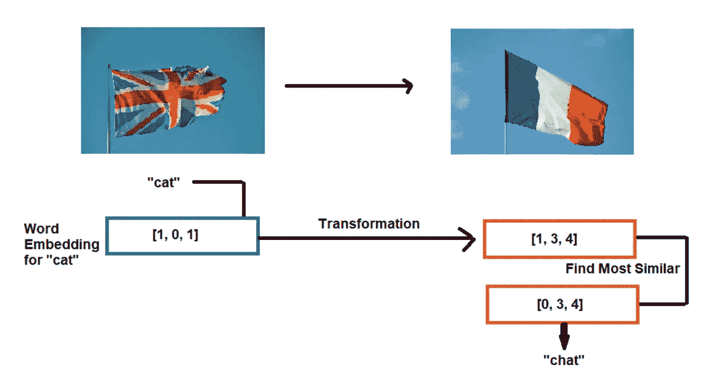
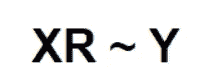
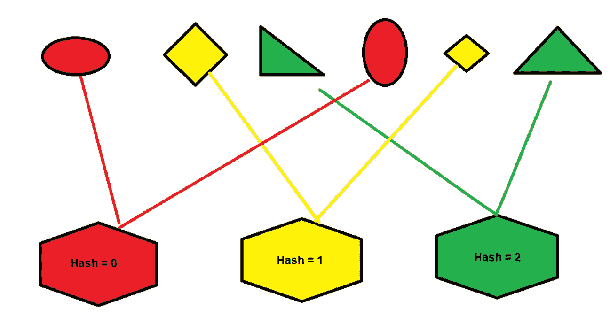
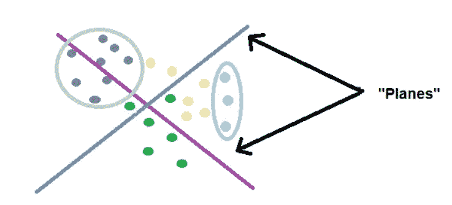
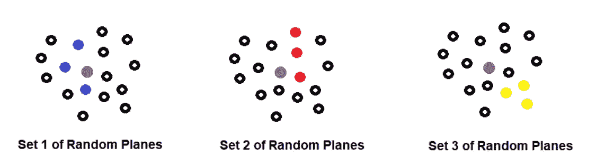
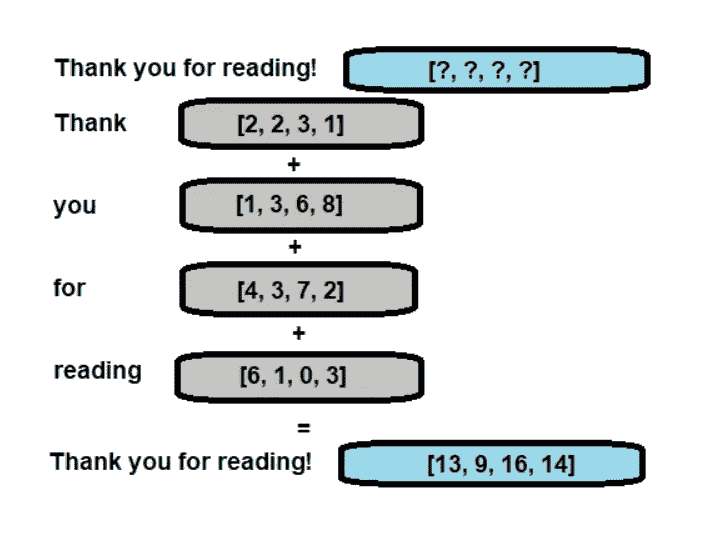

# 机器翻译导论

> 原文：<https://towardsdatascience.com/introduction-to-machine-translation-5613f834e0be?source=collection_archive---------43----------------------->

## [自然语言处理笔记](https://towardsdatascience.com/tagged/nlpnotes)

## 自然语言处理专业课程 1 第 3 周笔记

由[布鲁诺·沃尔夫](https://unsplash.com/@d0cz?utm_source=medium&utm_medium=referral)在 [Unsplash](https://unsplash.com?utm_source=medium&utm_medium=referral) 上拍摄的照片

之前，我们已经介绍过[情感分析](/getting-started-with-sentiment-analysis-731531ec880d?source=collection_tagged---------1----------------------------)和[向量空间模型](/vector-space-models-48b42a15d86d?source=collection_tagged---------0----------------------------)。本周我们将学习如何进行机器翻译，但是通过练习如何找到相似的单词向量，我们也将知道如何执行文档搜索，这样我们将一举两得。

要访问我在 Coursera 上关于自然语言处理专业化的所有笔记，请访问关于走向数据科学的自然语言处理系列部分。

## 转换单词向量

在[向量空间模型](/vector-space-models-48b42a15d86d?source=collection_tagged---------0----------------------------)的帖子中，我们讨论了单词向量以及它们如何捕捉单词的重要属性。由于这一点，我们可以使用这些词向量来对齐两种不同语言的词，以获得一个基本的翻译程序。

机器翻译是从一个单词(句子或文档)开始，将其翻译成另一种语言的任务—参见*图 1* 。

**图 1** :机器翻译的任务是从一种语言翻译成另一种语言。图像中显示的示例显示英语→法语。(图片由作者提供)

如果我们要让一个人来执行这项任务，我们首先要找到一个会说两种语言的人，并让他们创建一个英语和法语单词的大列表(使用图 1 中的例子)，这可能是一项非常耗时的任务。

另一方面，如果我们希望机器执行这项任务，我们首先计算与每种语言相关的单词嵌入，然后检索该语言的一个单词的特定单词嵌入，例如，我们可以检索英语单词 cat，然后想出一种方法将英语单词嵌入转换为在法语单词向量空间中有意义的单词嵌入。有了翻译语言中的这个单词向量(在我们的场景中是法语向量空间),我们将找到与该单词最相似的向量，这些向量将成为我们翻译的候选单词。在我们的示例场景中，我们希望提出单词“chat ”,因为这是 cat 的法语单词— *图 2* 提供了对该任务的可视化解释。

**图 2** :机器翻译任务的视觉呈现(图片由作者提供)

但是我们如何实现你所说的转变呢？太好了。如果你记得在线性代数中，取矩阵 A(1x2 矩阵)和矩阵 B(2 x2 矩阵)的点积，得到的矩阵 C 将是 1 x2 矩阵。也就是说，我们需要找到一个矩阵， **R，**，我们可以用它来转换我们的英语单词嵌入， **X** ，找到想要的法语单词嵌入， **Y** 。—参见“ [*如何乘矩阵*](https://www.mathsisfun.com/algebra/matrix-multiplying.html) ”来刷新你的记忆。

**图 3** :问题陈述的定义(图片由作者提供)

> **注**:为此，我们初始化一个随机矩阵， **R** ，并执行[梯度下降](/gradient-descent-811efcc9f1d5)来求解 **R** ，目标是最小化 XR 和 Y 之间的距离。此外，我们不需要所有英语单词 X 到法语单词 Y 的映射，因为一个子集就足够了。如果模型在子集上做得很好，它也可以用来推断不属于原始训练集 x 的单词。

当然，一旦执行了这个步骤，我们需要找到单词向量的最近邻居，因为转换的英语单词不一定与法语单词向量空间中的任何单词向量相同，但重要的是它在法语单词向量空间中。

在这种情况下，我们应该搜索法语单词，以找到与我们通过转换创建的单词相似的单词。一种方法是使用 K-最近邻算法，我们已经在“ [*从头开始算法:K-最近邻*](/algorithms-from-scratch-k-nearest-neighbors-fe19b431a57) ”系列中广泛讨论了该算法。

 [## 从头开始的算法:K-最近邻

### 从头开始详述和构建 K-NN 算法

towardsdatascience.com](/algorithms-from-scratch-k-nearest-neighbors-fe19b431a57) 

您可能还记得 K-Nearest Neighbors 算法中的“*对于我们来说，要确定 K 个最接近新实例的记录，我们必须对所有实例进行测量*”，这对于找到最接近我们要翻译的单词的实例是不必要的，因为将会有一些向量与我们拥有的单词向量完全不同。因此，我们必须找到一种方法来将向量空间划分为区域，因此我们在区域内进行搜索。

如果我们要将数据组织到区域中，以便我们可以有效地在这些区域中搜索相似的向量，我们必须引入哈希表。哈希表对于任何涉及数据的工作都是有用的工具。

## 哈希表

我们可以通过一些相似性函数将数据分组到桶中——参见图 4*。*

**图 4** :将数据分组到桶中(图片由作者提供)

除了映射到每个桶的形状是单词向量而不是形状之外，将我们的文本数据分组到桶中以便我们在各个区域中执行 K-最近邻居搜索的任务类似于上面的示例。

因此，将我们的单词向量映射到散列值需要我们找到一个称为“*散列函数*的映射，它将我们的向量映射到散列值，即散列函数(向量)→散列值。

然而，需要注意的是，我们的目标是将相似的词向量放入相同的桶中。为此，我们需要做一些叫做“*位置敏感散列*”的事情。位置敏感哈希是一种哈希方法，它非常关心基于项目在向量空间中的位置来分配项目。

## 位置敏感散列法

当在高维空间中实现 K-最近邻时，位置敏感散列是一种非常重要的技术，这主要是因为它降低了寻找 K-最近邻的计算成本。根据[维基百科](https://en.wikipedia.org/wiki/Locality-sensitive_hashing)的说法，它可能被定义为一种算法技术，以高概率将相似的输入项散列到相同的“桶”中。

如果我们想知道一些向量是否靠得很近，我们首先用平面划分向量空间，这有助于我们根据向量的位置将它们分成子集。

**图 5:** 2d 向量空间示例(图片由作者提供)

紫色平面将空间分割成位于其上方或下方的向量。我们突出显示的浅蓝色向量似乎都在紫色平面上方，而灰色向量在(我不知道确切的颜色)深蓝色平面上方。因此，这些平面可以帮助我们根据它们的位置将向量分成散列，方法是在平面的法向量和代表我们数据的向量之间进行点积，这将为我们提供相对于平面的相对位置。

然而，如果我们应该把我们的数据分成可管理的区域，我们可能要使用不止一个平面。对于每个平面，我们可以确定一个向量是在该平面的+侧还是-侧。因此，我们最终会得到多个信号，每个平面一个信号，利用这些信息，我们必须找到一种方法，将所有这些信号组合成一个哈希值，该哈希值将定义向量空间内的一个特定区域。

> **注** : [什卡·古普塔](https://medium.com/u/83100b0fd306?source=post_page-----5613f834e0be--------------------------------)写了一篇关于[地区敏感哈希](/understanding-locality-sensitive-hashing-49f6d1f6134)的精彩文章，我推荐你去看看更全面的解释。

## 近似最近邻居

我们无法确切知道哪组平面是划分我们的随机平面的最佳方式，因此为了在我们的不确定性中变得更舒适，一种解决方案可能是创建多组随机平面，以便我们可以将向量空间划分成多个独立的哈希表组。

我们现在可以利用不同组的随机平面来帮助我们找到一组好的友好邻域向量或 k-最近邻。

**图 6** :随机平面集合；紫色向量表示英语单词向量到法语单词向量的转换。突出显示的颜色表示根据随机平面已经被分配到相同散列桶的向量。(图片由作者提供)

通过将多组随机平面用于位置敏感散列，我们有了一种更健壮的方式来搜索向量空间，以寻找作为最近邻居的潜在候选的一组向量。我们称之为“*近似最近邻*”，因为我们没有搜索整个向量空间——为了效率，我们牺牲了精度。

## 搜索文档

有了更快版本的 K-Nearest Neighbors，我们还可以执行各种其他任务，例如文档搜索，它包括在大量文档中搜索与查询相关的文本。

为了将一个文档表示为一个向量，我们可以从获取单词向量的总和开始——参见*图 7*

**图 7** :将文档表示为向量。(图片由作者提供)

要执行这项任务，我们只需为文档和查询创建向量，并应用 KNNeighbors 来查找与我们的查询最相似的文档。

## 包裹

谢谢你读到这篇文章的结尾。这就结束了自然语言处理专业的课程 1。到目前为止写的所有笔记，请访问[自然语言处理笔记](https://towardsdatascience.com/tagged/nlpnotes) —寻找我在课程 2 上的笔记。

如果你有兴趣开始自己的博客，或者你想在 2021 年认真对待博客，请订阅我的 Youtube 频道，每周更新关于如何开始你的旅程。如果你已经开了一个博客，里面可能还有对你有用的东西，所以我会订阅，这样你就不会错过了！—首个视频将于本周日发布！

 [## 库尔蒂斯·派克斯

### 欣赏您喜爱的视频和音乐，上传原创内容，并在上与朋友、家人和全世界分享这些内容…

www.youtube.com](https://www.youtube.com/channel/UCu6zdBQhvEY5_j-ifHWljYw?view_as=subscriber) 

一如既往，让我们在 LinkedIn 上继续对话…

 [## Kurtis Pykes -数据科学家-自由职业者，自由职业者| LinkedIn

### 在世界上最大的职业社区 LinkedIn 上查看 Kurtis Pykes 的个人资料。Kurtis 有 3 个工作列在他们的…

www.linkedin.com](https://www.linkedin.com/in/kurtispykes/)