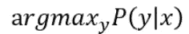
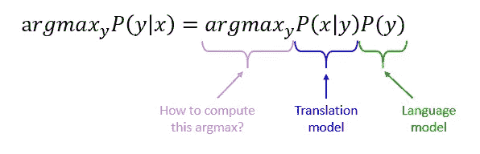
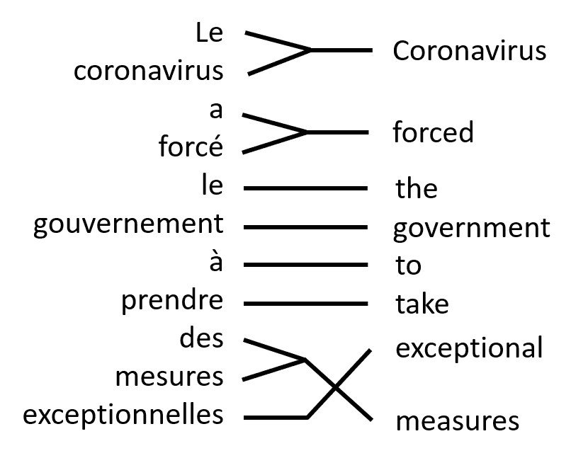
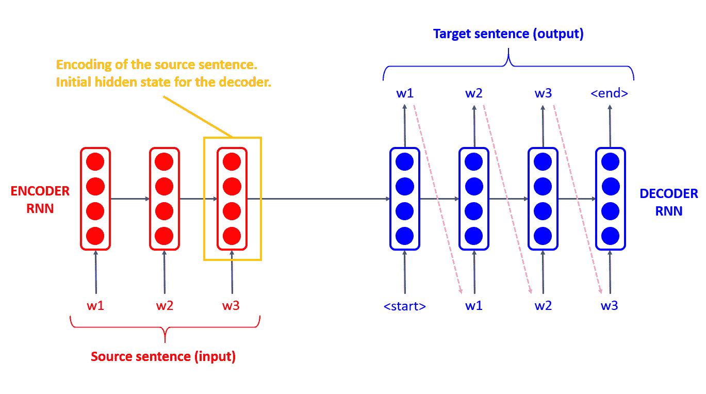
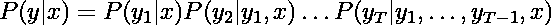
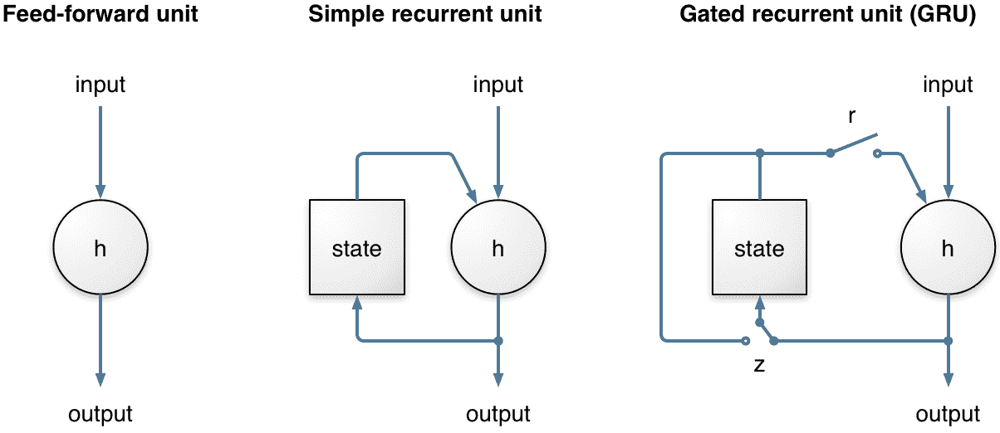
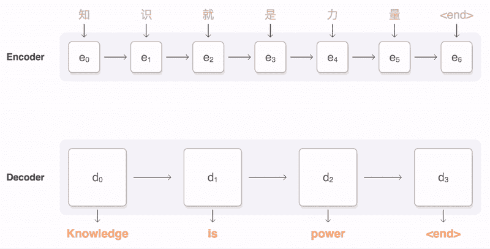

# 机器翻译导论

> 原文：<https://towardsdatascience.com/introduction-to-machine-translation-9cb0e93e7cb?source=collection_archive---------38----------------------->

从传统的机器学习到先进的深度学习方法

来源:https://pixabay.com/

***来源:*** *我是跟随斯坦福大学关于深度学习的自然语言处理的课程后写的这篇文章。本课程在 YouTube* *上有* [*的介绍，本文的大部分内容都来自于此。*](https://www.youtube.com/watch?v=XXtpJxZBa2c&list=PLoROMvodv4rOhcuXMZkNm7j3fVwBBY42z&index=8)

***需求:*** *在深入研究本文之前，我会建议你确保自己了解自然语言处理和深度学习的基础知识。如果你从未听说过解析或者单词嵌入，你可以阅读* [*这篇教程*](https://www.analyticsvidhya.com/blog/2018/02/the-different-methods-deal-text-data-predictive-python/) *。如果你从未听说过神经网络(尤其是递归神经网络)或反向传播，我建议你阅读这篇文章作为介绍。*

# 介绍

我们亲爱的星球被 7000 多种语言所丰富，感谢科技，我们生活在一个越来越全球化的世界。翻译已经成为沟通的支柱，让人们可以建立各种联系。要真正了解翻译的重要性，这里有一个关键数字:[2015 年，谷歌翻译每天处理 1000 亿个单词](https://www.blog.google/products/translate/ten-years-of-google-translate/)。我们用机器翻译解决的范例如下:

给我们一个**源语言**(比如法语)和一个**目标语言**(姑且说英语)。我们的目标是将一个句子从源语言翻译成目标语言。

从数学上来说，我们希望找到给定法语句子 x 的最佳英语句子 y。这可以用概率来表示:

# 传统机器学习翻译系统

**统计机器翻译(SMT)** 于 90 年代推出，试图从数据中学习概率模型。

我们可以使用贝叶斯法则分解我们试图求解的方程(见上文):

使用贝叶斯规则的概率公式

*   P(x|y)被称为**翻译模型**，在**平行语料库**上训练。这个模型知道法语单词或英语单词如何相互翻译。
*   P(y)被称为**语言模型**，在纯英语语料库上训练。语言模型是一个可以预测下一个单词的系统。

*法语和英语句子对齐的图示*

为了训练翻译模型，我们正在寻找法语和英语表达之间的**对齐**。这种排列(见图)远非微不足道。一个法语单词可以与一系列英语单词对齐(一对多对齐)，一系列法语单词也可以与一个英语单词对齐(多对一对齐)。经过许多步骤的构建，排列看起来像这样。

等式的另一部分是通过语言模型获得的。对于每一个单词，你在目标语言中都有潜在的候选词。我们使用语言模型来选择听起来不错的候选词。

总结这些 SMT 模型，它们是好的系统，但极其复杂。它们一直使用到 2014 年，需要大量人力来维护。例如，你需要为你想翻译的所有语言建立一个对比表。

2014 年，机器翻译界出现了深度学习。

# 深度学习拯救世界

**神经机器翻译(NMT)** 是机器翻译领域的一次革命，主要是因为它使用了单一的神经网络架构。这种架构被称为序列到序列，涉及两个 rnn:一个**编码器**和一个**解码器**。

编码器 RNN 将产生源句子的编码，而解码器 RNN 是一个语言模型，根据编码产生目标句子。

*一个基于 RNN 的翻译模型的图示*

与 SMT 相反，这里我们直接计算 P(y|x):

每一项都是给定到目前为止翻译的单词和源句子 x 的下一个目标单词的概率。与 SMT 相比，这是一个很大的优势，因为这个过程很简单。

# 消失/爆炸梯度问题

在训练阶段，我们通过反向传播得到梯度。但在实践中，梯度下降并不是很有效，除非我们小心谨慎。问题是，我们需要学习长时间窗口内的依赖性，梯度可能会爆炸或消失。这个著名的问题发生在任何使用基于梯度的优化技术的网络中。更多详情，请参见本课程。

为了解决这个问题，我们可以使用简单的技巧:

*   **渐变裁剪:**基本上，我们通过重新缩放来防止渐变爆炸。
*   **输入反转:**训练远距离依存关系非常困难，比如输入句子的第一个单词和输出句子的第一个单词之间。我们可以通过颠倒输入句子中单词的顺序来解决这个问题。这个原理用于双向 rnn。
*   **身份初始化:**如果你的网络计算身份函数，梯度计算将非常稳定，因为雅可比矩阵就是身份矩阵。这表明，我们可以通过鼓励计算接近恒等函数来保持稳定。有了这个窍门，激活功能都恢复了。

或者，我们也可以改变编码器/解码器 rnn 的架构:

*   **长-短时记忆(LSTM):**
    它使用 4 个门，旨在使长时间记忆信息变得容易，直到需要为止。阅读[这篇文章](http://colah.github.io/posts/2015-08-Understanding-LSTMs/)了解更多关于 LSTM 的信息。
*   **门控递归单元(GRU):**
    GRU 是 LSTM 的一个更简单的变体，用于解决消失梯度问题。它使用两个门。[详见本文](/understanding-gru-networks-2ef37df6c9be)。与 LSTM 相比，GRU 的参数更少，因此计算效率更高，需要的数据更少。

GRU 插图— [图像来源](https://www.analyticsvidhya.com/blog/2017/12/introduction-to-recurrent-neural-networks/gru/)

# BLEU:评估翻译的分数

一般来说，在机器学习中，评估算法的性能非常简单。然而，当涉及到翻译时，问题要复杂得多。BLEU(双语评估替读)是一种用于评估机器翻译文本质量的算法。它将机器翻译与一个或几个人工翻译进行比较，并计算 0 到 1 之间的相似性得分。完全匹配的得分为 1，而完全不匹配的得分为 0。BLEU 评分是当今最常用的基准指标。尽管这一指标并不完美，但它具有易于解释和计算的优点。

布雷特·乔丹在 [Unsplash](https://unsplash.com?utm_source=medium&utm_medium=referral) 上的照片

但是 BLEU score 面临一个主要问题:它是不可微的，因此基于梯度的优化方法不能直接应用。在训练阶段的优化损失和测试阶段的评估标准之间存在不匹配。

# 神经机器翻译在统计翻译上的五大胜利:

1.  单个神经网络的端到端训练。所有参数都被优化以最小化网络输出的损失函数。
2.  分布式表示允许更好地利用单词和短语的相似性。
3.  更好地利用上下文。
4.  更流畅的文本生成。
5.  需要更少的人工工程。以前，单词和短语在很大程度上是独立翻译的，现在我们将整个输入句子视为一个翻译单元

# 还有两个缺点

1.  **隐藏表示的固定尺寸**。编码器的最后一个向量必须捕捉句子的全部含义。这在大句子的情况下可能是个问题。此外，输入的一个单词可能需要更多的关注，因为它对翻译有影响。我们将看到注意力机制如何解决这个问题。
2.  **没有零炮翻译。**只有系统在训练阶段发现两种语言之间的翻译，才能进行翻译。这个问题被谷歌的多语言神经机器翻译系统解决了。

# 注意机制:

我们让模型学习如何为每个输出时间步长生成一个上下文向量，而不是将输入序列编码成一个固定的上下文向量(即。每个单词)。一个评分功能会对编码器 RNN 产生的每个位置进行评分，并指出应该注意的地方。这允许解码器网络**“聚焦”在编码器输出的特定部分**。

注意力显著提高了 NMT 的表现。另一个优点是，由于注意力的分布，它提供了可解释性。

这种架构用于谷歌神经机器翻译系统的核心，或 GNMT:

注意机制图解—来源:[https://ai . Google blog . com/2016/09/a-neural-network-for-machine . html](https://ai.googleblog.com/2016/09/a-neural-network-for-machine.html)

# **谷歌的多语言神经机器翻译系统**

为了解决零镜头翻译问题，GMNMT 引入了一个简单的数据调整，即在原始的神经机器翻译架构中添加一个人工令牌来指示所需的目标语言。

假设我们用 Japanese⇄English 和 Korean⇄English 的例子训练了一个多语言系统，如动画中的蓝色实线所示。我们能在系统从未见过的语言对之间进行翻译吗？这方面的一个例子是朝鲜语和日语之间的翻译，其中 Korean⇄Japanese 的例子不向系统显示。令人印象深刻的是，答案是肯定的。它可以生成合理的 Korean⇄Japanese 译文，尽管从未有人教过它这么做。我们称之为“零镜头”翻译，如动画中黄色虚线所示。

插图零投学习—来源:[https://ai . Google blog . com/2016/11/Zero-shot-translation-with-Google . html](https://ai.googleblog.com/2016/11/zero-shot-translation-with-googles.html)

# 结论

机器翻译介绍到此结束，希望你喜欢这篇文章！机器翻译是一个很有意思的领域，绝不是解决了。在我们能够翻译的语言的多样性以及翻译的质量方面仍有改进的余地。