# 神经网络背后的数学简介

> 原文：<https://towardsdatascience.com/introduction-to-math-behind-neural-networks-e8b60dbbdeba?source=collection_archive---------0----------------------->

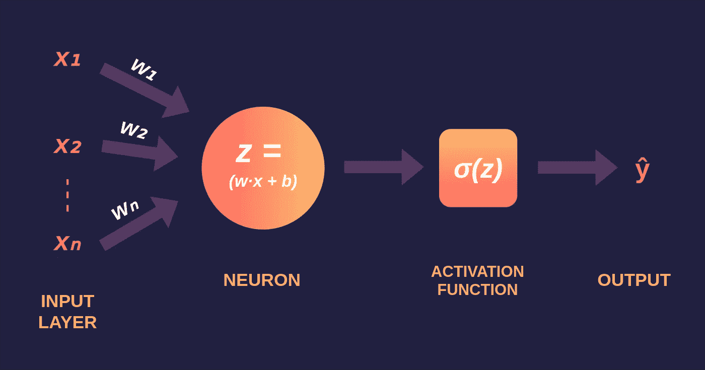

由作者使用*创建*

## *让我们深入研究神经网络和深度学习背后的数学*

*今天，通过开源机器学习软件库，如 [TensorFlow](https://www.tensorflow.org/) 、 [Keras](https://keras.io/) 或 [PyTorch](https://pytorch.org/) ，我们可以只用几行代码创建一个神经网络，即使结构非常复杂。话虽如此，神经网络背后的数学对我们一些人来说仍然是一个谜，拥有神经网络和深度学习背后的数学知识可以帮助我们理解神经网络内部发生的事情。它也有助于架构选择、深度学习模型的微调、超参数调整和优化。*

# *介绍*

*很长一段时间，我忽略了理解神经网络和深度学习背后的数学，因为我没有很好的代数或微积分知识。几天前，我决定从头开始，推导神经网络和深度学习背后的方法论和数学，以了解它们如何以及为什么工作。我也决定写这篇文章，对我这样觉得很难理解这些概念的人会有用。*

# *感知器*

*感知机——由 Frank Rosenblatt 于 1958 年发明，是最简单的神经网络，由 *n* 个输入、仅一个神经元和一个输出组成，其中 *n* 是我们数据集的特征数量。通过神经网络传递数据的过程被称为前向传播，在感知器中执行的前向传播在以下三个步骤中解释。*

***第一步**:对于每一次输入，将输入值 **xᵢ** 与权重 **wᵢ** 相乘，并将所有相乘后的值相加。权重——代表神经元之间连接的强度，并决定给定输入对神经元输出的影响程度。如果权重 w₁的值大于权重 w₂，则输入 x₁对输出的影响将大于 w₂.*

*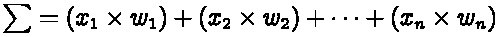*

*输入和权重的行向量分别为 x = [x₁，x₂，…，xₙ]和 w *=* [w₁，w₂，…，wₙ】，它们的 [*点积*](https://en.wikipedia.org/wiki/Dot_product#Algebraic_definition) 由下式给出*

*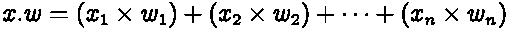*

*因此，总和等于矢量 *x* 和 *w* 的*点积**

*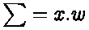*

***第二步**:将偏差 **b** 加到相乘值的总和上，我们称之为 *z* 。大多数情况下，偏置(也称为失调)是必需的，它将整个激活函数向左或向右移动，以产生所需的输出值。*

*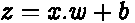*

***步骤 3** :将 *z* 的值传递给一个非线性激活函数。激活函数——用于将非线性引入神经元的输出，没有激活函数，神经网络将只是一个线性函数。此外，它们对神经网络的学习速度有重大影响。感知器具有*二元阶跃函数*作为其激活函数。然而，我们将使用 s *igmoid —* 也称为*逻辑*函数作为我们的激活函数。*

*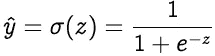*

*其中 **σ** 表示 s *igmoid* 激活函数，正向延拓后得到的输出称为*预测值*t28】ŷ。*

# *学习算法*

*学习算法由两部分组成——反向传播和优化。*

***反向传播:**反向传播，简称*误差反向传播*，是指计算损失函数相对于权重的梯度的算法。然而，该术语通常用于指代整个学习算法。在感知器中执行的反向传播在以下两个步骤中解释。*

***步骤 1** :使用*损失函数*来估计我们离期望的解决方案有多远。通常，回归问题选择*均方误差*作为损失函数，分类问题选择*交叉熵*。让我们来看一个回归问题，它的损失函数是均方误差，它是*实际值* (yᵢ)和*预测值* ( ŷᵢ)之差的平方。*

*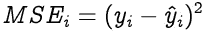*

*为整个训练数据集计算损失函数，并且它们的平均值被称为*成本函数* **C** 。*

*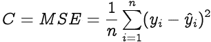*

*为了给我们的感知机找到最佳的权重和偏差，我们需要知道成本函数是如何随着权重和偏差而变化的。这是在*梯度* s ( *变化率)*的帮助下完成的——一个量如何相对于另一个量变化。在我们的例子中，我们需要找到成本函数相对于权重和偏差的梯度。*

*让我们使用*偏导数计算成本函数 **C** 相对于权重 **wᵢ** 的梯度。*由于成本函数与权重 wᵢ没有直接关系，我们使用[链式法则](https://en.wikipedia.org/wiki/Chain_rule)。*

*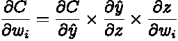*

*现在我们需要找到以下三个梯度*

*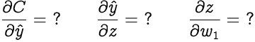*

*让我们从 c *ost 函数(C)* 相对于*预测值* ( ŷ)的梯度开始*

*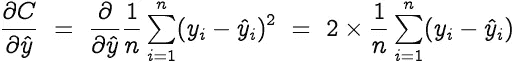*

*设 y = [y₁，y₂，… yₙ]和 ŷ =[ ŷ₁，ŷ₂，… ŷₙ]为实际值和预测值的行向量。因此，上述等式简化为*

*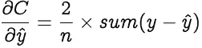*

*现在让我们找出*预测值*相对于 *z 的梯度。*这会有点长。*

*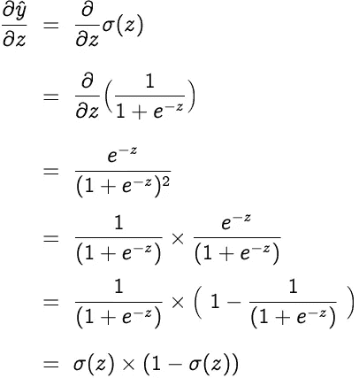*

****z*** 相对于重量 **wᵢ** 的倾斜度为*

*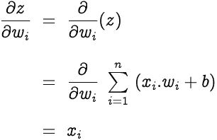*

*因此我们得到，*

*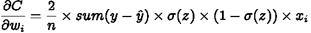*

*偏见呢？—偏置理论上被认为具有恒定值的输入 *1* 。因此，*

*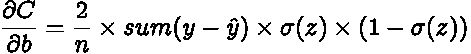*

***优化:**优化是从一组可用选项中选择最佳元素，在我们的例子中，是选择感知器的最佳权重和偏差。让我们选择*梯度下降*作为我们的优化算法，其改变*权重*和*偏差*，与成本函数相对于相应权重或偏差的梯度的负值成比例。*学习率* ( *α* )是一个超参数，用于控制权重和偏差变化的幅度。*

*如下更新权重和偏差，并重复反向传播和梯度下降，直到收敛。*

*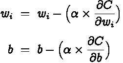*

# *最后的想法*

*我希望你已经发现这篇文章很有用，并且理解了神经网络和深度学习背后的数学。我在这篇文章中解释了单个神经元的工作。然而，这些基本概念通过一些修改适用于所有类型的神经网络。*