# R 中矩阵的介绍

> 原文：<https://towardsdatascience.com/introduction-to-matrices-in-r-dc009e3cdbb3?source=collection_archive---------49----------------------->

## 学习如何创建矩阵，了解如何用它们做基本的计算。


# 什么是矩阵？

**矩阵**是排列成固定数量的行和列的相同数据类型(数字、字符或逻辑)元素的集合。**二维矩阵**仅适用于行和列。

R 中的`[**matrix()**](https://www.rdocumentation.org/packages/base/versions/3.6.2/topics/matrix)`函数创建一个矩阵。考虑下面的例子:

```
matrix(1:9, byrow=TRUE, nrow = 3)
```

这将构造一个包含 3 行的矩阵，包含 1 到 9 的数字，按行填充。

在`matrix()`功能中:

*   第一个参数是 R 将排列到矩阵的行和列中的元素的集合。这里，我们使用了`1:9`(这个和`c(1,2,3,4,5,6,7,8,9)`一样(见 R 中的[向量)。这是一个可选参数，可以在以后填充。如果我们把它留空，矩阵就不会被填充。](https://medium.com/@linda.ngo/introduction-to-vectors-in-r-6ccae4748f2e)
*   参数`byrow`表示矩阵是按行填充的。如果我们希望矩阵按列填充，我们将这个参数设置为`FALSE`(即`byrow=FALSE`)。默认情况下，矩阵由列`byrow=FALSE`填充。

```
# Row-wise  # Column-wise
   1 2 3        1 4 7
   4 5 6        2 5 8
   7 8 9        3 6 9
```

*   第三个参数`nrow`表示所需的行数。`nrows=3`表示矩阵应该有三行。

还有其他论点，如:

*   `ncol`表示所需的列数。

# 从向量创建矩阵

让我们来分析一下《星球大战》系列的票房数字。

下面是三个向量，每个向量定义了前三部《星球大战》电影之一的票房数字。每个向量的第一个元素表示美国票房收入，第二个元素表示非美国票房(来源:[维基百科](https://en.wikipedia.org/wiki/List_of_Star_Wars_films))。

```
# Box office Star Wars (in millions)
new_hope <- c(460.998, 314.4)
empire_strikes <- c(290.475, 247.900)
return_jedi <- c(309.306, 165.8)
```

要从这三个向量构建一个矩阵，我们首先需要将这三个向量合并成一个。

```
box_office <- c(new_hope, empire_strikes, return_jedi)
```

然后我们使用`matrix()`函数构建一个矩阵。第一个参数是向量`box_office`，包含所有票房数字。接下来，我们必须指定`nrow=3`和`byrow=TRUE`来构建按行填充 3 行的矩阵(第一列代表美国收入，第二列代表非美国收入)。

```
star_wars_matrix <- matrix(box_office, byrow=TRUE, nrow=3)
```

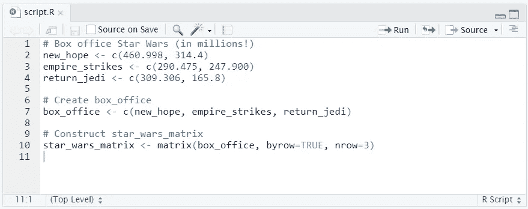

总的来说，代码应该是这样的。

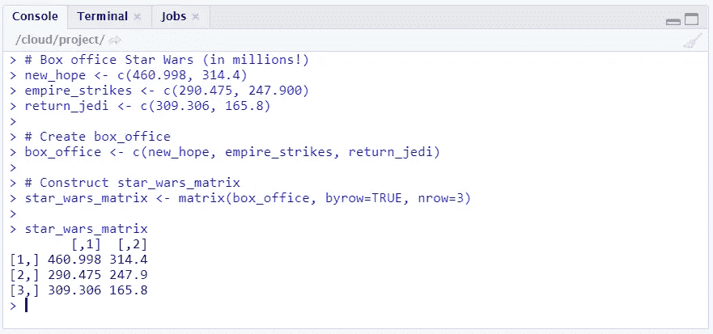

结果矩阵将是一个 3 行乘 2 列的“表格”。

# 命名矩阵

向矩阵的行和列添加名称通常有助于记住矩阵中存储的内容。它不仅有助于读取数据，还有助于从矩阵中选择某些元素。我们可以通过使用函数`colnames()`和`rownames()`来实现这一点。

```
rownames(my_matrix) <- row_names_vector
colnames(my_matrix) <- col_names_vector
```

要按区域和标题命名列，需要表示这些名称的向量。

```
# Vectors region and titles, used for naming
region <- c("US", "non-US")
titles <- c("A New Hope", "The Empire Strikes Back", "Return of the Jedi")
```

要用`region`向量命名`star_wars_matrix`的列，必须使用`colnames()`。

```
# Name the columns with region
colnames(star_wars_matrix) <- region
```

要用`titles`向量命名`star_wars_matrix`的行，必须使用`rownames()`。

```
# Name the rows with titles
rownames(star_wars_matrix) <- titles
```

您的代码现在应该像这样:

```
# Box office Star Wars (in millions)
new_hope <- c(460.998, 314.4)
empire_strikes <- c(290.475, 247.900)
return_jedi <- c(309.306, 165.8)# Construct matrix
star_wars_matrix <- matrix(c(new_home, empire_strikes, return_jedi), nrow = 3, byrow = TRUE)# Vectors region and titles, used for naming
region <- c("US", "non-US")
titles <- c("A New Hope", "The Empire Strikes Back", "Return of the Jedi")# Name the columns with region
colnames(star_wars_matrix) <- region# Name the rows with titles
rownames(star_wars_matrix) <- titles# Print out star_wars_matrix
star_wars_matrix
```

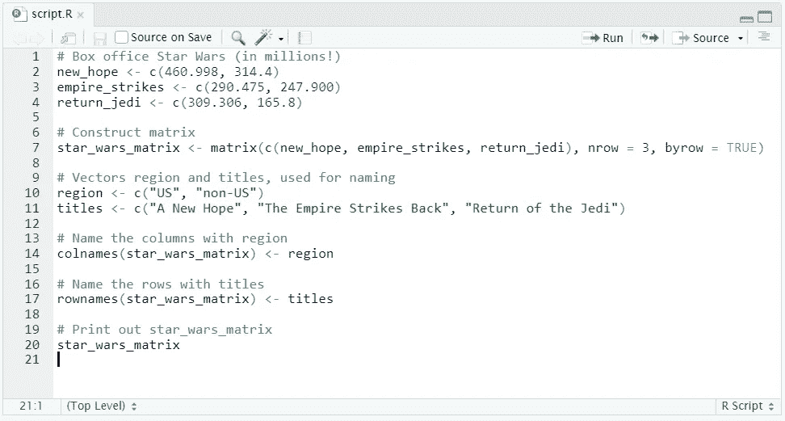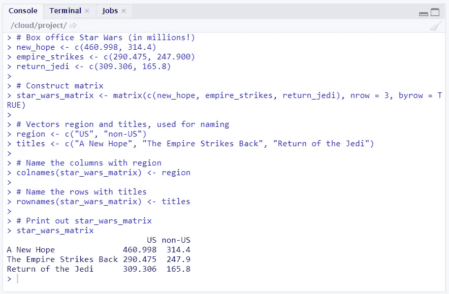

使用 colnames()和 rownames()函数后，矩阵现在被标记。

## 备选方案:使用 dimnames 参数

矩阵的`dimnames`属性可用于命名矩阵的行和列。`dimnames`属性接受长度为 2 的`list`,分别给出行名和列名。也就是说，

```
dimnames = list(row_vector,column_vector)
```

所以，在构造矩阵时，我们可以直接标记它。

```
# Construct star_wars_matrix
box_office <- c(460.998, 314.4, 290.475, 247.900, 309.306, 165.8)
star_wars_matrix <- matrix(box_office, nrow = 3, byrow = TRUE, dimnames = list(c("A New Hope", "The Empire Strikes Back", "Return of the Jedi"),c("US, "non-US")))
```

# 计算行总计

一部电影的一个重要统计数据是它的全球票房数字。要计算三部《星球大战》电影的总票房收入，你需要确定美国收入和非美国收入的总和。

函数`rowSums()`计算矩阵每行的总数，并创建一个新的向量:

```
rowSums(my_matrix)
```

## 让你试试

计算三部电影的全球票房数字。

## 解决办法

```
# Construct star_wars_matrix
box_office <- c(460.998, 314.4, 290.475, 247.900, 309.306, 165.8)
star_wars_matrix <- matrix(box_office, nrow = 3, byrow = TRUE, dimnames = list(c("A New Hope", "The Empire Strikes Back", "Return of the Jedi"),c("US, "non-US")))# Calculate worldwide box office figures
worldwide_vector <- rowSums(star_wars_matrix)
```

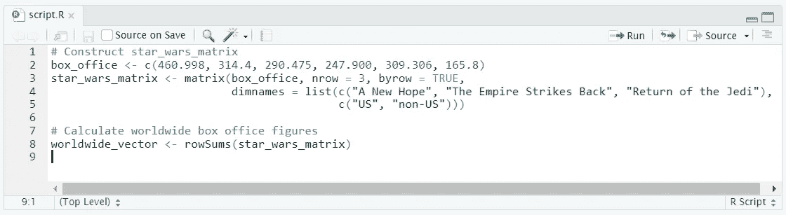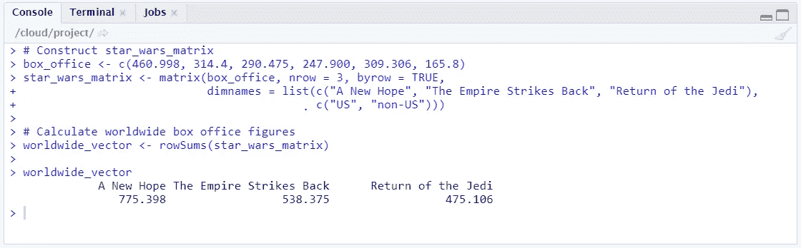

我们得到每部电影的总票房收入，而不考虑地区。

# 向矩阵中添加列

您可以使用`[cbind()](https://www.rdocumentation.org/packages/base/versions/3.6.2/topics/cbind)`功能向矩阵添加一列或多列，该功能按列将矩阵和/或向量合并在一起。例如:

```
big_matrix <- cbind(matrix1, matrix2, vector1, ...)
```

## 让你试试

在上一个练习中，您计算了包含三部电影的全球票房收入的向量。然而，这个向量还不是`star_wars_matrix`的一部分。将此向量作为新列添加到矩阵中，并将结果赋给新矩阵。

## 解决办法

```
# Construct star_wars_matrix
box_office <- c(460.998, 314.4, 290.475, 247.900, 309.306, 165.8)
star_wars_matrix <- matrix(box_office, nrow = 3, byrow = TRUE, dimnames = list(c("A New Hope", "The Empire Strikes Back", "Return of the Jedi"),c("US, "non-US")))# Calculate worldwide box office figures
worldwide_vector <- rowSums(star_wars_matrix)# Bind the new variable worldwide_vector as a column to star_wars_matrix
all_wars_matrix <- cbind(star_wars_matrix, worldwide_vector)
```

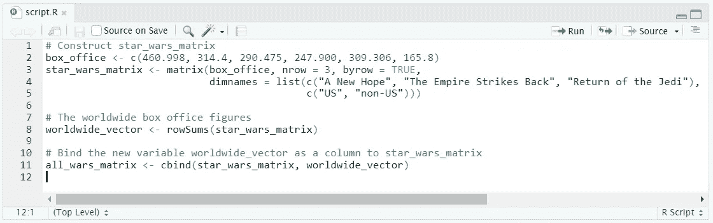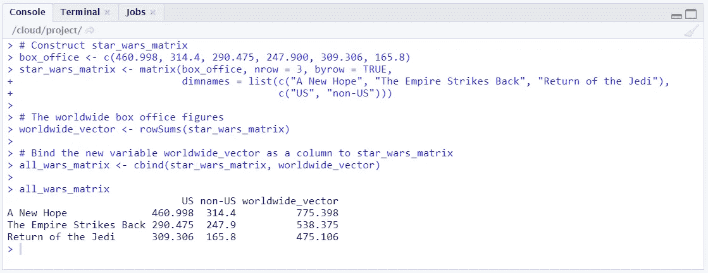

all_wars_matrix 现在包括美国收入、非美国收入以及这两项的总和。

# 添加一行

要添加列，可以使用`[**cbind()**](https://www.rdocumentation.org/packages/base/versions/3.6.2/topics/cbind)`。要添加一行，可以使用`[**rbind()**](https://www.rdocumentation.org/packages/base/versions/3.6.2/topics/cbind)`。`rbind()`函数接受一系列向量或矩阵参数，并按行组合它们。举个例子，

```
big_matrix <- rbind(matrix1, matrix2, vector1, ...)
```

## 让你试试

就像你用原三部曲的数据创建`star_wars_matrix`一样，用前传三部曲的类似数据创建第二个矩阵。

然后使用`rbind()`来合并两个矩阵，首先是原三部曲的数据，然后是前传的数据。

## 解决办法

```
# Construct star_wars_matrix
box_office <- c(461.0, 314.4, 290.5, 247.9, 309.3, 165.8)
star_wars_matrix <- matrix(box_office, nrow = 3, byrow = TRUE, dimnames = list(c("A New Hope", "The Empire Strikes Back", "Return of the Jedi"), c("US", "non-US")))# Construct star_wars_matrix2
box_office2 <- c(474.5, 552.5, 310.7, 338.7, 380.3, 468.5)
star_wars_matrix2 <- matrix(box_office2, nrow = 3, byrow = TRUE, dimnames = list(c("The Phantom Menace", "Attack of the Clones", "Revenge of the Sith"), c("US", "non-US")))# Combine both Star Wars trilogies in one matrix
all_wars_matrix <- rbind(star_wars_matrix, star_wars_matrix2)
```

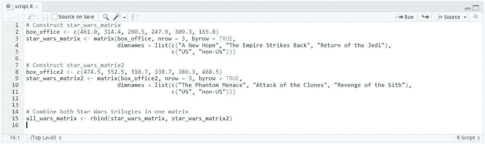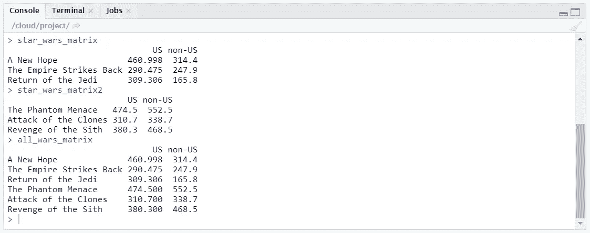

新的矩阵应该按地区列出原版和前传的收入。

# 计算列总计

类似于我们如何使用`rowSums()`来计算每行的总和，我们也可以使用`[**colSums()**](https://www.rdocumentation.org/packages/base/versions/3.6.2/topics/colSums)`来计算矩阵每列的总和。

```
rowSums(my_matrix)
```

## 让你试试

使用之前练习中构建的`all_wars_matrix`，计算整个传奇在美国和非美国地区的总票房收入。

## 解决办法

```
# Total revenue for US and non-US
total_revenue_vector <- colSums(all_wars_matrix)
```

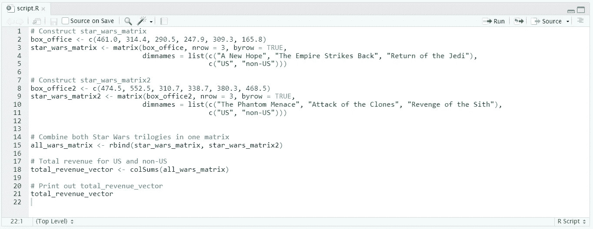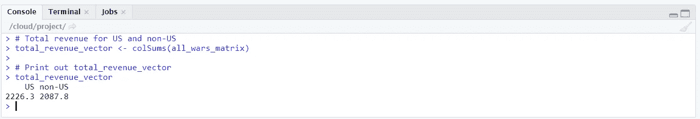

# 矩阵元素的选择

与向量类似，方括号`[]`可用于从矩阵中选择一个或多个元素。因为矩阵是二维的，所以需要逗号来分隔行和列。例如:

*   `my_matrix[1,2]`选择第一行第二列的元素(第 1 行，第 2 列)
*   `my_matrix[1:3, 2:4]`返回包含第 1 行到第 3 行、第 2 列到第 4 列的数据的矩阵。

要选择一行中的所有元素，在列后不需要数字。要选择一列的所有元素，在该列前不需要数字。

*   `my_matrix[,1]`选择第一列的所有元素。
*   `my_matrix[1,]`选择第一行的所有元素。

## 让你试试

计算所有电影的平均非美国收入(提示:选择`all_wars_matrix`的整个第二列，并使用`mean()`函数)。

## 解决办法

```
# Select the non-US revenue for all movies
non_us_all <- all_wars_matrix# Average non-US revenue
mean(non_us_all)
```

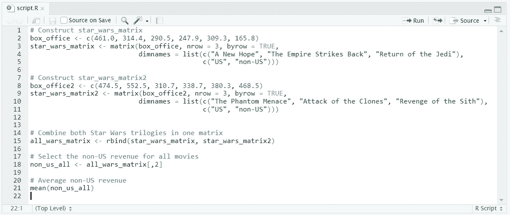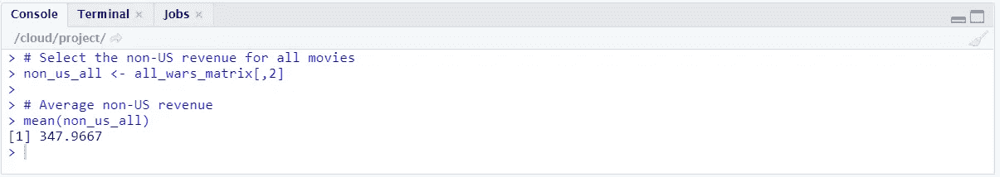

我们的平均收入为 3.4797 亿美元。

## 给你尝试(2)

计算传奇故事前两部电影的平均值。

## 解决办法

```
# Select the non-US revenue for the first two movies
non_us_some <- all_wars_matrix[1:2,2]# Average non-US revenue for the first two movies
mean(non_us_some)
```

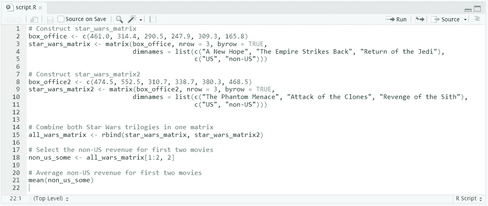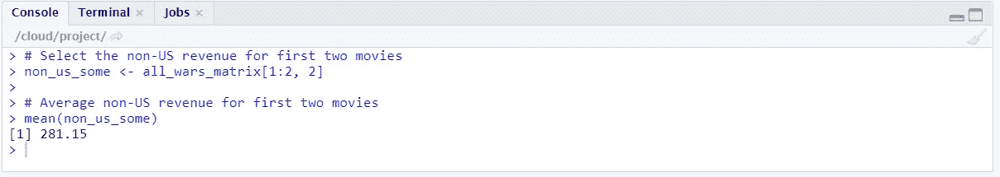

前两部电影的平均非美国收入为 2.8115 亿美元。

# 矩阵运算

标准运算符，如`+`、`-`、`/`、`*`等。它处理向量，也以元素的方式处理矩阵。

例如，`2 * my_matrix`将`my_matrix`的每个元素乘以 2。

也可以将一个矩阵乘以另一个矩阵。例如，`my_matrix1 * my_matrix2`创建一个矩阵，其中每个元素都是`my_matrix1`和`my_matrix2`中相应元素的乘积。

## 让你试试

假设一张电影票的价格是 5 美元。确定每个地理区域有多少观众去看了每部电影。(提示:简单地用票房数字除以票价就会得到游客数量)。

## 解决办法

```
# Estimate the visitors
visitors <- all_wars_matrix / 5
```

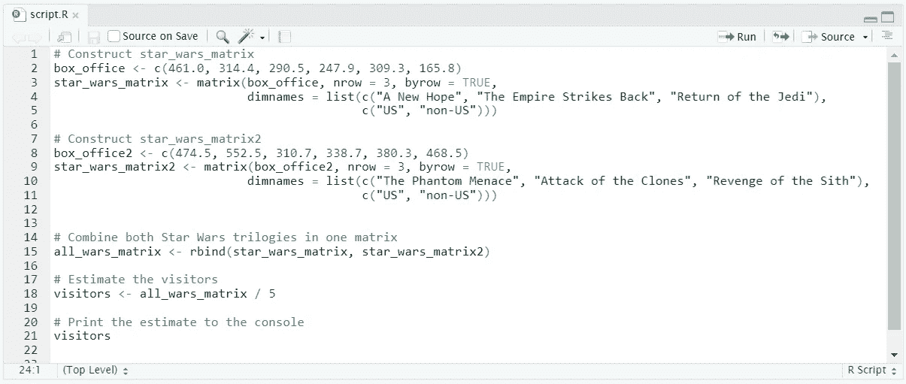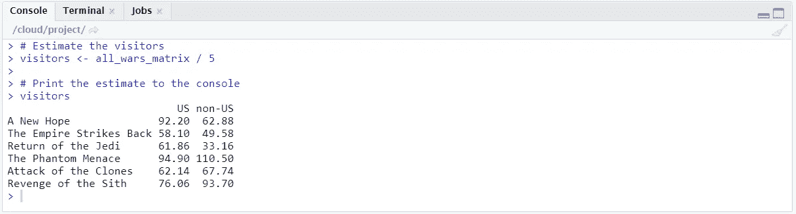

## 给你尝试(2)

假设票价随着时间的推移而上涨。给出一个票价矩阵，确定所有电影的美国和非美国游客的估计数量。

```
# Construct ticket_prices_matrix
ticket_prices <- c(5.0, 5.0, 6.0, 6.0, 7.0, 7.0, 4.0, 4.0, 4.5, 4.5, 4.9, 4.9)
ticket_prices_matrix <- matrix(ticket_prices, nrow = 6, byrow = TRUE, dimnames = list(c("A New Hope", "The Empire Strikes Back", "Return of the Jedi","The Phantom Menace", "Attack of the Clones", "Revenge of the Sith"),c("US", "non-US")))
```

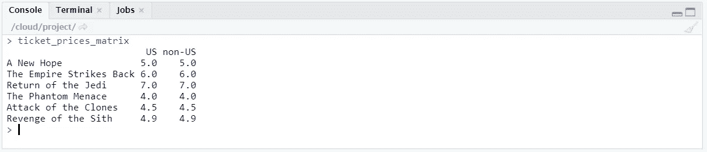

票价矩阵。

## 解决办法

```
# Estimated number of visitors
visitors <- all_wars_matrix / ticket_prices_matrix
```

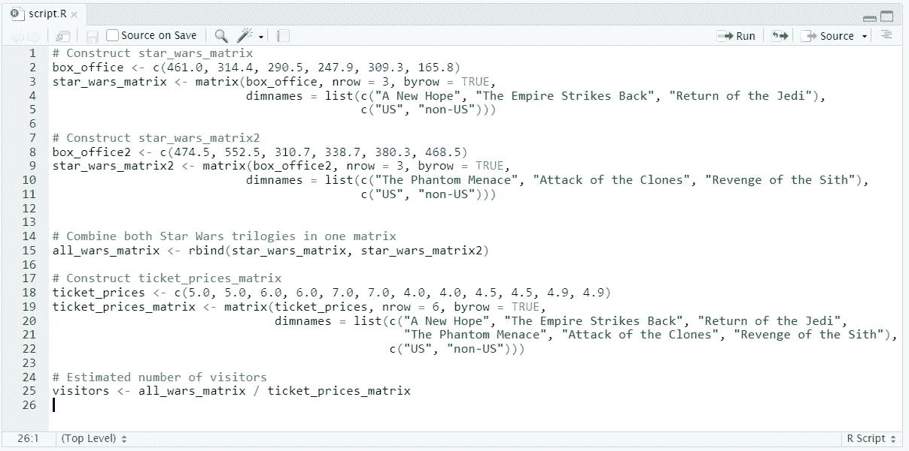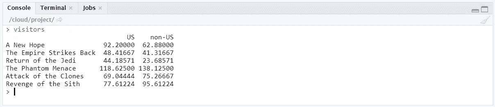

## 给你试试(3)

计算美国访问者的平均数量(提示:您需要完成第二个才能尝试)

## 解决办法

```
# US visitors (Select the entire first column)
us_visitors <- visitors[,1]# Average number of US visitors
mean(us_visitors)
```

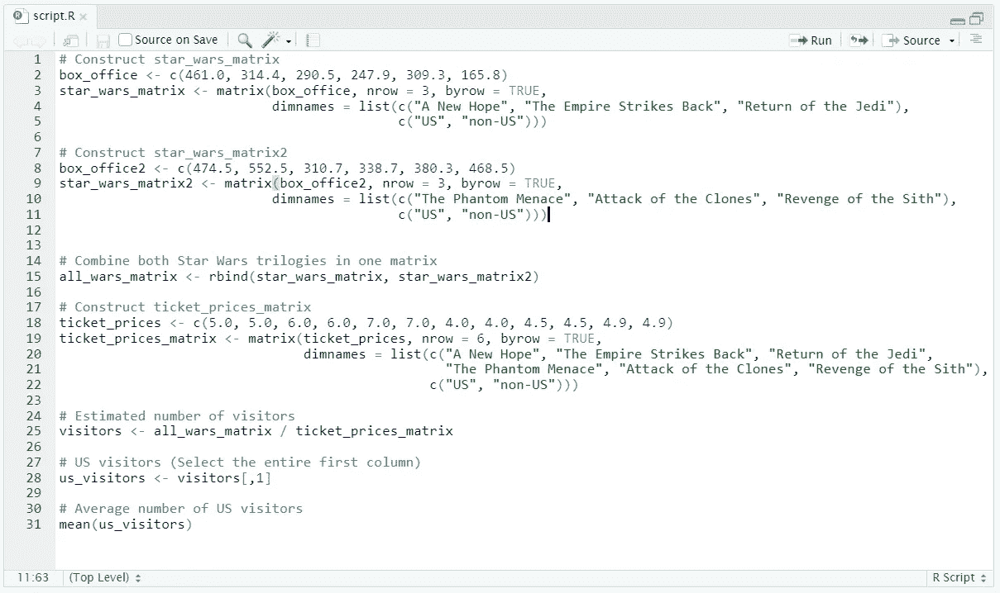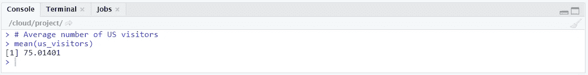

美国访问者的平均数量可以使用均值函数来确定。

# 笔记

所有图片，除非特别注明，均归作者所有。横幅图像是使用 [Canva](https://www.canva.com/) 创建的。