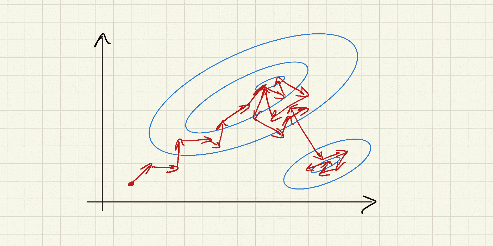
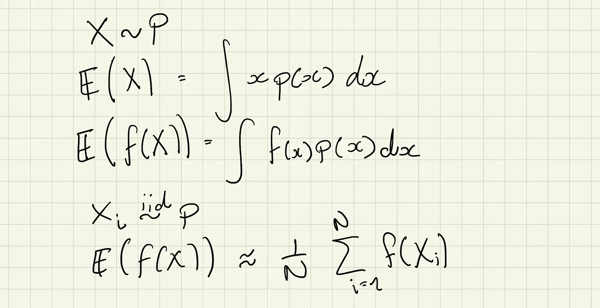
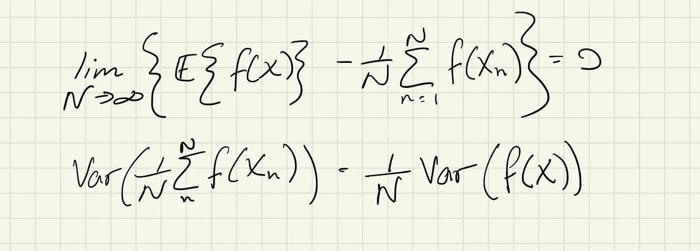
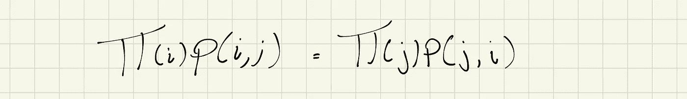
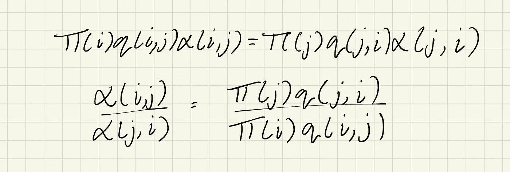
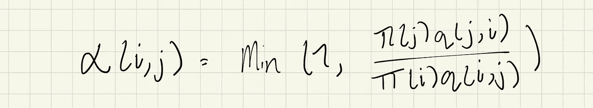
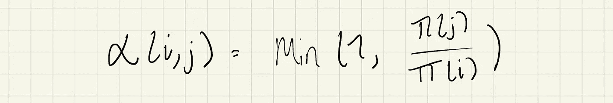
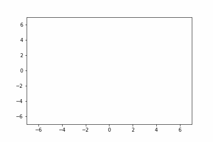

# MCMC 简介

> 原文：<https://towardsdatascience.com/introduction-to-mcmc-1c8e3ea88cc9?source=collection_archive---------22----------------------->

## 什么是蒙特卡洛近似法，Metropolis 算法是如何工作的？



Metropolis 算法的图示。作者图片

概率建模如今风靡一时，但当我第一次了解它时，总有一件事困扰着我。许多贝叶斯建模方法需要计算积分，我看到的任何成功的例子似乎都使用高斯或伯努利分布，原因很简单，如果你试图使用比这更复杂的东西，这将成为一个分析噩梦(甚至是棘手的)。将贝叶斯建模限制在“表现良好的”分布的小子集会极大地阻碍您对问题进行良好建模的能力，因此我们想出克服这种限制的方法是很重要的。

## 蒙特卡洛近似法

如果我不想解析地计算一些讨厌的积分，我该怎么做？输入蒙特卡罗近似值。

我们知道，我们可以通过使用目标分布的样本并计算它们的样本均值来计算期望值。为什么这很重要？那么，除了积分，还有什么是期望呢…



连续随机变量的期望。同样的过程也适用于离散，通过改变求和的积分。作者图片

由于中心极限定理，这种估计积分的方法有一些很好的保证。首先，这是期望的无偏估计，其次，我们可以计算估计的方差。



使用蒙特卡罗样本计算积分当然很好，但是我们如何从目标分布中抽取样本呢？绘制高斯或均匀样本很容易，但是任何更难和 np.random 的东西都会让你不及格。

抽取样本的最简单方法是使用逆 CDF 方法，但这依赖于对逆 CDF 函数的访问，该函数通常没有很好的分析形式，只对一维随机变量有意义。

Metropolis 算法是许多马尔可夫链蒙特卡罗(MCMC)采样方法的构建模块之一。当您只能访问目标发行版的 pdf 时，它允许我们提取样本。

MCMC 方法附带了一个警告，即我们不再获取独立的样本，因此我们不能保证我们的估计方差随着我们获取的样本数量的增加而减少。如果独立抽取样本，中心极限定理告诉我们，我们估计的方差将与样本数(N)成反比地减少。对于 MCMC，我们可以通过将样本数从 N 调整到 N_eff 来忽略这一点。N_eff(几乎)总是小于 N，并且与链中样本的相关程度有关。

## 大都市抽样

Metropolis 算法的步骤如下:

```
1\. Sample a starting point uniformly from the domain of the target distribution or from the prior distribution.2\. Calculate the pdf at that point.3\. Make a proposal for the new sample by taking a step from the current position in accordance with some state transition function.4\. Calculate the new pdf value.5\. Calculate the value of new pdf / old pdf.6\. If the ratio is greater than 1, accept the step.7\. If the ratio is less than 1:
    1\. Sample a uniform random variable.
    2\. If the ratio greater than the random sample, accept the step.8\. Else reject the proposal, add the current position as a sample and take a new step.
```

请注意，5–8 中描述的过程相当于根据概率为 min(1，p(新)/p(旧))的伯努利概率接受样本，请记住这一点，以便以后使用…

## 为什么大都会抽样有效？

对于任何 MCMC 方法，我们希望确保一个称为详细平衡或可逆性的属性。



明细余额。作者图片

如果π满足这个条件，那么π就是马尔可夫链 [(1)](http://www.robots.ox.ac.uk/~fwood/teaching/C19_hilary_2015_2016/mcmc.pdf) 的平稳分布。我们可以通过对等式两边求和来证明这一点。如果我们能保证详细的平衡，那么我们也知道我们是从马尔可夫链的平稳分布中取样，我们将把它指定为我们的目标分布。

这种对详细平衡的直觉是，由于从状态`i`到状态`j`的概率‘质量’转移与从状态`j`到状态`i`的转移相同，所以在链的每次转移之后，我们保持在稳定分布。

那么现在让我们展示 Metropolis 算法如何满足这个条件…

为了找到 p(i，j)使得它满足详细平衡，我们首先提出任意的“跳转”概率 q(i，j)，然后通过只接受概率为α(i，j)的“跳转”来获得 p(i，j)。当一个“跳转”被拒绝时，状态保持 j=i。这种“接受”思想不是 Metropolis 算法所独有的，并且存在于 MCMC 的大多数变体中。



跳跃概率推导。作者图片

这取决于α是有效的概率分布。所以α的有效形式是:



大都会-黑斯廷斯台阶。作者图片

如果跳动概率是对称的，那么这可以简化为:



大都会台阶。作者图片

否则，它可以保留其完整形式，称为 Metropolis-Hasting MCMC。

现在我们可以保证详细的平衡，我们可以让马尔可夫链机器接管。如果马尔可夫链是遍历的(所有状态都是不可约的)，那么在某个点上，该链将到达平稳分布，并且我们能够从目标分布中提取样本。

您可能还注意到，由于α是π(j)/π(i)的函数。这意味着目标分布不需要标准化。这在使用 Metropolis 进行贝叶斯后验估计时特别有用，因为证据项很难计算。

## 实施说明

Metropolis 算法的常见版本称为“随机行走 Metropolis ”,其中建议的状态是当前状态加上具有零均值和协方差矩阵σ I 的多元高斯。σ应选择为足够大，以便剔除足够多的样本。这是为了确保目标分布的良好探索。

第二个需要注意的是老化的概念。在马尔可夫链达到稳定分布之前采集的样本应该被移除，因为在马尔可夫链收敛之前，它们不代表目标分布。确定应该移除多少样本有些困难，但一般来说，会移除 10–20%的样本(或 10–100 个有效样本)。

## 让我们在 Numpy 建造它

为了简单起见，这里我们实现随机漫步大都会。

```
def metropolis(pi, dims, n_samples, burn_in=0.1, var=1):
    theta_ = np.random.randn(dims)*var samples = []
    while len(samples) < n_samples:
        theta = theta_ + np.random.randn(dims)*varratio = pi(theta)/pi(theta_)
        if np.random.rand(1) < ratio:
            sample = theta
            theta_ = theta
            samples.append(sample)
        else:
            sample = theta_
            samples.append(sample) samples = np.array(samples)
    return samples[int(samples*burn_in):,:]
```

我们可以看到这在两个高斯分布的和上的表现(注意这是一个非标准化的分布)。

```
from scipy.stats import multivariate_normaldef make_pdf(mean1, mean2, cov1, cov2): pdf1 = multivariate_normal(mean1, cov1)
    pdf2 = multivariate_normal(mean2, cov2) def pdf(x):
        return pdf1.pdf(x) * pdf2.pdf(x) return pdfpdf = make_pdf(
    [3, 3],
    [-1, -1],
    np.array([[1,0.1],[0.1,1]], dtype=float),
    np.array([[1,0.1],[0.1,1]], dtype=float),
)samples = metropolis(pdf, 2, 1_000, 0.1)
```



两个多元高斯和的大都会样本。作者图片

上面的 gif 显示了算法如何遍历分布，偶尔在分布的两种不同模式之间跳跃。注意，这也突出了 Metropolis 算法的一个弱点，它处理多模型分布相对较差。这是因为，为了探索一种新的模式，步长必须足够大，以便从一种模式转换到另一种模式。这要么需要一个大的步长，要么需要模式接近的分布。诸如哈密尔顿 MCMC 的修改可以对此有所帮助，但是一般来说，这是大多数 MCMC 方法的问题。

## 附加“阅读”

*   [关于详细平衡的视频](https://www.youtube.com/watch?v=xxDkdwQdGvs&t=0s)
*   [原文](https://arxiv.org/pdf/1504.01896.pdf)关于 Metropolis-Hastings 算法
*   [论文](https://arxiv.org/pdf/1206.1901.pdf):)关于哈密顿动力学(stan 和其他概率语言使用的 MCMC 方法)