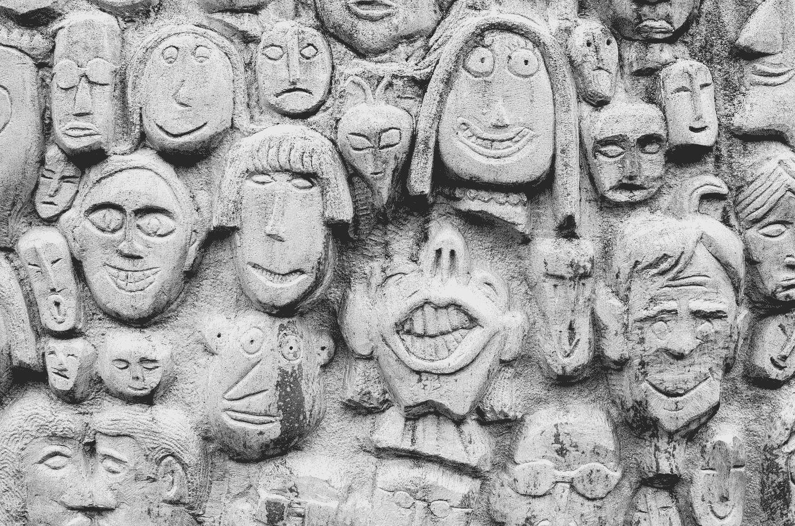
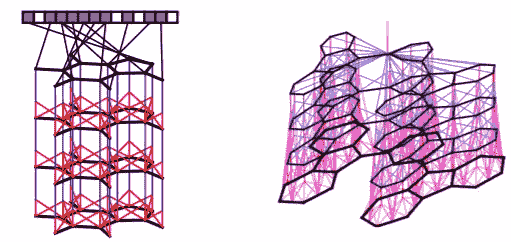
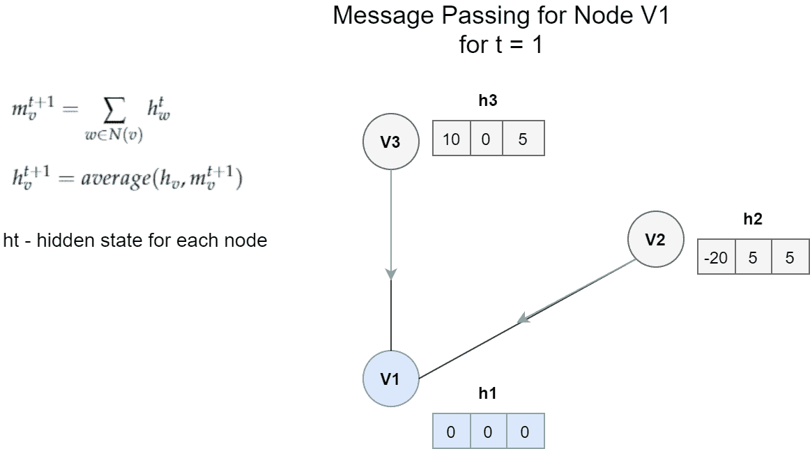
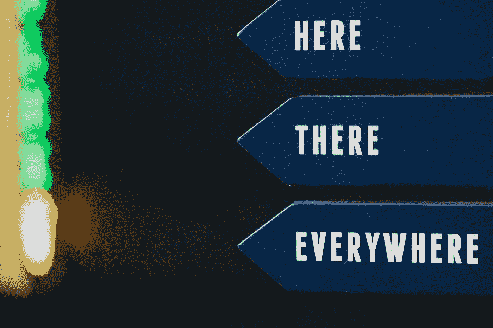

# 消息传递神经网络简介

> 原文：<https://towardsdatascience.com/introduction-to-message-passing-neural-networks-e670dc103a87?source=collection_archive---------5----------------------->

## 在图表上发送信息的神经网络

照片由 [Ryul Davidson](https://unsplash.com/@ryuldavidson?utm_source=medium&utm_medium=referral) 在 [Unsplash](https://unsplash.com?utm_source=medium&utm_medium=referral) 上拍摄

# 相关文章

*   [图的特征提取](/feature-extraction-for-graphs-625f4c5fb8cd)
*   [图上的机器学习任务](/machine-learning-tasks-on-graphs-7bc8f175119a)
*   [面向可解释图的神经网络](/towards-explainable-graph-neural-networks-45f5e3912dd0)
*   [图形神经网络的 10 大学习资源](/top-10-learning-resources-for-graph-neural-networks-f24d4eb2cc2b)

W 欢迎来到图形神经网络的世界，在这里我们在图形上构建深度学习模型。你可能认为这很简单。毕竟，难道我们不能重用使用正常数据的模型吗？

不完全是。在图中，所有的数据点(节点)都是相互连接的。这意味着数据不再是独立的，这使得大多数标准的机器学习模型无用，因为它们的推导强烈地基于这一假设。为了克服这个问题，可以从图中提取数字数据，或者使用直接处理这类数据的模型。

创建直接在图上工作的模型是更可取的，因为我们获得了关于它们的结构和属性的更多信息。在本文中，我们将研究专门为这种类型的数据设计的架构之一，消息传递神经网络(MPNNs)。

# 多面模特

安德鲁·西曼在 [Unsplash](https://unsplash.com?utm_source=medium&utm_medium=referral) 上拍摄的照片

在这个模型被标准化为一个单一的 MPNN 框架之前，几个独立的研究人员已经发表了不同的版本。这种类型的结构在化学中特别受欢迎，有助于预测分子的性质。

Duvenaud 等人(2015)在[1]中发表了关于这一主题的第一批工作之一。他使用消息传递架构从图形分子中提取有价值的信息，然后将其转换为单个特征向量。当时，他的工作是开创性的，因为他使架构*可区分。*事实上，这是第一个可以在图形上操作的卷积神经网络架构。

Duvenaud 等人(2015)在[1]中创建的消息传递架构。他将该模型定义为一堆可区分的层，其中每一层都是另一轮的消息传递。修改自[1]

李等人(2016)在[2]中对此架构进行了另一次尝试。在这里，他们关注图的顺序输出，例如在图[2]中寻找最优路径。为了实现这一点，他们将 GRU(门控循环单元)嵌入到他们的算法中。

尽管这些算法看起来非常不同，但它们有相同的基本概念，即在图中的节点之间传递消息。我们将很快看到如何将这些模型组合成一个单一的框架。

# 将模型统一到 MPNN 框架中

节点 **V1** 的消息传递架构的一个非常简单的例子。在这种情况下，消息是邻居隐藏状态的总和。更新函数是消息 **m** 和 **h1** 之间的平均值。作者创建的 Gif

毕竟，MPNN 背后的想法在概念上很简单。

图中的每个节点都有一个隐藏状态(即特征向量)。对于每个节点 **V** t，我们将所有*相邻节点的隐藏状态和可能的边与节点 **V** t 本身聚合在一起。然后，我们使用获得的消息和该节点的先前隐藏状态来更新节点 **V** t 的隐藏状态。*

有 3 个主要等式定义了图上的 MPNN 框架[3]。从相邻节点获得的消息由以下等式给出:

从相邻节点获得消息。修改自[3]。

它是 Mt 从邻居获得的所有消息的总和。Mt 是一个任意函数，它依赖于相邻节点的隐藏状态和边缘。我们可以通过保留一些输入参数来简化这个函数。在上面的例子中，我们只对不同的隐藏状态 h *w.* 求和

然后，我们使用一个简单的等式更新节点 **V** t 的隐藏状态:

使用先前的隐藏状态和新消息更新节点的状态。修改自[3]。

简单地说，节点 **V** t 的隐藏状态是通过用新获得的消息 **m** v 更新旧的隐藏状态而获得的。在上述示例的情况下，更新函数 Ut 是先前隐藏状态和消息之间的平均值。

我们重复这个消息传递算法指定的次数。之后，我们到达最后的读出阶段。

将获得的隐藏状态映射到描述整个图的单个特征向量中。修改自[3]。

在这一步中，我们提取所有新更新的隐藏状态，并创建描述整个图的最终特征向量。然后，该特征向量可以用作标准机器学习模型的输入。

就是这样！这些是 MPNN 的基础。这个框架非常健壮，因为我们可以根据我们想要实现的目标来定义不同的消息和更新功能。我建议查看[3]更多信息，MPNN 模型的不同变体。

# 在哪里可以找到模型的实现

照片由[尼克·费因斯](https://unsplash.com/@jannerboy62?utm_source=medium&utm_medium=referral)在 [Unsplash](https://unsplash.com?utm_source=medium&utm_medium=referral) 上拍摄

MPNN 是作为少数深度学习库的一部分实现的。以下是我能找到的几种不同实现的列表:

*   [原始模型的实现](https://github.com/brain-research/mpnn)
*   [深度化学实施](https://github.com/deepchem/deepchem/tree/master/contrib/mpnn)
*   [PyTorch 几何实现](https://github.com/rusty1s/pytorch_geometric)

# 总结

MPNN 框架标准化了由几个研究人员独立创建的不同的消息传递模型。该框架的主要思想由消息、更新和读出功能组成，这些功能在图中的不同节点上操作。有不同的 MPNN 模型共享这一功能，但他们定义不同。

感谢阅读，希望对你有用！

# 关于我

我是阿姆斯特丹大学的人工智能硕士学生。在我的业余时间，你可以发现我摆弄数据或者调试我的深度学习模型(我发誓这很有效！).我也喜欢徒步旅行:)

如果你想了解我的最新文章和其他有用的内容，以下是我的其他社交媒体资料:

*   [领英](https://www.linkedin.com/in/kacperkubara/)
*   [GitHub](https://github.com/KacperKubara)

# 参考

[1] [用于学习分子指纹的图上的卷积网络](https://arxiv.org/pdf/1509.09292.pdf)

[2] [门控图序列神经网络](https://arxiv.org/abs/1511.05493)

【3】[量子化学的神经信息传递](https://arxiv.org/pdf/1704.01212.pdf)