# LibROSA 和 Beat Saber 音乐信息检索简介

> 原文：<https://towardsdatascience.com/introduction-to-music-information-retrieval-with-librosa-and-beat-saber-48daedb8653e?source=collection_archive---------17----------------------->

## 音乐信息检索简介


[https://hdwallsource . com/beat-saber-video-game-HD-wallpaper-67665 . html](https://hdwallsource.com/beat-saber-video-game-hd-wallpaper-67665.html)

在这篇文章中，我将举例说明过去几周以来我围绕音乐信息所做的一些工作，这些工作应用于一个特定的游戏 Beat Saber。

# 击败赛博·凯扎科？

[Beat Saber](https://beatsaber.com/) 是 Beat Games 于 2018 年发布的虚拟现实(VR)节奏游戏，顺便说一下，Beat Games 最近被[脸书](https://www.oculus.com/blog/welcoming-beat-games-to-facebook/?utm_source=rakuten&utm_medium=affiliate&utm_campaign=TnL5HPStwNw)收购。游戏的原理是在你的虚拟现实耳机中，你沉浸在一个 3d 世界中，你必须摧毁积木并避免障碍(与播放的歌曲保持一致)。我邀请你观看他们在 youtube 频道上发布的最后一个视频，以了解游戏背后的逻辑。

对我来说，这是一个展示 VR 有多酷的游戏，对于对 VR 好奇的人来说，这是一个必须尝试的游戏(市场上大多数耳机上都有 gamer)。

这个游戏有一个由 beat games 制作的曲目列表，它们很酷，但在 PC 上有一个社区正在为这个游戏(UGC)开发他们选择的歌曲，这个用户发布内容的主要地方是[bsaber.com](https://bsaber.com/)。


该网站似乎被 Beat Games 所容忍，我认为这是游戏流行的原因。

几周前，我决定在这个网站上建立一个歌曲的刮刀(与我的[上一篇文章](http://the-odd-dataguy.com/build-a-webscraper-with-beautifsoup-and-selenium/)中的工作相同，仍然不是所有者，所以不共享),用于多种用途:

*   在这个地方，我有一个市场，用户在那里对内容进行建议和评级，所以这是一个围绕推荐引擎建立数据集的完美地方
*   当我看着网站的大量目录时，我最喜欢的歌曲都不在这里，所以为什么不从现有的歌曲中建立一个 ML 系统，可以根据你想要使用的歌曲建立等级。

关于这最后一点，当我向我的一些朋友介绍我的想法时，他们将我重新引向了 [OXAI](https://oxai.org/#page-top) 和他们的 [DeepSaber 项目](https://oxai.org/beatsaber)的工作，是的，就是这个(他们取得的成就令人难以置信)。我计划在未来使用他们已经完成的工作来帮助我构建我的系统(但仍需要在深度学习方面取得进展)。

我对推荐器和生成器的第一个假设是直接分析社区制作的曲目和歌曲，让我们从歌曲开始。

# 情况描述

Python 中最流行的音乐分析包之一叫做 [libROSA](https://librosa.github.io/librosa/#) ，我邀请你观看 Brian McFee 在这个包中的演讲。

对于本文，我使用的是 0.7 版本的软件包。

为了说明音乐分析的概念，我主要参考了:

*   在 Meinard Muller 的书[音乐处理基础](https://www.springer.com/gp/book/9783319219448)中找到的定义/模式似乎是音乐处理领域的参考


[https://www.springer.com/gp/book/9783319219448](https://www.springer.com/gp/book/9783319219448)

*   Youtube 频道 [3Blue1Brown](https://www.youtube.com/channel/UCYO_jab_esuFRV4b17AJtAw) 在解释科学概念方面做得非常出色(上帝啊，我希望当我还是一名工程学学生的时候就有这样的资源)

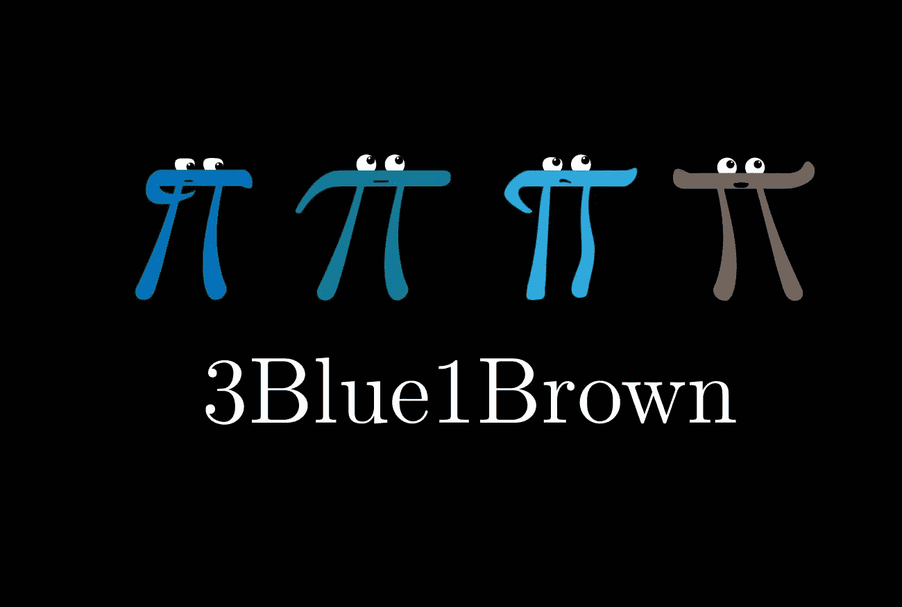

*   这个优秀的[知识库](https://github.com/stevetjoa/musicinformationretrieval.com)是由 [Steve Tjoa](https://www.stevetjoa.com/) 制作的，他是我极力推荐的谷歌工程师；这是混合 libROSA，穆勒的书和其他围绕音乐信息检索的资源。

我决定选两首歌做我的金妮猪:

*   过去十年中发行的最酷的电子歌曲之一是 M83 的午夜城市
*   另一首，你会讨厌我的是扔硬币给你的巫师 Sonya Belousova & Giona Ostinelli(我知道这首歌是你脑海中的，但现在它回来了)

这两首歌有不同的风格，我认为它们可能是一个好的开始，因为它们的用户评论是 bsaber.com 上的商品。让我们开始对歌曲进行分析。

# 音乐信息检索

在 Beat Saber 关卡背景中使用的歌曲可以看到(像所有歌曲一样)有音频信号。我们来看一些概念。

## 振幅

声音产生一个振动的物体，导致空气分子的位移和振荡，产生局部区域的压缩和稀薄，在穆勒的书中，对这种现象有一个清晰的说明。

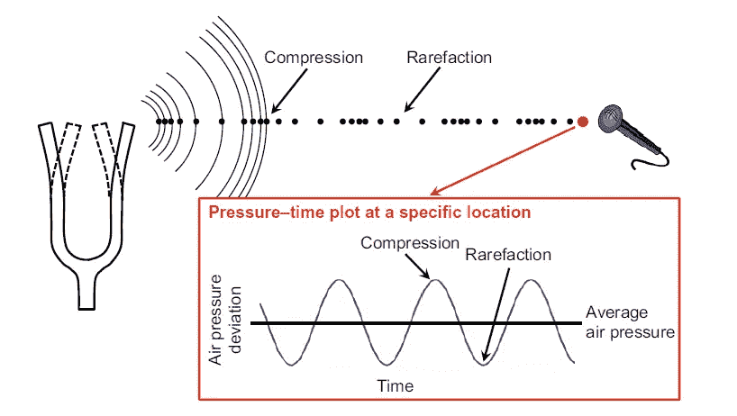

音乐处理基础——音乐表现

声音记录相当于捕捉特定时刻的气压振荡(捕捉的周期性称为采样率 sr)。在 LibROSA 中要构建这种图，可以使用以下命令:

```
import librosa # To load the file, and get the amplitude measured with the sampling rate amplitude, 
sr = librosa.load(path_song)  

# To plot the pressure-time plot 
librosa.display.waveplot(amplitude, sr=sr)
```

而对于我们两首歌，有他们的压力-时间情节。

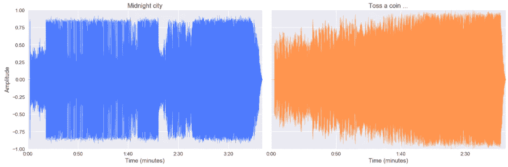

正如我们所看到的，两首歌有不同的波形，M83 的歌曲看起来比《巫师》的歌曲有更多的相位(在开始和大约两分钟的时间里有“平静”期)。这个可视化提供了一个很好的例子，但是让我们放大(在歌曲中间)。

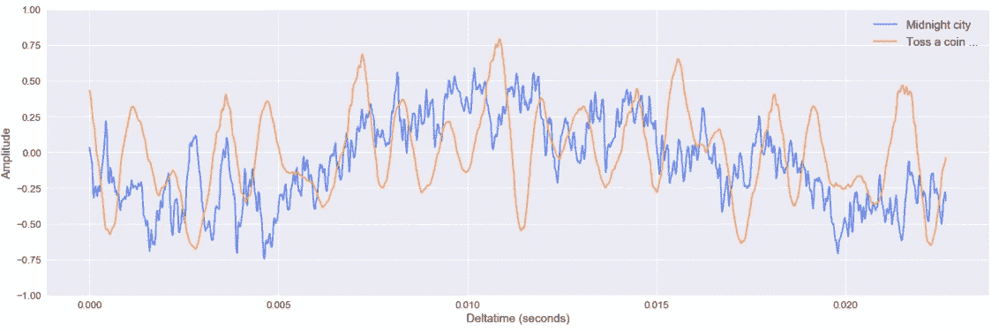

正如我们看到的午夜城市看起来更复杂(嘈杂？)就振幅的振荡而言，那首《巫师》(但仍记得那是在歌曲的特定时期)

现在，我们可以用 Beat Saber level 来分析一些更具体的东西，但一个重要的事实是，这些信号相当复杂，也许简化它们会有所帮助，所以让我们给我的朋友 Fourier 打电话。

## 傅里叶变换

傅立叶变换背后的原理是结合多个信号分解一个复信号。我不想做过程背后的所有理论(学校噩梦)，但我邀请你观看 3Blue1Brown 就此主题制作的优秀资源(感谢我在英国的同事提供的链接),这是 20 分钟，但值得。

变换的想法是检测隐藏在歌曲中的简单信号并估计它们的强度。为了利用 libROSA 的这个操作，您可以很容易地使用这段代码。

```
### # Build the Fourier transform 
X = librosa.stft(amplitude) # Apply a conversion from raw amplitude to decibel 
Xdb = librosa.amplitude_to_db(abs(X)) # Build a spectrogram librosa.display.specshow(Xdb, sr=sr, x_axis="time", y_axis="hz")
```

这个代码为我们提供了一个名为 spectrogram 的图表，它是时间与频率的关系图，色标与信号功率(由频率定义)相关。这是我们两首歌的声谱图。


正如我们所见，两首歌曲共享一个非常不同的声谱图:

*   《午夜城市》看起来是一首由比《巫师》更高频率的信号组成的歌
*   巫师看起来比午夜城市更吵闹；我不知道如何解释我所看到的

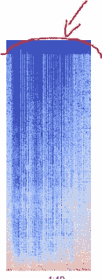

这种轮廓在《巫师》中出现过，但不像这张。但是，信号甚至分解复杂，难以分析(因为他的复杂性)。为什么不把它分解在伴奏和人声之间。

## 人声和伴奏分离

为了做到这一点，我可以使用 libROSA 包中的预制脚本，但是当我开始从事这个项目时，我的研究将我引向了 Deezer 的一篇科技博客文章,这篇文章开源了一个工具调用 spleeter。

Deezer 于 2019 年底发布了基于 TensorFlow v1 的这款产品。我没有找到 ISMIR 2019(围绕音乐信息检索的大型会议)期间的论文或演示文稿。如果你想在午夜城市上听到分离的结果(这很好)并抛硬币，你需要去这个[链接](https://drive.google.com/drive/folders/1a7qzKb8HCwh359zdvrZpgiTJympDN_d-?usp=sharing)下载 spleeter 文件夹中的分离文件。

振幅观点的影响是什么？

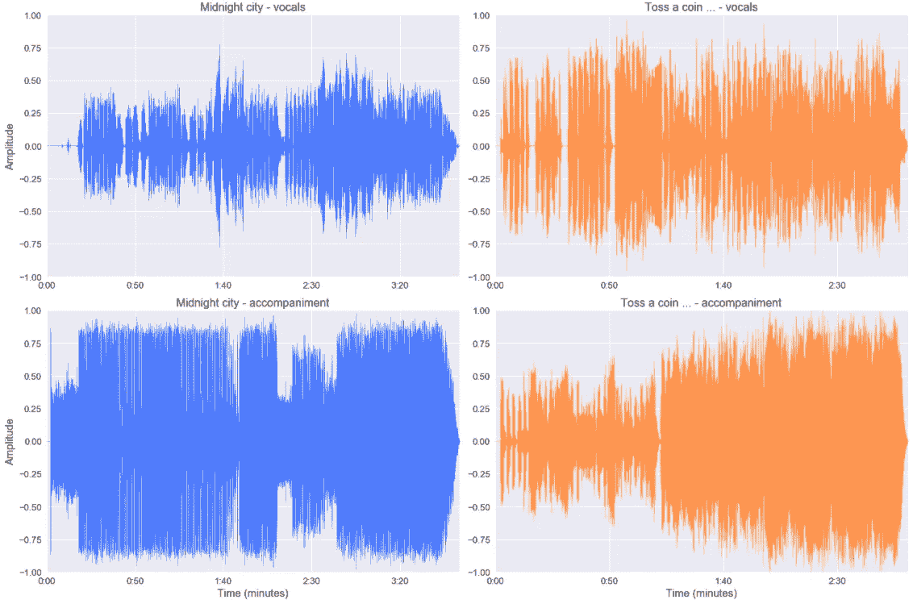

从一般的观点来看，信号不太复杂，但噪声仍然很大。(zoom 仍在说明这一点)。

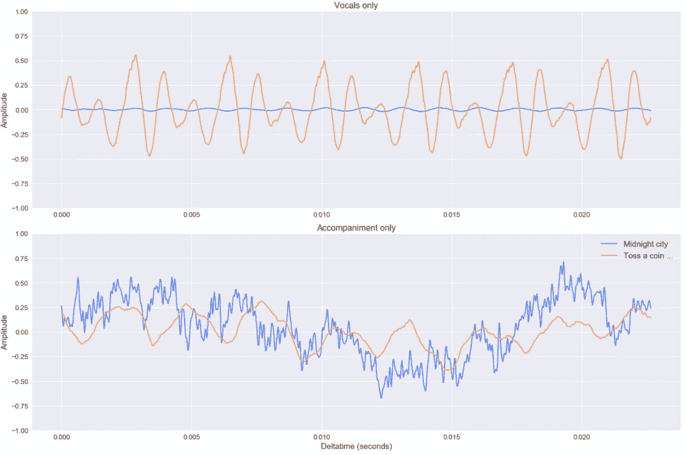

尽管如此，我认为这种分离在基于歌曲的振幅构建音轨的上下文中是有用的。

让我们现在开始交叉数据从节拍军刀轨道和歌曲。

# 俯冲在拍子军刀的侧面

从 bsaber.com 下载的文件中，我有我之前分析过的歌曲和关卡(包括音符障碍等等)。).对于这篇文章，我只是要分析正常的轨道和这个轨道上每秒发布的笔记数量(不是那种笔记)。

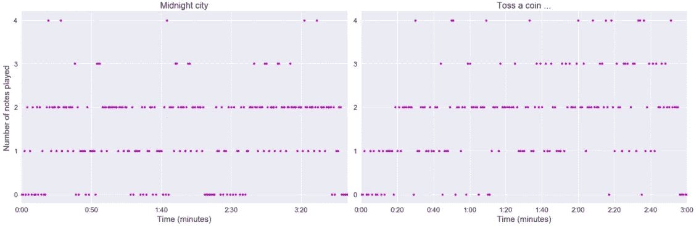

正如我们所看到的，歌曲中每秒显示的音符上有多个相位，但让我们在此图中添加歌曲的振幅。顺便说一下，为了比较每秒的振幅，我需要每秒进行一次聚合(振幅绝对值的平均值)。

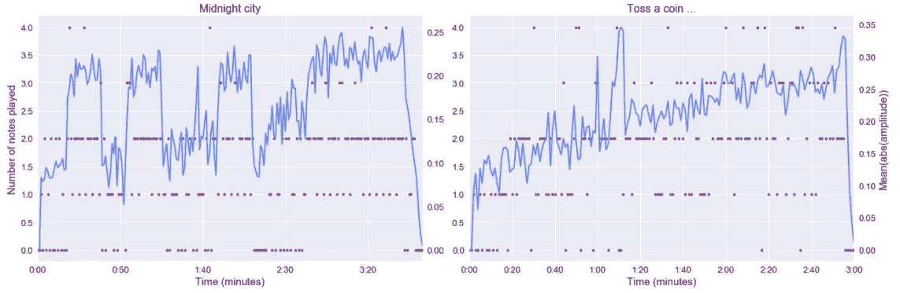

演奏的音符数量似乎高度依赖于信号的振幅。在《午夜之城》中，我们可以用 0 音符来区分平静的时期和振幅更大的更激烈的时期。对于巫师来说，分析不太清楚，但我们仍然可以在笔记幽灵中看到一些相位。现在让我们把注意力放在声乐上。

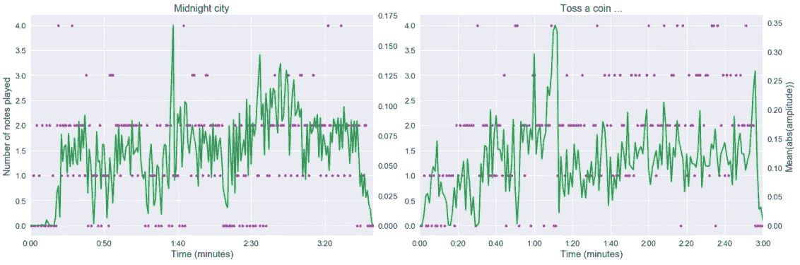

从这个分析来看，午夜城市的音轨看起来并没有受到歌词的影响，对于巫师来说，一分钟左右的人声有明显的影响。最后，我将在播放音符的情况下穿过声谱图(我仍然需要每秒进行一次汇总，在这种情况下我决定取最大值)。

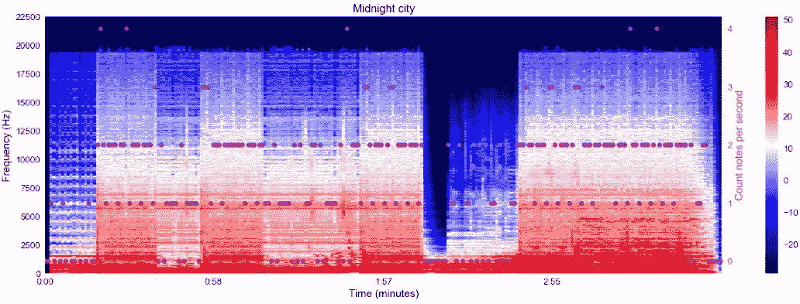

从《午夜城市》的声谱图来看，似乎出现了一个有趣的模式，频率较高的歌曲的区域似乎比频率较低的歌曲更少 0 音符时刻。

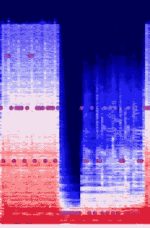

对于巫师来说，声谱图可能不太有表现力。

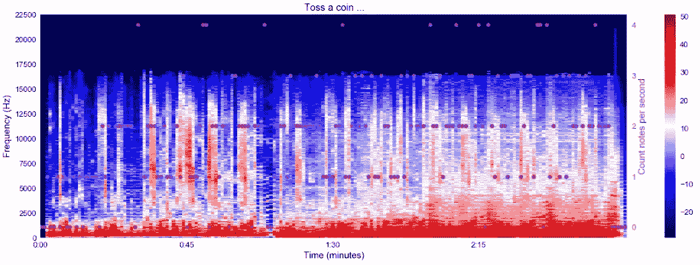

总的来说，以我的观点来看，声谱图的分析可以给出令人兴奋的见解，这可能有助于建立一个基于歌曲的音轨模型。

# 结论

这篇文章是对音乐分析的简要介绍；这是一个值得挖掘的领域，试图围绕这个领域建立像推荐引擎或轨迹生成器这样的系统将会很有趣。


【https://media.giphy.com/media/xTiN0CNHgoRf1Ha7CM/giphy.gif 号

关于这些主题的后续步骤:

*   构建一个更强大的刮刀，围绕用户评级收集更清晰的数据
*   对所有歌曲进行全局分析(基于收集的所有新数据)
*   深入分析 OXAI 围绕轨道建设所做的工作(他们的系统最初是基于 [Dance Dance Revolution](https://arxiv.org/pdf/1703.06891.pdf)
*   深入音乐信息检索会议，了解关于这个主题的更多信息
*   建立一些推荐引擎…