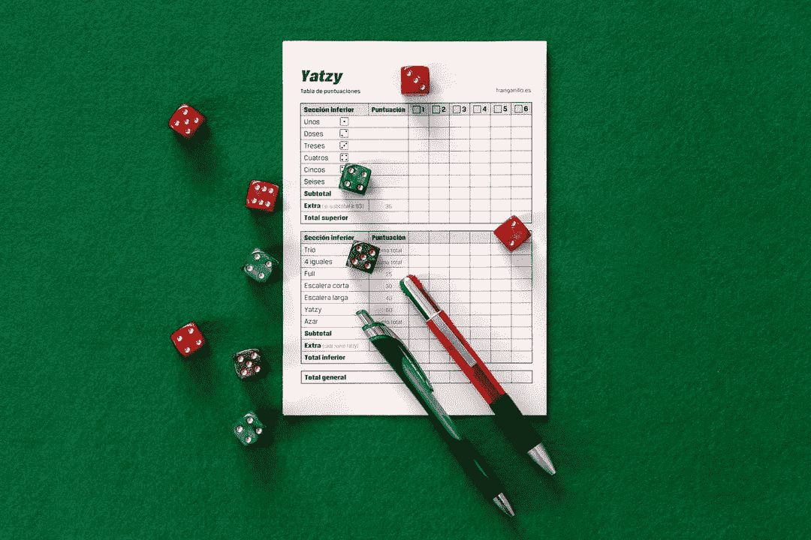
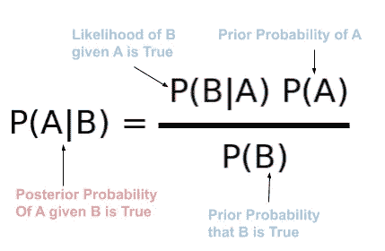
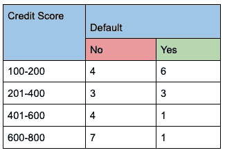
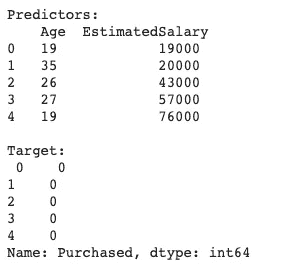
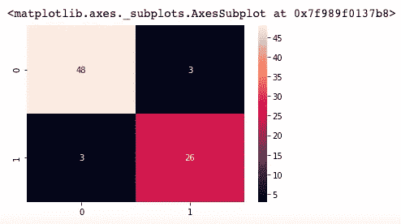
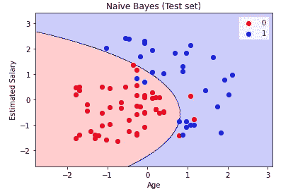

# 朴素贝叶斯分类器简介

> 原文：<https://towardsdatascience.com/introduction-to-naive-bayes-classifier-f5c202c97f92?source=collection_archive---------23----------------------->

Jorge Franganillo 在 [Unsplash](https://unsplash.com/photos/QJCJYfC1uzw) 上的照片

朴素贝叶斯是一个术语，统称为基于**贝叶斯定理**的**分类算法**。对于门外汉来说，分类算法是那些用于将新的观察结果分类到**预定义类别**中的算法。例如，假设您是伦敦一家大银行的数据分析师，您希望根据历史数据来预测客户是否会在银行贷款上欺诈。

你一定想知道这个名字中有“Bayes”，因为这个算法是基于 Bayes 定理的，但是**为什么是“Naive”**？是因为算法“幼稚”还是“哑巴”？不要！！该算法并不“愚蠢”,但事实上，它有时比一些非常复杂的算法更有效。该算法是“幼稚的”,因为它基于一个一般假设，即一个类中某个特定特征的存在是独立于同一类中某个其他特征的存在。例如，如果一个客户有不良信用记录、申请人收入低等等，他/她可以拖欠银行贷款。这两个特征独立地影响候选人违约的概率，也就是说，一个特征的存在与另一个特征无关。

如果有些术语你听起来不熟悉，不要灰心丧气。这一系列文章的目的是以最简单的方式解释机器学习算法。因此，在本系列结束时，您将能够非常轻松地构建自己的机器学习模型。所以让我们继续这篇关于朴素贝叶斯分类器的文章。

**贝叶斯定理！！贝叶斯定理到底是什么？**

贝叶斯定理是一个非常流行的数学公式，用于根据可能与事件相关的条件的先验知识来确定事件的条件概率。

**等等！条件概率到底是什么？**

假设另一个事件已经发生，这是一个结果发生的**可能性**。例如，从一副 52 张牌中抽取两张不替换的牌。假设抽的第一张牌也是 a，那么第二张牌是 a 的概率是多少？

因此，P(抽第一张王牌)=王牌总数/纸牌总数= 4/52

p(抽第二张 a)= 3/51(这是因为在第一次抽牌后，我们的牌组中只剩下 3 张 a，牌的总数也减少到 51 张)。这就是条件概率的含义。第二个事件取决于第一个事件的发生。

回到贝叶斯定理。它在数学上由以下公式给出:

图 1:贝叶斯定理[图片由作者提供]

现在我们对贝叶斯定理有了一个很好的理解。让我们继续了解它在分类问题中的用途。

## 朴素贝叶斯直觉

问题:试着预测一个信用分数为 180 的候选人是否会拖欠贷款。考虑下面的频率表来计算违约的可能性。

图 2:频率表[图片由作者提供]

我们可以按照下面的步骤来计算概率。由于候选人的信用分数为 180，让我们预测一下(100–200)的标签。

步骤 1:计算每个类别的**先验概率**(是和否)

p(是)= 11/29 = 0.379

p(100–200)= 10/29 = 0.345
第二步:找到每个类的每个属性的**似然概率**

p(100–200 | Yes)= 6/11 = 0.545
第三步:利用贝叶斯定理计算**后验概率**

P(是| 100–200)= P(100–200 |是)* P(是)/P(100–200)

= 0.545 * 0.379/0.345 = 0.5989 = 0.599
第四步:做**预测**

因为，候选人违约的概率超过 50%(这是假设的显著性水平，它可以根据用例而不同)，我们可以说候选人将违约。

## 端到端朴素贝叶斯分类器

了解了朴素贝叶斯分类器的工作原理后，让我们尝试使用 **sklearn** 基于它构建一个分类模型。Sklearn 或 scikit-learn 是一个用 python 编写的开源机器学习库。

出于本文的目的，我们将使用 [social_network_ads](https://www.kaggle.com/akram24/social-network-ads) 数据集。在这个问题中，我们将根据年龄和预计工资，通过点击社交媒体上向他/她显示的广告来预测用户是否购买了产品。所以让我们开始吧。

步骤 1:导入基本库

步骤 2:导入数据

图 3:自变量和因变量概览[图片由作者提供]

步骤 3:数据预处理

在数据预处理步骤中，我们首先将数据集分为训练集(80%)和测试集(20%)。接下来，我们使用**标准标量**完成了一些基本的特征缩放。标准标量以平均值为 0、标准差为 1 的方式转换数据。

第四步:模特训练

步骤 5:模型测试和评估

图 4:困惑矩阵[图片由作者提供]

混乱矩阵让我们知道我们的模型有多好。它描述了一个分类模型在一组已知
真值的测试数据上的性能。混淆矩阵中的每一行代表一个实际类别，而每一列代表一个预测类别。

第六步:视觉化

图 5:朴素贝叶斯分类模型的可视化

这一步不是必需的。它只是提供了一个概念，说明模型是如何对数据点进行分类的。

## 包裹

在这篇文章中，我们学习了朴素贝叶斯分类器背后的数学原理，并使用 sklearn 建立了一个模型。在接下来的文章中，我们将学习一些其他的分类算法作为这个系列的一部分，比如逻辑回归，决策树等等。敬请关注。