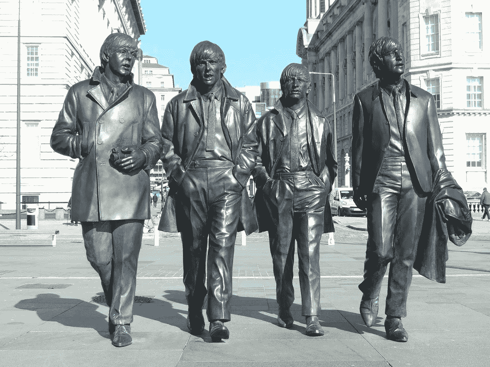
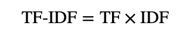
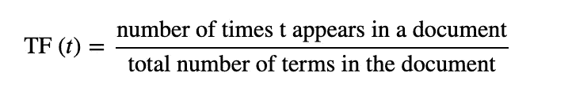
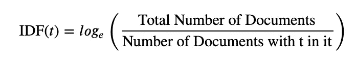
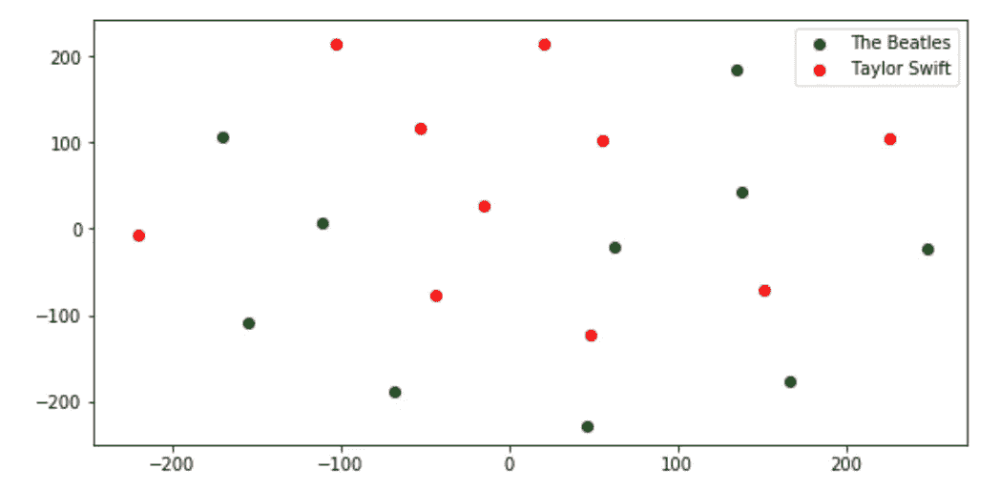
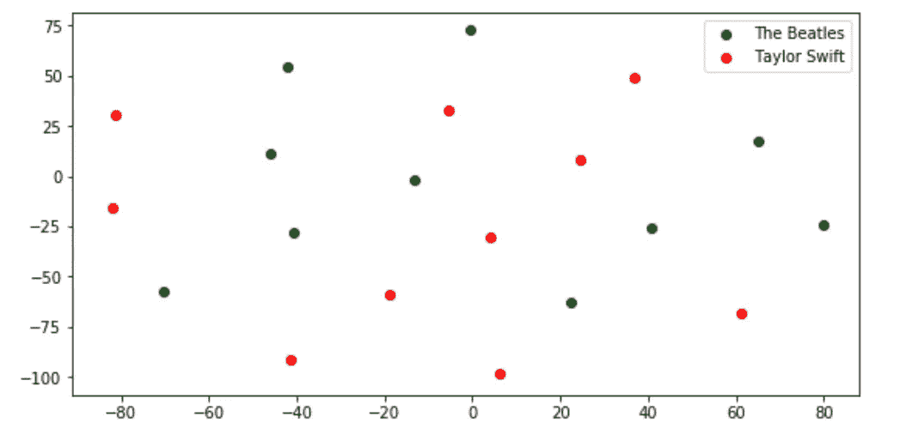

# 甲壳虫乐队和泰勒·斯威夫特的自然语言处理介绍

> 原文：<https://towardsdatascience.com/introduction-to-natural-language-processing-with-the-beatles-and-taylor-swift-2a06055cbc14?source=collection_archive---------35----------------------->

## 使用不同的技术操作非结构化数据，如标记化、词条化、停用词、TF-IDF。



利物浦的披头士雕像。[来源](https://pixabay.com/photos/beatles-liverpool-statue-2395311/)

自然语言处理是一个有趣的领域，因为消除输入句子的歧义以产生机器表示语言是发人深省的。看看著名的格劳乔·马克斯的笑话:

> 一天早上，我射杀了一头穿着睡衣的大象。我永远不知道他是怎么穿上我的睡衣的。

在人的层面上，这句话有几种解读。但是计算机几乎不可能理解。

尽管如此，NLP 的学习曲线并不陡峭，而且可能很吸引人。在这个项目中，我将用披头士和泰勒斯威夫特的歌词来解释自然语言处理的初级水平。最终目标是**比较披头士和泰勒·斯威夫特的歌词的用词**，看看我们能否将它们聚类。要实现这一目标，有 6 个步骤:

*   **过滤和清洗**
*   **标记化**
*   **词干化、词汇化、**和**停用词**
*   **矢量化**
*   **词频—逆文档频率(TF-IDF)**
*   **可视化**

## 0)导入歌曲:

你不需要运行代码来理解这个博客。但是如果你对它感兴趣，你可以在这里找到我的 Github 库。该文件夹的树形结构为:

*   main.ipynb
*   数据->(披头士-> 10 首歌)，(泰勒斯威夫特-> 10 首歌)

甲壳虫乐队:爱我吧，我想牵着你的手，在我的吉他轻轻哭泣的时候，一起来吧，一些事情，埃莉诺·里格比，生活中的一天，不要让我失望，救命，嘿，裘德

泰勒斯威夫特(Taylor Swift):嫌隙，你需要冷静下来，秀气，男人，你属于我，很快你就会好起来，看你让我做什么，我！，爱情故事，22。

```
import glob
TheBeatle=glob.glob("Data/TheBeatle/*.txt")
TaylorSwift=glob.glob("Data/TaylorSwift/*.txt")
filenames=TheBeatle+TaylorSwift
```

我们需要一首歌来做测试，让我们看看“嘿，裘德”的前 4 行

```
with open('Data/TheBeatle/HeyJude.txt') as f:
    test_song = f.readlines()
    test_song = test_song[:4]
    print(test_song)>>> ["Hey Jude, don't make it bad\n", 'Take a sad song and make it better\n', 'Remember to let her into your heart\n', 'Then you can start to make it better\n']
```

太好了，我们刚刚完成了项目的第一步。

## 1) **过滤和清洗**

我们需要问自己的第一个问题是我们要清洁什么。我们的目标是降低句子的复杂性，删除无意义的字符。要更改为不同的歌曲，请查看`filenames`列表并选择歌词对应的目录。从这一点来说，我把链接改为`‘Data/TaylorSwift/YouNeedToCalmDown.txt'`作为例子，因为它的内容有更多有趣的字符需要清理。让我们来看看泰勒·斯威夫特的《你需要冷静》的前几行。

```
["You are somebody that I don't know\n", "But you're takin' shots at me like it's Patrón\n", "And I'm just like, damn, it's 7 AM\n", "Say it in the street, that's a knock-out\n"]
```

我们需要删除`\n`和一些标点符号，如果他们存在。我们想把号码留在那里，它可能表明歌手的风格。小写所有的单词使其易于处理，但可能会使专有名词变成常规名词。我们还需要把你是这个词转换成你是，我是我是，那是那是，采取，但这一步将在后面的步骤中实现。

```
import stringpunctuations = list(string.punctuation)
punctuations.remove("'") #Not include the apostrophe
punctuations+="\n"def clean_song(song):
    cleaned = []
    for line in song:
        for symbol in punctuations:
            line = line.replace(symbol, '').lower()
        cleaned.append(line)
    return cleanedclean_song(test_song)[:4]>>> ["you are somebody that i don't know",
 "but you're takin' shots at me like it's patrón",
 "and i'm just like, damn, it's 7 am",
 "say it in the street, that's a knock-out"]
```

注意，我想把撇号`'`留在那里，因为去掉它可能会使一个单词变得毫无意义

**2)** **标记化**

**标记化**是将字符串、文本标记化或拆分成一系列标记的过程。我们可以把记号看作是部分，就像单词是句子中的记号，句子是段落中的记号一样。

标记一个单词最简单的方法是`split()`方法，它将一个字符串转换成一个字符串数组。然而，这种方法有一个问题。像`don’t`或`Taylor’s`这样的单词是两个不同单词的组合。很难列出适用于所有情况的所有拆分规则。因此，我们需要 NLTK 标记器的帮助。NLTK 代表自然语言处理工具包。它是文本处理的一站式商店，每个人都可以使用。让我们看看 NLTK 函数`word_tokenize`，看看它对一个随机的句子做了什么。

```
from nltk import word_tokenizesentence= "I'm dangerous. Don't underestimate!!!"
print(word_tokenize(sentence))
print(sentence.split(" "))>>>['I', "'m", 'dangerous', '.', 'Do', "n't", 'underestimate', '!', '!', '!']
>>>["I'm", 'dangerous.', "Don't", 'underestimate!!!']
```

注意`word_tokenize`将否定形式的`*verb*` *拆分为`verb` + `n’t`。它还将感叹号和点号从单词中分离出来。在这种情况下，我们已经在前面的部分照顾到了标点符号，但重复是可以的。下面是接收歌曲的干净版本并对其进行标记的函数:*

```
def tokenize(song):
    joined_song = ' '.join(song) #Join sentences together
    tokenized_song = word_tokenize(joined_song)
    return tokenized_song
```

## **3)词干化、词汇化、**和**停用词**

根据 Geek to Geek 的说法，**词干化**是产生词根/基本词的形态变体的过程。**词尾变化**是将一个词的不同屈折形式组合在一起的过程，因此它们可以作为一个单项进行分析。

几个例子展示了每种方法对我们工作的不同影响，并决定了我们想要包含哪种方法

```
from nltk.stem import PorterStemmer  
from nltk.stem import WordNetLemmatizer 

ps = PorterStemmer() 
lemmatizer = WordNetLemmatizer()# choose some words to be stemmed 
words = ["takin'", "knock-out", "don't", "dangerous","working", "apples", 'better', 'died' ] 

for w in words: 
    print(w,":", ps.stem(w),lemmatizer.lemmatize(w,pos ="v"))>>> 
takin' : takin' takin'
knock-out : knock-out knock-out
don't : don't don't
dangerous : danger dangerous
working : work work
apples : appl apples
better : better better
died : die die
```

第一列是我们文本中的单词，后面是**词干**和**词条列**。词干是处理单词的一种简单方法。它只是根据某些特定的规则截断单词，将其转换为词根。有时候会把单词搞得很乱。我们不希望`apples`变成`appl`。这就是为什么我做**不选**炮泥的原因。

另一方面，词汇化之后是更复杂的规则。注意在方法中`lemmatize`把`pos` ( **词性**)改成了`“v”`(动词)。所以`died`变成了`die`。如果我们把`pos`改成`"n"`，`apples`就会变成`apple`。如果我们把`pos`改成`"a"`(形容词)，`better`就会变成`good`。我们可以过滤许多其他层，但是为了更简单，我将依次应用`“a”`、`”v”`和`“n”`层。

**停用词:**停用词是我们可以简单忽略的常用词(如“the”、“A”、“an”、“in”)，因为它们不会给我们的分析带来任何价值。下面的代码显示了我们如何从`nltk`导入停用词列表

```
from nltk.corpus import stopwordsstopwords_list = stopwords.words('english')
print(len(stopwords_list))
print(stopwords_list[:10])
print(stopwords_list[35:45])>>>179
>>>['i', 'me', 'my', 'myself', 'we', 'our', 'ours', 'ourselves', 'you', "you're"]
>>>['what', 'which', 'who', 'whom', 'this', 'that', "that'll", 'these', 'those', 'am']
```

有 179 个停用词，但我不想全部使用。对于这个项目，我认为**代词**可能表明作者对这首歌的观点。例如，我在本文中使用“我们”,因为我希望读者和我在同一页上。你和我在歌曲中重复的词可能表明这首歌实际上是作者的故事。泰勒·斯威夫特因写她过去恋情的爱情故事而闻名，这可能是她与披头士的区别。然而，第 35 个停用词可能就没那么有趣了

我还创建了几个不在列表中的停用词。我知道该补充些什么，因为我尝试过不同的歌曲来理解缺失了什么。让我们为我们已经讨论过的内容创建一个函数:

```
from nltk.corpus import stopwords
from nltk.stem import WordNetLemmatizerstopwords_list = stopwords.words('english')
stopwords_list=stopwords_list[35:]
stopwords_list+=["n't", "it", "'s","'m", "'re","'"]
lemmatizer = WordNetLemmatizer()def lemmatize_remove_stopwords(tokenize_list):
    lemmatized_words=[]
    for w in tokenize_list:
        w=lemmatizer.lemmatize(w,pos ="a")
        w=lemmatizer.lemmatize(w,pos ="n")
        w=lemmatizer.lemmatize(w,pos ="v")
        lemmatized_words.append(w)
    song_noStopword = [i for i in lemmatized_words if i not in stopwords_list]
    return song_noStopwordprint(lemmatize_remove_stopwords(tokenize(test_song))[:23])>>> ['you', 'somebody', 'i', 'know', 'you', 'takin', 'shoot', 'me', 'like', 'patrón', 'i', 'like', 'damn', '7', 'say', 'street', 'knockout']
```

## 4) **矢量化和计数频率**

有了一个非常好的可以清理和标记歌曲的函数后，我们的下一步是计算每个单词出现的次数。该函数将接收一个令牌列表，并返回唯一的令牌及其计数。注意，在后面一步，我们要比较*所有歌曲的相似度。*因此**，t** 第二个输入(可选)应该是所有歌曲的**唯一令牌。**我们来看看下面的功能:

```
def vectorize_and_freq(song, vocab=None):

    if vocab:
        unique_words = vocab
    else:
        unique_words = list(set(song)) #initial bag of word dictionary
    song_dict = {i:0 for i in unique_words} 

    for word in song:
        song_dict[word] += 1

    return song_dictoutput_=lemmatize_remove_stopwords(tokenize(test_song))
output_=vectorize_and_freq(output_)
list(output_.items())[:10]>>> [('le', 1), ('But', 6), ('okay', 1), ('bone', 1), ('calm', 8), ('When', 1), ('must', 1), ('your', 2), ('see', 1), ('like', 7)]
```

太棒了。你差不多完成了。现在到了项目中最重要的一步。

## **4)词频—逆文档频率(TF-IDF)**

TF-IDF 是两个单独指标的组合，即 TF 和 IDF。当我们有多个文档时，使用 TF-IDF。这个想法是一个单词在一种类型的文档中出现的次数比其他的多。这一步的最终目标是有一个包含 20 首歌曲的表格，其中的列是所有文档中唯一的 vocabs。每列中的值是由 TF-IDF 公式分配的每个单词的相应权重



**a)术语频率**



顾名思义，我们希望找到单词`t`在单个文档中的出现率。让我们创建词频函数，并显示在**整首歌**中最常见的前 10 个词。

```
def term_frequency(BoW_dict):
    total_word_count = sum(BoW_dict.values()) 

    for ind, val in BoW_dict.items():
        BoW_dict[ind] = val/ total_word_count

    return BoW_dict#Apply different function 
output_=clean_song(test_song)
output_=tokenize(output_)
output_=lemmatize_remove_stopwords(output_)
output_=vectorize_and_freq(output_)
ouput_=term_frequency(output_)#Sort the output_ dictionary by values and then keys
ouput_=sorted(ouput_.items(), key = lambda kv:(kv[1], kv[0]),reverse=True)for i in ouput_[:5]:
    print(i)>>> ('you', 0.1542056074766355)
>>> ('ohoh', 0.14018691588785046)
>>> ('need', 0.056074766355140186)
>>> ('like', 0.04672897196261682)
>>> ('i', 0.037383177570093455)
```

`term_frequency's`函数只是一个标准化的`vectorize_and_freq`函数，在一首歌中使用 vocabs。

**b)逆文档频率**

逆文档频率取文档总数与包含单词`t`的文档数之比的自然对数:



```
def inverse_document_frequency(dicts_list):
    #0 : Total Number of Document
    num_doc=len(dicts_list)

    #1: Find all the unique words for all the document
    vocab_set=[]
    for d in dicts_list:
        for word in d.keys():
            vocab_set.append(word)
    vocab_set=set(vocab_set)

    #2: Number of document with t in it
    idf_t = {i:0 for i in vocab_set} #initial lize the list

    for word in idf_t.keys():
        docs = 0
        # Find number of doc for each word
        for d in dicts_list:
            if word in d:
                docs += 1

        # Compute idf for each t
        idf_t[word] = np.log((num_doc/ float(docs)))

    return idf_t
```

在分别计算了每个 TF 和 IDF 之后，让我们将它们组合在一起

```
def tf_idf(dicts_list):
    # Vocab for corpus
    doc_tf_idf = {}
    idf = inverse_document_frequency(dicts_list)
    full_vocab_list = {i:0 for i in list(idf.keys())}

    # Create tf-idf list of dictionaries, containing a dictionary that will be updated for each document
    tf_idf_list_of_dicts = []

    # Now, compute tf and then use this to compute and set tf-idf values for each document
    for doc in dicts_list:
        doc_tf = term_frequency(doc)
        for word in doc_tf:
            doc_tf_idf[word] = doc_tf[word] * idf[word]
        tf_idf_list_of_dicts.append(doc_tf_idf)
    return tf_idf_list_of_dicts
```

该函数获取每首歌曲的词汇字典列表，并为每首歌曲中的每个词汇创建相应的“tf-idf”权重。注意，这些权重不能为 0，因为 TF 和 IDF 项总是大于 0。

最后，我们希望将我们创建的所有函数组合成一个元函数:

```
def main(filenames):
    # Iterate through list of filenames and read each in
    cvad = [] #count vectorized all documents
    for file in filenames:
        with open(file) as f:
            raw_data = f.readlines()
        # Clean and tokenize raw text
        ouput_ = clean_song(raw_data)
        ouput_ = tokenize(ouput_)
        ouput_=lemmatize_remove_stopwords(ouput_)  
        ouput_ = vectorize_and_freq(ouput_)
        cvad.append(ouput_)
    # tf-idf representation of everything
    tf_idf_all_docs = tf_idf(cvad)

    return tf_idf_all_docstf_idf_all_docs = main(filenames)print("Number of Dimensions: {}".format(len(tf_idf_all_docs[12])))
for key, value in list(tf_idf_all_docs[15].items())[20:25]:
    print(key,value)>>> Number of Dimensions: 712
>>> let 0.003921735518976991
>>> happy 0.016807190459810554
>>> get 0.006288801694780355
>>> your 0.01002310915754525
>>> think 0.0033410363858484165
```

这个主函数的输出是 20 首歌曲的列表，每个单词对应一个 tf-idf 权重。20 首歌里有 712 个 vocabs(词根)。上面的输出显示了泰勒·斯威夫特的《微妙》中一些词汇的 tf-idf 权重。

可视化

我们的目标是把这 20 首歌画在一个可视化的空间里。然而，有 712 个维度。谈到降维，我想到的有两种方法:**主成分分析(PCA)** 和**T-分布式随机邻居嵌入(t-SNE)。**PCA 侧重于保持数据点从高维到低维的方差，而 t-SNE 侧重于相似点的概率分布。因此 t-SNE 更适合这个项目。

让我们定义将数据转换为 2D 的 t-SNE 实例:

```
import numpy as np
import matplotlib.pyplot as plt
from sklearn.manifold import TSNEnp.random.seed(4)
tf_idf_all_docs = main(filenames)
tf_idf_vals_list= [list(i.values()) for i in tf_idf_all_docs] 
TSNE_2d = TSNE(n_components=2)
data_2d = TSNE_2d.fit_transform(tf_idf_vals_list)
```

请注意，我将种子更改为 4，因为在不同的运行中可能会有不同的结果。原因是不像 PCA，t-SNE 有一个非凸的目标函数。使用随机启动的梯度下降优化来最小化目标函数。让我们来看看我们歌曲中的 2D 情节:

```
TheBeatle = data_2d[:10]
beatle_x = [i[0] for i in TheBeatle]
beatle_y = [i[1] for i in TheBeatle]TaylorSwift = data_2d[10:]
ts_x = [i[0] for i in TaylorSwift]
ts_y = [i[1] for i in TaylorSwift]fig = plt.figure(figsize=(20,10))
ax = fig.add_subplot(222)
ax.scatter(beatle_x, beatle_y, color='g', label='The Beatles')
ax.scatter(ts_x, ts_y, color='r', label='Taylor Swift')
ax.legend()
plt.show()
```

这是 4 号种子的结果



种子=4 的 t-SNE 2D 地图。资料来源:Huy Bui

该图没有真正显示清晰的集群。让我们试试 10 号种子



种子=10 的 t-SNE 2D 地图。资料来源:Huy Bui

这些点更加分散。关于这个结果，我们可以总结出几点:

*   也许我们没有足够的歌曲
*   也许预处理步骤没有真正概括每个歌曲作者的特征
*   首先，也许没有太大的区别。
*   也许我们可以做更多的特色工程。但是这超出了本文的范围。

有很多不确定性，但我们肯定知道的一件事是，NLP 需要很多思想和技术来产生一些有意义的东西。

# 摘要

在这个项目中，我们学习了自然语言处理中的一些基本概念，如标记化、词干化、词汇化、TF-IDF，以及各种删除停用词和可视化结果的策略。

感谢阅读！