# 神经网络导论—第 1 部分

> 原文：<https://towardsdatascience.com/introduction-to-neural-networks-part-1-3bb27a8d314a?source=collection_archive---------17----------------------->

## [入门](https://towardsdatascience.com/tagged/getting-started)

## 理解最早的模型:感知器和 Adaline


[乌列尔 SC](https://unsplash.com/@urielsc26?utm_source=medium&utm_medium=referral) 在 [Unsplash](https://unsplash.com?utm_source=medium&utm_medium=referral) 上的照片

WAI 的目的是什么？毫无疑问，这是为了满足人类使用不同的概念、模型和技术创造类似人类的机器的渴望，这些概念、模型和技术仍在不断改进，因为你越成长，你的需求就越大。1943 年，沃伦·麦卡洛克和沃尔特·皮茨用电路模拟了一个简单的神经元，由此产生了模拟人类神经元或者换句话说创造一个人造神经元的想法。当然，这只是人工神经网络(ANN)历史上的一小部分。如果你想知道更多，那就看看这个。

## 动机

多年来，AI 了解了许多不同的模型，例如:

*   一元/多元线性回归
*   一类/多类的逻辑回归(分类)(一对多技术)

所有这些提到的模型之间的共同因素是它们的线性，它们只能应用于**可线性分离的**数据，这实际上是导致创建神经网络模型的原因之一，即使最早的模型也是线性分类器(线性分隔符)。本质上，它过去是，现在仍然是一种试图模仿大脑的算法，大脑是迄今为止我们知道的最强大的学习机器。

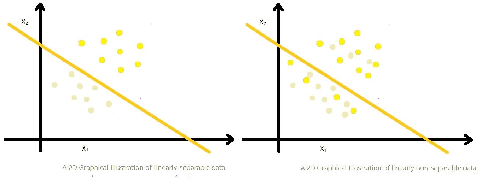

作者图片

所以，在开始理论之旅之前，我们先来了解一下什么是**前馈神经网络**；

*   **前馈神经网络:**是一种神经网络，其中节点(定义如下)之间的连接不形成循环。不同于它的后代**递归神经网络** (RNN)(在以后的文章中可以看到)。本文讨论的模型属于前馈神经网络类型。

# 感知器，根

一个单层神经网络，一个线性阈值单元( **LTU** ) **/** 门( **LTG** )，甚至一个神经元……随便你怎么称呼。人类神经元是一种从其他细胞接收电信号作为输入并基于此输出信号的细胞。这个神经元使用数值来做完全相同的工作，这就是数学成为你最好的朋友的时候！

如果你熟悉前面提到的线性分类器，那么你肯定知道什么是**假设函数**，什么是**决策边界**代表什么。如果没有，让我快速介绍一下:

*   **假设:**最能描述目标的函数称为 ***Y*** 。
*   **决策边界:**最佳拟合线，能够根据不同的类标签分离数据。每个分类器的目标是找到决策边界。注意，在二进制分类中， *i* t 是*真*和*假*值**即** *之间的战斗。一*和*零*。

模型描述如下:

*   **输入值(X):** 单样本 ***x* ，**特征向量(属性)****x₁…xₙ****
*   ***权值(W):** 称为*θ*(theta)偶尔，一个向量的参数用来形成不同节点之间的连接，每个权值都与一个输入*相关联，并显示它将对输出产生多大的影响。**
*   ****偏置(b):** 节点 ***x₀*** ，带有*****1***的常数值。即使所有输入都为空，也能保证神经元的激活。****
*   ******净输入(net):** 权重和输入的点积，很多时候叫做 ***z*** 。****

****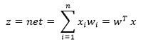****

*   ******激活函数:**阈值函数 ***g(z)*** ，使感知器成为二元分类器(2 类标签函数)。阈值表示为 ***θ*** 。****

********

****为了简化 ***g(z)* ，**我们把 ***θ*** 带到左边，认为它是与偏差相关联的参数**【w₀】**，***【g(z)***， ***z*** 变成:****

****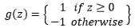********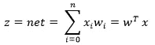****

*   ******输出(假设):**激活函数的结果，简称为***【o(x)***这也是假设的结果***【h(x)***。****

****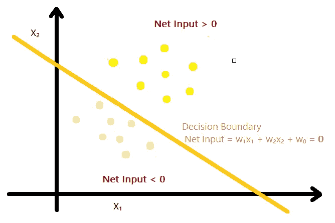****

****2D 决策边界图解—作者图片****

## ****感知器训练规则…谢谢罗森布拉特****

****假设权重已经用小数字随机初始化，第一个样本 ***x*** 正在运行感知器模型，最终输出指示一个错误的类，现在该怎么办？这是 AI 吗？****

****幸运的是没有，该模型将通过改进*值在每次迭代中学习，因此它可以使用 **Rosenblatt** 在 1959 年引入的以下训练/学习规则来更好地执行:*****

**********

*   *******学习率:**一个**超参数** ，它控制每次更新模型权重时响应估计误差而改变模型的程度。传统值为 *0.1* 或 *0.01* ，始终在 *0* 和 *1* 的范围内。*****

****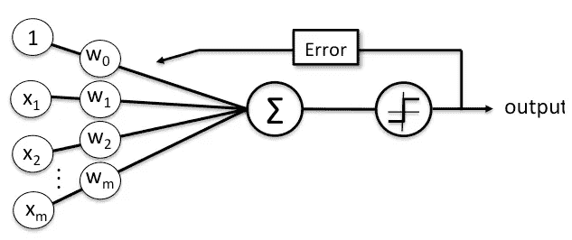****

****感知器分类器示意图——由 [mlxtend](http://rasbt.github.io/mlxtend/) 拍摄****

****现在，我们已经为算法做好了准备:****

```
****- Random initialization of the weights, with small numbers
- For each epoch:
  - For each training sample xϵX**:
     .** Calculate output value o(x)
     .  For i from 1..n:
           w*ᵢ =* w*ᵢ +* ∆w*ᵢ*****
```

****这个小怪物实际上能够表示各种功能，如 **And、Or、Nand、Nor、m-of-n**…还有很多。但也有很多情况下它会失败，例如 **XOR** 函数，因为这个函数不是**线性可分的**，所以模型将无法为它找到正确的决策边界，并且会无限地使用相同的权重留在循环内，除非你组合多个感知器，换句话说，形成感知器的**网络**(不能推广到所有线性不可分的数据):****

****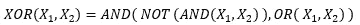****

****如果我们给上面显示的每个逻辑操作分配一个感知器，我们将使用三个已经训练好的模型(**和**、**或**和**而不是**)来训练一个复杂的感知器。更多详情，请查看[本](/perceptrons-logical-functions-and-the-xor-problem-37ca5025790a)出。****

****感知器模型仍然是上面提到的**麦卡洛克-皮茨**神经元的计算版本，它当然不能满足现代人工智能的要求。这就是为什么 **Adaline** 出现了！！**(不是电影)******

# ****自适应线性神经元时代(Adaline)****

## ****和感知器一样的结构，不同的引擎！****

****由 **Widrow** 和 **Hoff** 于 **1960 年**开发，被认为是许多复杂的机器学习算法的基础，如逻辑回归和支持向量机(SVMs)。还有一个二元分类器和一个线性分隔符。****

****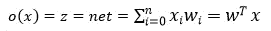****

*   ******激活函数:**净输入***【z】***的线性函数(恒等函数)记为***【x】***。****
*   ****仍然需要使用阈值函数 ***g(z)*** 。****
*   ****与感知器模型不同，Adaline 使用连续输出 ***z*** 来学习模型权重。这比仅仅利用预测类标签要有效得多。****

****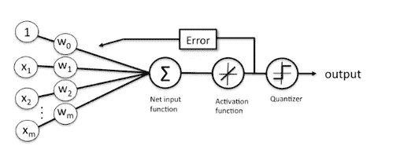****

****Adaline 分类器示意图—由 [mlxtend](http://rasbt.github.io/mlxtend/) 成像****

****Adaline 类似于应用**线性回归**，唯一的区别是使用阈值函数将最终输出转换为分类输出。该模型使用所谓的**代价函数** ***J(w)*** 来估计其误差。这背后的逻辑是，最佳拟合线被定义为**最小化误差平方和(SSE)** 的线。误差被认为是数据点(一个样本)与拟合线(判定边界)的垂直偏差(残差)。在这个阶段，一些细节可能看起来有点模糊，但如果你继续阅读，将会得到进一步的解释。****

****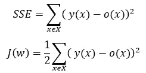****

****其中 ***X*** 是训练样本的集合， ***y(x)*** 一个训练样本的目标***X******o(X)***是连续输出(净输入) ***z*** 。****

*   ****成本函数是误差平方和(**凸**)除以 2，以便于推导过程。****

****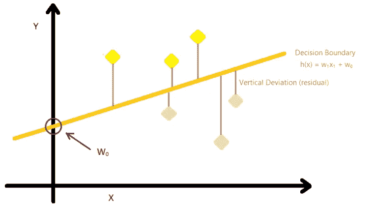****

****2D 线性回归模型中垂直偏差的图示-图片由作者提供****

## ****优化…我们来了****

****我们讨论了成本函数，并且碰巧提到了术语**最小化**…因为误差函数存在的主要原因是**最小化**误差，因此得名！****

****我们认为有两种主要方法可以做到这一点:****

*   ****正规方程(封闭解)****
*   ****标准/随机梯度下降****

****在本文中，我们将涵盖标准和随机梯度下降技术。该过程是直接的，我们在每次迭代中计算成本函数的值，通过在特定点 **( *w，J(w)* )** 寻找正切值(**偏导数**)向函数的全局最小值前进一步，并使用**Delta 规则**更新权重。当达到全局最小值(或局部最小值)时，循环停止(**零导数**)。****

******嗯..德尔塔法则…这是怎么回事？******

****还记得在**感知器**中，权重是如何根据 **Rosenblatt** 的学习规则更新的吗，与 **Adaline** 中的前提相同，但公式不同。****

****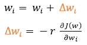****

*   ****减号表示我们正朝着成本梯度的相反方向前进一步，如图所示。****

## ****梯度下降****

****现在我们已经到了推导部分，如果你只对结果表达式感兴趣，你可以跳过它。否则，推导过程如下:****

****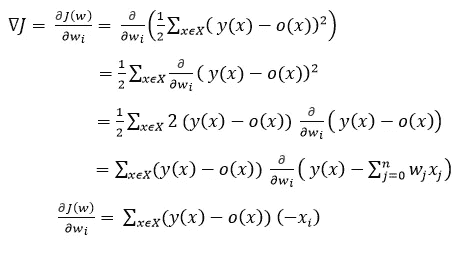****

****成本函数的偏导数 ***J(w)*** w.r.t 各权重 ***wᵢ (i ϵ 1..n)*** 是:****

****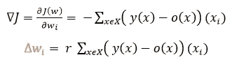************

****梯度下降—由 [mlxtend](http://rasbt.github.io/mlxtend/user_guide/general_concepts/gradient-optimization/) 成像****

******标准梯度下降(物品)******

****称为 **Batch-GD** 模式，用于在处理整个数据集后更新权重，因此步长较大。然而，它不能保证找到全局最小值，并且如果代价函数是非凸的，它可能容易收敛到局部最小值。****

```
****- Random initialization of the weights, with small numbers
- For each epoch : **.** Calculate output value o(x)for each training sample xϵX
  .  Calculate cost gradient ∇J
  .  For i from 1..n :
        w*ᵢ =* w*ᵢ +* ∆w*ᵢ*****
```

******随机梯度下降******

****也被称为**迭代/在线模式**，用于计算成本梯度并在每个训练样本之后更新权重，这使得即使成本函数是非凸的，也更有可能找到全局最小值。因此，收敛需要更多的时间(达到最小成本)。****

```
****- Random initialization of the weights, with small numbers
- For each epoch :
  - For each batch training sample xϵX **:
     .** Calculate the output value o(x)
     .  Calculate cost gradient ∇J
     .  For i from 1..n :
           w*ᵢ =* w*ᵢ +* ∆w*ᵢ*****
```

******让 GD 算法收敛更快的方法******

*   ****在大规模机器学习系统中，通常使用**小批量**，这是 **GD** 和 **SGD 之间的折衷。**比 **SGD** 产生更平滑的收敛。****
*   ****当特征相差**数量级**时，**特征缩放**提供数值稳定性，使得更有可能使 GD 收敛得更快。存在各种方法，例如**最小-最大归一化**和**标准化**。****

## ****检查学习率值****

****本节展示了绘制学习曲线对于梯度下降算法的重要性。有时，当 GD 没有很好地收敛或者根本没有收敛时，问题可能出在你选择的学习率值上。****

*   ******太大:**算法可能超过最小值并发散，如左图所示。****
*   ******太小:**可能需要太多的历元来收敛(小步)，并且可能导致局部最小值而不是全局最小值。****

****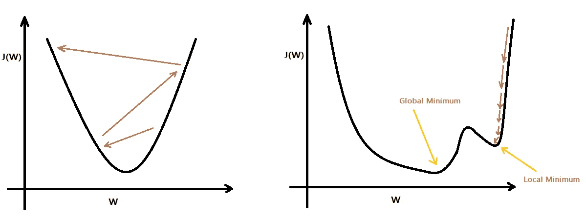****

****学习率较大和较小的 GD 行为****

## ****决策边界方程****

****当您有一个二维输入向量时，分隔线方程的类型为:****

****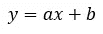****

****其中 ***a*** 称为**斜率**和***b***y 轴截距**。******

******先将净输入 ***z*** 设置为***0；*********

******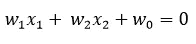******

******如果把***【x₁】***、 ***x₂、*** 和 ***w₀*** 分别换成 ***、*** ***y、a、b、*** 和 ***C*** ，看起来就像是一条线的标准方程。******

******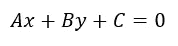******

******下一步是寻找 **x 轴截距**和 **y 轴截距**，这样你就得到直线上的两点，这样你就可以最终找到斜率，即*。*******

## *******摘要*******

*******神经网络的两个初始模型是:*******

*   *******感知器*******
*   *******自适应线性神经元*******

*******相似之处:*******

*   *******线性分类器*******
*   *******二元分类器*******
*   *******阈值函数的使用*******

*******差异:*******

*   *******感知器模型使用其预测的类别标签(分类输出)和 ***感知器学习规则*** 来学习其系数(权重)。*******
*   ******另一方面，Adaline 使用其连续结果和 ***delta 规则*** 以获得更高的准确性。******

******如果 GD 算法在几个纪元后仍然停滞不前，那么您可能需要考虑调整您的学习率值以获得更好的性能。******

******[1]:阿卜杜勒·拉森。(2020 年 7 月)。https://morioh.com/p/1d9e1c91f4a3 的 FNN 和 CNN 使用 Pytorch******

******[2]:帕布。(2018 年 7 月 3 日)。了解超参数及其优化技术[https://towards data science . com/understanding-hyperparameters-and-its-optimization-techniques-f 0 debba 07568 #:~:text = In % 20 statistics % 2C % 20 hyperparameter % 20 is % 20a，Model % 20 parameters % 20 vs % 20 hyperparameters](/understanding-hyperparameters-and-its-optimisation-techniques-f0debba07568#:~:text=In%20statistics%2C%20hyperparameter%20is%20a,Model%20parameters%20vs%20Hyperparameters)******

******[3]:杰森·布朗利。(2020 年 9 月 12 日)。了解学习率对神经网络性能的影响[https://machine Learning mastery . com/understand-the-dynamics-of-Learning-Rate-on-deep-Learning-Neural-networks/](https://machinelearningmastery.com/understand-the-dynamics-of-learning-rate-on-deep-learning-neural-networks/)******