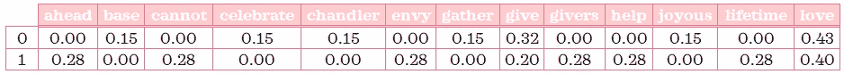
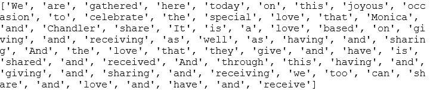
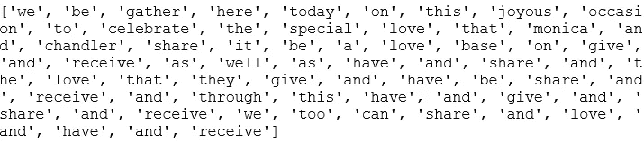
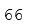
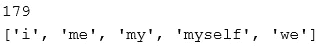
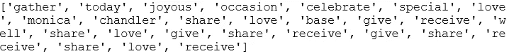
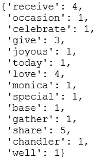
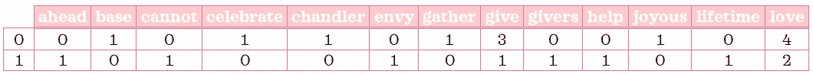

# NLP 介绍——第 1 部分:用 Python 预处理文本

> 原文：<https://towardsdatascience.com/introduction-to-nlp-part-1-preprocessing-text-in-python-8f007d44ca96?source=collection_archive---------19----------------------->

欢迎来到 NLP 入门！这是 5 篇系列文章的第一部分。这篇文章将展示一种预处理文本的方法，使用一种叫做单词包的方法，其中每个文本都用它的单词来表示，而不管它们出现的顺序或嵌入的语法。预处理时，我们将完成以下步骤:

1.  象征化
2.  正常化
3.  删除停用词
4.  计数矢量
5.  转换到 tf-idf 表示

💤这些术语对你来说像是胡言乱语吗？不要担心，当你读完这篇文章的时候，他们已经不在了！🎓


萨法尔·萨法罗夫在 [Unsplash](https://unsplash.com?utm_source=medium&utm_medium=referral) 上拍摄的照片

# 0.Python 设置🔧

我假设读者(👀是的，你！)可以访问并熟悉 Python，包括安装包、定义函数和其他基本任务。如果你是 Python 的新手，[这个](https://www.python.org/about/gettingstarted/)是一个入门的好地方。

我已经使用并测试了 Python 3.7.1 中的脚本。在我们开始之前，让我们确保你有合适的工具。

## ⬜️确保安装了所需的软件包:pandas， *nltk* & sklearn

我们将使用以下强大的第三方软件包:

*   *熊猫*:数据分析库，
*   *nltk:* 自然语言工具包库和
*   *sklearn:* 机器学习库。

## ⬜️ **从 nltk 下载“停用词”和“wordnet”语料库**

下面的脚本可以帮助你下载这些语料库。如果您已经下载了，运行此程序将通知您它们是最新的:

```
import nltk
nltk.download('stopwords') 
nltk.download('wordnet')
```

# 1.数据📦

为了使事情易于管理，我们将使用微小的文本数据，这将允许我们监视每一步的输入和输出。对于这个数据，我选择了情景喜剧[老友记](https://www.imdb.com/title/tt0108778/)中乔伊为钱德勒和莫妮卡的婚礼准备的演讲稿。

他的演讲是这样的:

```
part1 = """We are gathered here today on this joyous occasion to celebrate the special love that Monica and Chandler share. It is a love based on giving and receiving as well as having and sharing. And the love that they give and have is shared and received. And
through this having and giving and sharing and receiving, we too can share and love and have... and receive."""part2 = """When I think of the love these two givers and receivers share I cannot help but envy the lifetime ahead of having and loving and giving and receiving."""
```

如果你没有看到我提到的部分，YouTube 上有一些短视频(关键词:乔伊的婚礼致辞)。我认为乔伊的表演和莫妮卡和钱德勒的反应绝对让这个演讲比单纯的文字有趣多了。写这个帖子给了我一个很好的借口来反复观看这个场景，我无法满足它。🙈

# 2.最终代码📃

首先，让我们用包和数据准备环境:

```
# Import packages and modules
import pandas as pd
from nltk.stem import WordNetLemmatizer
from nltk.tokenize import RegexpTokenizer
from nltk.corpus import stopwords
from sklearn.feature_extraction.text import TfidfVectorizer# Create a dataframe
X_train = pd.DataFrame([part1, part2], columns=['speech'])
```

其次，让我们定义一个文本预处理函数，将其传递给 *TfidfVectorizer* :

```
def preprocess_text(text):
    # Tokenise words while ignoring punctuation
    tokeniser = RegexpTokenizer(r'\w+')
    tokens = tokeniser.tokenize(text)

    # Lowercase and lemmatise 
    lemmatiser = WordNetLemmatizer()
    lemmas = [lemmatiser.lemmatize(token.lower(), pos='v') for token in tokens]

    # Remove stopwords
    keywords= [lemma for lemma in lemmas if lemma not in stopwords.words('english')]
    return keywords
```

最后，让我们利用前面定义的函数对文本数据进行预处理:

```
# Create an instance of TfidfVectorizer
vectoriser = TfidfVectorizer(analyzer=preprocess_text)# Fit to the data and transform to feature matrix
X_train = vectoriser.fit_transform(X_train['speech'])# Convert sparse matrix to dataframe
X_train = pd.DataFrame.sparse.from_spmatrix(X_train)# Save mapping on which index refers to which words
col_map = {v:k for k, v in vectoriser.vocabulary_.items()}# Rename each column using the mapping
for col in X_train.columns:
    X_train.rename(columns={col: col_map[col]}, inplace=True)
X_train
```



tf-idf 矩阵(未显示所有列)

Ta-da❕我们将文本预处理成特征矩阵。这些脚本在没有任何解释的情况下有意义吗？让我们在下一节通过例子来分解和理解开头提到的 5 个步骤。

# 3.最终代码分解和解释🔍

## **第一步:标记化**

> *💡* " [给定一个字符序列和一个定义好的文档单元，标记化就是把它分割成小块的任务，叫做标记，也许同时扔掉某些字符，比如标点符号。](https://nlp.stanford.edu/IR-book/html/htmledition/tokenization-1.html)

在这一步，我们将把一个字符串 *part1* 转换成一个记号列表，同时去掉标点符号。我们有许多方法可以完成这项任务。我将通过使用 *nltk:* 中的 *RegexpTokenizer* 向您展示一种方法

```
# Import module
from nltk.tokenize import RegexpTokenizer# Create an instance of RegexpTokenizer for alphanumeric tokens
tokeniser = RegexpTokenizer(r'\w+')# Tokenise 'part1' string
tokens = tokeniser.tokenize(part1)
print(tokens)
```

让我们来看看*令牌*是什么样子的:



代币

我们看到每个单词现在是一个单独的字符串。你注意到同一个词有不同的用法了吗？例如:单词的大小写可以不同:“and”和“and”或它们的后缀:“share”、“shared”和“sharing”。这就是标准化的由来。

## 第二步。正常化

> *💡* *把一个词规格化就是把它转换成它的词根形式。*

词干分析和词条解释是规范化文本的常用方法。在这一步中，我们将使用 lemmatisation 将单词转换为它们的字典形式，并通过将所有单词转换为小写来消除大小写差异。

🔗如果你想了解更多关于词干和词尾的知识，你可能想看看这个系列的第二部分。

我们将使用 *nltk* 中的 *WordNetLemmatizer* 来对我们的*令牌*进行符号化:

```
# Import module
from nltk.stem import WordNetLemmatizer# Create an instance of WordNetLemmatizer
lemmatiser = WordNetLemmatizer()# Lowercase and lemmatise tokens
lemmas = [lemmatiser.lemmatize(token.lower(), pos='v') for token in tokens]
print(lemmas)
```



前题

这些单词现在被转换成它的字典形式。例如，“分享”、“分享”和“共享”现在都只是“分享”。

```
# Check how many words we have
len(lemmas)
```



我们有 66 个单词，但不是所有的单词对文本意义的贡献都是相同的。换句话说，有些词对关键信息不是特别有用。这就是停用词出现的地方。

## 第三步。删除停用词

> *💡停用词是常见的词，对文本的意义没有什么价值。*

想一想:如果你必须用三个词尽可能详细地描述你自己，你会包括“我”还是“我”？如果我让你在乔伊演讲中的关键词下面划线，你会划‘a’还是‘the’？大概不会。I、am、a 和 The 都是停用词的例子。我想你明白了。

根据文本涉及的领域，可能需要不同的停用词集。在这一步，我们将利用 *nltk 的停用词*语料库。您可以定义自己的停用字词集，或者通过添加适合文本领域的常用术语来丰富标准停用字词。

让我们先稍微熟悉一下*的常用词*:

```
# Import module
from nltk.corpus import stopwords# Check out how many stop words there are 
print(len(stopwords.words('english')))# See first 5 stop words
stopwords.words('english')[:5]
```



在写这篇文章的时候，nltk 的停用词语料库中有 179 个英语停用词。一些例子包括:“我”、“我”、“我的”、“我自己”、“我们”。如果您很想看到完整的列表，只需从最后一行代码中删除`[:5]`。

注意这些停用词是如何小写的？为了有效地删除停用词，我们必须确保所有单词都是小写的。在这里，我们已经在第二步中这样做了。

使用列表理解，让我们从列表中删除所有停用词:

```
keywords = [lemma for lemma in lemmas if lemma not in stopwords.words('english')]
print(keywords)
```



关键词

```
# Check how many words we have
len(keywords)
```

去掉停用词后，我们只有 26 个词，而不是 66 个，但要点仍然保留。

现在，如果您向上滚动到第 2 部分(最终代码)并快速查看一下`preprocess_text`函数，您将会看到这个函数捕获了步骤 1 到 3 中所示的转换过程。

## 第四步。计数矢量

> *💡* [*Count vectorise 是将一组文本文档转换成一个 token counts 的矩阵*](https://scikit-learn.org/stable/modules/generated/sklearn.feature_extraction.text.CountVectorizer.html#sklearn.feature_extraction.text.CountVectorizer) *。*

现在让我们来看看步骤 3 中*关键词*中每个单词的计数:

```
{word: keywords.count(word) for word in set(keywords)}
```



关键词计数

“给予”这个词出现了三次，而“快乐”只出现了一次。

这就是计数矢量器对所有记录所做的事情。*计数矢量器*通过 *n* 将文本转换成一个 *m* 的矩阵，其中 m 是文本记录的数量，n 是所有记录中唯一的*标记*的数量，矩阵的元素指的是给定记录的*标记*的计数。

在这一步，我们将把文本数据帧转换成计数矩阵。我们将把我们的自定义预处理器函数传递给*计数矢量器:*

```
# Import module
from sklearn.feature_extraction.text import CountVectorizer# Create an instance of CountfVectorizer
vectoriser = CountVectorizer(analyzer=preprocess_text)# Fit to the data and transform to feature matrix
X_train = vectoriser.fit_transform(X_train['speech'])
```

输出特征矩阵将是稀疏矩阵形式。让我们将它转换成具有适当列名的 dataframe，使它更易于阅读:

```
# Convert sparse matrix to dataframe
X_train = pd.DataFrame.sparse.from_spmatrix(X_train)# Save mapping on which index refers to which terms
col_map = {v:k for k, v in vectoriser.vocabulary_.items()}# Rename each column using the mapping
for col in X_train.columns:
    X_train.rename(columns={col: col_map[col]}, inplace=True)
X_train
```



计数矩阵(未显示所有列)

一旦我们将其转换为数据帧，列将只是索引(即从 0 到 n-1 的数字)，而不是实际的单词。因此，我们需要重命名这些列，以便于解释。

当向量器适合数据时，我们可以从`vectoriser.vocabulary_`中找到单词的索引映射。此索引映射的格式为{word:index}。要重命名列，我们必须将键值对切换到{index:word}。这在第二行代码中完成，并保存在`col_map`中。

在代码末尾使用 for 循环，我们使用映射重命名每一列，输出应该类似于上表中的内容(由于空间限制，只显示了部分输出)。

从这个矩阵中，我们可以看到“give”在 *part1(行索引=0)* 中被提及 3 次，在 *part2(行索引=1)* 中被提及 1 次。

在我们的例子中，我们只有 2 条记录，每条记录只包含少量的句子，所以计数矩阵非常小，稀疏性也不高。稀疏性是指矩阵中所有元素中零元素的比例。当您处理包含数百、数千甚至数百万条记录(每条记录都由富文本表示)的真实数据时，计数矩阵可能会非常大，并且大部分包含 0。在这些情况下，使用稀疏格式可以节省存储内存，并加快进一步的处理。因此，在现实生活中预处理文本时，您可能并不总是像我们这里举例说明的那样将稀疏矩阵转换成数据帧。

## 第五步。转换到 TF-IDF 表示

> *💡* tf-idf *代表词频逆文档频率。*

当转换为 *tf-idf* 表示时，我们将计数转换为加权频率，其中我们通过使用一个名为*逆文档频率*的权重，对不太频繁的词赋予更高的重要性，对较频繁的词赋予较低的重要性。

🔗我已经在[系列的第三部分](https://medium.com/@zluvsand/introduction-to-nlp-part-3-tf-idf-explained-cedb1fc1f7dc)中专门写了一个单独的帖子来详细解释这一点，因为我认为它应该有自己的一节。

```
# Import module
from sklearn.feature_extraction.text import TfidfTransformer# Create an instance of TfidfTransformer
transformer = TfidfTransformer()# Fit to the data and transform to tf-idf
X_train = pd.DataFrame(transformer.fit_transform(X_train).toarray(), columns=X_train.columns)
X_train
```

在最后一步中，我们确保输出仍然是正确命名的数据帧:


tf-idf 矩阵(未显示所有列)

既然我们已经分别理解了第 4 步和第 5 步，我想指出，使用 *TfidfVectorizer 有一种更有效的方法来完成第 4 步和第 5 步。*这是使用以下代码完成的:

```
# Import module
from sklearn.feature_extraction.text import TfidfVectorizer# Create an instance of TfidfVectorizer
vectoriser = TfidfVectorizer(analyzer=preprocess_text)# Fit to the data and transform to tf-idf
X_train = vectoriser.fit_transform(X_train['speech'])
```

要将这个稀疏矩阵输出到具有相关列名的 dataframe 中，您知道该怎么做(提示:参见我们在步骤 4 中所做的)。

介绍完所有步骤后，如果您再次回到第 2 部分(最终代码)中的脚本，是否会比您第一次看到时更熟悉？👀


Gabriel Beaudry 在 [Unsplash](https://unsplash.com?utm_source=medium&utm_medium=referral) 上拍摄的照片

*您想访问更多这样的内容吗？媒体会员可以无限制地访问媒体上的任何文章。如果你使用* [*我的推荐链接*](https://zluvsand.medium.com/membership)*成为会员，你的一部分会费会直接去支持我。*

感谢您花时间阅读这篇文章。我希望你从阅读它中学到一些东西。其余帖子的链接整理如下:
◼️ **第一部分:Python 中的文本预处理**
◼️ [第二部分:引理和词干化的区别](https://medium.com/@zluvsand/introduction-to-nlp-part-2-difference-between-lemmatisation-and-stemming-3789be1c55bc)
◼️ [第三部分:TF-IDF 解释](https://medium.com/@zluvsand/introduction-to-nlp-part-3-tf-idf-explained-cedb1fc1f7dc)
◼️ [第四部分:Python 中的监督文本分类模型](https://medium.com/@zluvsand/introduction-to-nlp-part-4-supervised-text-classification-model-in-python-96e9709b4267)
◼️ [第五部分:Python 中的无监督主题模型(sklearn)](/introduction-to-nlp-part-5a-unsupervised-topic-model-in-python-733f76b3dc2d) 【T29

快乐预处理！再见🏃💨

# 4.参考📁

*   [Christopher D. Manning，Prabhakar Raghavan 和 Hinrich Schütze，*信息检索导论*，剑桥大学出版社，2008 年](https://nlp.stanford.edu/IR-book/html/htmledition/stemming-and-lemmatization-1.html)
*   [伯德、史蒂文、爱德华·洛珀和伊万·克莱恩，*用 Python 进行自然语言处理*。奥莱利媒体公司，2009 年](http://www.nltk.org/book/)
*   [*特征提取*，sklearn 文档](https://scikit-learn.org/stable/modules/feature_extraction.html)