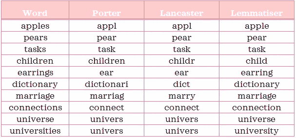
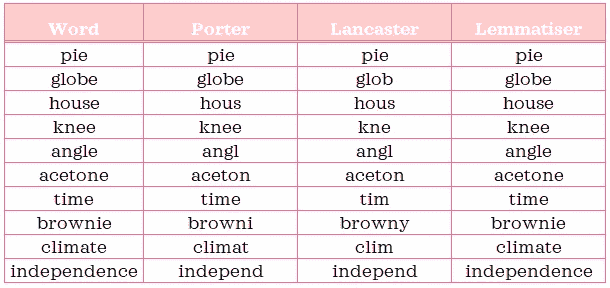
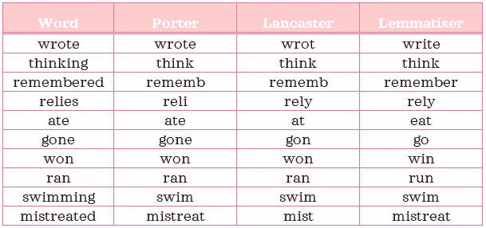
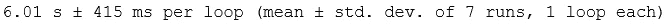
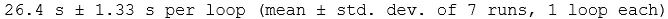
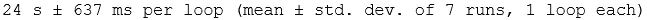
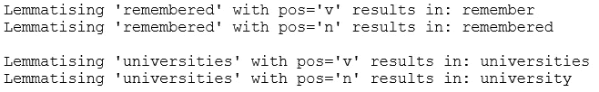
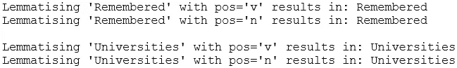

# NLP 介绍-第 2 部分:引理满足和词干的区别

> 原文：<https://towardsdatascience.com/introduction-to-nlp-part-2-difference-between-lemmatisation-and-stemming-3789be1c55bc?source=collection_archive---------48----------------------->

你想知道引理满足和词干的区别吗？如果你很想知道答案，这篇文章将试图解释它。


照片由[在](https://unsplash.com/@retrosupply?utm_source=medium&utm_medium=referral) [Unsplash](https://unsplash.com?utm_source=medium&utm_medium=referral) 上反推

# 1.定义📗

引理和词干是规范化文本以获得单词的词根形式的不同技术。Christopher D. Manning、Prabhakar Raghavan 和 Hinrich Schütze 在他们的著作中对这两个概念做了如下简明的定义:*信息检索导论*，2008:

> ***💡*** [“词干化通常指一种粗糙的启发式过程，即砍掉词尾，希望在大多数时候都能正确实现这一目标，通常还包括去除派生词缀……词干分析器使用特定于语言的规则，但是它们比词汇分析器需要更少的知识…”](https://nlp.stanford.edu/IR-book/html/htmledition/stemming-and-lemmatization-1.html)
> 
> **💡** [“词汇化通常是指利用词汇和词的形态分析来恰当地做事情，通常旨在仅去除屈折词尾并返回词的基本形式或词典形式，这就是所谓的词汇……一个词法分析器，它需要完整的词汇和词法分析来正确地对单词进行词法分析…”](https://nlp.stanford.edu/IR-book/html/htmledition/stemming-and-lemmatization-1.html)

如果这是你第一次阅读这些定义，他们可能不会马上点击。因为这些定义相当丰富和密集，所以慢慢地、仔细地、反复地阅读是有帮助的。如果你读完这篇文章后回来，希望这些定义会更有意义。

**简化概述:**词干化使用*预定义规则*将单词转化为*词干*，而词条化使用*上下文*和*词库*派生*词条*。*词干*不一定总是有效单词，而*词条*将总是有效单词，因为*词条*是单词的字典形式。

正如我们很快将在示例中看到的，这两种技术有时会产生相同的输出。

# 2.Python 设置🔧

本节假设您已经访问并熟悉 Python，包括安装包、定义函数和其他基本任务。如果你是 Python 的新手，[这个](https://www.python.org/about/gettingstarted/)是一个很好的开始。

我已经使用并测试了 Python 3.7.1 中的脚本。在使用代码之前，让我们确保您有合适的工具。

## ⬜️确保安装了所需的软件包:熊猫和 nltk

我们将使用以下强大的第三方软件包:

*   *熊猫*:数据分析库和
*   *nltk:* 自然语言工具包库

## ⬜️从 nltk 下载“wordnet”语料库

下面的脚本可以帮助你下载这个语料库。如果您已经下载了它，运行它将通知您它是最新的:

```
import nltk
nltk.download('wordnet')
```

# 3.输出比较🔍

在我们深入例子之前，您应该知道有不同类型的词干分析器和词尾分析器可用。正如您所料，一种类型的词干分析器可能与其他类型的词干分析器有所不同。对于 lemmatisers 来说也是如此。

在我们的例子中，我们将使用来自 *nltk* 的 *PorterStemmer、LancasterStemmer* 和 *WordNetLemmatizer* 来规范化单词。

> *💡****PorterStemmer*:******最常用的词干分析器之一。它基于波特词干算法。更多信息，查看官方网页:【https://tartarus.org/martin/PorterStemmer/】[](https://tartarus.org/martin/PorterStemmer/)**
> 
> ***💡***Lancaster stemmer*:****它基于 Lancaster 词干算法，有时会产生比* PorterStemmer *更激进的词干。***
> 
> ***💡***【WordNet lemma tiser】*:***[*使用 WordNet 词汇数据库。如果在 WordNet 中找不到输入单词，则返回不变的输入单词。*](https://wordnet.princeton.edu/)**

**让我们创建一个函数，使用以下三种方法对单词进行规范化:**

```
**# Import packages
import pandas as pd
from nltk.stem import PorterStemmer, LancasterStemmer, WordNetLemmatizer# Instantiate stemmers and lemmatiser
porter = PorterStemmer()
lancaster = LancasterStemmer()
lemmatiser = WordNetLemmatizer()# Create function that normalises text using all three techniques
def normalise_text(words, pos='v'):
    """Stem and lemmatise each word in a list. Return output in a dataframe."""
    normalised_text = pd.DataFrame(index=words, columns=['Porter', 'Lancaster', 'Lemmatiser'])
    for word in words:
        normalised_text.loc[word,'Porter'] = porter.stem(word)
        normalised_text.loc[word,'Lancaster'] = lancaster.stem(word)
        normalised_text.loc[word,'Lemmatiser'] = lemmatiser.lemmatize(word, pos=pos)
    return normalised_text**
```

**我们将从 10 个任意名词开始，并比较它们的规范化形式:**

```
**normalise_text(['apples', 'pears', 'tasks', 'children', 'earrings', 'dictionary', 'marriage', 'connections', 'universe', 'university'], pos='n')**
```

****

**你可以看到*词干*并不总是一个有效的单词，而*词条*却是。大学和宇宙一旦被毁灭，看起来是一样的，但一旦被毁灭，情况就不同了。你有没有注意到上面的词干都不是以 e 结尾的？可能是因为词干的一个规则是去掉结尾的 e 吗？让我们用一些以“e”结尾的单词来检验这个假设:**

```
**normalise_text(['pie', 'globe', 'house', 'knee', 'angle', 'acetone', 'time', 'brownie', 'climate', 'independence'], pos='n')**
```

****

**不完全是，有些词干是以 e 结尾的。虽然这个假设不成立，但我想指出的是，词干提取有可观察到的趋势，因为它们是基于规则的。**

**如果我让你建议一些规则来规范各种形式的动词，你会推荐什么？是去掉后缀“ing”还是“ed”？如果有两个辅音，前面有一个元音，那么你会把最后一个辅音也去掉吗？诸如此类…**

**虽然我不熟悉底层算法的复杂细节，但使用上述规则进行词干提取似乎是实际词干提取的过度简化版本，从计算和语言的角度来看，它将利用更加复杂和深思熟虑的规则。**

**现在，让我们来看看一些动词:**

```
**normalise_text(['wrote', 'thinking', 'remembered', 'relies', 'ate', 'gone', 'won', 'ran', 'swimming', 'mistreated'], pos='v')**
```

****

**虽然“思考”和“游泳”在所有三个规格化器中以完全相同的方式规格化，但其他一些动词有不同的输出。例如，你有没有注意到 lemmatiser 如何将不规则动词如“ate”和“gone”进行了合理的转换，而 stemmers 却没有。我认为这是因为为这些少数例外情况定制规则很棘手。我希望到目前为止，这些简短的例子已经让您了解了词干分析器和词汇分析器是如何规范化单词的。**

# **4.速度比较🐎**

**在研究词干匹配和词干匹配时，我遇到了许多资源，这些资源声称词干匹配比词干匹配更快。然而，当我在我的计算机上对一个样本数据测试三个规格化器时，我观察到完全相反的情况:**

```
**from nltk.corpus import movie_reviews
from nltk.tokenize import RegexpTokenizer# Import data
reviews = []
for fileid in movie_reviews.fileids():
    tag, filename = fileid.split('/')
    reviews.append((tag, movie_reviews.raw(fileid)))
sample = pd.DataFrame(reviews, columns=['target', 'document'])# Prepare one giant string 
sample_string = " ".join(sample['document'].values)# Tokenise data
tokeniser = RegexpTokenizer(r'\w+')
tokens = tokeniser.tokenize(sample_string)%%timeit 
lemmatiser = WordNetLemmatizer()
[lemmatiser.lemmatize(token, 'v') for token in tokens]**
```

****

```
**%%timeit 
porter = PorterStemmer()
[porter.stem(token) for token in tokens]**
```

****

```
**%%timeit 
lancaster = LancasterStemmer()
[lancaster.stem(token) for token in tokens]**
```

****

**正如你所看到的，从这个快速评估中，lemmatiser 实际上更快，甚至当我们用平均+/- 3 个标准差来比较一个范围时。因此，Lemmatiser 看起来更有利，因为它规范化得更合理，运行速度更快。在下一节中，我将分享两个有效的引理满足技巧作为奖励。**

***请注意，本帖中没有提到的其他词干分析器和词干分析器可能会给我们一个不同的故事。***

# **5.有效引理满足的两个技巧💡**

## **5.1.词性标签💬**

**如果您查看规范化示例名词和动词的代码片段，您会注意到两者之间的`pos`参数有所不同。这个参数指的是一个单词的词性标签，它在单词如何被词汇化的过程中起着重要作用。词性标签向 lemmatiser 提供单词的*上下文*。让我们看一些例子:**

```
**lemmatiser = WordNetLemmatizer()
print(f"Lemmatising 'remembered' with pos='v' results in: {lemmatiser.lemmatize('remembered', 'v')}")
print(f"Lemmatising 'remembered' with pos='n' results in: {lemmatiser.lemmatize('remembered', 'n')}\n")
print(f"Lemmatising 'universities' with pos='v' results in: {lemmatiser.lemmatize('universities', 'v')}")
print(f"Lemmatising 'universities' with pos='n' results in: {lemmatiser.lemmatize('universities', 'n')}")**
```

****

**如您所见，为了有效地规范化带有`WordNetLemmatizer`的单词，为每个单词提供正确的`pos`参数是很重要的。**

## **5.2.情况🔠 🔡**

**此外，单词的大小写也很重要:**

```
**print(f"Lemmatising 'Remembered' with pos='v' results in: {lemmatiser.lemmatize('Remembered', 'v')}")
print(f"Lemmatising 'Remembered' with pos='n' results in: {lemmatiser.lemmatize('Remembered', 'n')}\n")
print(f"Lemmatising 'Universities' with pos='v' results in: {lemmatiser.lemmatize('Universities', 'v')}")
print(f"Lemmatising 'Universities' with pos='n' results in: {lemmatiser.lemmatize('Universities', 'n')}")**
```

****

**大写时，单词即使有正确的`pos`也保持不变，因为它们被视为专有名词。💭**

****

**照片由[帕特里克·福尔](https://unsplash.com/@patrickian4?utm_source=medium&utm_medium=referral)在 [Unsplash](https://unsplash.com?utm_source=medium&utm_medium=referral) 拍摄**

***您想访问更多这样的内容吗？媒体会员可以无限制地访问媒体上的任何文章。如果你使用* [*我的推荐链接*](https://zluvsand.medium.com/membership)*成为会员，你的一部分会费会直接去支持我。***

**感谢您花时间阅读这篇文章。我希望你学到了一些关于引理满足和词干的知识。读完这篇文章后，如果你再翻一遍定义，你会觉得比第一次读的时候更有意义吗？👀其余帖子的链接整理如下:
◼️ [第一部分:Python 中的文本预处理](https://medium.com/@zluvsand/introduction-to-nlp-part-1-preprocessing-text-in-python-8f007d44ca96)
◼️ **第二部分:引理和词干化的区别**
◼️ [第三部分:TF-IDF 解释](https://medium.com/@zluvsand/introduction-to-nlp-part-3-tf-idf-explained-cedb1fc1f7dc)
◼️ [第四部分:Python 中的监督文本分类模型](https://medium.com/@zluvsand/introduction-to-nlp-part-4-supervised-text-classification-model-in-python-96e9709b4267)
◼️ [第五部分:Python 中的无监督主题模型(sklearn)](/introduction-to-nlp-part-5a-unsupervised-topic-model-in-python-733f76b3dc2d) 【T29**

**正常化快乐！再见🏃💨**

# **4.参考📁**

*   **[Christopher D. Manning，Prabhakar Raghavan 和 Hinrich Schütze，*信息检索导论*，剑桥大学出版社，2008 年](https://nlp.stanford.edu/IR-book/html/htmledition/stemming-and-lemmatization-1.html)**
*   **[伯德、史蒂文、爱德华·洛珀和伊万·克莱恩，*用 Python 进行自然语言处理*。奥莱利媒体公司，2009 年](http://www.nltk.org/book/)**
*   **普林斯顿大学 WordNet。2010 年**
*   **[*茎包*，nltk 文档](https://www.nltk.org/api/nltk.stem.html)**