# NLP 介绍-第 3 部分:TF-IDF 讲解

> 原文：<https://towardsdatascience.com/introduction-to-nlp-part-3-tf-idf-explained-cedb1fc1f7dc?source=collection_archive---------30----------------------->

词频-逆文档频率，也称为 tf-idf…💤

你觉得这听起来像胡言乱语吗？但你希望不会？在这篇文章中，我将首先演示如何使用 *sklearn* 将文本数据矢量化到 tf-idf，然后展示如何在没有任何软件的情况下自己完成的一步一步的过程。希望 *tf-idf* 在这篇帖子结束后，你会更清楚！🎓


JESHOOTS.COM 在 [Unsplash](https://unsplash.com?utm_source=medium&utm_medium=referral) 上[拍照](https://unsplash.com/@jeshoots?utm_source=medium&utm_medium=referral)

# **1。定义📗**

首先，让我们熟悉一些定义，以确保我们对每个概念的含义保持一致:

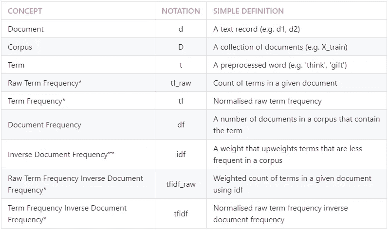

> * tf 和 tf-idf 被分成两个变体:一个基于 count (_raw)，另一个基于 percentage 以使事情更清楚。
> 
> * * IDF 的一个更通用的定义是一个权重，它提高不太频繁的术语的权重，降低较频繁的术语的权重。然而，我选择了一个简单的定义，因为根据所使用的公式，一个术语的最低权重可以是 1。无论哪种方式，在 tf-idf 中，与 tf 相比，频率较低的术语权重较高，频率较高的术语权重较低。
> 
> 括号中的例子显示了本文中使用的数据集的参考。

为了便于管理，我们将从这些句子中创建两个小文档，这将允许我们监控每个步骤的输入和输出:

```
d1 = 'I thought, I thought of thinking of thanking you for the gift'
d2 = 'She was thinking of going to go and get you a GIFT!'
```

如果你想知道为什么我选择了这两个句子，我必须想出一个最小的例子，在它们被预处理后，转换成我理想的末端向量，然后向后想。一个绕口令派上了用场！

# 2.带 sklearn 的 TF-IDF💻

本节假设您已经访问并熟悉 Python，包括安装包、定义函数和其他基本任务。如果你是 Python 的新手，[这个](https://www.python.org/about/gettingstarted/)是一个很好的入门地方。

## 2.0.Python 设置🔧

我已经使用并测试了 Python 3.7.1 中的脚本。在使用代码之前，让我们确保您有合适的工具。

## ⬜️确保安装了所需的软件包:熊猫和 nltk

我们将使用以下强大的第三方软件包:

*   *熊猫*:数据分析库，
*   *nltk:* 自然语言工具包库和
*   *sklearn:* 机器学习库。

## ⬜️从 nltk 下载“停用词”和“wordnet”语料库

下面的脚本可以帮助你下载这些语料库。如果您已经下载了，运行它会通知您它是最新的:

```
import nltk
nltk.download('stopwords')
nltk.download('wordnet')
```

## 2.1.定义文本处理功能

首先，让我们用包和数据准备环境:

```
# Import packages and modules
import pandas as pd
from nltk.stem import WordNetLemmatizer
from nltk.tokenize import RegexpTokenizer
from nltk.corpus import stopwords
from sklearn.feature_extraction.text import TfidfVectorizer# Create a dataframe
X_train = pd.DataFrame({'text': [d1, d2]})
```

从现在开始，我们将把‘X _ train’作为我们的语料库(不管它有多大)，把两个句子作为文档。第二，我们需要一个文本处理函数来将它传递给 *TfidfVectorizer* :

```
def preprocess_text(text):
    # Tokenise words while ignoring punctuation
    tokeniser = RegexpTokenizer(r'\w+')
    tokens = tokeniser.tokenize(text)

    # Lowercase and lemmatise 
    lemmatiser = WordNetLemmatizer()
    lemmas = [lemmatiser.lemmatize(token.lower(), pos='v') for token in tokens]

    # Remove stopwords
    keywords= [lemma for lemma in lemmas if lemma not in stopwords.words('english')]
    return keywords
```

🔗如果你需要解释，我已经在[系列的第一部分](https://medium.com/@zluvsand/introduction-to-nlp-part-1-preprocessing-text-in-python-8f007d44ca96)中详细解释了这个功能。这个预处理程序将把文档转换成:

```
d1 = [‘think’, ‘think’, ‘think’, ‘thank’, ‘gift’]
d2 = [‘think’, ‘go’, ‘go’, ‘get’, ‘gift’]
```

## 2.2.使用 TfidfVectorizer 向 tf-idf 矢量化

最后，对语料进行预处理:

```
# Create an instance of TfidfVectorizer
vectoriser = TfidfVectorizer(analyzer=preprocess_text)# Fit to the data and transform to feature matrix
X_train = vectoriser.fit_transform(X_train['text'])# Convert sparse matrix to dataframe
X_train = pd.DataFrame.sparse.from_spmatrix(X_train)# Save mapping on which index refers to which words
col_map = {v:k for k, v in vectoriser.vocabulary_.items()}# Rename each column using the mapping
for col in X_train.columns:
    X_train.rename(columns={col: col_map[col]}, inplace=True)
X_train
```

一旦脚本运行，您将得到以下输出:

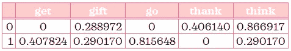

tf-idf 矩阵

Tada❕我们已经将语料库矢量化到 tf-idf！数据现在是机器学习模型可接受的格式。

让我们看看有或没有看不见的术语的测试文档是如何转换的:

```
d3 = “He thinks he will go!”
d4 = “They don’t know what to buy!”# Create dataframe
X_test = pd.DataFrame({‘text’: [d3, d4]})# Transform to feature matrix
X_test = vectoriser.transform(X_test['text'])# Convert sparse matrix to dataframe
X_test = pd.DataFrame.sparse.from_spmatrix(X_test)# Add column names to make it more readible
for col in X_test.columns:
    X_test.rename(columns={col: col_map[col]}, inplace=True)
X_test
```

当`preprocess_text`被应用时，测试文档将转换成:

```
d3 = [‘think’, 'go'] # *vectoritiser is familiar with these terms*
d4 = [‘know’, ‘buy’] # *vectoritiser is not familiar with these terms*
```

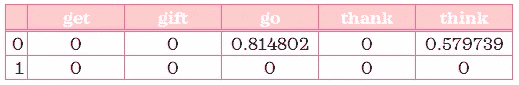

tf-idf 矩阵

这是您在 X_test 转换时所期望看到的吗？虽然我们在 *d3* 中出现了一次“go”和“think ”,但你有没有注意到“go”相对于“think”的权重是如何增加的？ *d4* 取全 0 值这个事实对你有意义吗？你是否注意到矩阵中的项数取决于训练数据，就像任何其他的 *sklearn* 变形金刚一样？

# 3.TF-IDF -自己动手📝

我认为当我们开始寻找引擎盖下的东西时，事情会变得更有趣。在这一节中，我们将手动进行转换，这不是很有趣吗？😍

如果你喜欢数学，我鼓励你按照这个指南手动计算问题，或者更好的是，在继续下面的答案之前尝试自己计算。在下面的例子中，行代表文档或语料库，列代表术语。

## 3.1.原始术语频率表

**🔒问题:**按文档统计每个术语的*原始术语频率*。

**💭提示:**看预处理后的 *d1* 和 *d2* 以及 *tf_raw* 的定义。

**🔑答案:**

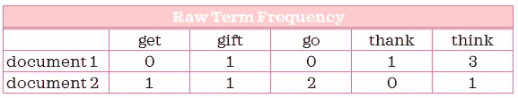

下表总结了每个术语在文档中出现的次数。例如:我们在文档 1 中看到“think”出现了 3 次，但在文档 2 中只出现了一次。列的数量由语料库中唯一术语的数量决定。这一步其实就是 *sklearn 的 count vector ser*做的事情。

## 3.2.术语频率

*(此步骤仅用于比较最终输出。)*

**🔒问题:**按文档计算每个词的*词频*。

**💭提示:**一个术语在文档中占多大比例？(第%行)

**🔑答案:**

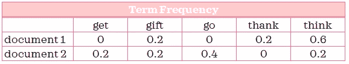

术语“思考”占了文献 1 中 60%的术语。

## 3.3.文档频率

**🔒问题:**统计*每期的文档频率*。

**💭提示:**有多少个文档包含特定的术语？

**🔑回答:**

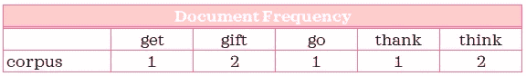

术语“get”仅在文档 1 中出现，而术语“think”在两个文档中都出现。

## 3.4.逆文档频率

这是第一次计算的地方。
**➗公式:**在该公式中， *n* 代表文档数。

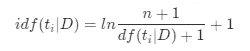

**🔒问题:**计算每项的 *idf* 。

**🔑答:***IDF*看起来是不是和 *df* 有点反？

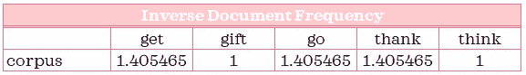

在 *sklearn* 中，可以从拟合的*tfidf 矢量器*中访问 *idf_* 属性。

🔍**例题计算:**下面，我已经提供了一个例题计算。通过复制相同的逻辑，您可以将它作为其余术语的指南:

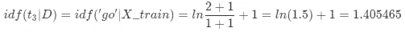

## 3.5.原始术语频率与文档频率相反

**➗公式:**

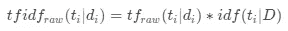

**🔒问题:**按文档计算每个术语的 *raw tf-idf* (即加权计数)。

**🔑答案:**

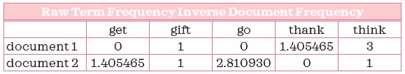

**🔍示例计算:**


## 3.6.术语频率与文档频率成反比

**➗公式:**

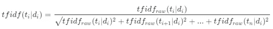

**🔒问题:**通过文档计算每项的 *tf-idf* 。

**🔑答案:**

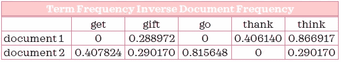

**🔍** **示例计算:**

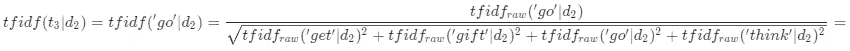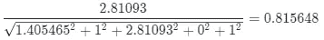

Yay❕我们已经获得了完全相同的结果！值得注意的是，如果您在中间步骤的任何地方进行了舍入，由于舍入误差，您的最终答案可能与上面提供的答案不完全匹配。

**📌** **练习:**看看能不能计算出 *d3* 和 *d4* 的 *tf-idf* ，并与上一节 *sklearn* 的输出相匹配。

**💭** **提示:** (1) Count tf_raw - terms 指的是来自训练数据的术语，(2)使用我们构建的 idf 计算 tf-idf_raw，(3)计算 tf-idf。仅对培训中的术语执行这些步骤。

当 *sklearn* 中的*tfidf vector*或 *TfidfTransformer* 的 *smooth_idf=True* 时，该方法复制输出。如果您将该参数更改为 *False* ，您将不得不通过从分子和分母中取出+1 来稍微调整 *idf* 公式。

在我们总结之前，让我们比较一下文档 1 的 *tf* 与 *tf-idf* :

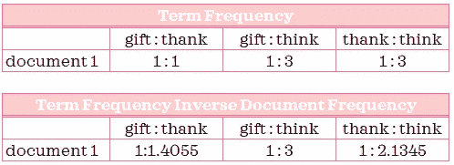

因为“gift”和“think”出现在所有文档中，所以它们在两个表中的相对权重是相同的。然而，“感谢”只出现在文档 1 中，因此与“礼物”或“思考”相比，它在 tf-idf 中的相对频率更高。因此，这展示了 *tf-idf* 如何提高较少文档中的术语的权重，降低较多文档中的术语的权重。

**📌** **练习:**自己分析文献 2。

显然，手动计算更容易出错，并且不太可能适用于具有数百、数千甚至数百万文档的真实语料库。非常感谢 *sklearn* 贡献者提供了这样一种有效的方式，用短短几行代码将文本转换成 *tf-idf* 。此处显示的手动计算仅用于举例说明使用软件时的底层实现。如果您想自己从工具而不是从 *sklearn* 复制输出，可能需要对公式进行调整，但总体思路应该是相似的。我希望这些解释是有用和有见地的。


[Leone Venter](https://unsplash.com/@fempreneurstyledstock?utm_source=medium&utm_medium=referral) 在 [Unsplash](https://unsplash.com?utm_source=medium&utm_medium=referral) 上拍照

*您想要访问更多这样的内容吗？媒体会员可以无限制地访问媒体上的任何文章。如果您使用* [*我的推荐链接*](https://zluvsand.medium.com/membership)*成为会员，您的一部分会费将直接用于支持我。*

感谢您花时间阅读这篇文章。我希望你从阅读它中学到一些东西。其余帖子的链接整理如下:
◼️ [第一部分:Python 中的文本预处理](https://medium.com/@zluvsand/introduction-to-nlp-part-1-preprocessing-text-in-python-8f007d44ca96)
◼️ [第二部分:词法分析和词干分析的区别](https://medium.com/@zluvsand/introduction-to-nlp-part-2-difference-between-lemmatisation-and-stemming-3789be1c55bc)
◼️ **第三部分:TF-IDF 解释**
◼️ [第四部分:Python 中的有监督文本分类模型](https://medium.com/@zluvsand/introduction-to-nlp-part-4-supervised-text-classification-model-in-python-96e9709b4267)
◼️ [第五部分:Python 中的无监督主题模型(sklearn)](/introduction-to-nlp-part-5a-unsupervised-topic-model-in-python-733f76b3dc2d)
◼️ [第五部分](/introduction-to-nlp-part-5b-unsupervised-topic-model-in-python-ab04c186f295)

快乐变身！再见🏃💨

# 4.参考📁

*   [伯德、史蒂文、爱德华·洛珀和伊万·克莱恩，*用 Python 进行自然语言处理*。奥莱利媒体公司，2009 年](http://www.nltk.org/book/)
*   [*特征提取*，sklearn 文档](https://scikit-learn.org/stable/modules/feature_extraction.html)