# 自然语言处理导论第 4 部分:Python 中的监督文本分类模型

> 原文：<https://towardsdatascience.com/introduction-to-nlp-part-4-supervised-text-classification-model-in-python-96e9709b4267?source=collection_archive---------23----------------------->

这篇文章将向你展示一个构建基本的*监督文本分类模型*的简化例子。如果这听起来有点胡言乱语，让我们看看一些定义:

> **💡监督:** *我们知道样本数据中每个文本的正确输出类* ***💡*** ***文本:*** *输入的数据是以文本格式* ***💡分类模型:*** *使用输入数据预测输出类的模型
> 每个输入文本也称为“文档”，输出也称为“目标”(术语，不是商店！😄).*

*监督文本分类模型*现在听起来更有意义吗？也许吧？在有监督的文本分类模型中，我们将在这篇文章中关注一种特殊的类型。在这里，我们将建立一个受监督的情感分类器，因为我们将在具有二元目标的电影评论上使用情感极性数据。


照片由 [Clément H](https://unsplash.com/@clemhlrdt?utm_source=medium&utm_medium=referral) 在 [Unsplash](https://unsplash.com?utm_source=medium&utm_medium=referral) 上拍摄

# 0.Python 设置🔧

本文假设您已经访问并熟悉 Python，包括安装包、定义函数和其他基本任务。如果你是 Python 新手，[这个](https://www.python.org/about/gettingstarted/)是入门的好地方。

我已经使用并测试了 Python 3.7.1 中的脚本。在我们开始之前，让我们确保你有合适的工具。

## ⬜️确保安装了所需的软件包:熊猫，nltk & sklearn

我们将使用以下强大的第三方软件包:

*   *熊猫*:数据分析库，
*   *nltk:* 自然语言工具包库和
*   *sklearn:* 机器学习库。

## ⬜️从 nltk 下载“停用词”、“wordnet”和电影评论语料库

下面的脚本可以帮助你下载这些语料库。如果您已经下载了，运行此程序将通知您它们是最新的:

```
import nltk
nltk.download('stopwords') 
nltk.download('wordnet')
nltk.download('movie_reviews')
```

# 1.数据准备🔡 ➡ 🔢

## 1.1.导入示例数据和包

首先，让我们通过导入所需的包来准备环境:

```
import pandas as pdfrom nltk.corpus import movie_reviews, stopwords
from nltk.stem import WordNetLemmatizer
from nltk.tokenize import RegexpTokenizerfrom sklearn.model_selection import train_test_split, cross_val_score, cross_val_predict, GridSearchCV
from sklearn.feature_extraction.text import TfidfVectorizer
from sklearn.linear_model import SGDClassifier
from sklearn.pipeline import Pipeline
from sklearn.metrics import confusion_matrix, accuracy_score
```

我们将把 *movie_reviews* 标记的语料库从 *nltk* 转换成熊猫数据帧，脚本如下:

```
# Script copied from [her](# https://stackoverflow.com/questions/46109166/converting-categorizedplaintextcorpusreader-into-dataframe)e
reviews = []
for fileid in movie_reviews.fileids():
    tag, filename = fileid.split('/')
    reviews.append((tag, movie_reviews.raw(fileid)))
sample = pd.DataFrame(reviews, columns=['target', 'document'])
print(f'Dimensions: {sample.shape}')
sample.head()
```

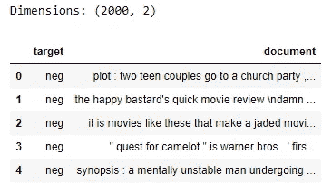

您将看到数据框架有两列:一列用于目标、极性情绪，另一列用于 2000 条评论的评论(即文档)。每个评论要么被标记为正面评论，要么被标记为负面评论。让我们检查目标类的数量:

```
sample[‘target’].value_counts()
```

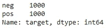

每个类(即‘pos’，‘neg’)各有 1000 条记录，完全平衡。让我们确保这些类是二进制编码的:

```
sample['target'] = np.where(sample['target']=='pos', 1, 0)
sample['target'].value_counts()
```

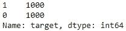

这看起来不错，让我们继续划分数据。

## 1.2.分区数据

谈到数据分区，我们有两种选择:

1.  将样本数据分成三组:*训练*、*验证*和*测试*、，其中*训练*用于拟合模型，*验证*用于评估过渡模型的适合度，*测试*用于评估最终模型的适合度。
2.  将样本数据分成两组:*训练*和*测试*、*、*其中*训练*进一步分成训练和验证集 *k 次*使用 *k 倍交叉验证，*和*测试*用于评估最终模型的适合度。用 *k 重交叉验证*:
    :**第一个** : *列*被拆分成 k 块。
    **第二**:将模型拟合到剩余的 *k-1* 件后，取一件作为验证集，评估中间模型的适合度。
    **第三**:重复第二步 *k-1* 多次，每次使用不同的件用于验证组，剩余的件用于序列组，这样*序列*的每件仅用作验证组一次。

这里的中间模型指的是在比较不同机器学习分类器以及为给定分类器尝试不同超参数以找到最佳模型的迭代过程中创建的模型。

我们将使用第二个选项对样本数据进行分区。让我们先把一些测试数据放在一边，这样我们就可以检查最终模型对未知数据的概括程度。

```
X_train, X_test, y_train, y_test = train_test_split(sample['document'], sample['target'], test_size=0.3, random_state=123)print(f'Train dimensions: {X_train.shape, y_train.shape}')
print(f'Test dimensions: {X_test.shape, y_test.shape}')# Check out target distribution
print(y_train.value_counts())
print(y_test.value_counts())
```

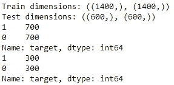

我们有 1400 个文档在训练中，600 个文档在测试数据集中。目标均匀地分布在训练和测试数据集中。

如果你对关于数据分区的这一节有点困惑，你可能想要查看[这篇很棒的文章](https://machinelearningmastery.com/difference-test-validation-datasets/)来了解更多。

## 1.2.预处理文档

是时候对训练文档进行预处理了，也就是把非结构化的数据转换成数字的矩阵。让我们使用一种称为单词包的方法对文本进行预处理，其中每个文本都由它的单词表示，而不管它们出现的顺序或嵌入的语法，步骤如下:

1.  象征化
2.  正常化
3.  删除停用词
4.  计数矢量
5.  转换到 tf-idf 表示

🔗我已经在系列文章的第一部分[中提供了预处理步骤的详细解释，包括下面代码块的分解。](https://medium.com/@zluvsand/introduction-to-nlp-part-1-preprocessing-text-in-python-8f007d44ca96)

这些连续的步骤是通过下面的代码块完成的:

```
def preprocess_text(text):
    # Tokenise words while ignoring punctuation
    tokeniser = RegexpTokenizer(r'\w+')
    tokens = tokeniser.tokenize(text)

    # Lowercase and lemmatise 
    lemmatiser = WordNetLemmatizer()
    lemmas = [lemmatiser.lemmatize(token.lower(), pos='v') for token in tokens]

    # Remove stop words
    keywords= [lemma for lemma in lemmas if lemma not in stopwords.words('english')]
    return keywords# Create an instance of TfidfVectorizer
vectoriser = TfidfVectorizer(analyzer=preprocess_text)# Fit to the data and transform to feature matrix
X_train_tfidf = vectoriser.fit_transform(X_train)
X_train_tfidf.shape
```

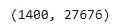

🔗如果你不确定什么是 tf-idf，我已经在[系列第三部](https://medium.com/@zluvsand/introduction-to-nlp-part-3-tf-idf-explained-cedb1fc1f7dc)中提供了详细的解释。

一旦我们预处理了文本，我们的训练数据现在是以稀疏矩阵格式存储的 1400 x 27676 特征矩阵。这种格式提供了有效的数据存储，并加快了后续过程。我们有 27676 个特征代表来自训练数据集中的唯一单词。现在，训练数据已经准备好进行建模了！

# 2.模拟ⓜ️

## 2.1.基线模型

让我们使用随机梯度下降分类器建立一个基线模型。我选择了这个分类器，因为它速度快，并且适用于稀疏矩阵。使用 5 重交叉验证，让我们将模型与数据进行拟合并对其进行评估:

```
sgd_clf = SGDClassifier(random_state=123)
sgf_clf_scores = cross_val_score(sgd_clf, X_train_tfidf, y_train, cv=5)print(sgf_clf_scores)
print("Accuracy: %0.2f (+/- %0.2f)" % (sgf_clf_scores.mean(), sgf_clf_scores.std() * 2))
```

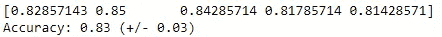

假设数据是完全平衡的，我们希望尽可能正确地预测两个标签，我们将使用*准确性*作为评估模型适合度的度量。然而，根据目标的分布和类的相对误分类成本，精度并不总是最佳的度量。在这种情况下，其他评估指标如精确度、召回率或 f1 可能更合适。

最初的表现看起来还不错。基线模型可以在大约 83% +/- 3%的时间内准确预测。

值得注意的是，使用的默认指标是`cross_val_score` 中的*准确度*，因此我们不需要指定它，除非您想明确地这样说，如下所示:

```
cross_val_score(sgd_clf, X_train_tfidf, y_train, cv=5, scoring='accuracy')
```

让我们通过查看混淆矩阵来进一步理解这些预测:

```
sgf_clf_pred = cross_val_predict(sgd_clf, X_train_tfidf, y_train, cv=5)
print(confusion_matrix(y_train, sgf_clf_pred))
```

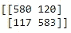

这两类预测的准确性是相似的。

## 2.2.尝试提高性能

本节的目的是找到最佳的机器学习算法及其超参数。让我们看看我们是否能够通过调整一些超参数来改进模型。我们将把大多数超参数保留为其合理的默认值。在网格搜索的帮助下，我们将使用下面指定的超参数的每种组合运行一个模型，并交叉验证结果，以感受其准确性:

```
grid = {'fit_intercept': [True,False],
        'early_stopping': [True, False],
        'loss' : ['hinge', 'log', 'squared_hinge'],
        'penalty' : ['l2', 'l1', 'none']}
search = GridSearchCV(estimator=sgd_clf, param_grid=grid, cv=5)
search.fit(X_train_tfidf, y_train)
search.best_params_
```

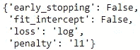

这些是上面指定的超参数的最佳值。让我们使用所选超参数的这些值来训练和验证模型:

```
grid_sgd_clf_scores = cross_val_score(search.best_estimator_, X_train_tfidf, y_train, cv=5)
print(grid_sgd_clf_scores)
print("Accuracy: %0.2f (+/- %0.2f)" % (grid_sgd_clf_scores.mean(), grid_sgd_clf_scores.std() * 2))
```

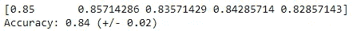

与基线相比，模型拟合度稍好(小 yay❕).

为了节省时间，我们将为最终模型选择这些超参数组合，这一部分到此为止。然而，本节可以进一步扩展，尝试不同的建模技术，并使用网格搜索找到模型超参数的最佳值。

**📌练习:**看看是否可以通过使用不同的建模技术和/或优化超参数来进一步提高该模型的准确性。

## 2.3.最终模型

现在我们已经完成了模型，让我们将数据转换步骤和模型放入*管道*:

```
pipe = Pipeline([('vectoriser', vectoriser),
                 ('classifier', search.best_estimator_)])pipe.fit(X_train, y_train)
```

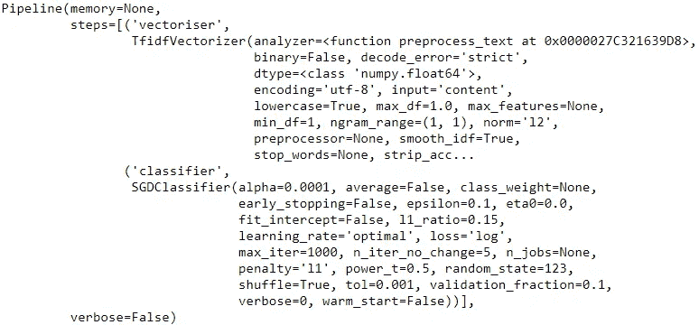

在上面显示的代码中，管道首先将非结构化数据转换为特征矩阵，然后将预处理后的数据拟合到模型中。这是一种将基本步骤放在一个管道中的优雅方式。

让我们在测试集上评估模型的预测能力。这里，我们将把测试数据传递给管道，管道将首先预处理数据，然后使用之前拟合的模型进行预测:

```
y_test_pred = pipe.predict(X_test)
print("Accuracy: %0.2f" % (accuracy_score(y_test, y_test_pred)))
print(confusion_matrix(y_test, y_test_pred))
```

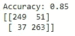

最终模型对未知数据的精确度约为 85%。如果这个测试数据代表了未来的数据，那么考虑到我们到目前为止所付出的努力，这个模型的预测能力是相当不错的，你不这样认为吗？不管怎样，恭喜你！您刚刚构建了一个简单的监督文本分类模型！🎓


[摄蜻蜓大街](https://unsplash.com/@dragonflyave?utm_source=medium&utm_medium=referral)上[的 Unsplash](https://unsplash.com?utm_source=medium&utm_medium=referral)

*您想访问更多这样的内容吗？媒体会员可以无限制地访问媒体上的任何文章。如果您使用* [*我的推荐链接*](https://zluvsand.medium.com/membership) ，*成为会员，您的一部分会费将直接用于支持我。*

感谢您花时间阅读这篇文章。我希望你从阅读它中学到一些东西。其余帖子的链接整理如下:
◼️ [第一部分:Python 中的文本预处理](https://medium.com/@zluvsand/introduction-to-nlp-part-1-preprocessing-text-in-python-8f007d44ca96)
◼️ [第二部分:词法分析和词干分析的区别](https://medium.com/@zluvsand/introduction-to-nlp-part-2-difference-between-lemmatisation-and-stemming-3789be1c55bc)
◼️ [第三部分:TF-IDF 解释](https://medium.com/@zluvsand/introduction-to-nlp-part-3-tf-idf-explained-cedb1fc1f7dc)
◼️ **第四部分:Python 中的有监督文本分类模型** ◼️ [第五部分:Python 中的无监督主题模型(sklearn)](/introduction-to-nlp-part-5a-unsupervised-topic-model-in-python-733f76b3dc2d)
◼️ [第五部分](/introduction-to-nlp-part-5b-unsupervised-topic-model-in-python-ab04c186f295)

快乐造型！再见🏃💨

# 3.参考📁

*   [Christopher D. Manning，Prabhakar Raghavan 和 Hinrich Schütze，*信息检索导论*，剑桥大学出版社，2008 年](https://nlp.stanford.edu/IR-book/html/htmledition/stemming-and-lemmatization-1.html)
*   [伯德、史蒂文、爱德华·洛珀和伊万·克莱恩，*用 Python 进行自然语言处理*。奥莱利媒体公司，2009 年](http://www.nltk.org/book/)
*   Jason Brownlee，测试数据集和验证数据集有什么区别？，机器学习精通，2017