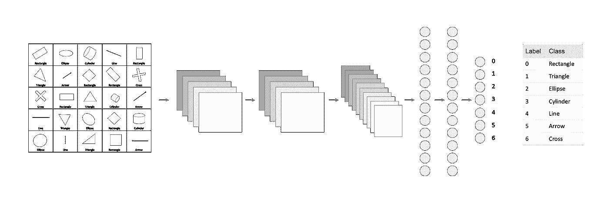
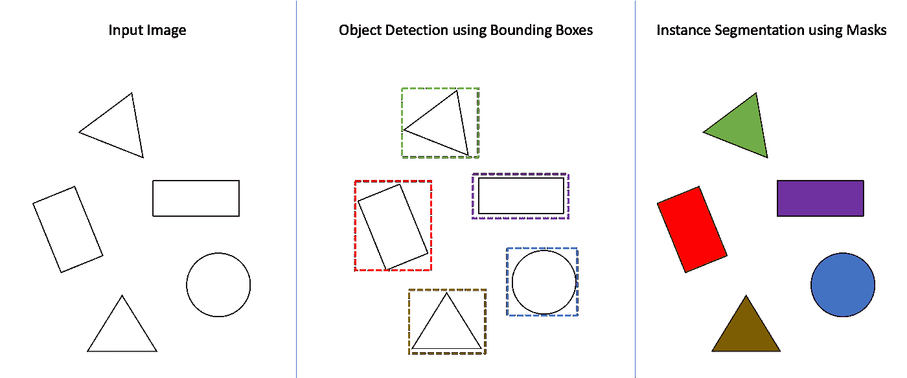
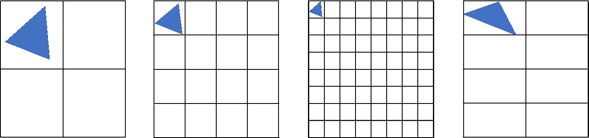
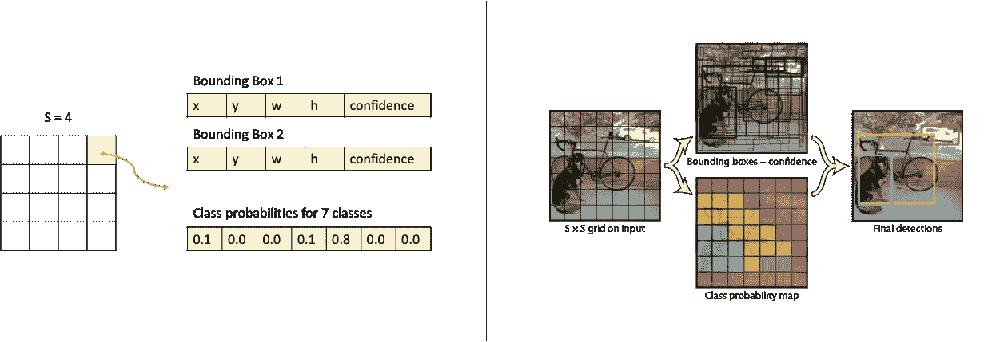
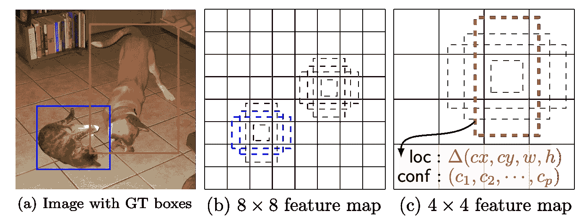
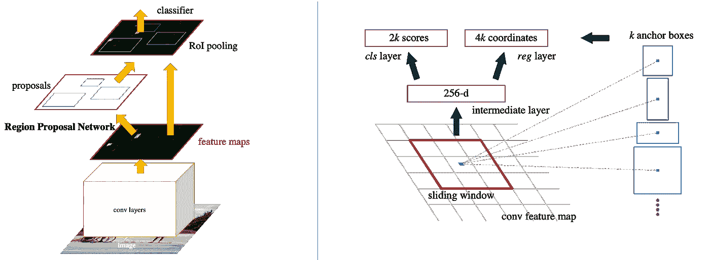

# 对象检测简介

> 原文：<https://towardsdatascience.com/introduction-to-object-detection-943f21e26063?source=collection_archive---------38----------------------->

## 从图像分类到目标检测

# 入门指南

基本的图像分类模型相对简单。给定一幅图像作为输入，目标是将它归类为许多可能的输出类别之一。该架构通常(但不一定)是一系列卷积层和汇集层，其末端是一个或多个线性层，最终输出层具有与类数量相同的节点/神经元数量。输出层中的每个节点代表一个类，并且将为该最终层训练模型，以给出给定输入图像属于相应类的概率。

说明性图像分类

上图是一个多类影像分类示例，其中输出相互排斥，即所有输出概率总和为 1。另一种变化是多标签分类，其中每个概率都相互独立，一个图像可以被标记为多个类别，就像将类型与电影海报相关联一样。

# 目标

虽然这种图像分类能力具有许多应用，但是大多数真实世界的应用需要的不仅仅是单个图像的这种分类。如果您将自动驾驶汽车视为一个例子(注意:真正的自动驾驶解决方案可能更复杂，但出于说明目的，请使用这个例子)，它要求我们:

1.  确定所识别的物体在图像中的位置。例如:如果识别的行人在正前方或旁边
2.  识别多个对象。例如:一个单一的图像可以有多辆汽车，许多行人，交通灯等
3.  识别对象的方向。例如:汽车的前部面向，后部背向(例如，汽车向我们驶来或面向我们停放)

完成所有这些需要做的比图像分类模型多一点。在本帖中，我们将着眼于实现前两个目标。

# 思维练习

那么，除了分类之外，我们如何确定由边界框坐标定义的对象的位置呢？当存在多个物体时，我们如何确定它们？

我们想要确定位置的方法是通过识别对象的边界框的坐标。我们的目标是获得边界框的坐标，通常是通过识别角或中心的坐标以及边界框的高度和宽度。

> **附注:**另一种方法是获取已识别对象实例的掩码。对于已识别的对象，遮罩为我们提供了作为已识别实例一部分的所有像素。图 1 示出了这两种输出选项(为了便于理解，使用了多对象检测图示)。虚线表示边界框输出，而彩色对象表示我们希望在给定输入图像的情况下得到的遮罩输出。

**图 1** :使用包围盒的对象检测与使用遮罩的实例分割

让我们做一个简单的思考练习，从几个约束开始，这将简化思考，稍后再回来移除它们。第一，假设所有的物体都是固定的宽度和高度(比如 20px * 20px)。第二，让我们假设这些对象从 0 或者 20 的倍数开始。即它们的左上坐标将是 0 或 20 的倍数(即左上坐标将是 0，0 或 0，20 或 20，40 或 40，40 等)。

有了这两个约束，确定对象精确位置的一种方法是在图像上想象一个网格，每个单元的大小为 20*20。现在，我们要做的就是像图像分类一样，对网格中的每个单元评估分类概率。所有类别概率高于阈值的单元格都是对象所在的位置！

现在，当我们去除预先确定的尺寸和位置的两个约束时，很明显，我们必须有一个网格系统来帮助我们确定各种尺寸、长宽比和位置的盒子。这些箱子有时被称为锚箱。有不同的方法来解决产生不同大小/位置的锚盒的问题，我们将看看一些众所周知的方法。

同样重要的是要注意，在这个简单的思考练习中，我们直接在图像上想象网格系统和锚定框，但从技术上讲，我们将在表示图像的特征图上这样做，就像图像通过的基本网络的最后一层。

**图 2** :检测包围盒需要评估不同大小、长宽比和位置的盒子

## YOLO

例如，Yolo ( [paper link](https://arxiv.org/pdf/1506.02640.pdf) )将输入图像分成一个 S × S 的网格。正如我们上面所做的，每个网格单元不仅被评估类别概率，而且一组“B”边界框和这些框的置信度分数也被一起预测。

换句话说，盒子不是像我们简单的思考练习中那样预先确定的，而是随着单元的类别概率一起预测的。每个边界框由 5 个预测组成:x，y，w，h 和置信度。前四个与坐标有关，最后一个，置信度反映了模型对盒子包含对象的置信度以及盒子坐标的精确度。

此外，确定对象的框坐标的责任属于对象中心所在的网格单元。这有助于防止多个单元格确定同一对象周围的框。但是每个单元仍然预测多个边界框。这些框中的一个被认为“负责”预测对象，基于该预测，在训练期间，哪个预测具有最高的当前值 [IOU](https://en.wikipedia.org/wiki/Jaccard_index) 。在训练过程中，这导致每个单元中不同的边界框专门用于预测物体的特定大小、长宽比或类别，从而提高整体回忆。

这些预测被编码为 S × S×(B∫5+C)张量(S×S 是网格维度，B 是网格中每个单元将确定的框，5 是每个框做出的预测，即 x、y、w、h 和置信度，C 是模型可以识别的 C 类对象的概率)。

**图 3** : Yolo 插图，此处摘自[原图的第二部分。左边是生成两个边界框和 7 个类别概率的 4 x 4 网格的图示。](https://arxiv.org/pdf/1506.02640.pdf)

## （同 solid-statedisk）固态（磁）盘

单次多盒检测器(SSD) ( [纸链接](https://arxiv.org/pdf/1512.02325.pdf))不会凭空预测盒子，而是从一组默认盒子开始。它使用几个不同比例的特征地图(即几个不同大小的网格，如图 4 中的**所示的 4 x 4、8 x 8 等)以及每个网格/特征地图中每个单元不同纵横比的一组固定默认框。对于每个默认框，该模型随后计算“偏移量”以及类别概率。偏移量由 4 个数字 cx、cy、w 和 h 组成，给出了实际框相对于默认框的中心坐标、宽度和高度的偏移量。**

SSD 在将对象基础事实框与默认框相匹配的策略上也有所不同。没有一个单独的默认框负责并匹配一个对象。相反，默认框与任何高于阈值(0.5)的 IOU[匹配。这意味着，对于与对象重叠的多个默认框，将会预测到高分，而不是只要求其中一个框负责。](https://en.wikipedia.org/wiki/Jaccard_index)

**图 4** : SSD 框架来自[原文此处](https://arxiv.org/pdf/1512.02325.pdf)。说明了多个(两个)匹配猫的蓝框和一个匹配狗的红框。匹配框也来自不同的特征地图，即网格大小。

## **更快的 RCNN**

与 Yolo 和 SSD 不同，更快的 RCNN ( [paper link](https://arxiv.org/pdf/1506.01497.pdf) )及其前身采用了两步方法。快速 RCNN 部署一个单独的区域建议网络，专门用于首先确定锚盒。接下来是一个快速的 R-CNN 检测器，它使用了提出的区域。

在区域建议网络(RPN)中，在基本网络的输出上应用小滑动窗口(卷积)。如果基础网络的输出是 n*m *个通道，则 n*m 就相当于我们的网格，对 n * m 个特征图中的每个位置(即细胞)进行评估。根据不同尺寸和长宽比的“k”个锚箱对每个位置进行评估。对于每个锚盒，确定 2 个类别预测和 4 个盒坐标。这两类预测表明盒子中的对象是背景还是前景(即有或没有对象)。4 个框坐标是典型的中心 x、y 以及宽度和高度。对于训练 rpn，我们给每个锚点分配一个二进制类标签(是否为对象)。保留具有最高 [IOU](https://en.wikipedia.org/wiki/Jaccard_index) 的锚和具有高于 0.7 的 [IOU](https://en.wikipedia.org/wiki/Jaccard_index) 重叠的锚。

特征图中落在方框内的部分是感兴趣区域，在 ROI 汇集层之后，这些感兴趣区域被提供给分类器。

**图 5** :此处[原纸更快的 RCNN](https://arxiv.org/pdf/1506.01497.pdf)。左侧是完整网络的示意图，包括区域提案网络。右边是如何使用锚定框的滑动窗口到达区域提议(框提议)的图示。

# 应用

我们已经研究了这些流行的模型是如何解决目标检测问题的。对于每一个模型，都有一些我们在这里没有涉及到的细微差别，但是希望这篇文章仍然给出了一个关于这个问题是如何解决的一般概念。虽然知道这很好，但如果你更倾向于在应用程序中使用对象检测，那么检查一些可用的选项: [torchvision 模型](https://pytorch.org/docs/stable/torchvision/models.html#object-detection-instance-segmentation-and-person-keypoint-detection)、 [Tensorflow 对象检测 API](https://github.com/tensorflow/models/tree/master/research/object_detection) 和 py torch powered[Detectron 2](https://github.com/facebookresearch/detectron2)。