# 熊猫应用简介，应用地图和地图

> 原文：<https://towardsdatascience.com/introduction-to-pandas-apply-applymap-and-map-5d3e044e93ff?source=collection_archive---------1----------------------->

## 一个直观的熊猫教程，教你如何使用`apply()`和`applymap()`应用一个函数，以及如何使用`map()`替换值


熊猫应用()应用地图()和地图()介绍

在数据处理中，经常需要对某一行或某一列执行操作(如统计计算、拆分或代入值)以获得新的数据。编写一个 for 循环来遍历 Pandas DataFrame 和 Series 可以完成这项工作，但这似乎不是一个好主意。for 循环往往有更多的代码行，更少的代码可读性和更慢的性能。

幸运的是，熊猫已经内置了很好的方法来帮助你完成目标！在本文中，我们将看到如何使用`apply()`和`applymap()`执行操作，以及如何使用`map()`替换值。

首先，你应该知道 DataFrame 和 Series 会有这三种方法中的一些或全部，如下:

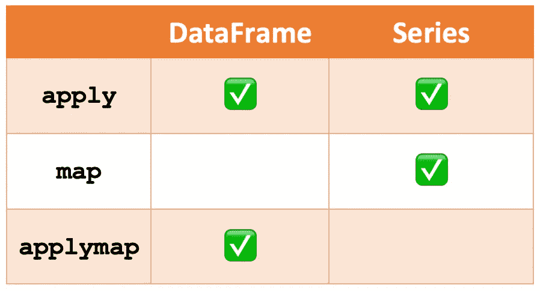

而熊猫官方 API 参考建议:

*   `[**apply()**](https://pandas.pydata.org/pandas-docs/stable/reference/api/pandas.DataFrame.apply.html)`用于沿数据帧或**的轴对系列**的值应用函数**。**
*   `[**applymap()**](https://pandas.pydata.org/pandas-docs/stable/reference/api/pandas.DataFrame.applymap.html)`用于将函数应用于数据帧的元素。
*   `[**map()**](https://pandas.pydata.org/pandas-docs/stable/reference/api/pandas.Series.map.html?highlight=map#pandas.Series.map)`用于将序列中的每个值替换为另一个值。

# 用于演示的数据集

在我们深入细节之前，让我们首先创建一个数据框架进行演示。

```
import pandas as pddf = pd.DataFrame(**{ 'A': [1,2,3,4], 
                   'B': [10,20,30,40],
                   'C': [20,40,60,80]
                  }**, 
                  index=[**'Row 1', 'Row 2', 'Row 3', 'Row 4'**])
```

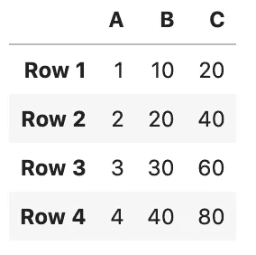

应用数据集、应用地图和地图演示

# 如何使用 apply()？

Pandas `apply()`用于沿数据帧或**的轴对序列**的值应用函数**。**

让我们从一个简单的例子开始，对每一行求和并将结果保存到新的列“D”

```
# Let's call this "custom_sum" as "sum" is a built-in function
def **custom_sum**(row):
    return row.sum()df[**'D'**] = df.apply(**custom_sum**, **axis=1**)
```

这是输出

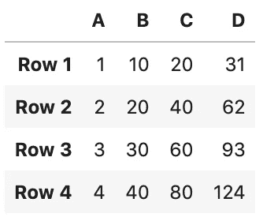

df 的结果[**' D '**]= df . apply(**custom _ sum**， **axis=1** )

你真的明白刚才发生了什么吗？

让我们来看看`df.apply(**custom_sum**, **axis=1**)`

*   第一个参数`**custom_sum**`是一个函数。
*   第二个参数`axis`是指定函数应用于哪个轴。`0`用于将函数应用于每一列，而`1`用于将函数应用于每一行。

让我用更直观的方式来解释这个过程。第二个参数`axis = 1`告诉熊猫使用行。因此，`custom_sum`应用于每一行，并返回一个新的序列，每一行的输出作为值。

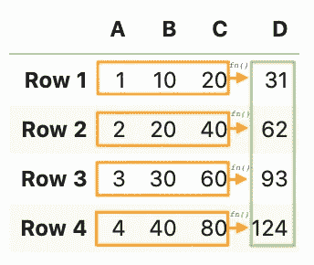

有了对每行总和的理解，每列总和就正好用`axis = 0`来代替

```
df.**loc['Row 5']** = df.apply(custom_sum, **axis=0**)
```

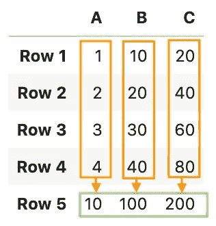

到目前为止，我们一直在谈论数据帧上的`apply()`。同样，`apply()`可以用在数值序列上。例如，将列“C”乘以 2，并将结果保存到新列“D”

```
def multiply_by_2(val):
    return val * 2df[**'D'**] = **df['C']**.apply(**multiply_by_2**)
```

注意`df[‘C’]`用于选择列“C ”,然后用唯一的参数`multiply_by_2`调用`apply()`。我们不再需要指定轴，因为 Series 是一个**一维数组**。返回值是一个序列，并由`df[**‘D’**]`分配给新的列 D。

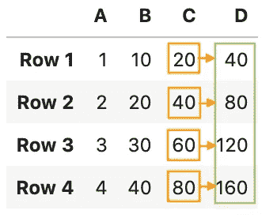

序列上 apply()的输出

## 将 lambda 与 apply 一起使用

您也可以将 lambda 表达式与 Pandas `apply()`函数一起使用。

数据帧每行总和的λ当量:

```
df['D'] = df.apply(**lambda x:x.sum()**, axis=1)
```

数据帧每列总和的λ当量:

```
df.loc['Row 5'] = df.apply(**lambda x:x.sum()**, axis=0)
```

以及在一系列上乘以 2 的λ当量:

```
df['D'] = df['C'].apply(**lambda x:x*2**)
```

## 带有结果类型参数

`result_type`是`apply()`中的一个参数，设置为`'expand'`、`'reduce'`或`'broadcast'`以获得所需类型的结果。

在上面的场景中，如果`result_type`被设置为`'broadcast'`，那么输出将是由`custom_sum`值替代的数据帧。

```
df.apply(custom_sum, axis=1, **result_type='broadcast'**)
```

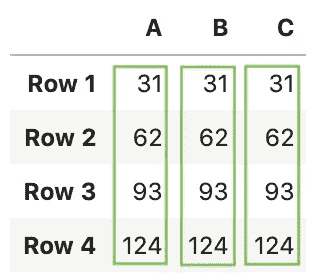

结果被广播到帧的原始形状，原始索引和列被保留。

为了将`result_type`理解为`'expand'`和`'reduce'`，我们将首先创建一个返回列表的函数。

```
def cal_multi_col(row):
    return **[row['A'] * 2, row['B'] * 3]**
```

现在将此函数应用于数据帧列，将`result_type`作为`'expand'`

```
df.apply(**cal_multi_col**, axis=1, **result_type='expand'**)
```

输出是列名为 **0** 和 **1** 的新数据帧。

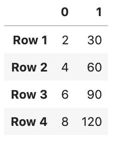

为了将它添加到现有的数据帧中，结果必须保存在一个变量中，这样列名就可以被`res.columns`访问。

```
**res** = df.apply(cal_multi_col, axis=1, result_type='expand')
df[**res.columns**] = **res**
```

输出是:

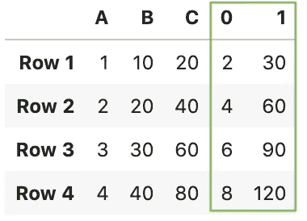

result_type='expand '的输出

接下来，用`result_type`作为`'reduce'`在 DataFrame 列中应用该函数。`result_type='reduce'`与`'expand'`正好相反，如果可能的话返回一个序列，而不是展开列表式的结果。

```
df[**'New'**] = df.apply(cal_multi_col, axis=1, **result_type='reduce'**)
```

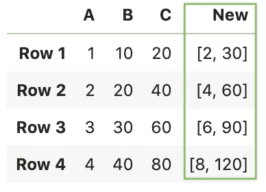

result_type='reduce '的输出

# 如何使用 applymap()？

`applymap()`仅在数据帧中可用，用于整个数据帧中的元素操作。它已经过优化，在某些情况下比`apply()`快得多，但在进行任何更繁重的操作之前，最好将其与`apply()`进行比较。

例如:输出数字平方的数据帧

```
df.applymap(np.square)
```

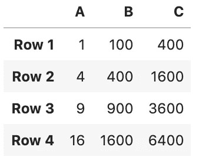

# 如何使用 map()？

`map()`仅在序列中可用，用于将序列中的每个值替换为另一个值。为了理解`map()`是如何工作的，我们首先创建一个系列。

```
**>>>** s = pd.Series(['cat', 'dog', np.nan, 'rabbit'])
**>>>** s
0      cat
1      dog
2      NaN
3   rabbit
dtype: object
```

`map()`接受一个`dict`或一个`Series`。在`dict`中找不到的值被转换成`NaN`，除非`dict`有默认值(如`defaultdict`):

```
**>>>** s.map(**{'cat': 'kitten', 'dog': 'puppy'}**)
0   **kitten**
1    **puppy**
2      NaN
3      **NaN**
dtype: object
```

它还接受一个函数:

```
**>>>** s.map('I am a *{}*'.format)
0       I am a cat
1       I am a dog
2       I am a nan
3    I am a rabbit
dtype: object
```

为避免将该函数应用于缺失值(并将其保持为`NaN`)，可使用`na_action='ignore'`:

```
**>>>** s.map('I am a *{}*'.format, na_action='ignore')
0     I am a cat
1     I am a dog
2            NaN
3  I am a rabbit
dtype: object
```

# 摘要

最后，这里总结一下:

对于数据帧:

*   `apply()`:当您想要沿行或列应用一个函数时使用。`axis = 0`用于列，`axis = 1`用于行。
*   `applymap()`:用于整个数据帧的逐元素操作。

对于系列:

*   `apply()`:当你想对数列的值应用一个函数时使用。
*   `map()`:用于将每个值替换为另一个值。

## 你可能会对我的其他一些熊猫文章感兴趣:

*   [你应该知道的熊猫串联()招数](/pandas-concat-tricks-you-should-know-to-speed-up-your-data-analysis-cd3d4fdfe6dd)
*   [如何对熊猫数据帧进行自定义排序](/how-to-do-a-custom-sort-on-pandas-dataframe-ac18e7ea5320)
*   [何时使用熊猫变换()函数](/when-to-use-pandas-transform-function-df8861aa0dcf)
*   [使用熊猫方法链接提高代码可读性](https://medium.com/@bindiatwork/using-pandas-method-chaining-to-improve-code-readability-d8517c5626ac)
*   [在 Pandas 数据框架中处理日期时间](/working-with-datetime-in-pandas-dataframe-663f7af6c587)
*   [处理熊猫中的缺失值](/working-with-missing-values-in-pandas-5da45d16e74)
*   [熊猫阅读 _csv()你应该知道的招数](https://medium.com/@bindiatwork/all-the-pandas-read-csv-you-should-know-to-speed-up-your-data-analysis-1e16fe1039f3)
*   [用 Pandas read_csv()解析日期列应该知道的 4 个技巧](/4-tricks-you-should-know-to-parse-date-columns-with-pandas-read-csv-27355bb2ad0e)

更多可以从我的 [Github](https://github.com/BindiChen/machine-learning) 中找到

# 尽情享受吧！

大概就是这样。感谢阅读。