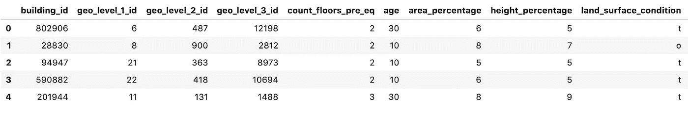
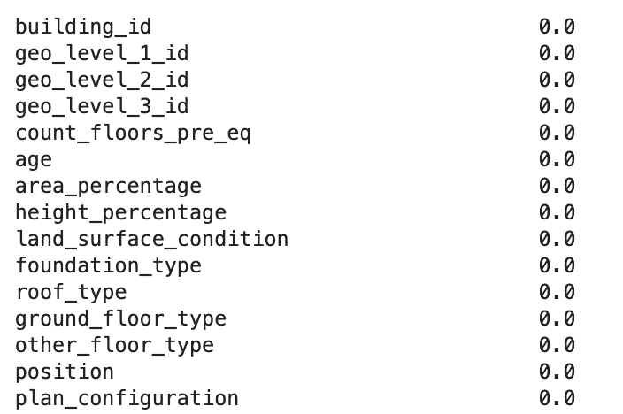
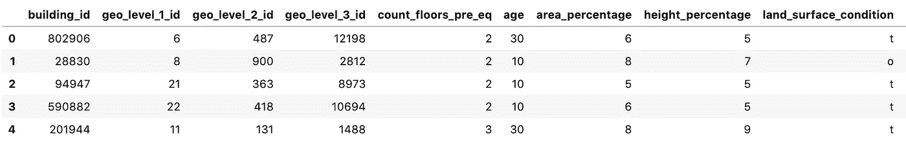
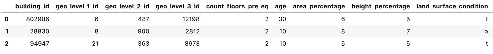
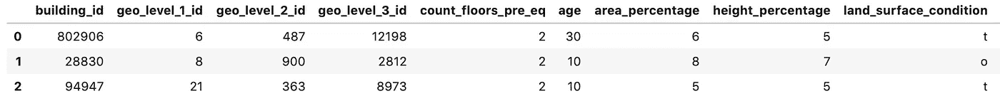

# 熊猫数据帧简介

> 原文：<https://towardsdatascience.com/introduction-to-pandas-dataframes-b1b61d2cec35?source=collection_archive---------16----------------------->


照片由[吴镇男·麦金尼](https://unsplash.com/@derickray?utm_source=unsplash&utm_medium=referral&utm_content=creditCopyText)在 [Unsplash](https://unsplash.com/s/photos/frames?utm_source=unsplash&utm_medium=referral&utm_content=creditCopyText) 上拍摄

## 使用 pandas 处理、清理和选择数据

Pandas 是一个 python 包，设计用于快速灵活的数据处理、操作和分析。Pandas 有许多基本的数据结构(一种数据管理和存储格式)。如果您正在处理二维标签数据，即既有列又有带行标题的行的数据—类似于电子表格，那么 DataFrame 就是您将在 Pandas 中使用的数据结构。



二维数据结构——熊猫数据框架

在下一篇文章中，我将介绍这个包中一些最常见的数据处理和操作方法。

## 数据

在整个教程中，我将使用来自机器学习竞赛网站 drivendata.org 的数据集。数据集可以从[这里](https://www.drivendata.org/competitions/57/nepal-earthquake/)下载。

数据集包括用于拟合机器学习模型的一组训练数据和用于进行预测的测试数据文件。出于本文的目的，因为我只执行预处理和分析，所以我将只使用训练数据。

## 读取数据

使用 Pandas 处理数据的第一步是将数据读入编辑器，在本文中，我将使用 Jupyter 笔记本。

Pandas 为大多数类型的数据导入提供了方法。

要从 CSV 文件中获取数据，您可以使用`**pandas.read_csv()**` [功能](https://pandas.pydata.org/pandas-docs/stable/reference/api/pandas.read_csv.html)。我们使用的数据集中的要素(值)和标注位于不同的文件中，因此我们将同时读取它们，稍后将学习如何将它们合并在一起。

```
import pandas as pdtrain_values = pd.read_csv('train_values.csv')
train_labels = pd.read_csv('train_labels.csv')
```

Pandas 还具有从各种其他来源读取数据的功能，包括:

*   **Excel** — `pandas.read_excel()`。
*   JSON——`pandas.read_json()`。
*   **SQL** — `pandas.read_sql()`。
*   **谷歌大查询**——`pandas.read_gbq()`。

## 合并和连接

在从事数据科学项目时，您正在处理的数据通常位于多个文件中和/或来自多个来源。因此，经常会有需要组合数据集的时候。有很多方法可以让你做到这一点，熊猫为每一种都提供了一种方法。

***合并***

如果您以前有过使用 SQL 查询的经验，那么这个方法将会非常熟悉。合并是通过公共标识符将两个数据集连接在一起的过程，类似于 SQL 中的连接。

在我们的数据集的例子中，我们有一个 train_values 数据集和一个 train_labels 数据集，每行都有相同的`building_id`,称为键。

merge [函数](https://pandas.pydata.org/pandas-docs/stable/reference/api/pandas.DataFrame.merge.html)有许多参数，但是我们需要注意的三个参数是 **how** 和 **on** 。在这里可以找到所有的论点和解释。

**how** 参数指的是确定哪些键应该出现在结果数据集中的方法。例如，值数据集中的行可能不会出现在标签数据集中。如果是这种情况，我们需要确定保留哪些行。 **how** 参数有四个变量。

*   **left**-此参数将仅保留左侧数据框中的关键点。
*   **右** —这将只保留右数据帧的关键帧。
*   **外部** —将保留两个数据帧的所有关键字，包括不匹配的行。
*   **inner** —将保留两个数据帧的所有关键字，但**不会**包括不匹配的行。

下面的代码通过在`on`参数中使用`building_id`的内部连接来连接两个数据帧。

```
train_data = pd.merge(train_values, train_labels, how='inner', on=['building_id', 'building_id'])
```

***串联***

pandas 中的`**concat()**` [函数](https://pandas.pydata.org/pandas-docs/stable/reference/api/pandas.concat.html)是组合数据帧的另一种方法。然而，`**concat()**`并没有加入一个公共键，而是通过将列添加到列或者将行添加到行来有效地将数据帧粘合在一起，这被称为**轴**。

由于我们的两个数据集具有完全相同的索引，我们可以使用 concat 函数将它们组合起来，作为 merge 的直接替换。在下面，我们将两个数据帧作为一个列表传递，并指定 axis=1，这告诉函数我们想要在列上连接。在我们的例子中，concat 的缺点是,`building_id`列出现了两次。

```
train_data_concat = pd.concat([train_values, train_labels], axis=1)
```

## 处理缺失数据

数据集中最常见的问题之一是缺失数据。Pandas 有多种方法来处理数据帧中的缺失值。

对于缺失数据的处理，我们有很多选择。

*   删除任何列中包含缺失数据的所有行。
*   删除包含丢失数据的一列或多列。
*   用合理的替代值估算缺失值这可能是 0，也可能是列中剩余数据的中间值。

熊猫有办法做到每一点。

首先检测是否有缺失值熊猫有`**isna()**` [功能](https://pandas.pydata.org/pandas-docs/stable/reference/api/pandas.DataFrame.isna.html)。如果值丢失，则返回**真**，否则返回**假**。我们可以用它来确定每列缺失值的数量，如下所示。

```
train_data.apply(lambda x: sum(x.isna()) / len(train_data))
```



我们的数据集实际上没有任何丢失的值，但是让我们通过一些例子来说明如果有丢失的值，我们将如何处理它们。

熊猫[函数](https://pandas.pydata.org/pandas-docs/stable/reference/api/pandas.DataFrame.dropna.html) `**drop_na()**`删除包含缺失值的行或列(取决于您选择的参数)。该函数采用您设置为 0 的轴参数来删除行，设置为 1 来删除列。

替代功能[为`**fillna()**`。该函数将用您选择的值替换缺失的值。您可以用固定值(如 0)替换，也可以使用计算方法(如平均值)。还可以通过为每列传递一个值字典，将不同的值应用于不同的列。](https://pandas.pydata.org/pandas-docs/stable/reference/api/pandas.DataFrame.fillna.html)

下面的代码用该列的模式填充任何缺少的值。

```
train_data_numeric = train_data.apply(lambda x: x.fillna(x.mode()),axis=0)
```

## 选择数据

在数据分析和预处理过程中，会有很多时候需要选择数据的子集。您可能希望选择特定的列、行的子集或基于特定条件创建数据的子集。Pandas 提供了执行这些任务的各种方法。

要根据标签或位置从数据框中选择数据的子集和行，pandas 有两种方法 **loc** 和 **iloc** 。

**loc** [方法](https://pandas.pydata.org/pandas-docs/stable/reference/api/pandas.DataFrame.loc.html)根据**索引标签**选择行。让我们快速看一个例子。

这是我们的数据框。索引是位于`building_id`列左侧的数字列。



在 pandas 中，我们总是从 0 开始计数，所以如果我们想使用 loc 选择前三行，我们运行下面的代码。

```
subset_loc = train_data.loc[[0, 1, 2]]
subset_loc.head()
```

这给了我们前三行。



**iloc** 方法[通过**索引位置选择行。**例如，如果用户不知道索引或者如果索引不是数字的，可以使用这种方法。](https://pandas.pydata.org/pandas-docs/stable/reference/api/pandas.DataFrame.iloc.html)

选择前三行看起来非常类似于 loc 方法。

```
subset_iloc = train_data.iloc[[0, 1, 2]]
subset_iloc.head()
```



为了根据特定条件选择行，我们可以使用`**where()**`函数。这非常类似于 SQL 查询中的 where 子句。下面是几个例子。

基于布尔条件选择数据。下面的代码只选择列`has_superstructure_cement_mortar_brick`中的值为 1 的行。

```
has_cement_mortar_brick = train_data[train_data['has_superstructure_cement_mortar_brick'] == 1]
has_cement_mortar_brick.head()
```

根据数值条件选择数据。下面的代码只选择了`age`列的值大于 50 的行。

```
has_age_greater_than_50 = train_data[train_data['age'] > 50]
has_age_greater_than_50.head()
```

您可以组合多个条件，如下所示。

```
two_conditions = train_data_concat[train_data['has_superstructure_cement_mortar_brick'] == 1 & (train_data['age'] > 50)]
two_conditions.head()
```

本文简要介绍了 pandas 数据框和一些最常见的任务。熊猫用户指南是一个很好的参考点，可以在图书馆找到更多关于这些和其他可用方法的信息。如果你有兴趣了解更多关于如何用 Pandas 软件包分析数据的信息，我写了另一篇文章，可以在这里找到。

感谢阅读！

我每月都会发一份简讯，如果你想加入，请点击此链接注册。期待成为您学习旅程的一部分！