# 各种 SQL 查询的 Pandas 等价物介绍

> 原文：<https://towardsdatascience.com/introduction-to-pandas-equivalents-of-various-sql-queries-448fb57dd9b9?source=collection_archive---------22----------------------->

## 一个直观的教程，适用于初学者和将职业道路转向数据科学的人


卡斯帕·卡米尔·鲁宾在 [Unsplash](https://unsplash.com/s/photos/sql-query?utm_source=unsplash&utm_medium=referral&utm_content=creditCopyText) 上的照片

有一些关于 SQL 查询的熊猫等价物的很棒的文章，例如:

*   [熊猫相当于 10 个有用的 SQL 查询](/pandas-equivalent-of-10-useful-sql-queries-f79428e60bd9)
*   如何在 Pandas 中重写您的 SQL 查询，等等。

它们是很棒的文章，但是，它们都假设读者已经熟悉了 [SQL](https://en.wikipedia.org/wiki/SQL) 。事实证明，情况并非总是如此，尤其是对于初学者和将职业道路转向数据科学的人。

本文旨在向零编码技能人员介绍 Pandas 查询。在本文中，每一节都以对特定 SQL 查询的介绍开始，然后是 Pandas 等价物，从而使我们对该方法的理解更加深刻和方便。

# 数据集准备

本文使用[安德森鸢尾花(iris)](https://en.wikipedia.org/wiki/Iris_flower_data_set) 数据集进行演示。该数据集包含五个属性下的一组 150 条记录:*萼片长度*、*萼片宽度*、*花瓣长度*、*花瓣宽度、*和*类*(从 sklearn 数据集称为*目标*)。

首先，让我们导入库并从 ***scikit-learn*** 库中获取虹膜数据集。你也可以从 [UCI 虹膜数据集](https://archive.ics.uci.edu/ml/datasets/iris)下载。

```
import pandas as pd
import numpy as np
from sklearn.datasets import load_iris
```

为了演示，我们只取 6 个记录(每个类 2 个记录):

```
iris = load_iris()
df = pd.DataFrame(iris.data, columns=iris.feature_names)# Convert datatype to float
df = df.astype(float)# append "target" and rename it to "label"
df['label'] = iris['target']# Use string label instead
df['label'] = df.label.replace(dict(enumerate(iris.target_names)))# Select first 2 records from each label
df_setosa = df[df['label'] == 'setosa'].head(2)
df_versicolor = df[df['label'] == 'versicolor'].head(2)
df_virginica = df[df['label'] == 'virginica'].head(2)
iris = pd.concat([df_setosa, df_versicolor, df_virginica])# For simplicity, change columns name from 
#    | sepal length (cm) | sepal width (cm) | petal length (cm) | petal width (cm) | label |
#  to the below
iris.columns = ['sepal_l', 'sepal_w', 'petal_l', 'petal_w', 'label']iris
```

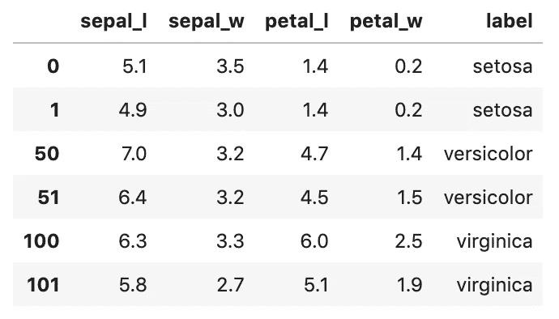

iris 数据集中的 6 条记录

# 1.选择数据(选择)

从数据集中选择数据通常用于检索和预览数据。

例如:预览虹膜数据的****萼片宽度******花瓣长度******花瓣宽度*** 列，显示前 2 条记录。*

*在 SQL 中，`SELECT`语句用于从数据库中选择数据。这是通过使用您想要选择的列的逗号分隔列表来完成的(或者使用`*`来选择所有列):*

```
*SELECT **sepal_l, sepal_w, petal_l, petal_w** 
FROM iris 
**LIMIT 2***
```

*在 Pandas 中，列的选择是通过将列名列表传递给数据帧来完成的:*

```
*search = iris[**['sepal_l', 'sepal_w', 'petal_l', 'petal_w']**].**head(2)***
```

*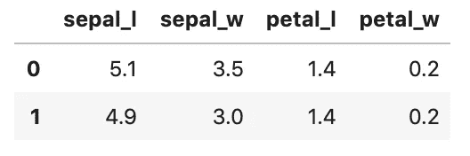*

*Pandas 列选择的输出*

# *2.选择带条件的数据(其中)*

*在实践中，您经常希望检索满足某些指定条件的记录，这通常由过滤器来完成。*

## *单一条件*

*例如，*检索标签为“virginica”的所有数据**

*在 SQL 中，过滤是通过一个`WHERE`子句完成的*

```
*SELECT * 
FROM iris 
**WHERE label='virginica'***
```

*在 Pandas 中，数据帧可以用多种方式过滤，最广泛使用的是[布尔索引](https://pandas.pydata.org/pandas-docs/stable/user_guide/indexing.html#boolean-indexing):*

```
*search = iris[**iris['label']=='virginica'**]*
```

*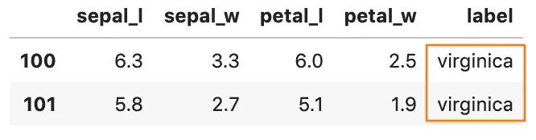*

*使用布尔索引选择 Pandas 列的输出*

## *多个条件和*

*在某些情况下，您可能希望检索满足多个条件的记录。*

*例如，*检索标签为“virginica”且花瓣长度≥ 5.5 的所有数据**

*在 SQL 中，如果由`AND`分隔的所有条件都为真，则可以将`WHERE`子句与`AND`运算符结合起来显示记录。*

```
*SELECT * 
FROM iris 
**WHERE label='virginica'AND petal_l >= 5.5***
```

*在 Pandas 中，可以使用`&`操作符将等价的 AND 条件传递给数据帧:*

```
*search = iris[**(iris['label']=='virginica')** **&** 
              **(iris['petal_l'] >= 5.5)**]*
```

*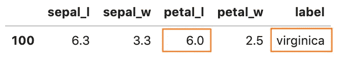*

*具有多个条件和的 Pandas 列选择的输出*

## ***多重条件或***

*对于这些案例，您希望提取满足任何条件的记录。*

*例如，*检索花瓣长度≥ 5 或间隔长度≥ 6 的所有数据**

*在 SQL 中，类似于`AND`运算符，`OR`运算符可以与`WHERE`结合使用，如果`OR`分隔的任何条件为真，则显示记录。*

```
*SELECT * 
FROM iris 
**WHERE petal_l >= 5OR sepal_l >= 6***
```

*在 Pandas 中，可以使用`|`操作符将等价的 OR 条件传递给数据帧:*

```
*search = iris[**(iris['petal_l'] >= 5) |** 
              **(iris['sepal_l'] >= 6)**]*
```

*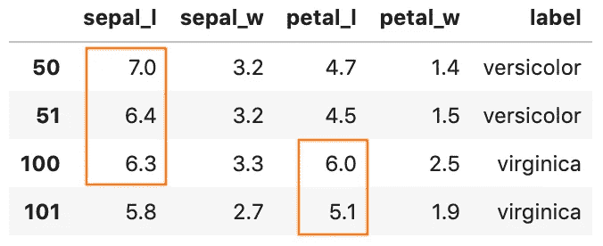*

*熊猫的产量或状况*

# *3.处理缺失值(NULL 或 NaN)*

*在现实世界中，许多有趣的数据集都会丢失一些值。不同的编程语言使用不同的方法来指示缺失值。对于数据库和熊猫:*

*   *缺失值在数据库中通常显示为`NULL`*
*   *`[NaN](/working-with-missing-values-in-pandas-5da45d16e74)` [，一个特殊的浮点值](/working-with-missing-values-in-pandas-5da45d16e74)，在 Pandas 中用来表示一个缺失值。*

## *选择缺少值的记录*

*在某些情况下，您希望只查看字段缺少值的记录。*

*例如，*检索丢失花瓣长度*的所有数据*

*在 SQL 中，我们可以使用`IS NULL`操作符来测试`NULL`值*

```
*SELECT * 
FROM iris 
**WHERE petal_l IS NULL***
```

*在 Pandas 中，方法`isna()`可用于检查缺失值*

```
*search = iris[**iris['petal_l'].isna()**]*
```

## *过滤掉缺失的值*

*在某些情况下，您希望只看到有值的记录。*

*例如，*检索花瓣长度为的所有数据不丢失**

*在 SQL 中，`IS NOT NULL`运算符可以用来过滤掉缺失的值*

```
*SELECT * 
FROM iris 
**WHERE petal_l IS NOT NULL***
```

*在 Pandas 中，等价的查询可以用方法`notna()`来完成*

```
*search = iris[**iris['petal_l'].notna()**]*
```

# *4.排序结果(排序依据)*

*当从数据集中查询数据时，您可能还希望结果以排序的顺序返回。*

## *按升序排列*

*例如，*从 iris 数据集中检索花瓣 _l ≥ 4 的所有数据，按标签列升序排序**

*在 SQL 中，`ORDER BY`关键字用于按升序(`ASC`)对结果集进行排序。*

```
*SELECT * 
FROM iris 
WHERE petal_l >= 4 
**ORDER BY label ASC***
```

*在 Pandas 中，可以使用带有参数`by=’label’`和`ascending=True`的方法`sort_values()`来完成等效的查询*

```
*search = iris[iris['petal_l'] >= 4]**.sort_values(by='label', ascending=True)***
```

*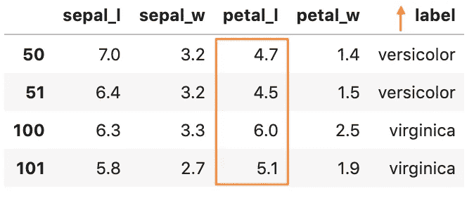*

*熊猫的输出用 ASC 排序 _value*

## *按降序排列*

*例如，*从 iris 数据集中检索所有花瓣 _l ≥ 4 的数据，按标签列降序排序。**

*在 SQL 中，`ORDER BY`关键字用于按降序(`DESC`)对结果集进行排序。*

```
*SELECT * 
FROM iris 
WHERE petal_l >= 4 
**ORDER BY label DESC***
```

*在 Pandas 中，可以使用带有参数`by=’label’`和`ascending=False`的方法`sort_values()`进行等效查询*

```
*search = iris[iris['petal_l'] >= 4]**.sort_values(by='label', ascending=False)***
```

*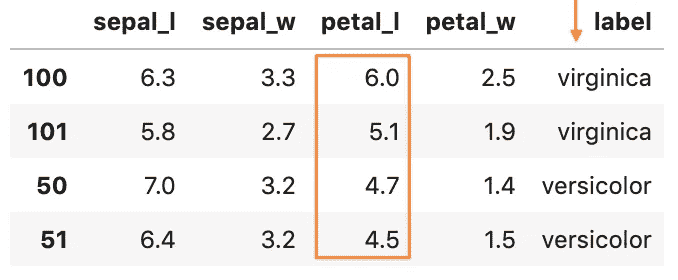*

*熊猫产量与 DESC 排序 _ 值*

# *5.更新记录(更新)*

*有时，我们需要修改数据集中的现有记录。*

*例如:*将所有 sepal_length = 7 且 sepal_width = 3.2* 的记录的标签更新为***virginica****

**在 SQL 中，`UPDATE`语句和`SET`运算符一起用于修改现有记录**

```
****UPDATE** iris 
**SET label = 'virginica'** 
WHERE sepal_l = 7 AND sepal_w = 3.2**
```

**在 Pandas 中，`loc()`可以用来有条件地访问行，并返回指定的列`label`。之后，我们可以将所有记录的值设置为 **virginica** 。**

```
**iris.**loc**[**(iris['sepal_l'] == 7) & 
        (iris['sepal_w'] == 3.2), 'label'**] = 'virginica'**
```

**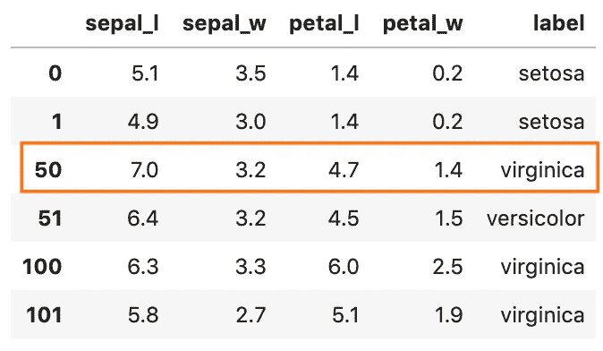**

**更新熊猫的现有记录**

# ****6。记录分组(分组依据)****

**在某些情况下，我们希望对具有相同值的记录进行分组。**

**例如:*查找每个标签中的记录数***

**在 SQL 中，`GROUP BY`语句将具有相同值的行分组到汇总行中，**

```
**SELECT label, count(*) 
FROM iris 
**GROUP BY label****
```

**在 Pandas 中，SQL 的`GROUP BY`操作使用类似命名的`groupby()`方法来执行。**

```
**search = iris**.groupby('label')**.size()**
```

**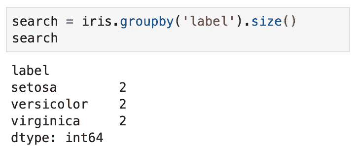**

**熊猫中的分组记录**

## **拥有多项统计数据**

**对于需要多个统计数据的情况**

**例如:*查找每个标签的平均萼片长度和最大花瓣长度***

**在 SQL 中，我们可以使用一些内置的[数学函数](https://www.w3schools.com/sql/sql_ref_sqlserver.asp)来完成任务:**

```
**SELECT label, **avg(sepal_l)**, **max(petal_l)** 
FROM iris 
**GROUP BY label****
```

**在熊猫身上，`agg()`可以用来同时应用多种功能:**

```
**search = iris.groupby('label').**agg(
       { 'sepal_l': np.mean, 'petal_l': np.max})****
```

**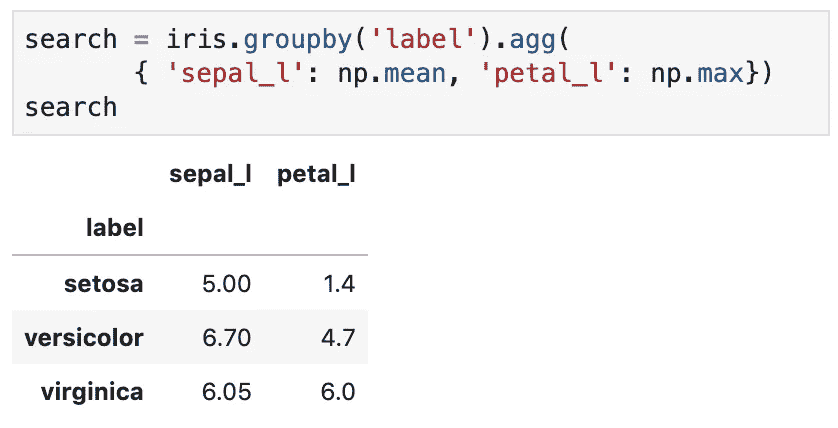**

**Pandas 中具有多个统计数据的分组记录**

# **7.删除记录**

**从数据集中删除记录是数据处理的主要要求之一。**

**例如:*删除花瓣宽度= 1.7，花瓣长度≥ 5 的记录***

**在 SQL 中，`DELETE`语句用于删除现有记录**

```
****DELETE** FROM iris 
**WHERE petal_w = 1.7 AND petal_l >= 5****
```

**在熊猫身上，对等的方法是`drop()`。而给定的参数应该是匹配记录`iris[(iris[‘petal_w’] == 1.7) & (iris[‘petal_l’] >= 4)].**index**` 的索引。**

```
**drop = iris.drop(**iris[(iris['petal_w'] == 1.7) 
                      & (iris['petal_l'] >= 4)].index**)**
```

# **8.从多个数据集查询数据(连接)**

**到目前为止，我们一直在查看来自单个数据集的查询。在现实世界中，基于相关列组合来自两个或更多数据集的记录是很常见的。官方称这种查询为 Join。**

**有 4 种不同类型的连接**

1.  ****内部连接**:返回在两个数据集中具有匹配值的记录**
2.  ****左(外)连接**:返回左数据集中的所有记录，以及右数据集中的匹配记录**
3.  ****右(外)连接**:返回右数据集中的所有记录，以及左数据集中的匹配记录**
4.  ****完全(外部)连接**:当左或右数据集中有匹配时，返回所有记录**

**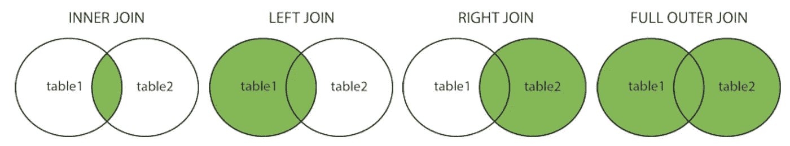**

**来源于[https://www.w3schools.com/sql/sql_join.asp](https://www.w3schools.com/sql/sql_join.asp)**

**在我们深入细节之前，让我们创建一个新的数据集 ***country*** ，它记录了在哪里发现了这种花:**

```
**country = pd.DataFrame(**{ 'label': ['virginica', 'versicolor'],
                  'country': ['US', 'Germany']**})**
```

**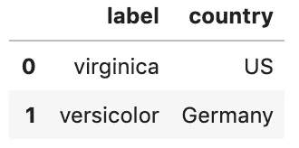**

**组成一个数据集国家**

**请注意，我们没有标签“setosa”的国家记录**

## **内部连接**

**例如:*根据标签*检索在 iris 和 country 数据集中具有匹配值的所有记录**

```
**SELECT * FROM iris 
**INNER JOIN** country 
**ON iris.label = country.label****
```

**在 Pandas 中，当您想要基于相关列连接两个数据帧时，方法`merge()`会提供参数。默认情况下，它执行内部连接。**

```
**inner = pd.**merge(iris, country, on='label')****
```

**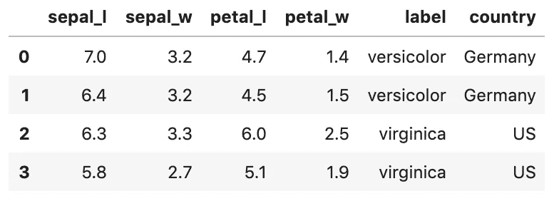**

**基于标签的内部连接的结果**

## **左外部连接**

**例如:*根据标签从 iris 中检索所有记录，并从国家中检索匹配的记录。***

```
**SELECT * FROM iris 
**LEFT OUTER JOIN** country
**ON iris.label = country.label****
```

**相当于熊猫:**

```
**left = pd.merge(iris, country, on='label', **how='left'**)**
```

**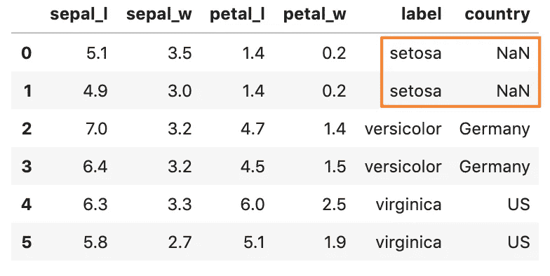**

**左外部连接的结果**

## **右外部联接**

**例如:*根据标签从国家/地区检索所有记录，并从 iris 检索匹配的记录。***

```
**SELECT * FROM iris 
**RIGHT OUTER JOIN** country 
**ON iris.label = country.label****
```

**相当于熊猫:**

```
**right = pd.merge(iris, country, on='label', **how='right'**)**
```

**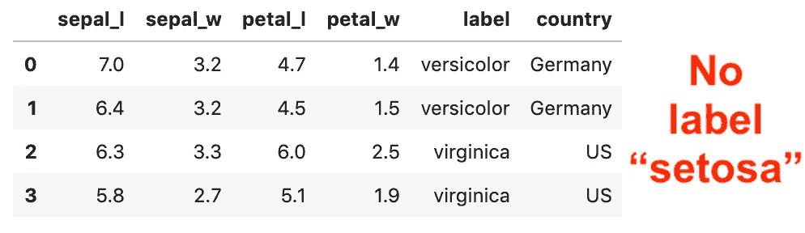**

**右外部联接的结果**

## **完全外部连接**

**例如:*当 iris 或国家数据集中存在匹配时，根据标签检索所有记录。***

```
**SELECT * FROM iris 
**FULL OUTER JOIN** country
**ON iris.label = country.label****
```

**相当于熊猫:**

```
**full = pd.merge(iris, country, on='label', **how='outer'**)**
```

**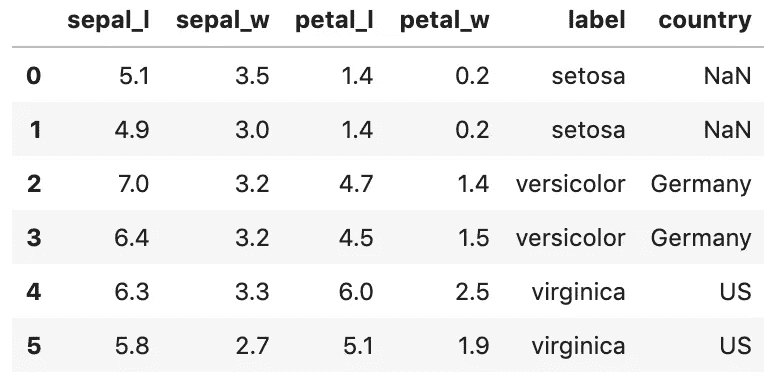**

**完全外部连接的结果**

# **9.组合多个查询的结果(联合)**

**在数据处理中，将两个或多个查询的结果组合成一个结果也很常见。为了组合结果，每个查询必须具有相同数据类型的相同数量的列。**

**为了演示，让我们从 iris 构建两个数据集。注意，我们还创建了一个如图所示的重复记录。**

```
**iris_a = iris[0:3]
iris_b = iris[2:]**
```

**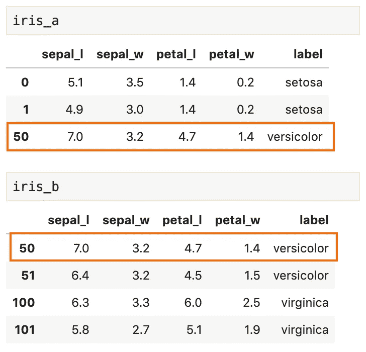**

**具有重复记录的 iris_a 和 iris_b**

## **允许重复值**

**在 SQL 中，可以使用`UNION ALL` 运算符来允许重复值**

```
**SELECT * FROM iris_a WHERE label = 'versicolor' 
**UNION ALL** 
SELECT * FROM iris_b WHERE label = 'versicolor'**
```

**在熊猫中，对应的方法是`concat()`，默认情况下它允许所有的副本。**

```
**union = pd.**concat**([iris_a[iris_a['label']=='versicolor'], iris_b[iris_b['label']=='versicolor']])**
```

**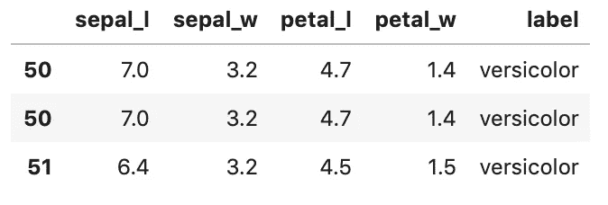**

**UNION All 允许重复的结果**

## **没有重复值**

**在 SQL 中，`UNION`操作符只选择不同的值**

```
**SELECT * FROM iris_a WHERE label = 'versicolor' 
**UNION** 
SELECT * FROM iris_b WHERE label = 'versicolor'**
```

**在熊猫中，你可以将`[**concat()**](https://pandas.pydata.org/pandas-docs/stable/reference/api/pandas.concat.html#pandas.concat)`与`[**drop_duplicates()**](https://pandas.pydata.org/pandas-docs/stable/reference/api/pandas.DataFrame.drop_duplicates.html#pandas.DataFrame.drop_duplicates)`结合使用。**

```
**union = pd.**concat**([iris_a[iris_a['label']=='versicolor'], iris_b[iris_b['label']=='versicolor']])**.drop_duplicates()****
```

**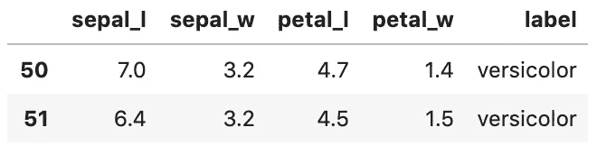**

**移除重复项的联合结果**

# **尽情享受吧！**

**仅此而已。感谢阅读。**

**我们一直在谈论缺失的价值观。如果你想了解更多关于在 Pandas 中使用缺失值的信息，这里有一篇文章你可能会感兴趣。**

**[](/working-with-missing-values-in-pandas-5da45d16e74) [## 处理熊猫中缺失的值

### 关于 Pandas 中缺失值以及如何使用内置方法处理它们的教程

towardsdatascience.com](/working-with-missing-values-in-pandas-5da45d16e74)**