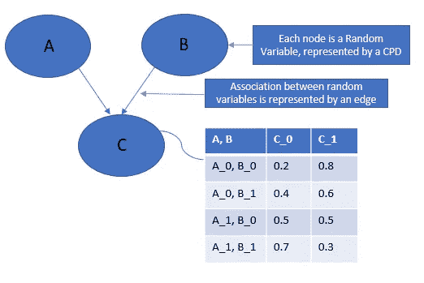
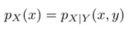
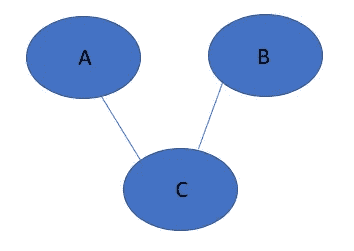

# PGM 1:概率图形模型介绍

> 原文：<https://towardsdatascience.com/introduction-to-probabilistic-graphical-models-7d2c0b4bef19?source=collection_archive---------20----------------------->

## **概率图形模型世界的快速简单入门**

由作者创建，用于说明贝叶斯网络中的节点和边

> 概率图形模型(PGM)提供了一种图形表示来理解一组随机变量(RVs)之间的**复杂**关系。

RVs 表示节点，它们之间的统计相关性称为边。上面显示了一个概率图形模型的例子。

我在上面强调了“复杂”这个词；**让我们了解一下房车之间的复杂程度:**

假设我们有 n 辆房车:X1，X2…Xn。让我们举一个非常简单的例子，假设每个 RV 只能取 2 个可能的值，即我们有一组二进制 RV。

现在，学习概率图形模型的关键目标是学习由 P(X1，X2，..Xn)为一组随机变量。我们注意到，随着 2^n 状态的增加，n 个二元 RVs 分布的复杂性增长到指数级。

## **建立直觉的例子:**

## RVs 及其关联借助一个示例进行解释:

如果患者带着一些症状(例如发烧)去看医生，医生为调查症状和可能的致病原因而询问的问题可以被描述为 RVs。

医学诊断是 PGM 的应用之一；照片由[国家癌症研究所](https://unsplash.com/@nci?utm_source=unsplash&utm_medium=referral&utm_content=creditCopyText)在 [Unsplash](https://unsplash.com/s/photos/medical-diagnosis?utm_source=unsplash&utm_medium=referral&utm_content=creditCopyText) 上拍摄

这些问题可能采取如下形式:

*   发烧多少天了？
*   食欲不振？
*   发烧级别——高还是低？
*   头疼还是头晕？
*   病史？

**补充说明**:上面描述了两种变量——连续变量和离散变量。我们稍后将对此进行更多讨论，但在这一点上需要注意的是，连续变量和离散变量的共同存在会导致混合/混合网络(通常难以建模)。

因此，基于这些属性(又名 RVs)之间的关联，医生可能会建议进一步的行动方案，要么是一些药物，要么是一些测试，以某种概率**得出结论**。

这里出现了一个需要更多强调和讨论的重要方面——概率。虽然我们大概知道没有机器学习模型或专家(在我们的情况下，是医生)可以在任何时候都 100%准确地预测输出，但让我们明白其中的一些原因，如下所述:

*   **对世界的一知半解:**无论医生对可能的原因调查得多好，总有一定程度的不确定性。这主要是因为我们并不完全了解世界上所有的国家。
*   **噪音:**测试结果可能会有噪音观察的成分，并清楚地表明它们可以被信任的程度。
*   **建模限制:**即使有一些可能的疾病以发热为初步症状，但在建立模型时，几乎不可能考虑所有这些因素。

## **我们为什么需要 PGM，它在机器学习世界中处于什么位置？**

*   PGM 提供了一种结构，在这种结构中，我们可以利用 ***独立性属性*** 以更紧凑的方式表示高维数据。
*   它是对某些*未观测变量，给出 ***观测变量*** 的证据，得出 ***推论*** 的有力工具。*

*总之，PGM 以联合分布的形式提供了一种基于图形的表示，对 RVs 之间的潜在关联进行了紧凑建模*

*我在上面强调了一些术语(对你来说可能是新的)，所以在我们继续之前，让我简单扼要地解释一下，以便更容易保持联系:*

***独立性属性:***

*让我们从概率的世界来重温一下独立事件的概念。a 和 B 是独立的事件，如果:*

*P(A)= P(A | B)；这意味着知道事件 B 的发生并不能告诉我们任何关于事件 a 发生的事情。*

*让我们把这个概念推广到随机变量。例如，X 和 Y 是独立的随机变量，如果:*

**

*很好，现在我们理解了独立性，但是在理解一个复杂的结构时，我们如何从中受益呢？*

*   *它使我们更容易从系统的其余部分中独立地理解特定属性的特征。话虽如此，但在复杂网络中很少会遇到独立的情况。*
*   *因此出现了条件独立的概念，即两个 RV 在观察到第三个 RV 时变得独立。*
*   *现在，可以合理地假设条件独立的概念在如何计算和表示网络结构方面带来了显著的节约。*

***推论:***

*由于概率图形建模的结果，我们已经了解了属性/RVs 的联合概率分布，最困难和唯一的任务之一是计算一个或多个变量的边际密度和条件密度。*

*简而言之，推断是在给定观察变量的状态的情况下，对一组变量(即未观察变量)的条件密度的计算。*

***图形模型的类型:***

*1) **贝叶斯网络:**通过有向无环图来表示结构。这类网络中变量之间概率影响的流动有明确的方向。箭头的存在意味着两个变量之间的因果关系，这由条件概率分布(CPDs)表示。*

***示例:**开头所示的图形网络代表贝叶斯网络*

***2)** **马尔可夫网络:**马尔可夫网络中的底层图是无向的。由于这个网络中的边没有任何方向，因此缺少因果关系。因此，我们只能根据**相似度**来表示哪个组合更有可能出现，这不一定在 0 和 1 之间，不像贝叶斯网络。*

***示例:**与示例(开头所示)类似的马尔可夫网络如下:*

**

*马尔可夫网络*

## *应用:*

*PGM 广泛应用于信息提取、语音识别、医疗诊断、计算机视觉等领域。*

*还有一个应用，我将使用“pgmpy”演示 PGM 的实现。但在此之前，我打算写一系列的帖子，以清晰的方式解释先决条件的概念。*

*所以，敬请期待，快乐阅读。*

***参考文献:***

*   *https://www . coursera . org/specializations/probability-graphical-models*
*   *[https://en.wikipedia.org/wiki/Graphical_model](https://en.wikipedia.org/wiki/Graphical_model)*
*   *[http://ai.stanford.edu/~paskin/gm-short-course/lec2.pdf](http://ai.stanford.edu/~paskin/gm-short-course/lec2.pdf)*