# 概率图形模型介绍

> 原文：<https://towardsdatascience.com/introduction-to-probabilistic-graphical-models-b8e0bf459812?source=collection_archive---------2----------------------->

克林特·王茂林在 [Unsplash](https://unsplash.com?utm_source=medium&utm_medium=referral) 上拍摄的照片

**概率图形模型(PGMs)** 是使用图形对复杂的联合多元概率分布进行编码的统计模型。换句话说，PGM 捕获相互作用的随机变量之间的条件独立性关系。这是有益的，因为多年来在各个领域中已经积累了许多关于图的知识，特别是在分离图上的子集、集团和函数方面。这些知识可以在 PGMs 中重用。此外，人们可以很容易地将 PGM 可视化，并快速了解模型结构。

通过了解 PGM 的图形结构，可以解决诸如推理(计算一个或多个随机变量的边际分布)或学习(估计概率函数的参数)之类的任务。给定一些数据，人们甚至可以尝试学习图形本身的结构。

在这篇文章中，我将简要描述 PGM 的两种风格，**有向图模型(dgm)，**也称为**贝叶斯网络(BNs)和无向图模型(ugm)或马尔可夫随机场(MRF)**。我将解释这些模型之间的区别，并提供两者的例子。在这篇文章的最后一部分，我将看看 bn 和 MRF 之间的转换。我还将简要介绍 PGMs 中的推理和参数估计。我会在适当的地方提供更多相关信息的链接。

# 有向图形模型

顾名思义，有向图模型可以用一个图来表示，图的顶点作为随机变量，图的**有向**边作为它们之间的依赖关系(见下图)。

图 DGMs 的两个例子。虽然(A)中的模型是循环的，但是(B)是 DAG 并且可以表示贝叶斯网络。

边缘的**方向决定了一个随机变量对另一个**的**影响。如果该图不包含循环(在一个封闭链中连接的多个顶点)，它通常被称为**有向无环图(DAG)** 。可以使用诸如**置信传播(BP)** 或变量消除之类的算法精确地对这些图进行推断。**

## 贝叶斯网络

DGM 的一个例子是贝叶斯网络(BN) 。贝叶斯网络是一个 **DAG** ，其顶点(随机变量)代表模型的可观察变量或潜在变量。

BN **的**有向边**(“箭头”)代表条件分布**。例如，如果顶点的值是二进制的，则条件分布可以是伯努利分布。在连续值的情况下，条件分布可以是高斯分布。联合概率分布被公式化为条件概率或边际概率的乘积。

例如，当对下雨或洒水装置开启时给出的湿草概率建模时，我们可以使用这样的 DAG 来表示它:

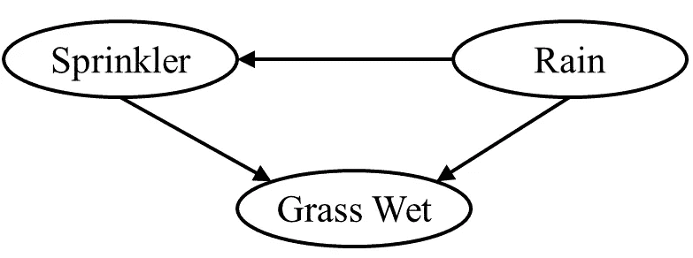

图 2:贝叶斯网络的例子。它编码了以下逻辑:草地潮湿的概率取决于打开洒水器和雨水。洒水装置开启的概率本身取决于降雨(下雨时你不会打开洒水装置)。

这个 DAG 表示(分解的)概率分布

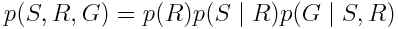

，其中 *R* 为随机变量，为降雨， *S* 为洒水器， *G* 为湿草。通过检查图表，您很快就会看到模型中唯一的独立变量是 *R* 。其他两个变量取决于降雨和/或洒水喷头的概率。通常，BN 的联合分布是给定其父节点的每个节点的条件概率的乘积:

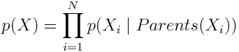

由于大多数节点的父节点远少于节点总数，所以**图通常是稀疏的**。

虽然这不是必需的，但是 BNs 经常被用来建模因果关系。如果 BN 中的边的方向代表因果性，那么 Judea Pearl 引入的因果 do-calculus 允许人们通过执行模拟干预来修改图表，并预测外部干预的影响(如果你想了解更多，请参见[这篇伟大的文章](https://www.inference.vc/untitled/))。

## BNs 中的推理

让我们回到湿草的例子，算出草是湿的概率，即**边际概率** *p(G)* 。这项任务被称为推理。为了确定一个变量的边际概率，通常你必须对图中的所有双亲求和。在这种情况下，边际概率是

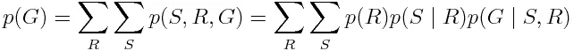

在这种情况下，我们需要综合所有因素。然而，对于更复杂的图形，利用**稀疏图形结构**，有可能**从总和中提取一些因子并大大简化计算**。

我们可能感兴趣的另一个任务是计算假定不下雨，草地会湿的条件概率。在这种情况下，我们将如下进行:

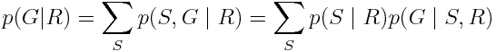

在这种情况下，我们只需要对 *S* 进行边缘化，因为 *R* 已经被假定为给定的。这个程序叫做[变量消除](https://en.wikipedia.org/wiki/Variable_elimination)。变量消去法是一种精确的推理算法。它还可以用于计算出网络的状态，通过简单地交换最大函数的和，具有最大概率。它的缺点是，对于大型 bn，它可能在计算上很难处理。在这些情况下，可以使用近似推理算法，如[吉布斯采样](https://en.wikipedia.org/wiki/Gibbs_sampling)或[拒绝采样](https://en.wikipedia.org/wiki/Rejection_sampling)。

## 弄清楚 BNs 中的独立性

给定一个节点，我们如何确定一个 BN 中的两个节点是否独立？为了回答这个问题，让我们引入 d-分离的概念。

d 分离有 3 个规则:

*   如果两组节点 *X* 和 *Y* 之间没有单向路径(不考虑其方向性的任何边序列),则它们是 d 分离的。

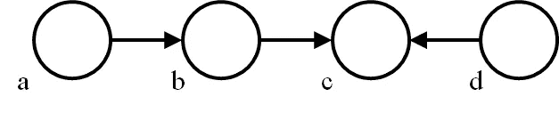

图 3:规则 1。

在本例中，节点 *a* 和 *c* 是 d 连接的，而 *a* 和 *d* 或 *b* 和 *d* 是 d 分离的，因为 *b* 和 *d* 都是 *c* 的父节点。

*   *X* 和 *Y* 是 d 分隔的，给定另一组节点 *Z* ，如果 *Z* “阻塞”它们之间的任何单向路径。

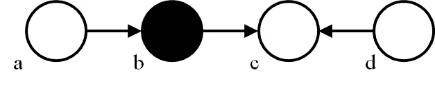

图 4:规则 2。

在这种情况下， *b* 阻断了 *a* 和 *c* 之间的路径，导致它们被 d 分离。

*   如果一个碰撞体或者它的后代在集合 Z 中，它打破了它的双亲的 d 分离。

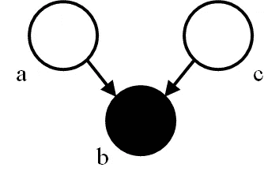

图 5:规则 3。

这个需要一些解释:碰撞器是一个有两个或更多父节点的节点。如果对撞机被观察到，它的双亲，虽然之前是独立的，却变成了依赖的。例如，如果我们正在处理二元变量，对撞机的知识使其双亲的概率或多或少。在上图中， *b* 打破了 *a* 和 *c* 之间的 d 分离。

# 无向图模型(ugm)或马尔可夫随机场(MRF)

与贝叶斯网络类似，MRF 用于使用图形描述随机变量之间的依赖关系。然而，**MRF 使用无向边而不是有向边**。它们也可能包含**周期**，不像贝叶斯网络。因此，MRF 可以描述与它们的贝叶斯网络对应物不同的依赖关系集合。请注意，MRF 不是 dgm 的超集，因为有些关系(如因果关系)只能由 dgm 描述。

贝叶斯网络的边表示条件依赖，而**MRF 的无向边表示图中派系**的联合概率。看看下面的 MRF:

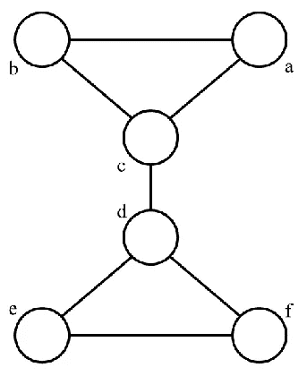

图 6:有三个派系的 MRF 的例子。

该图描述了 3 个不同集团中 6 个变量的联合概率函数。因此，它分解为以下分布乘积:

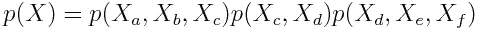

MRF 的一个基本属性是它们满足**成对的、局部的和全局的马尔可夫属性**。这些性质与 BNs 的 d-分离规则有着深刻的联系。特别地，d-分离定义了有向图上的马尔可夫性质。

**成对马尔可夫性质**表明，给定所有其他变量，两个不相邻的变量是有条件独立的:

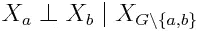

，其中 *X_a* 和 *X_b* 定义任意两个不相邻的变量，X_ *G* 是所有变量的集合。

**局部马尔可夫性质**引入了变量的**邻域**的概念:

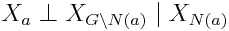

，其中 *N(a)* 是 *X_a* 的邻域。换句话说，任何变量都有条件地独立于给定其邻域的任何其他变量。

最后，**全局马尔可夫性质**表明，给定一个分离子集 *X_S* ，任何变量集合 *X_A* 都独立于任何其他集合 *X_B* :

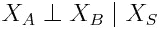

一般来说，成对马尔可夫性质来自局部马尔可夫性质，而局部马尔可夫性质又来自全局马尔可夫性质。然而，对于严格正概率分布，这些陈述是等价的。

MRFs 的另一个重要结果是 [**Hammersley-Clifford 定理**](https://en.wikipedia.org/wiki/Hammersley%E2%80%93Clifford_theorem) :非正式地，该定理陈述了满足一个(或等价地所有)马尔可夫性质的严格正概率分布可以表示为 Gibbs 测度。因此，吉布斯测度是在图的集团上分解的严格正函数:

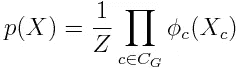

，其中 *Z* 是适当的归一化常数(也称为配分函数)， *c* 是图的(最大)团， *ϕ* 是团上的因式分解函数(不一定归一化)，而 *X* 是随机变量的集合。

## MRF 的例子

MRF 的一个非常常见的例子是**隐马尔可夫模型(HMM)**:HMM 描述了一个具有周期性观察的**动态系统。系统在每个时间步改变隐藏状态。因此， *i* 时刻的状态仅取决于 *i-1* 时刻的状态，即 HMMs 模型马尔可夫过程。此外，在时间 *i* 的观察仅直接取决于时间 *i* 的状态。**

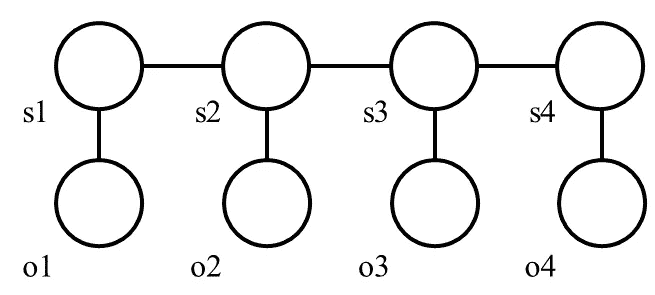

图 7:嗯。隐藏状态表示为 S1–S4，相应的观察值为 o1-o4。

由 HMM 建模的联合概率分布是:

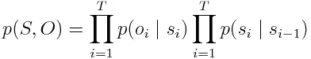

其中 *S* 和 *O* 分别为状态和观测随机变量， *T* 为时间步数。hmm 上的推理非常简单:因为图具有链状结构，所以可以使用**动态编程**算法进行推理。例如，在给定所有观察值*o _【0:T】*的情况下，计算系统在时间 *i* 处于状态 *s* 的概率可以使用**算法来计算。类似地，给定观察值的最可能的隐藏状态序列由 [**维特比算法**](https://en.wikipedia.org/wiki/Viterbi_algorithm) 计算。**

**MRF 还经常用于图像处理等领域，在这些领域中，它们描述了各个像素之间的关系。例如，它们可以通过要求相邻像素具有相似的亮度来加强期望解决方案的某种平滑度。二进制图像平滑(松弛)的一个流行模型是 [**伊辛模型**](https://en.wikipedia.org/wiki/Ising_model) 。伊辛模型将图像中的每个像素视为图形中的一个节点，嵌入到一个与相邻像素相连的网格中:**

**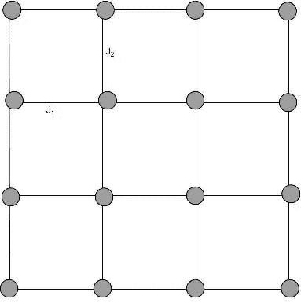**

**图 8:具有势 J1 和 J2 的伊辛模型。**

**伊辛模型假设每个节点可以有两种状态:σ ϵ {-1，1}。特定状态的能量由下式描述:**

**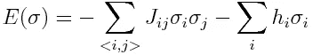**

**，其中 *σ_i* 表示节点 *i* 的状态，第一个总和覆盖网格中的所有邻居， *J_ij* 是节点 *i* 和 *j* 之间的相互作用， *h_i* 是单个节点能量的因子(先验概率)。J_ij 可以是正的，鼓励相邻节点具有相同的符号，也可以是负的，使它们具有相反的符号。系统的联合吉布斯分布由下式给出:**

**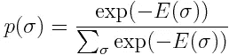**

**取这个表达式的对数，表达式分解成图的集团。因此，我们可以看到，根据哈默斯利-克利福德定理，这个模型确实是一个 MRF。不幸的是，分母中的归一化因子通常很难计算，这使得近似推断成为涉及伊辛模型的问题的选择方法。**

# **BNs 和 MRF 之间的等价性**

**贝叶斯网络和马尔可夫随机场有什么关系？难道我们不能用一个或另一个来表示概率分布吗？如何才能建立等价？人们可以通过简单地改变箭头的方向来把 BN 转换成 MRF。然而，这是不正确的，因为 dgm 和 ugm 编码的独立性关系是不同的。例如，考虑下面的贝叶斯网络和通过移除箭头获得的 MRF:**

**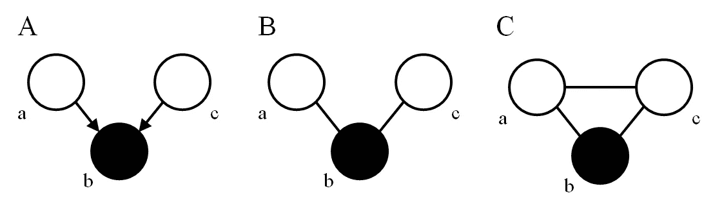**

**图 9 :( A)中的 BN 和通过移除箭头生成的 MRF(B)。正确的道德化的 MRF 显示在(C)中。**

**从上图可以看出，A 和 B 处的图并没有编码相同的条件独立关系:给定节点 *b* ，节点 *a* 和 *c* 根据第三个 d-分离规则并不独立。然而,( B)中的 MRF 不包含这种依赖关系，因为在 *a* 和 *c* 之间没有连线。我们可以通过一个叫做 [**道德化**](https://en.wikipedia.org/wiki/Moral_graph) 的程序来解决这个问题。这被恰当地命名为:尽管**节点 *a* 和 *c* 有一个共同的子节点，但它们并没有通过连接**而“结合”。通过将 *a* 和 *c* 结合，我们弥补了这种不一致。然而，如果没有给出 *b* ，我们也会**失去**独立性**的一部分，即在 *a* 和 *c* 之间。因此，图表变得更一般，推理可能更复杂。****

**逆过程(从 MRFs 移动到 BNs)称为 [**三角测量**](https://en.wikipedia.org/wiki/Chordal_graph) 。请注意，这个过程比说教更复杂，因为最终的 BN 可能比原来的 MRF 大得多。具体来说，MRF 中所有具有 4 个或更多顶点的闭合环都必须划分成三角形。通过执行三角测量，我们得到了所谓的**弦图**。类似于道德化，三角测量也会导致独立信息的丢失。然而，三角测量用于多种推理算法，因为**在一般图上是 NP 难的问题在弦图上往往变得容易**。作为使用道德化**和**三角剖分的算法的例子，让我们提一下 [**连接树算法**](https://en.wikipedia.org/wiki/Junction_tree_algorithm) 。**

# **结论**

**概率图形模型提供了一种模拟随机变量之间关系的方法。最近，由于神经网络的普遍存在，它们已经有点失宠了。然而，我认为它们在未来仍然是相关的，特别是因为它们非常容易解释和直观。它们还允许对因果关系进行建模，甚至可能对学习高级概念的表示有用(参见 Yoshua Bengio 的[本文](https://arxiv.org/abs/1709.08568))。在我看来，找到一种将神经网络与图形模型结合起来的方法，可能对推进整个人工智能领域非常有用。**