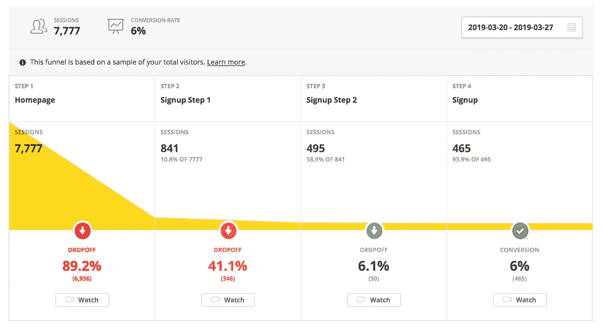
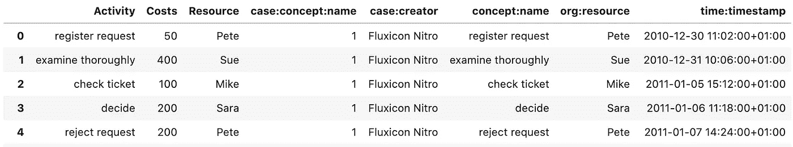
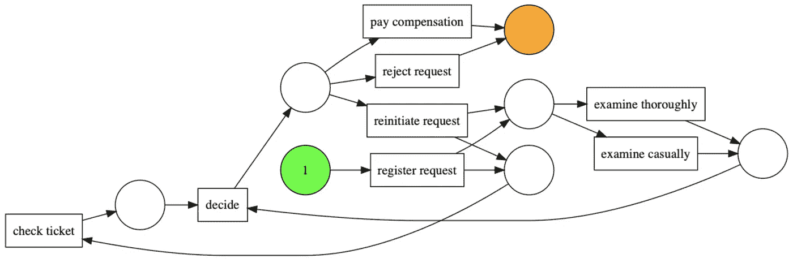
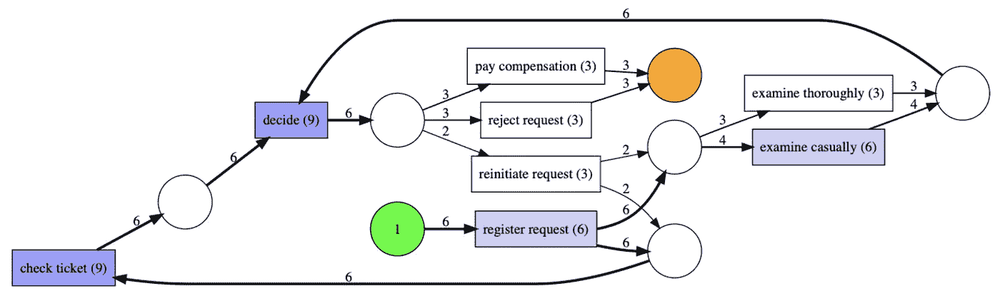
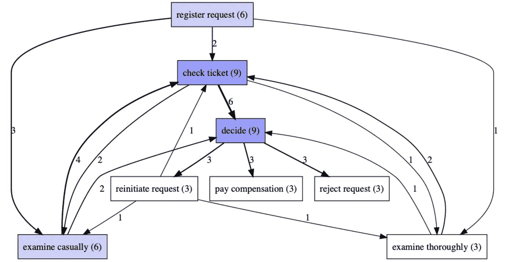
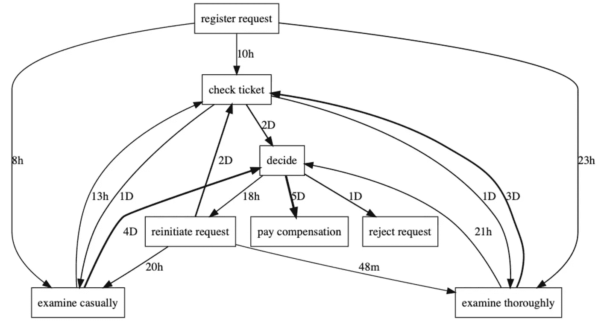
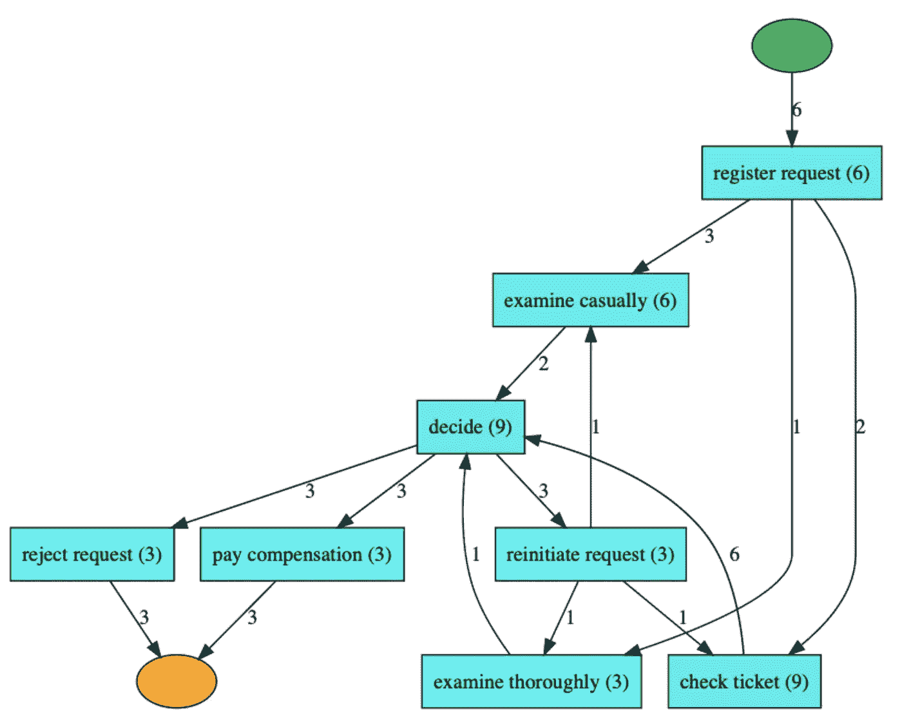
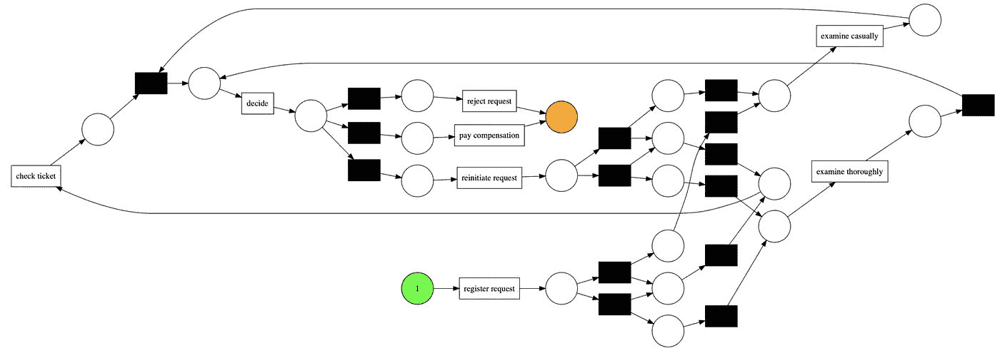
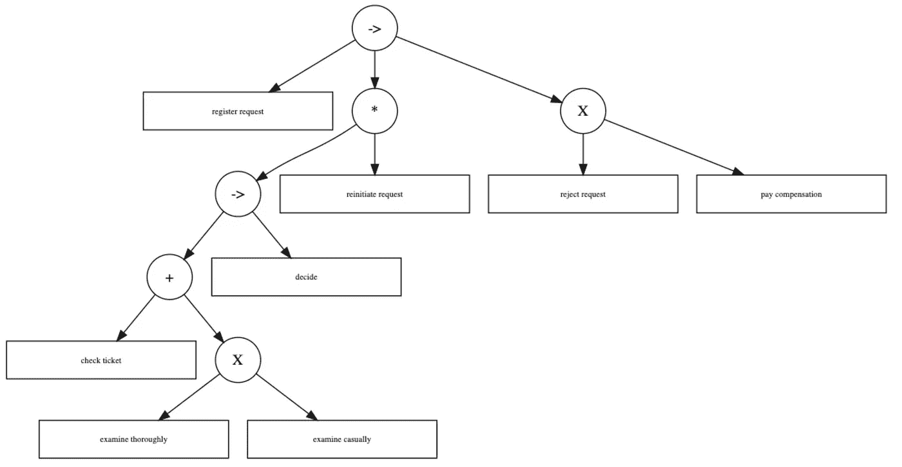
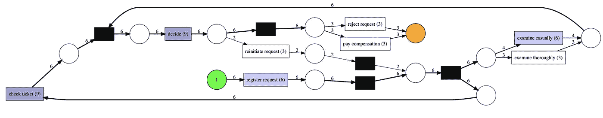

# 流程挖掘简介

> 原文：<https://towardsdatascience.com/introduction-to-process-mining-5f4ce985b7e5?source=collection_archive---------2----------------------->

照片由[UX](https://unsplash.com/@uxindo?utm_source=unsplash&utm_medium=referral&utm_content=creditCopyText)在 [Unsplash](/?utm_source=unsplash&utm_medium=referral&utm_content=creditCopyText) 上拍摄

## 了解流程挖掘的基础知识，以及如何在 Python 中使用流程发现算法

目前，我们日常使用的大多数应用程序/网站都对*我们如何*使用它们非常感兴趣。这是因为他们想从用户的行为中学习和改进，以吸引或留住更多的用户。

想象一下你最喜欢的电商 app。最有可能的是，你可以自由浏览该公司提供的产品，并且时不时地你会被轻轻推着创建一个帐户，以便实际购买一些东西。为了真正成为注册用户，你经常需要提供一些关于你的信息(每个服务的信息量相差很大)。经过几次筛选后，你就可以开始购买了。

*免责声明*:上面的描述是一种简化，许多电子商务零售商采用不同的方式让用户注册，例如，要求在支付订单之前的最后一步注册，或者为了您的方便，在订购后友好地提供保存您的详细信息，以便您下次可以更快地订购。

后台发生的事情是数据科学家/分析师的工作，他们分析用户的旅程，并可能创建某种类型的**漏斗分析** —对一系列事件的映射和分析，这些事件导向一个定义的目标，如完成注册或进行购买。漏斗分析是一个伟大而直观的工具，用于识别每个阶段的下降，并计算转化率。下面您可以看到一个展示漏斗的仪表板示例。

来源:[维基百科](https://en.wikipedia.org/wiki/Funnel_analysis#/media/File:Funnel-analysis-example.png)

我们可以使用漏斗分析来确定用户旅程的哪一步导致最高的下降，然后花费一些额外的资源来调查原因并潜在地改进它，以留住更多的用户。

在一个简单的世界里，漏斗足以理解用户行为。然而，生活并不那么简单，许多应用程序/网站提供复杂的非线性体验。这就是为什么我们可以用一组额外的分析来补充漏斗分析，其中之一就是流程挖掘。

在本文中，我将简要概述进程挖掘的主题，并演示最流行的进程发现算法。我还会推荐额外的资源来进行更深入的阅读。

# 什么是流程挖掘？

在回答这个问题之前，我们首先需要定义构建模块——**流程**本身。我们所说的过程是指我们为了实现某个目标而执行的一系列离散的活动或事件。继续前面的例子，我们可以将注册所需的每个屏幕作为注册过程中的一个单独事件，目标是充分使用给定应用程序的服务。

**流程挖掘**是一套通过分析流程执行过程中产生的事件数据来获取流程知识并从中提取洞察力的技术。流程挖掘的最终目标是发现、建模、监控和优化底层流程。

流程采矿的潜在优势:

*   流程发现—将事件日志转换为流程模型。
*   一致性检查——调查模型和现实生活中发生的事情之间的差异。通过这种方式，公司可以识别与模型的偏差，并确定其严重性/成本。
*   吞吐量分析/瓶颈检测—说明事件执行的强度(通过完成特定事件所花费的时间来衡量)，以便确定潜在的瓶颈。这种分析可用于通过最小化吞吐量/开销时间来改进与时间相关的 KPI。

# Python 中的进程发现算法

在这一部分中，我们将介绍一些最流行的流程挖掘算法，并将它们应用于 Python 中的一个玩具数据集。为此，我们将使用`pm4py`库(Python 的流程挖掘，如果你想知道的话)。

同样值得一提的是，对于许多研究人员/从业者来说，领先的流程挖掘软件是 [ProM](http://www.promtools.org/doku.php) (自由软件)或 Fluxicon 的 [Disco](https://fluxicon.com/disco/) (商业软件)。还有 R 包，例如`bupaR`生态系统中的`processmapR`。

## 数据准备—事件日志

流程挖掘基于事件日志。我们可以将**事件日志**描述为一系列事件。在大多数情况下，只要流程得到任何 IT 系统的支持，它就会生成某种由用户完成的操作的日志。例如，日志可以包含用户在应用程序中执行的所有操作。

为了执行进程发现，数据集必须包含以下 3 种类型的信息:

*   案例 ID —通过流程的实体的唯一标识符。一个常见的例子可能是用户的唯一 ID，尽管有许多可能是有效的(这取决于用例)。
*   事件——流程的一个步骤，是我们正在分析的流程的一部分的任何活动。
*   时间戳——用于性能评估和确定事件的顺序，可以是用户进入/退出给定事件的时间(或者实际上两者都是)。

此外，我们可以包括更详细的信息，如资源、国家、用户群等。通过利用额外的信息，我们能够进行更详细的分析。

对于本文，我们使用由`pm4py`的作者提供的玩具数据集。你可以从他们的 [GitHub](https://github.com/pm4py/pm4py-source/tree/release/tests/input_data) 下载数据集(`running-example`文件)。首先，我们加载所有需要的库。

我必须说进口某些模块在`pm4py`不是最干净的，例如与`scikit-learn`相比。除非有一个非常强有力的理由这样组织图书馆，我真的希望它在未来将被简化。

然后，我们导入数据。在流程挖掘中，两种最常见的数据格式是 CSV 和 XES。后者成为存储事件日志的标准格式。你可以在这里阅读更多信息[。](http://www.xes-standard.org/)

在下表中，我们可以看到第一个案例的日志片段。在这个例子中，资源是完成动作的人(可能代表某个客户)。

请特别注意表格中的命名约定。在这些列中有一些重复，所以你可以清楚地看到它们是如何被重命名的，以便与`pm4py`中的算法配合得更好。指示案例 ID 的默认名称是`case:concept:name`，`concept:name`是事件，最后`time:timestamp`是相应的时间戳。如果列不是这样命名的，我们总是可以使用`pd.DataFrame`的`rename`方法来重命名它们。有关正确指示案例列的更多信息，请参见本部分文档[。](https://pm4py.fit.fraunhofer.de/documentation#importing)

使用这个小数据集的好处是，我们实际上可以检查整个日志，并计算出我们头脑中发生了什么。这样，解释创建的流程图将会容易得多。你可以在这里找到更多事件日志[的例子。](https://data.4tu.nl/repository/collection:event_logs_real)

## 阿尔法矿工

Alpha Miner 是最著名的进程发现算法之一。简而言之，该算法扫描**轨迹**(事件日志中的序列)的排序关系，并构建足迹矩阵。然后，它将矩阵转换成一个 [**Petri 网**](https://en.wikipedia.org/wiki/Petri_net) (一种图)。这个[视频](https://www.futurelearn.com/courses/process-mining/0/steps/15636)包含了更详细的算法描述。

运行 Alpha Miner 会产生以下结果:

*   一种 Petri 网模型，其中所有的转换都是可见的、唯一的，并且与分类事件相对应。
*   初始标记——它描述了执行开始时 Petri 网模型的状态。
*   最后的标记——它描述了执行结束时 Petri 网模型的状态。

使用 Petri 网表达的流程模型共享一个定义良好的语义:流程的执行从初始标记中包含的事件开始，到最终标记中包含的事件结束。

该算法的一些特征:

*   它不能处理长度为一或二的循环，
*   不可见的和重复的任务不能被发现，
*   发现的模型可能不健全(关于流程挖掘中**模型健全性**的定义，请参考此[视频](https://www.coursera.org/lecture/process-mining/2-5-workflow-nets-and-soundness-tBnqo))，
*   它不能很好地处理噪声。

为了用 Python 实现该算法，我们运行以下代码:

以下 Petri 网的结果是什么:

绿色圆圈代表初始标记，橙色圆圈代表最终标记。使用数据集的第一种情况，我们可以跟踪:注册请求->彻底检查->验票->决定->拒绝请求。

为了在流程图上提供更多的信息，我们可以添加关于事件频率的信息。我们不需要重新运行算法，我们只需向可视化工具添加一个参数。

这一次，我们在痕迹中看到最常采取的步骤。

Alpha Miner 有一个改进版本，叫做 Alpha+ Miner，它可以额外处理长度为 1 和 2 的循环。

## 直接跟随图

第二类流程模型是**直接跟随图**。在这类模型中，节点表示日志中的事件，而如果日志中至少有一个跟踪，其中源事件之后是目标事件，则有向边连接节点。

这些有向边与一些额外的指标配合得很好，例如:

*   频率—目标事件跟随源事件的次数。
*   性能—某种聚合，例如，两个事件之间经过的平均时间。

在最基本的变体中，我们可以通过运行以下代码行，从事件日志中创建一个直接跟踪图:

在此图中，我们在有向边的顶部添加了频率。我们可以看到，这个图与从 Alpha Miner 获得的 Petri 网有显著的不同。这是因为这种类型的图表显示了所有的联系，而不是试图找到事件遵循的一些规则。

或者，我们可以通过使用性能度量来修饰边缘。通过使用`PERFORMANCE`变量，我们显示了两个节点之间经过的平均时间。

## 启发式挖掘器

**启发式挖掘器**是阿尔法挖掘器算法的改进，作用于直接跟随图。它提供了一种处理噪声和寻找公共结构的方法。该算法的输出是一个启发式网络——一个包含活动和它们之间关系的对象。关于算法的更多细节，请看[这段视频](https://www.futurelearn.com/courses/process-mining/0/steps/15639)。

注意:启发式网络可以转换成 Petri 网。

该算法的一些特征:

*   将频率考虑在内，
*   检测短循环和跳过事件，
*   并不保证发现的模型是可靠的。

我们使用以下代码片段中的所有默认设置运行启发式挖掘器:

该图的解释与上面生成的直接跟随图非常相似。我们还可以看到，这些连接类似于 Alpha Miner 的 Petri 网所显示的流程。值得一提的是，启发式网络的形状高度依赖于算法的超参数集。

现在，让我们基于启发式挖掘器生成一个 Petri 网。

生成的模型比 Alpha Miner 生成的模型复杂得多。

## 感应采矿机

**归纳挖掘器**算法是阿尔法挖掘器和启发式挖掘器的改进。最大的区别在于，它保证了一个具有良好适应值的合理过程模型(通常保证完美的重放)。

该算法的基本思想是在事件日志中找到一个显著的拆分(有不同类型的拆分:顺序、并行、并发和循环)。在找到分裂之后，算法在子日志(通过应用分裂找到)上递归，直到识别出基本情况。归纳挖掘器不在 Petri 网上工作，而是在流程树上工作(我们可以将它们转换成 Petri 网，我们很快就会看到一个例子)。[这个视频](https://www.futurelearn.com/courses/process-mining/0/steps/15642)直观地描述了算法如何工作，以及 Petri 网和流程树之间的区别。

该算法有多种变体，其中一种是 IMDFc，它避免了子日志上的递归，而是使用直接跟随图。有关该算法的更多信息，请参考[6]。

为了从我们的事件日志创建流程树，我们运行以下代码:

其中->是序列运算符，X 是唯一选择，*是循环。在下一个代码块中，我们将流程树转换成一个更熟悉的 Petri 网。

# 结论

在本文中，我简要概述了流程挖掘作为一种在商业中使用的有用技术。我确实认为，在典型的数据科学家的技能组合中，这绝对不是一项主流技能，但成功实施流程挖掘实际上可以为许多公司带来显著的增值。

我没有详细讨论过程挖掘算法的技术细节，因为至少有足够的材料可以写一系列的文章。对于那些对所有这些图表是如何创建的本质细节感兴趣的人，我可以推荐 Coursera 上的 [*过程挖掘:数据科学在行动*](https://www.coursera.org/learn/process-mining) 。它是由流程采矿之父 Wil van der Aalst 教授讲授的，因此向专家学习才有意义。此外，您可以查看[3]以获得更多资源。

您可以在我的 [GitHub](https://github.com/erykml/medium_articles/blob/master/Business/introduction_to_process_mining.ipynb) 上找到本文使用的代码。一如既往，我们欢迎任何建设性的反馈。你可以在推特上或者评论里联系我。

觉得这篇文章有趣？成为一个媒介成员，通过无限制的阅读继续学习。如果你使用[这个链接](https://eryk-lewinson.medium.com/membership)成为会员，你将支持我，不需要你额外付费。提前感谢，再见！

如果您喜欢这篇文章，您可能还会对以下内容感兴趣:

 [## Python 中群组分析的分步介绍

### 学习如何进行群组分析，以更好地了解顾客的行为

towardsdatascience.com](/a-step-by-step-introduction-to-cohort-analysis-in-python-a2cbbd8460ea)  [## 论度量的专制和度量的固定

### 在一个充满指标的世界里，我们需要清楚地认识到那些弊大于利的指标

towardsdatascience.com](/on-the-tyranny-of-metrics-and-metric-fixation-b4c1d44b5f6c) 

# 参考

[1]Sebastiaan j . van Zelst:Python 中的流程挖掘| PyData Eindhoven 2019—[https://www.youtube.com/watch?v=i6NGHvZyHXY](https://www.youtube.com/watch?v=i6NGHvZyHXY)

[2] [过程挖掘:数据科学在行动](https://www.coursera.org/learn/process-mining) | Coursera。

[3]http://www.processmining.org/

[https://www.futurelearn.com/courses/process-mining](https://www.futurelearn.com/courses/process-mining)

[5]魏茨，A. J. M. M .，范德阿尔斯特，W. M .，，德梅德罗斯，A. A. (2006 年)。用启发式挖掘算法进行过程挖掘。*埃因霍温技术大学。代表 WP* ， *166* ，1–34。[https://pdfs . semantic scholar . org/1c C3/d62e 27365 b 8d 7 ed 6 ce 93 b41 c 193d 0559d 086 . pdf](https://pdfs.semanticscholar.org/1cc3/d62e27365b8d7ed6ce93b41c193d0559d086.pdf)

[6]李曼斯、法兰德和范德阿尔斯特(2015 年)。有保证的可扩展流程发现。在*企业、业务流程和信息系统建模*(第 85-101 页)。斯普林格，查姆。—[http://www . process mining . org/_ media/blogs/pub 2015/BPM ds _ directly-follows _ mining . pdf](http://www.processmining.org/_media/blogs/pub2015/bpmds_directly-follows_mining.pdf)