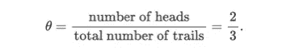
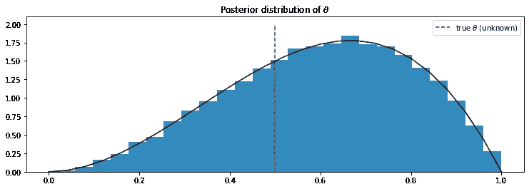
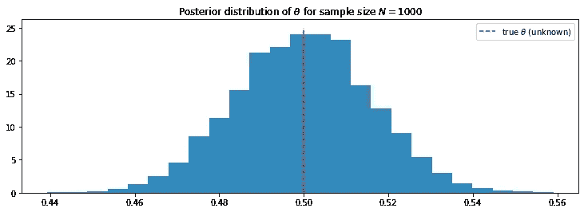

# PyMC3 简介:概率编程的 Python 包

> 原文：<https://towardsdatascience.com/introduction-to-pymc3-a-python-package-for-probabilistic-programming-5299278b428?source=collection_archive---------11----------------------->

**简介**

我们经常在天气预报节目中听到这样的话:明天下雨的几率是 80%。那是什么意思？通常很难给这种说法赋予意义，尤其是从频率主义者的角度来看:没有合理的方法来无限(或非常大)次重复下雨/不下雨的实验。

贝叶斯方法为这种类型的陈述提供了一个解决方案。下面这句话摘自《T2 概率编程》一书&黑客的贝叶斯方法，完美地总结了贝叶斯观点的一个关键思想。

> 贝叶斯世界观将概率解释为事件中*可信度的度量，也就是说，我们对事件的发生有多有信心。*

换句话说，在贝叶斯方法中，我们永远不能绝对肯定我们的*信念*，但可以明确地说我们对相关事件有多有信心。此外，随着收集的数据越来越多，我们可以对自己的信念更加自信。

作为一名科学家，我被训练成相信数据，并且总是对几乎所有事情都持批评态度。自然地，我发现贝叶斯推理相当直观。

然而，使用贝叶斯推理通常在计算和概念上具有挑战性。通常，需要进行大量冗长而复杂的数学计算才能完成任务。即使作为一名数学家，我偶尔也会觉得这些计算很乏味；尤其是当我需要快速浏览我想要解决的问题时。

幸运的是，我的导师[奥斯汀·罗奇福德](https://austinrochford.com/)最近向我介绍了一个叫做 [PyMC3](https://github.com/pymc-devs/pymc3) 的奇妙软件包，它可以让我们进行*数字*贝叶斯推理。在本文中，我将通过一个具体的例子来快速介绍 PyMC3。

**一个具体的例子**

假设我们有一枚硬币。我们翻转三次，结果是:

[0, 1, 1]

其中 0 表示硬币落在尾部，1 表示硬币落在头部。我们有信心说这是一枚公平的硬币吗？换句话说，如果我们让θ是硬币返回正面的概率，那么证据是否足够有力的支持θ=12 的说法？

除了上述实验的结果，我们对硬币一无所知，所以很难说什么是肯定的。从频率主义者的角度来看，θ的[点估计值](https://en.wikipedia.org/wiki/Point_estimation)为



虽然这个数字有意义，但 frequentist 方法并不能真正提供一定程度的可信度。特别是，如果我们做更多的试验，我们很可能得到θ的不同点估计。

这就是贝叶斯方法可以提供一些改进的地方。这个想法很简单，因为我们对θ一无所知，我们可以假设θ可以是[0，1]上的任何值。在数学上，我们之前认为θ遵循均匀(0，1)分布。对于那些需要复习数学的人，Uniform(0，1)的 pdf 由下式给出


然后，我们可以利用证据/我们的观察来更新我们对θ分布的看法。

让我们正式调用 D 作为证据(在我们的例子中，它是我们掷硬币的结果。)根据贝叶斯规则，后验分布计算如下


其中 p(D|θ)是似然函数，p(θ)是先验分布(本例中为均匀分布(0，1))。)这里有两条路可以走。

**显式方法**

在这个特殊的例子中，我们可以手工做所有的事情。更准确地说，给定θ，我们在三次掷硬币中得到两个正面的概率由下式给出


假设 p(θ)=1。接下来，我们评估支配者


通过一些简单的代数，我们可以看到上述积分等于 1/4，因此


*备注:*通过同样的计算，我们还可以看到，如果θ的先验分布是一个参数为α，β的[贝塔分布](https://en.wikipedia.org/wiki/Beta_distribution)，即 p(θ)=B(α，β)，样本量为 N，其中 k 为 head，则θ的后验分布由 B(α+k，β+N k)给出。在我们的例子中，α=β=1，N=3，k=2。

**数值逼近**

在显式方法中，我们能够通过使用[共轭先验](https://en.wikipedia.org/wiki/Conjugate_prior)显式计算θ的后验分布。然而，有时共轭先验用于简化计算，它们可能不反映现实。此外，寻找共轭先验并不总是可行的。

我们可以通过使用[马尔可夫链蒙特卡罗](https://en.wikipedia.org/wiki/Markov_chain_Monte_Carlo) (MCMC)方法来近似后验分布，从而克服这个问题。这里的数学非常漂亮，但就本文的唯一目的而言，我们不会深究它。相反，我们将解释如何使用 PyMC3 实现这个方法。

为了运行我们的代码，我们导入以下包。

```
import pymc3 as pm
import scipy.stats as stats
import pandas as pd
import matplotlib.pyplot as plt
import numpy as np
%matplotlib inline
from IPython.core.pylabtools import figsize
```

首先，我们需要初始化θ的先验分布。在 PyMC3 中，我们可以通过下面几行代码来实现。

```
with pm.Model() as model:
    theta=pm.Uniform('theta', lower=0, upper=1)
```

然后我们用观察到的数据来拟合我们的模型。这可以通过下面几行代码来完成。

```
occurrences=np.array([1,1,0]) #our observation 
with model:
    obs=pm.Bernoulli("obs", p, observed=occurrences) #input the observations
    step=pm.Metropolis()
    trace=pm.sample(18000, step=step)
    burned_trace=trace[1000:]
```

在内部，PyMC3 使用 Metropolis-Hastings 算法来逼近后验分布。trace 函数决定了从后验分布中抽取的样本数。最后，由于算法在开始时可能不稳定，所以仅在一定的迭代周期后提取样本是有用的。这就是我们代码中最后一行的目的。

然后，我们可以绘制从后验分布获得的样本直方图，并将其与真实密度函数进行比较。

```
from IPython.core.pylabtools import figsize
p_true=0.5
figsize(12.5, 4)
plt.title(r"Posterior distribution of $\theta$")
plt.vlines(p_true,0, 2, linestyle='--', label=r"true $\theta$ (unknown)", color='red')
plt.hist(burned_trace["theta"], bins=25, histtype='stepfilled', density=True, color='#348ABD')
x=np.arange(0,1.04,0.04)
plt.plot(x, 12*x*x*(1-x), color='black')
plt.legend()
plt.show()
```



我们可以清楚地看到，数值近似值非常接近真实的后验分布。

如果我们增加样本量，会发生什么？

正如我们之前提到的，我们获得的数据越多，我们对θ的真实值就越有信心。让我们通过一个简单的模拟来检验我们的假设。

我们将随机投掷一枚硬币 1000 次。然后，我们使用 PyMC3 来近似θ的后验分布。然后，我们绘制从该分布中获得的样本的直方图。所有这些步骤都可以通过下面几行代码来完成

```
N=1000 #the number of samples
occurences=np.random.binomial(1, p=0.5, size=N)
k=occurences.sum() #the number of head#fit the observed data 
with pm.Model() as model1:
    theta=pm.Uniform('theta', lower=0, upper=1)with model1:
    obs=pm.Bernoulli("obs", theta, observed=occurrences)
    step=pm.Metropolis()
    trace=pm.sample(18000, step=step)
    burned_trace1=trace[1000:]
#plot the posterior distribution of theta. p_true=0.5
figsize(12.5, 4)
plt.title(r"Posterior distribution of $\theta for sample size N=1000$")
plt.vlines(p_true,0, 25, linestyle='--', label="true $\theta$ (unknown)", color='red')
plt.hist(burned_trace1["theta"], bins=25, histtype='stepfilled', density=True, color='#348ABD')
plt.legend()
plt.show()
```

这是我们得到的。



如我们所见，后验分布现在以θ的真实值为中心。

我们可以通过取样本的平均值来估算θ。

```
burned_trace1['theta'].mean()0.4997847718651745
```

我们看到这真的很接近真实答案。

**结论**

正如我们所见，PyMC3 很好地执行了统计推断任务。此外，它使得概率编程变得相当容易。

**参考文献。**

[1][https://github . com/CamDavidsonPilon/probabilical-Programming-and-Bayesian-Methods-for-Hackers](https://github.com/CamDavidsonPilon/Probabilistic-Programming-and-Bayesian-Methods-for-Hackers)