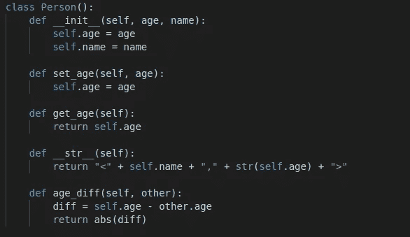
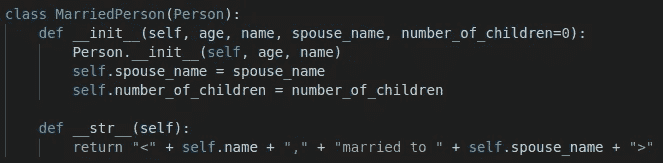

# Python 类简介

> 原文：<https://towardsdatascience.com/introduction-to-python-classes-da526ff745df?source=collection_archive---------14----------------------->

## 面向对象编程的综合实践指南


Edvard Alexander lvaag 在 [Unsplash](https://unsplash.com/s/photos/hierarchy?utm_source=unsplash&utm_medium=referral&utm_content=creditCopyText) 上拍摄的照片

类是 Python 最基础的部分。原因在于面向对象编程的概念。

Python 中的一切都是对象比如整数、列表、字典、函数等等。每个对象都有一个类型，对象类型是使用类创建的。

课程有:

*   数据属性:定义创建一个类的实例需要什么
*   方法(即过程属性):定义如何与类的实例交互

方法就像函数一样，但是它们属于一个特定的类。属性可以被认为是与类交互的接口。

类的一个优点是我们不需要知道它是如何被创建的。我们可以通过数据属性和方法来使用它。例如，为了使用 scikit-learn 中的线性回归模型，我们只需导入 linear regression 类。

```
from sklearn.linear_model import LinearRegression
```

我们只需要知道如何使用 LinearRegression 类或与之交互。我们对它是如何产生的不感兴趣。这是抽象的概念。行为已定义，但实现是隐藏的(如果您愿意，可以看到它)。

这个帖子可以被认为是对类的全面介绍。我们将通过许多例子来解释它们的特点。在实现一个类时，还需要记住一些提示。

我们还将做几个例子来解释继承，这是面向对象编程中一个非常重要的概念。

## 创建一个类

让我们首先创建一个名为“Person”的简单类。

```
class Person(object):
    def __init__(self, age, name):
        self.age = age
        self.name = name
```

__init__ 是一个特殊的方法，在创建类的实例时自动运行。参数代表数据属性。自我就是实例本身。你可以用任何词来代替“自我”，但使用“自我”是一种非常普遍的做法。

年龄和姓名是另外两个数据属性。因此，Person 类的每个实例都有年龄和姓名数据属性。

我们创建了 Person 类的一个实例。

```
p1 = Person(24, "John")print(type(p1))
<class '__main__.Person'>

print(p1)
<__main__.Person object at 0x7f67faac9ba8>
```

type 打印出一个对象的类型(即类)。因此，p1 是 Person 类型的实例。

当我们打印 p1 时，Python 返回对象的类型和内存位置。但是，我们可以通过在我们的类中实现 __str__ 方法来改变它。

让我们把这个人的名字和年龄打印出来。

```
class Person():
    def __init__(self, age, name):
        self.age = age
        self.name = name def __str__(self):
        return "<" + self.name + "," + str(self.age) + ">"
```

如果我们现在打印一个 Person 类型的对象，我们将得到名字和年龄。

```
print(p1)
<John,24>
```

我们可以访问对象的数据属性，如下所示:

```
p1 = Person(24, "John")print(p1.name)
Johnprint(p1.age)
24
```

我们也可以用同样的方式改变属性:

```
p1 = Person(24, "John")print(p1.age)
24p1.age = 28print(p1.age)
28
```

但是，不建议使用这种方法。相反，我们可以实现获取和设置属性值的方法(也称为 getters 和 setters)。

让我们为年龄属性做这件事:

```
def set_age(self, age):
    self.age = agedef get_age(self):
    return self.age
```

注意:我每次只写新的部分，而不是写整个类的定义。

set_age 方法用给定的值更新一个人的年龄。get_age 方法只返回 age 属性的值。self 参数表示实例本身。

```
p2 = Person(26, "Emily")print(p2.get_age())
26p2.set_age(27)print(p2.get_age())
27
```

我们调用了对象上的方法。另一种选择是在类上调用它。

```
p2 = Person(26, "Emily")print(Person.get_age(p2))
26Person.set_age(p2, 27)print(Person.get_age(p2))
27
```

如果要使用此选项，请确保在方法内部传递对象的名称。

为了让这些方法返回值，我们需要使用括号。否则，您将得到如下消息:

```
p1 = Person(36, "Edward")print(p1.get_age)
<bound method Person.get_age of <__main__.Person object at 0x7fe33bf08eb8>>
```

我们可以为我们的类定义方法。记住方法就像函数一样，但是与特定的类相关联。

让我们定义一个计算两个人物年龄差的方法。

```
def age_diff(self, other):
    diff = self.age - other.age
    return abs(diff)
```

它接受两个对象，并返回它们之间年龄差的绝对值:

```
p1 = Person(22, "Ashley")
p2 = Person(26, "Max")print(p1.age_diff(p2))
4print(Person.age_diff(p1, p2))
4
```

## 创建子类(继承)

我们将创建另一个基于 Person 类的类。在面向对象编程中，有一个概念叫做**继承**。

类似于现实生活中的传承。我们的大部分基因组来自我们的父母。我们继承了他们。因此，我们和父母有相似之处。

继承与类的工作方式相同。当我们创建一个子类时，它从父类继承属性(数据的和过程的)。但是，我们可以自由添加或覆盖这些属性。

让我们创建一个名为 MarriedPerson 的新类。它将是人的子类。除了年龄和姓名数据属性之外，它还具有配偶姓名和子女数量属性。

下面是包含 __init__ 方法的类定义:

```
class MarriedPerson(Person):
   def __init__(self, age, name, spouse_name, number_of_children=0):
      Person.__init__(self, age, name)
      self.spouse_name = spouse_name
      self.number_of_children = number_of_children
```

这里有两个要点:

1.  父类的名称写在括号中，这样 python 就知道 MarriedPerson 类继承了 Person 类的所有属性。
2.  因为已经在 Person 类中定义了 age 和 name 属性，所以我们可以复制 Person 类的 __init__ 方法。我们只需要定义额外的属性。

**注**:我们可以自由手工为子类定义每个数据属性。使用 parent 的 __init__ 是可选的。

**注意**:我们也可以在 __init__ 方法中继承父类的属性，如下所示:

```
class MarriedPerson(Person):
   def __init__(self, age, name, spouse_name, number_of_children=0):
      super().__init__(age, name)
      self.spouse_name = spouse_name
      self.number_of_children = number_of_children
```

我们现在可以创建一个 MarriedPerson 对象(这个类的一个实例)。

```
mp1 = MarriedPerson(26, 'Max', 'Ashley', 2)print(mp1)
<Max,26>
```

如您所见，print 函数只打印已婚者的姓名和年龄。原因是 MarriedPerson 类从 Person 类继承了 __str__ 方法。

我们可以覆盖它。

```
class MarriedPerson(Person):
   def __init__(self, age, name, spouse_name, number_of_children):
      Person.__init__(self, age, name)
      self.spouse_name = spouse_name
      self.number_of_children = number_of_children def __str__(self):
      return "<" + self.name + "," + "married to " +
      self.spouse_name + ">"
```

如果我们现在打印一个 MarriedPerson 对象，我们将看到姓名和配偶姓名。

```
mp1 = MarriedPerson(26, 'Max', 'Ashley', 2)print(mp1)
<Max,married to Ashley>
```

我们创建了一个方法来返回两个 Person 对象之间的年龄差(age_diff)。因为我们从 Person 对象继承，所以我们可以对 MarriedPerson 对象使用该方法。

```
mp1 = MarriedPerson(26, 'Max', 'Ashley', 2)
mp2 = MarriedPerson(29, 'Emily', 'John', 1)print(mp1.age_diff(mp2))
3
```

我们可以为数据属性指定默认值。例如，一个已婚的人可能没有孩子。因此，我们可以将默认值设置为 0。

```
class MarriedPerson(Person):
   def __init__(self, age, name, spouse_name, number_of_children=0):
      Person.__init__(self, age, name
      self.spouse_name = spouse_name
      self.number_of_children = number_of_children
```

除非另外指定，否则 number_of_children 属性将获得值 0。

```
mp1 = MarriedPerson(26, 'Max', 'Ashley', 2)
mp2 = MarriedPerson(29, 'Emily', 'John')print(mp1.number_of_children)
2print(mp2.number_of_children)
0
```

下面是 Person 和 MarriedPerson 类的最终版本:



人物类(图片由作者提供)



已婚人士类(图片由作者提供)

## 结论

关于 Python 类还有很多内容要介绍。例如，类变量和实例变量之间的区别是一个重要的话题。

然而，我们在这篇文章中讨论的内容将会让你对工作和创建类感到舒适。可以认为是全面的介绍。

随着你不断练习，你会学到更多。

感谢您的阅读。如果您有任何反馈，请告诉我。