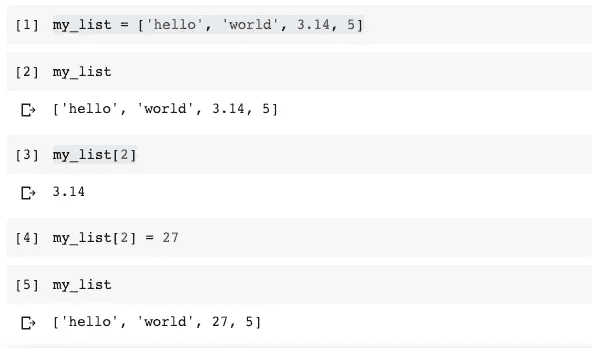
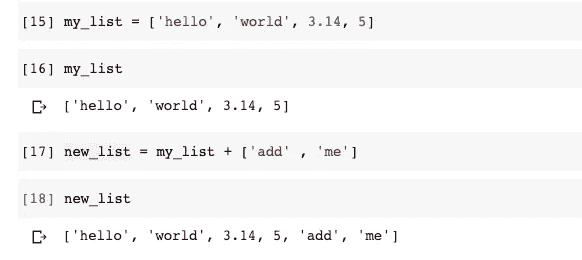
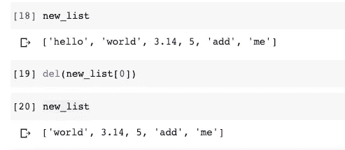
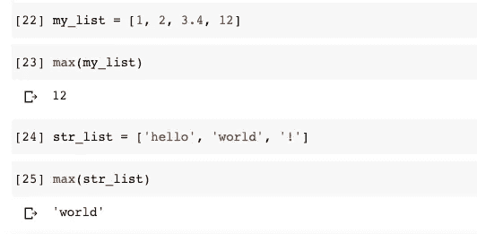
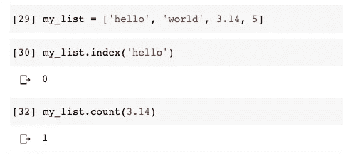
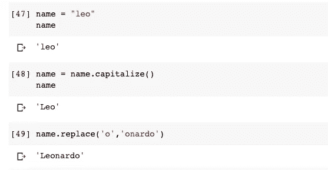

# 面向数据科学的 Python 简介

> 原文：<https://towardsdatascience.com/introduction-to-python-for-data-science-6d1dba7c305c?source=collection_archive---------31----------------------->

## 面向初学者的简单交互式教程


诺德伍德主题公司在 [Unsplash](https://unsplash.com/?utm_source=unsplash&utm_medium=referral&utm_content=creditCopyText) 上拍摄的照片

在本帖中，您将了解存储和操作数据的强大方法，以及开始进行自己的分析的有用的数据科学工具。首先，我将向您介绍我们的朋友 Python 和一个名为数据科学的领域，然后我们将开始互动练习。在动手操作教程部分，我们将通过以下主题 ***列出*** *、* ***函数*** *、以及* ***方法*** 。我等不及了，让我们开始吧！

# 计算机编程语言

Python 是一种通用编程语言，在数据科学中越来越受欢迎。Python 还能让您快速工作，更有效地集成系统。世界各地的公司都在利用 Python 从他们的数据中收集知识。官方 Python 页面如果你想[了解更多](https://www.python.org/about/)。

# 数据科学

数据科学继续发展，成为技术专业人员最有前途和最受欢迎的职业道路之一。如今，成功的数据专业人士明白，他们必须超越分析大量数据的传统技能、数据挖掘和编程技能。

如今，我们与科技设备进行的几乎每一次互动都包含数据——比如我们在亚马逊购买的商品、脸书订阅、网飞推荐，甚至是我们用来登录手机的面部识别。

[](/simple-face-detection-in-python-1fcda0ea648e) [## Python 中的简单人脸检测

### 如何使用 OpenCV 库检测图像中的人脸

towardsdatascience.com](/simple-face-detection-in-python-1fcda0ea648e) 

如果你像我一样是视觉学习者，这里有一个来自 YouTube 的 5 分钟的短片。该视频包含一些详细的信息，但它会让您了解数据科学的全貌。

# 什么是列表？

列表是方括号中逗号分隔的项的集合。Python 中列表的好处是列表中的项目可以是不同类型的项目。列表是强大的。您可以很容易地更改、添加或删除列表中的元素。

在这一步中，您将学习存储、访问和操作列表中的数据:这是高效处理大量数据的第一步。让我们做一些练习。

**改变列表元素**

```
my_list = ['hello', 'world, 3.14, 5]my_list[2] = 27my_list
```



更改列表元素

**添加列表元素**

```
my_list = ['hello', 'world, 3.14, 5]new_list = my_list + ['add' , 'me']my_list
```



添加列表元素

**删除列表元素**

```
new_list = ['hello', 'world, 3.14, 5, 'add' , 'me']del(new_list[0])new_list
```



移除列表元素

# 什么是函数？

函数是可重用的代码。我把它们看作是环境友好的代码:)不用写完整的代码，你可以放入一个函数，在你需要运行代码的任何时候调用那个函数。函数用于解决特定的任务。目标是减少解决挑战性问题所需的代码量！

在 Python 中，有一些内置函数，你可以不用定义它们就能使用它们。它们已经创建好，可以使用了。

以下是一些内置函数:

*   **max()** :返回列表中最大值的元素
*   **min()** :返回列表中最小值的元素
*   **len()** :返回列表或字符串的长度
*   **index()** :返回列表中元素的索引。(这是一个方法，将在函数之后介绍)

## **最大()和最小()**

请记住，要使用最大值和最小值函数，列表中的元素必须是相同的类型。同样，在比较字符串值时，它会检查它们的 ascii 值。如果你没有听说过 Ascii 表，你可以谷歌一下。

```
my_list = [1, 2, 3.4, 12]max(my_list)min(my_list)
```



最大值和最小值

## **Len()**

如果我们想得到整个列表的长度，括号中的值就是列表的长度。如果我们想得到一个特定元素的长度，这个元素将会在括号之间。

```
my_list = ['hello', 'world, 3.14, 5]len(my_list)len(my_list[0])
```


长度

# 方法

方法内置于函数中，可以为特定类型的元素调用。例如，列表对象有自己的方法，字符串对象有自己的方法。我将向您展示每种类型的几个例子，让您了解方法是如何工作的。

## **列出方法**

Index 方法返回特定元素的索引号。count 方法返回列表中特定元素的数量。

```
my_list = ['hello', 'world, 3.14, 5]my_list.index('hello')my_list.count(3.14)
```



列出方法

## **字符串方法**

方法在将字符串的第一个字母大写后返回元素。和 replace 方法在用另一个字符串替换特定字符串后返回元素。

```
name = 'leo'name.capitalize()name.replace('o', 'onardo')
```



字符串方法

感谢你阅读这篇文章，我希望你今天喜欢并学到了一些新东西。如果您在执行代码时有任何问题，请随时回复。我非常乐意帮忙。你可以找到我发表的关于数据科学 Python 的其他文章。保持安全和快乐的编码！:)

> 跟随[我的博客](https://medium.com/@lifexplorer)和[走向数据科学](https://towardsdatascience.com/)以获得灵感。

## 更多相关内容

[](https://medium.com/python-in-plain-english/cleaning-data-in-python-data-types-46f9ebf2feef) [## 清理 Python 中的数据(数据类型)

### 使用 pandas 操作数据类型的简单说明

medium.com](https://medium.com/python-in-plain-english/cleaning-data-in-python-data-types-46f9ebf2feef) [](/sorting-and-subsetting-in-python-f9dd2e14caa0) [## Python 中的排序和子集化

### 使用 Pandas 进行动手数据分析

towardsdatascience.com](/sorting-and-subsetting-in-python-f9dd2e14caa0)